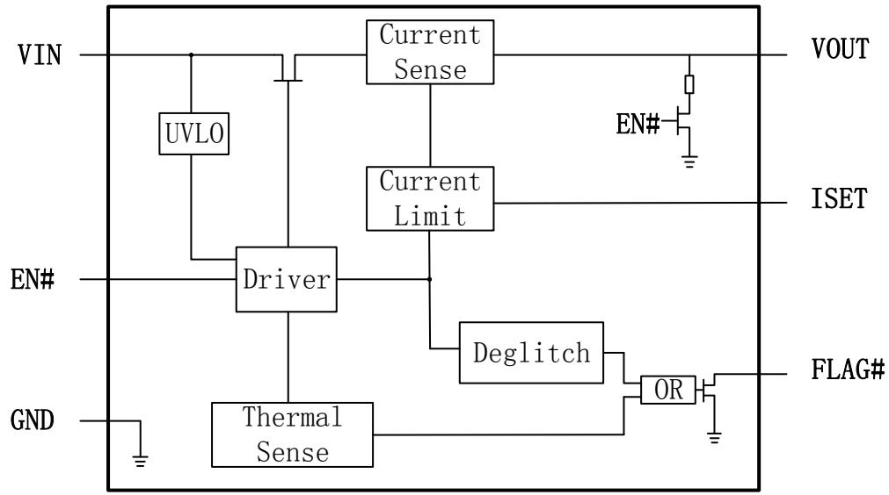
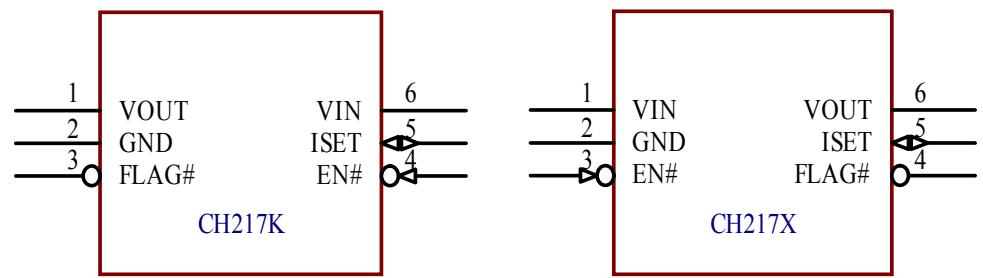
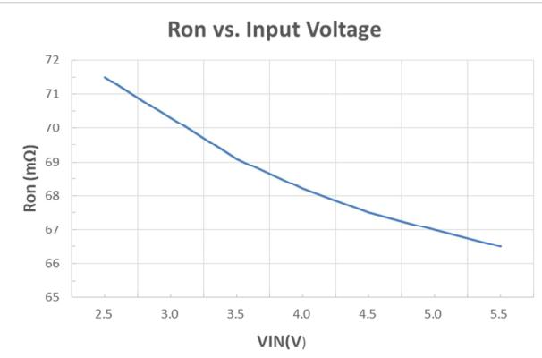
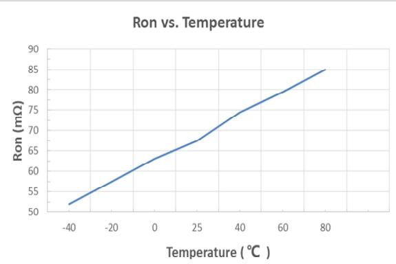
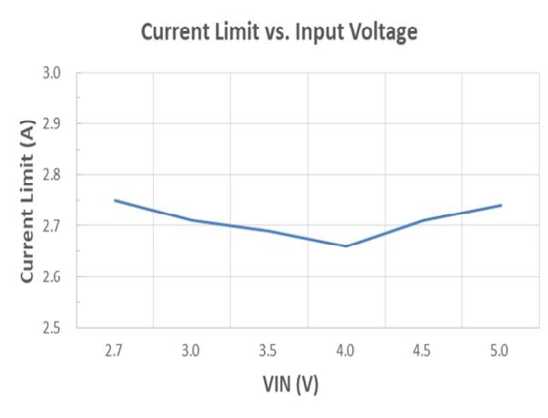
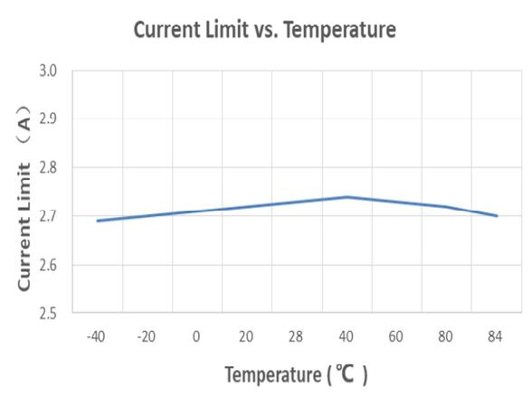
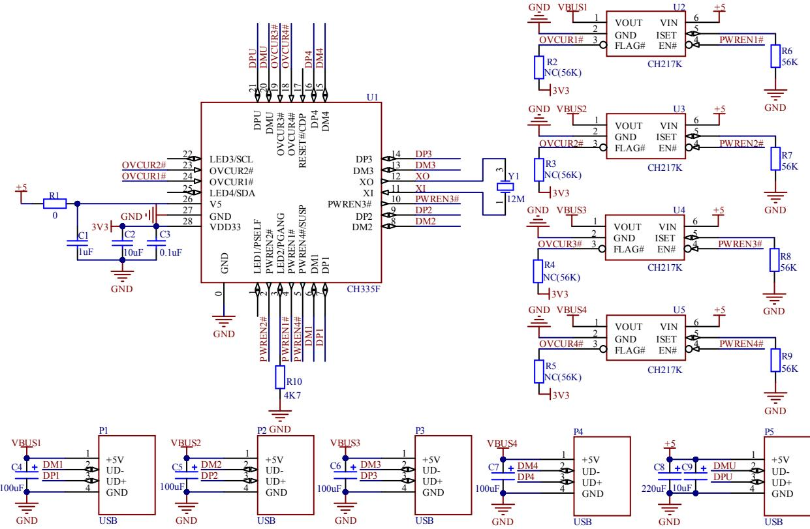
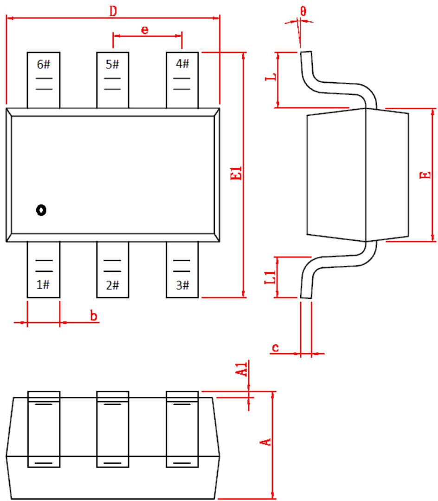

# USB 限流配电开关芯片 CH217

手册  
版本：1.1  
https://wch.cn

# 1、概述

CH217是可调限流门限的USB端口电源开关芯片。芯片内部集成了过流保护、过温保护、欠压保护等模块，支持 5V 电压下不超过 2.7A 的可编程电流，在 VOUT 输出端发生短路等情况时可以限制输出电流从而保护供电系统。下面为 CH217 的内部框图，仅供参考。

# 2、特点

$\bullet$ 内置功率开关管，典型 $7 0 m \Omega$ 导通电阻。

$\bullet$ 可通过外置电阻调节限流门限，支持 $4 0 0 \mathsf { m } \mathsf { A } { \sim } 2 . 7 \mathsf { A }$ , 典型误差± $10 \%$ 。

$\bullet$ 支持电源电压 $2 . 7 \lor \sim 5 . 5 \lor$ 。

$\bullet$ 输出短路时快速限流保护。

$\bullet$ 低功耗，典型 50uA 静态工作电流。

$\bullet$ 典型关机电流小于1uA，关断时没有反向电流。

$\bullet$ SOT23-6 封装。

# 3、封装

<table><tr><td rowspan=1 colspan=1>封装形式</td><td rowspan=1 colspan=2>塑体宽度</td><td rowspan=1 colspan=2>引脚间距</td><td rowspan=1 colspan=1>封装说明</td><td rowspan=1 colspan=1>订货型号</td></tr><tr><td rowspan=1 colspan=1>SOT23-6</td><td rowspan=1 colspan=1>1. 6mm</td><td rowspan=1 colspan=1>63miI</td><td rowspan=1 colspan=1>0.95mm</td><td rowspan=1 colspan=1>37mil</td><td rowspan=1 colspan=1>小型6脚贴片</td><td rowspan=1 colspan=1>CH217K</td></tr><tr><td rowspan=1 colspan=1>SOT23-6</td><td rowspan=1 colspan=1>1. 6mm</td><td rowspan=1 colspan=1>63miI</td><td rowspan=1 colspan=1>0.95mm</td><td rowspan=1 colspan=1>37miI</td><td rowspan=1 colspan=1>小型6脚贴片</td><td rowspan=1 colspan=1>CH217X</td></tr></table>

# 4、引脚

<table><tr><td rowspan=1 colspan=1>CH217K引脚号</td><td rowspan=1 colspan=1>CH217X引脚号</td><td rowspan=1 colspan=1>引脚名称</td><td rowspan=1 colspan=1>类型</td><td rowspan=1 colspan=1>引脚说明</td></tr><tr><td rowspan=1 colspan=1>6</td><td rowspan=1 colspan=1>1</td><td rowspan=1 colspan=1>VIN</td><td rowspan=1 colspan=1>电源</td><td rowspan=1 colspan=1>电源输入，建议外接电容10uF或以上</td></tr><tr><td rowspan=1 colspan=1>1</td><td rowspan=1 colspan=1>6</td><td rowspan=1 colspan=1>VOUT</td><td rowspan=1 colspan=1>电源</td><td rowspan=1 colspan=1>电源输出，通常连接USB端口VBUS</td></tr><tr><td rowspan=1 colspan=1>2</td><td rowspan=1 colspan=1>2</td><td rowspan=1 colspan=1>GND</td><td rowspan=1 colspan=1>电源</td><td rowspan=1 colspan=1>公共接地端</td></tr><tr><td rowspan=1 colspan=1>4</td><td rowspan=1 colspan=1>3</td><td rowspan=1 colspan=1>EN#</td><td rowspan=1 colspan=1>输入</td><td rowspan=1 colspan=1>电源开关使能输入，低电平有效，高电平关机</td></tr><tr><td rowspan=1 colspan=1>3</td><td rowspan=1 colspan=1>4</td><td rowspan=1 colspan=1>FLAG#</td><td rowspan=1 colspan=1>输出</td><td rowspan=1 colspan=1>过流或过温报警开漏输出，低电平有效</td></tr><tr><td rowspan=1 colspan=1>5</td><td rowspan=1 colspan=1>5</td><td rowspan=1 colspan=1>ISET</td><td rowspan=1 colspan=1>模拟</td><td rowspan=1 colspan=1>限流门限设置，外接电阻Rset到GND设置Iset</td></tr></table>

# 5、功能模块

# 5.1. 欠压保护

当VIN电压低于欠压保护门限Vuvlo时，开关管将不受 EN#控制，始终保持关断状态。当 VIN电压高于欠压保护门限后，开关管被允许控制，EN#输入低电平则开启。欠压保护门限具有迟滞特性。

# 5.2. 过温保护

当开关连续导通电流较大或者发生过流或短路等情况时，VIN 和 VOUT 两端压差乘以电流的功耗将会使芯片内部升温。当芯片温度超过过温保护门限Tsd后，开关管将被强行关断，VOUT没有输出电流。稍后芯片降温后，开关管将会被允许重新开启。开启后一段时间如果过温，则再次关断。

# 5.3. 开关控制

当EN#输入低电平，且VIN高于Vuvlo 时，VIN和VOUT 之间的开关管开启，即电源开关打开。当 EN#输入高电平，或 VIN 低于 Vuvlo 时，VIN 和 VOUT 之间的开关管关断，即 shutdown 关机，并且VOUT端的放电管开启，加速VOUT电容放电。

# 5.4. 限流与过流保护

当VOUT输出电流Iout超过限流门限Iset 时，过流保护模块自动降低功率开关管的导通程度，使导通电阻增大、VOUT电压下降，从而限制输出电流并进入恒流状态。该恒流值与 VOUT 电压值正相关，当 VOUT 对 GND 短路时，VOUT 电压最小，对应的恒流值最小，即短路电流 Ishort。

在 ISET 引脚外接对 GND 的电阻 Rset 可以设定限流门限 Iset，Iset=60K/Rset，Rset 不小于 22K。

# 6、参数

6.1 绝对最大值（临界或者超过绝对最大值将可能导致芯片工作不正常甚至损坏）

<table><tr><td rowspan=1 colspan=1>名称</td><td rowspan=1 colspan=1>参数说明</td><td rowspan=1 colspan=1>最小值</td><td rowspan=1 colspan=1>最大值</td><td rowspan=1 colspan=1>单位</td></tr><tr><td rowspan=1 colspan=1>TA</td><td rowspan=1 colspan=1>工作时的环境温度</td><td rowspan=1 colspan=1>-40</td><td rowspan=1 colspan=1>85</td><td rowspan=1 colspan=1>℃</td></tr><tr><td rowspan=1 colspan=1>TS</td><td rowspan=1 colspan=1>储存时的环境温度</td><td rowspan=1 colspan=1>-55</td><td rowspan=1 colspan=1>150</td><td rowspan=1 colspan=1>℃</td></tr><tr><td rowspan=1 colspan=1>VIN</td><td rowspan=1 colspan=1>电源电压</td><td rowspan=1 colspan=1>-0. 4</td><td rowspan=1 colspan=1>6</td><td rowspan=1 colspan=1>V</td></tr><tr><td rowspan=1 colspan=1>VOUT</td><td rowspan=1 colspan=1>输出电压</td><td rowspan=1 colspan=1>-0.4</td><td rowspan=1 colspan=1>VIN</td><td rowspan=1 colspan=1>V</td></tr><tr><td rowspan=1 colspan=1>VI0</td><td rowspan=1 colspan=1>EN#或者FLAG#引脚上的电压</td><td rowspan=1 colspan=1>-0.4</td><td rowspan=1 colspan=1>5.5</td><td rowspan=1 colspan=1>V</td></tr><tr><td rowspan=1 colspan=1>PD</td><td rowspan=1 colspan=1>整个芯片的最大功耗</td><td rowspan=1 colspan=1></td><td rowspan=1 colspan=1>500</td><td rowspan=1 colspan=1>mW</td></tr></table>

<table><tr><td>0JA</td><td>S0T23-6封装热阻</td><td>220</td><td>℃/W</td></tr><tr><td></td><td></td><td></td><td></td></tr></table>

6.2 电气参数（测试条件： $\mathtt { T A } = 2 5 ^ { \circ } C$ 、VIN=5V、Rset=30KΩ）  

<table><tr><td rowspan=1 colspan=1>名称</td><td rowspan=1 colspan=2>参数说明</td><td rowspan=1 colspan=1>最小值</td><td rowspan=1 colspan=1>典型值</td><td rowspan=1 colspan=1>最大值</td><td rowspan=1 colspan=1>单位</td></tr><tr><td rowspan=1 colspan=1>VIN</td><td rowspan=1 colspan=2>电源电压</td><td rowspan=1 colspan=1>2.7</td><td rowspan=1 colspan=1>5.0</td><td rowspan=1 colspan=1>5.5</td><td rowspan=1 colspan=1>V</td></tr><tr><td rowspan=1 colspan=1>lq</td><td rowspan=1 colspan=1>静态工作电流</td><td rowspan=1 colspan=1>EN#=低电平</td><td rowspan=1 colspan=1>25</td><td rowspan=1 colspan=1>50</td><td rowspan=1 colspan=1>80</td><td rowspan=1 colspan=1>uA</td></tr><tr><td rowspan=1 colspan=1>Isd</td><td rowspan=1 colspan=1>关机电流</td><td rowspan=1 colspan=1>EN#=高电平</td><td rowspan=1 colspan=1>0</td><td rowspan=1 colspan=1>0.1</td><td rowspan=1 colspan=1>3</td><td rowspan=1 colspan=1>uA</td></tr><tr><td rowspan=1 colspan=1>VIL</td><td rowspan=1 colspan=2>EN#引脚低电平输入电压</td><td rowspan=1 colspan=1>0</td><td rowspan=1 colspan=1></td><td rowspan=1 colspan=1>0.7</td><td rowspan=1 colspan=1>V</td></tr><tr><td rowspan=1 colspan=1>VIH</td><td rowspan=1 colspan=2>EN#引脚高电平输入电压</td><td rowspan=1 colspan=1>1.8</td><td rowspan=1 colspan=1></td><td rowspan=1 colspan=1>5</td><td rowspan=1 colspan=1>V</td></tr><tr><td rowspan=1 colspan=1>VOL</td><td rowspan=1 colspan=1>FLAG#引脚低电平输出电压</td><td rowspan=1 colspan=1>吸入2mA电流</td><td rowspan=1 colspan=1></td><td rowspan=1 colspan=1>0.2</td><td rowspan=1 colspan=1>0.4</td><td rowspan=1 colspan=1>V</td></tr><tr><td rowspan=1 colspan=1>Ron</td><td rowspan=1 colspan=1>功率开关管导通电阻</td><td rowspan=1 colspan=1>lout=500mA</td><td rowspan=1 colspan=1>40</td><td rowspan=1 colspan=1>70</td><td rowspan=1 colspan=1>110</td><td rowspan=1 colspan=1>mΩ</td></tr><tr><td rowspan=1 colspan=1>Iset</td><td rowspan=1 colspan=1>限流门限</td><td rowspan=1 colspan=1>Rset=30K</td><td rowspan=1 colspan=1>1.7</td><td rowspan=1 colspan=1>2.0</td><td rowspan=1 colspan=1>2.3</td><td rowspan=1 colspan=1>A</td></tr><tr><td rowspan=1 colspan=1>Ishort</td><td rowspan=1 colspan=1>VOUT对地短路电流</td><td rowspan=1 colspan=1>Rset=30K</td><td rowspan=1 colspan=1>1. 0</td><td rowspan=1 colspan=1>1. 2</td><td rowspan=1 colspan=1>1. 4</td><td rowspan=1 colspan=1>A</td></tr><tr><td rowspan=2 colspan=1>Vuvlo</td><td rowspan=2 colspan=1>欠压锁定电压（具有迟滞特性）</td><td rowspan=1 colspan=1>VIN上升阶段</td><td rowspan=1 colspan=1>1. 8</td><td rowspan=1 colspan=1>2.2</td><td rowspan=1 colspan=1>2.7</td><td rowspan=1 colspan=1>V</td></tr><tr><td rowspan=1 colspan=1>VIN下降阶段</td><td rowspan=1 colspan=1>1. 6</td><td rowspan=1 colspan=1>2.0</td><td rowspan=1 colspan=1>2.4</td><td rowspan=1 colspan=1>V</td></tr><tr><td rowspan=2 colspan=1>Tsd</td><td rowspan=2 colspan=1>过温保护门限(具有迟滞特性）</td><td rowspan=1 colspan=1>升温阶段</td><td rowspan=1 colspan=1></td><td rowspan=1 colspan=1>155</td><td rowspan=1 colspan=1></td><td rowspan=1 colspan=1>℃</td></tr><tr><td rowspan=1 colspan=1>降温阶段</td><td rowspan=1 colspan=1></td><td rowspan=1 colspan=1>135</td><td rowspan=1 colspan=1></td><td rowspan=1 colspan=1>℃</td></tr><tr><td rowspan=1 colspan=1>Tdly</td><td rowspan=1 colspan=1>从检测到故障到FLAG#引脚输出有效</td><td rowspan=1 colspan=1>脚输出有效</td><td rowspan=1 colspan=1></td><td rowspan=1 colspan=1>8</td><td rowspan=1 colspan=1></td><td rowspan=1 colspan=1>mS</td></tr></table>

# 7、典型特性图示（无特殊说明 $\mathsf { T } \mathsf { A } \mathsf { = } 2 5 ^ { \circ } \mathrm { C }$ 、VIN=5V、Rset=22KΩ）

# 8、应用

CH217 可以用于计算机、USB 主机、USB HUB 集线器、充电器等端口的电源控制。

下图为HUB各端口独立电源配电控制的应用，EN#引脚由 HUB芯片 CH335或 CH334的PWREN#信号控制，FLAG#引脚可以产生过流或过温报警信号通知HUB 控制器及计算机，CH334/5已内置上拉电阻

图中 Rset 为 56K，设置限流门限约 1A，实际应该根据电源供电能力选择以实现保护效果。

电容 C8 根据需要选择容量，C4/C5/C6/C7 典型值可选 150uF。

设计 PCB 时需考虑实际工作电流承载能力，VIN（ $+ 5 \vee$ ）和 VOUT（VBUS\*）走线路径的 PCB 尽可能宽，如有过孔则建议多个，至少两个以上并联。

# 9、封装信息

9.1. SOT23-6

<table><tr><td rowspan=2 colspan=1>符号</td><td rowspan=1 colspan=3>公制，单位为mm</td></tr><tr><td rowspan=1 colspan=1>Min</td><td rowspan=1 colspan=1>Type</td><td rowspan=1 colspan=1>Max</td></tr><tr><td rowspan=1 colspan=1>A</td><td rowspan=1 colspan=1>1. 05</td><td rowspan=1 colspan=1>1. 15</td><td rowspan=1 colspan=1>1.4</td></tr><tr><td rowspan=1 colspan=1>A1</td><td rowspan=1 colspan=1>0.0</td><td rowspan=1 colspan=1>0.07</td><td rowspan=1 colspan=1>0.15</td></tr><tr><td rowspan=1 colspan=1>b</td><td rowspan=1 colspan=1>0.3</td><td rowspan=1 colspan=1>0.4</td><td rowspan=1 colspan=1>0.5</td></tr><tr><td rowspan=1 colspan=1>C</td><td rowspan=1 colspan=1>0.1</td><td rowspan=1 colspan=1>0.16</td><td rowspan=1 colspan=1>0.22</td></tr><tr><td rowspan=1 colspan=1>D</td><td rowspan=1 colspan=1>2.7</td><td rowspan=1 colspan=1>2.9</td><td rowspan=1 colspan=1>3.1</td></tr><tr><td rowspan=1 colspan=1>E</td><td rowspan=1 colspan=1>1. 4</td><td rowspan=1 colspan=1>1. 6</td><td rowspan=1 colspan=1>1.8</td></tr><tr><td rowspan=1 colspan=1>E1</td><td rowspan=1 colspan=1>2.6</td><td rowspan=1 colspan=1>2.8</td><td rowspan=1 colspan=1>3.0</td></tr><tr><td rowspan=1 colspan=1>e</td><td rowspan=1 colspan=1></td><td rowspan=1 colspan=1>0.95</td><td rowspan=1 colspan=1></td></tr><tr><td rowspan=1 colspan=1>L</td><td rowspan=1 colspan=1></td><td rowspan=1 colspan=1>0.6</td><td rowspan=1 colspan=1></td></tr><tr><td rowspan=1 colspan=1>L1</td><td rowspan=1 colspan=1>0.25</td><td rowspan=1 colspan=1>0.4</td><td rowspan=1 colspan=1>0.55</td></tr><tr><td rowspan=1 colspan=1>0</td><td rowspan=1 colspan=1>0°</td><td rowspan=1 colspan=1></td><td rowspan=1 colspan=1>8°</td></tr></table>

