# USB PD多快充协议受电芯片CH224

手册1  
版本：2.1  
https://wch.cn

# 1、概述

CH224Q/CH224A为支持 USB PD3.2的USBPD快充协议受电芯片，最高支持 PD3.2EPR140W功率，并支持单电阻配置、I/0电平配置及I2C配置。通过I2C接口可以读取协议握手状态和读取当前PD 档位额定电流。芯片内置高压LD0，静态功耗低，集成度高，外围精简。芯片集成输出电压检测及过压保护功能，可广泛应用于各类电子设备拓展高功率输入如无线充电器、小家电、锂电池电动工具等各类场合。

CH224K/CH224D/CH221K 为支持 USB PD3.0的 USB PD快充协议受电芯片，最高支持 100W 功率，支持单电阻配置和I/0电平配置。

# 2、特点

$\bullet$ 支持4V至30V输入电压  
$\bullet$ 支持 PD3.2 EPR、AVS、PPS、SPR 协议及 BC1.2等升压快充协议  
$\bullet$ 支持eMarker模拟，自动检测VCONN  
$\bullet$ 支持多种方式动态调整请求电压  
$\bullet$ 支持400KHz速率I2C通信  
$\bullet$ 芯片内置高压LD0，静态功耗低  
$\bullet$ 单芯片集成度高，外围精简，成本低  
$\bullet$ 内置过压保护模块OVP

# 3、引脚排列

0 2 3 4 5 1 GND VHV CFG2/SCL CFG3/SDA DP DM CH224A VBUS CFG1 CC2 CC1 PG 10 8 7 9 6 3 4 0 2 5 1 VHV DP DM GND CFG2/SCL CFG3/SDA CH224Q VBUS CFG1 CC2 CC1 PG 10 7 9 8 6   
2181   
CH224K   
0 1 2 3 4 5 GND DRV VBUS NC NC GATE N CH224D CFG2 CFG3 CC1 ISN ISP 15 14 13 12 11 4 3 2 5 0 1 GND VDD CFG2 CFG3 DP DM VBUS CFG1 CC2 CC1 PG 9 8 7 10 6   
00 00 2 3 1 VDD GND PG CH221K CFG CC2 CC1 4 6 5

表3-1封装说明  

<table><tr><td rowspan=1 colspan=1>封装形式</td><td rowspan=1 colspan=1>塑体尺寸</td><td rowspan=1 colspan=2>引脚节距</td><td rowspan=1 colspan=1>封装说明</td><td rowspan=1 colspan=1>订货型号</td></tr><tr><td rowspan=1 colspan=1>DFN10</td><td rowspan=1 colspan=1>2*2mm</td><td rowspan=1 colspan=1>0.4mm</td><td rowspan=1 colspan=1>15.7mil</td><td rowspan=1 colspan=1>双边无引线10脚</td><td rowspan=1 colspan=1>CH224Q</td></tr><tr><td rowspan=1 colspan=1>ESSOP10</td><td rowspan=1 colspan=1>3.9mm</td><td rowspan=1 colspan=1>1. 00mm</td><td rowspan=1 colspan=1>39.4mil</td><td rowspan=1 colspan=1>带底板的窄距10脚贴片</td><td rowspan=1 colspan=1>CH224A</td></tr><tr><td rowspan=1 colspan=1>ESSOP10</td><td rowspan=1 colspan=1>3.9mm</td><td rowspan=1 colspan=1>1.00mm</td><td rowspan=1 colspan=1>39.4mil</td><td rowspan=1 colspan=1>带底板的窄距10脚贴片</td><td rowspan=1 colspan=1>CH224K</td></tr><tr><td rowspan=1 colspan=1>QFN20</td><td rowspan=1 colspan=1>3*3mm</td><td rowspan=1 colspan=1>0.40mm</td><td rowspan=1 colspan=1>15.7mil</td><td rowspan=1 colspan=1>四边无引线20脚</td><td rowspan=1 colspan=1>CH224D</td></tr><tr><td rowspan=1 colspan=1>SOT23-6</td><td rowspan=1 colspan=1>1. 6mm</td><td rowspan=1 colspan=1>0.95mm</td><td rowspan=1 colspan=1>37mil</td><td rowspan=1 colspan=1>小型6脚贴片</td><td rowspan=1 colspan=1>CH221K</td></tr></table>

注：1．O#引脚是指 ESS0P10、DFN10、QFN20封装的底板。2．新项目建议使用小体积且多功能的CH224Q，CH224A 侧重于PCB兼容CH224K。

# 4、引脚定义

表4-1 CH224Q、CH224A 引脚定义  

<table><tr><td rowspan=1 colspan=2>引脚号</td><td rowspan=1 colspan=1>引脚</td><td rowspan=1 colspan=1>引脚</td><td rowspan=2 colspan=1>功能描述</td></tr><tr><td rowspan=1 colspan=1>CH224Q</td><td rowspan=1 colspan=1>CH224A</td><td rowspan=1 colspan=1>名称</td><td rowspan=1 colspan=1>类型(1)</td></tr><tr><td rowspan=1 colspan=1>0</td><td rowspan=1 colspan=1>0</td><td rowspan=1 colspan=1>GND</td><td rowspan=1 colspan=1>P</td><td rowspan=1 colspan=1>公共接地端，散热底板。</td></tr><tr><td rowspan=1 colspan=1>1</td><td rowspan=1 colspan=1>1</td><td rowspan=1 colspan=1>VHV</td><td rowspan=1 colspan=1>P</td><td rowspan=1 colspan=1>工作电源输入，外接1uF对地电容（注意耐压）。</td></tr><tr><td rowspan=1 colspan=1>4</td><td rowspan=1 colspan=1>4</td><td rowspan=1 colspan=1>DP</td><td rowspan=2 colspan=1>1/0</td><td rowspan=2 colspan=1>USB总线。</td></tr><tr><td rowspan=1 colspan=1>5</td><td rowspan=1 colspan=1>5</td><td rowspan=1 colspan=1>DM</td></tr><tr><td rowspan=1 colspan=1>7</td><td rowspan=1 colspan=1>7</td><td rowspan=1 colspan=1>CC1</td><td rowspan=2 colspan=1>1/0</td><td rowspan=2 colspan=1>Type-C CC 信号线。</td></tr><tr><td rowspan=1 colspan=1>6</td><td rowspan=1 colspan=1>6</td><td rowspan=1 colspan=1>CC2</td></tr><tr><td rowspan=1 colspan=1>9</td><td rowspan=1 colspan=1>9</td><td rowspan=1 colspan=1>CFG1</td><td rowspan=1 colspan=1>一</td><td rowspan=1 colspan=1>电源档位配置输入引脚1。</td></tr><tr><td rowspan=1 colspan=1>2</td><td rowspan=1 colspan=1>2</td><td rowspan=1 colspan=1>CFG2/SCL</td><td rowspan=1 colspan=1>I, PU</td><td rowspan=1 colspan=1>电源档位配置输入引脚2或I2C时钟输入引脚。</td></tr><tr><td rowspan=1 colspan=1>3</td><td rowspan=1 colspan=1>3</td><td rowspan=1 colspan=1>CFG3/SDA</td><td rowspan=1 colspan=1>I/0, PU</td><td rowspan=1 colspan=1>电源档位配置输入引脚3或I2C数据双向引脚。</td></tr><tr><td rowspan=1 colspan=1>8</td><td rowspan=1 colspan=1>8</td><td rowspan=1 colspan=1>VBUS</td><td rowspan=1 colspan=1>一</td><td rowspan=1 colspan=1>电压检测输入，需要短接至VHV。</td></tr><tr><td rowspan=1 colspan=1>10</td><td rowspan=1 colspan=1>10</td><td rowspan=1 colspan=1>PG</td><td rowspan=1 colspan=1>OD</td><td rowspan=1 colspan=1>默认PowerGood指示，低电平有效，可定制功能。</td></tr></table>

表4-2 CH224K引脚定义  

<table><tr><td rowspan=1 colspan=1>引脚号</td><td rowspan=1 colspan=1>引脚</td><td rowspan=1 colspan=1>引脚</td><td rowspan=2 colspan=1>功能描述</td></tr><tr><td rowspan=1 colspan=1>CH224K</td><td rowspan=1 colspan=1>名称</td><td rowspan=1 colspan=1>类型(1)</td></tr><tr><td rowspan=1 colspan=1>0</td><td rowspan=1 colspan=1>GND</td><td rowspan=1 colspan=1>P</td><td rowspan=1 colspan=1>公共接地端，散热底板。</td></tr><tr><td rowspan=1 colspan=1>1</td><td rowspan=1 colspan=1>VDD</td><td rowspan=1 colspan=1>P</td><td rowspan=1 colspan=1>工作电源输入，外接1uF对地电容，串联电阻至VBUS。</td></tr><tr><td rowspan=1 colspan=1>4</td><td rowspan=1 colspan=1>DP</td><td rowspan=2 colspan=1>1/0</td><td rowspan=2 colspan=1>USB总线。</td></tr><tr><td rowspan=1 colspan=1>5</td><td rowspan=1 colspan=1>DM</td></tr><tr><td rowspan=1 colspan=1>7</td><td rowspan=1 colspan=1>CC1</td><td rowspan=2 colspan=1>1/0</td><td rowspan=2 colspan=1>Type-C CC 信号线。</td></tr><tr><td rowspan=1 colspan=1>6</td><td rowspan=1 colspan=1>CC2</td></tr><tr><td rowspan=1 colspan=1>9</td><td rowspan=1 colspan=1>CFG1</td><td rowspan=1 colspan=1>1</td><td rowspan=3 colspan=1>电源档位配置输入引脚。</td></tr><tr><td rowspan=1 colspan=1>2</td><td rowspan=1 colspan=1>CFG2</td><td rowspan=1 colspan=1>一</td></tr><tr><td rowspan=1 colspan=1>3</td><td rowspan=1 colspan=1>CFG3</td><td rowspan=1 colspan=1>1</td></tr><tr><td rowspan=1 colspan=1>8</td><td rowspan=1 colspan=1>VBUS</td><td rowspan=1 colspan=1>一</td><td rowspan=1 colspan=1>电压检测输入，需要串联电阻至外部输入VBUS。</td></tr><tr><td rowspan=1 colspan=1>10</td><td rowspan=1 colspan=1>PG</td><td rowspan=1 colspan=1>OD</td><td rowspan=1 colspan=1>默认PowerGood 指示，低电平有效，可定制功能。</td></tr></table>

表4-3 CH224D引脚定义  

<table><tr><td colspan="1" rowspan="1">引脚号</td><td colspan="1" rowspan="1">引脚</td><td colspan="1" rowspan="1">引脚</td><td colspan="1" rowspan="2">功能描述</td></tr><tr><td colspan="1" rowspan="1">CH224D</td><td colspan="1" rowspan="1">名称</td><td colspan="1" rowspan="1">类型(1)</td></tr><tr><td colspan="1" rowspan="1">0</td><td colspan="1" rowspan="1">GND</td><td colspan="1" rowspan="1">P</td><td colspan="1" rowspan="1">公共接地端，散热底板。</td></tr><tr><td colspan="1" rowspan="1">2</td><td colspan="1" rowspan="1">VBUS</td><td colspan="1" rowspan="1">P</td><td colspan="1" rowspan="1">工作电源输入，建议外接0.1uF或1uF对地电容。</td></tr><tr><td colspan="1" rowspan="1">7</td><td colspan="1" rowspan="1">VDD</td><td colspan="1" rowspan="1">P</td><td colspan="1" rowspan="1">内部稳压器输出端，外接1uF对地电容。</td></tr><tr><td colspan="1" rowspan="1">8</td><td colspan="1" rowspan="1">DP</td><td colspan="1" rowspan="2">1/0</td><td colspan="1" rowspan="2">USB总线。</td></tr><tr><td colspan="1" rowspan="1">9</td><td colspan="1" rowspan="1">DM</td></tr><tr><td colspan="1" rowspan="1">11</td><td colspan="1" rowspan="1">CC1</td><td colspan="1" rowspan="2">1/0</td><td colspan="1" rowspan="2">Type-C CC 信号线。</td></tr><tr><td colspan="1" rowspan="1">10</td><td colspan="1" rowspan="1">CC2</td></tr><tr><td colspan="1" rowspan="1">19</td><td colspan="1" rowspan="1">CFG1</td><td colspan="1" rowspan="1">1</td><td colspan="1" rowspan="3">电源档位配置输入引脚。</td></tr><tr><td colspan="1" rowspan="1">13</td><td colspan="1" rowspan="1">CFG2</td><td colspan="1" rowspan="1">一</td></tr><tr><td colspan="1" rowspan="1">12</td><td colspan="1" rowspan="1">CFG3</td><td colspan="1" rowspan="1">1</td></tr><tr><td colspan="1" rowspan="1">1</td><td colspan="1" rowspan="1">DRV</td><td colspan="1" rowspan="1">0</td><td colspan="1" rowspan="1">弱驱动输出，用于驱动配置电阻。</td></tr><tr><td colspan="1" rowspan="1">14</td><td colspan="1" rowspan="1">ISP</td><td colspan="1" rowspan="2">一</td><td colspan="1" rowspan="2">差分输入，用于检测工作电流，定制功能。</td></tr><tr><td colspan="1" rowspan="1">15</td><td colspan="1" rowspan="1">ISN</td></tr><tr><td colspan="1" rowspan="1">5</td><td colspan="1" rowspan="1">GATE</td><td colspan="1" rowspan="1">0, HV</td><td colspan="1" rowspan="1">用于驱动高侧电源通路NMOS，定制功能。</td></tr><tr><td colspan="1" rowspan="1">6</td><td colspan="1" rowspan="1">NMOS#</td><td colspan="1" rowspan="1">1</td><td colspan="1" rowspan="1">驱动NMOS使能，低电平有效，应该短接GND。</td></tr></table>

表4-4 CH221K引脚定义  

<table><tr><td rowspan=1 colspan=1>引脚号</td><td rowspan=1 colspan=1>引脚</td><td rowspan=2 colspan=1>引脚类型(1)</td><td rowspan=2 colspan=1>功能描述</td></tr><tr><td rowspan=1 colspan=1>CH221K</td><td rowspan=1 colspan=1>名称</td></tr><tr><td rowspan=1 colspan=1>1</td><td rowspan=1 colspan=1>VDD</td><td rowspan=1 colspan=1>P</td><td rowspan=1 colspan=1>工作电源输入，外接1uF对地电容，串联电阻至VBUS。</td></tr><tr><td rowspan=1 colspan=1>2</td><td rowspan=1 colspan=1>GND</td><td rowspan=1 colspan=1>P</td><td rowspan=1 colspan=1>公共接地端。</td></tr><tr><td rowspan=1 colspan=1>4</td><td rowspan=1 colspan=1>CC1</td><td rowspan=2 colspan=1>1/0</td><td rowspan=2 colspan=1>Type-C CC 信号线。</td></tr><tr><td rowspan=1 colspan=1>5</td><td rowspan=1 colspan=1>CC2</td></tr><tr><td rowspan=1 colspan=1>3</td><td rowspan=1 colspan=1>PG</td><td rowspan=1 colspan=1>I,OD</td><td rowspan=1 colspan=1>默认PowerGood指示，低电平有效，可定制功能。</td></tr><tr><td rowspan=1 colspan=1>6</td><td rowspan=1 colspan=1>CFG</td><td rowspan=1 colspan=1>OD</td><td rowspan=1 colspan=1>电源档位配置输入引脚。</td></tr></table>

注1：引脚类型缩写解释：

$\begin{array} { r l } { I { \mathrm { ~ \Omega ~ } } = } \end{array}$ 信号输入；  
$o =$ 信号输出；  
$\boldsymbol { P } ~ =$ 电源或地；  
$o D \ =$ 开漏输出；  
$H V =$ 高压引脚；  
$P D =$ 内置下拉电阻；  
$\mathop { P U } ~ =$ 内置上拉电阻。

# 5、功能说明

# 5.1概述

CH224Q/CH224A 是一款支持 PD3.2 EPR、AVS、PPS、SPR 协议握手、BC1.2等升压快充协议输入的协议电源受电端芯片，支持 $5 \sim 3 0 \nu$ 范围内电压的请求，可通过单电阻配置、I/0电平配置及I2C 配置，来动态配置请求的电压档位。其中，CH224Q体积较小，适用于对集成度要求更高的场景。

CH224A兼容CH224K引脚，多数情况下可在不更改PCB的情况下通过更换外围器件进行替换，具体请参考第七章。

# 5.2 CH224Q/CH224A电压档位配置

# 5.2.1单电阻配置

适用于同一PCB通过修改电阻阻值实现不同请求电压的应用场合。

CFG1对GND连接电阻，不同阻值对应不同的电压请求档位。使用单电阻配置方式时，CFG2和CFG3引脚可悬空。电阻与请求电压对照表如下：

表5-1电阻与请求电压对照说明  

<table><tr><td rowspan=1 colspan=1>配置电阻阻值</td><td rowspan=1 colspan=1>请求电压</td></tr><tr><td rowspan=1 colspan=1>6.8K Ω</td><td rowspan=1 colspan=1>9V</td></tr><tr><td rowspan=1 colspan=1>24K Ω</td><td rowspan=1 colspan=1>12V</td></tr><tr><td rowspan=1 colspan=1>56KΩ</td><td rowspan=1 colspan=1>15V</td></tr><tr><td rowspan=1 colspan=1>120K Ω</td><td rowspan=1 colspan=1>20V</td></tr><tr><td rowspan=1 colspan=1>210KΩ</td><td rowspan=1 colspan=1>28V</td></tr></table>

# 5.2.21/0电平配置

适用于MCU动态调整请求电压或PCB 线路固定请求电压的应用场合。

表 $5 { - } 2 1 / 0$ 电平与请求电压对照说明  

<table><tr><td rowspan=1 colspan=1>CFG1</td><td rowspan=1 colspan=1>CFG2</td><td rowspan=1 colspan=1>CFG3</td><td rowspan=1 colspan=1>请求电压</td></tr><tr><td rowspan=1 colspan=1>0</td><td rowspan=1 colspan=1>0</td><td rowspan=1 colspan=1>0</td><td rowspan=1 colspan=1>9V</td></tr><tr><td rowspan=1 colspan=1>0</td><td rowspan=1 colspan=1>0</td><td rowspan=1 colspan=1>1</td><td rowspan=1 colspan=1>12V</td></tr><tr><td rowspan=1 colspan=1>0</td><td rowspan=1 colspan=1>1</td><td rowspan=1 colspan=1>1</td><td rowspan=1 colspan=1>20V</td></tr><tr><td rowspan=1 colspan=1>0</td><td rowspan=1 colspan=1>1</td><td rowspan=1 colspan=1>0</td><td rowspan=1 colspan=1>28V</td></tr><tr><td rowspan=1 colspan=1>1</td><td rowspan=1 colspan=1>X</td><td rowspan=1 colspan=1>X</td><td rowspan=1 colspan=1>5V</td></tr></table>

表中“X”表示不关心。

表中“0”表示低电平，外部应短接到GND。

表中“1”表示高电平，CFG2和CFG3内置上拉电阻，支持3.3V或5V电平输入，外部可使用推挽或开漏输出驱动。CFG1若需设置为高电平，根据应用场景不同，有以下三种方法：

（1）通过100KΩ电阻上拉至VHV引脚（无需对CH224进行控制时）；  
（2）串接2KΩ电阻至MCU的GPI0，并使用推挽模式输出高电平（使用5V电平控制CH224时)；  
（3）直接连接至MCU的GPI0，并使用推挽模式输出高电平（使用3.3V电平控制 CH224时)。

5.2.312C配置

芯片为单电阻配置时自动启用I2C配置功能，此时可通过I2C通信来控制电压请求或者读取相关信息。

CH224Q/CH224A七位I2C 地址为 ${ 0 } \times 2 2$ 或 ${ 0 } \times { 2 } 3$ (不包含读写位)。

表5-3芯片功能寄存器表  

<table><tr><td rowspan=1 colspan=1>地址</td><td rowspan=1 colspan=1>名称</td><td rowspan=1 colspan=1>功能</td></tr><tr><td rowspan=1 colspan=1>0x09</td><td rowspan=1 colspan=1>12C状态寄存器</td><td rowspan=1 colspan=1>获取当前协议状态</td></tr><tr><td rowspan=1 colspan=1>0x0A</td><td rowspan=1 colspan=1>电压控制寄存器</td><td rowspan=1 colspan=1>切换请求电压</td></tr><tr><td rowspan=1 colspan=1>0x50</td><td rowspan=1 colspan=1>电流数据寄存器</td><td rowspan=1 colspan=1>获取当前档位最大可用电流</td></tr><tr><td rowspan=1 colspan=1>0x51</td><td rowspan=1 colspan=1>AVS电压配置寄存器 (高八位)</td><td rowspan=1 colspan=1>配置AVS请求电压高八位</td></tr><tr><td rowspan=1 colspan=1>0x52</td><td rowspan=1 colspan=1>AVS电压配置寄存器(低八位)</td><td rowspan=1 colspan=1>配置AVS请求电压低八位</td></tr><tr><td rowspan=1 colspan=1>0x53</td><td rowspan=1 colspan=1>PPS电压配置寄存器</td><td rowspan=1 colspan=1>配置PPS请求电压</td></tr><tr><td rowspan=1 colspan=1>0x60~0x8F</td><td rowspan=1 colspan=1>PD电源数据寄存器</td><td rowspan=1 colspan=1>获取适配器完整电源信息</td></tr></table>

$0 \times 0 9$ ：I2C 状态寄存器  

<table><tr><td rowspan=1 colspan=1>位</td><td rowspan=1 colspan=1>7</td><td rowspan=1 colspan=1>6</td><td rowspan=1 colspan=1>5</td><td rowspan=1 colspan=1>4</td><td rowspan=1 colspan=1>3</td><td rowspan=1 colspan=1>2</td><td rowspan=1 colspan=1>1</td><td rowspan=1 colspan=1>0</td></tr><tr><td rowspan=1 colspan=1>名称</td><td rowspan=1 colspan=1>保留</td><td rowspan=1 colspan=1>保留</td><td rowspan=1 colspan=1>保留</td><td rowspan=1 colspan=1>EPR激活</td><td rowspan=1 colspan=1>PD激活</td><td rowspan=1 colspan=1>QC3激活</td><td rowspan=1 colspan=1>QC2激活</td><td rowspan=1 colspan=1>BC激活</td></tr><tr><td rowspan=1 colspan=1>默认值</td><td rowspan=1 colspan=1>0</td><td rowspan=1 colspan=1>0</td><td rowspan=1 colspan=1>0</td><td rowspan=1 colspan=1>0</td><td rowspan=1 colspan=1>0</td><td rowspan=1 colspan=1>0</td><td rowspan=1 colspan=1>0</td><td rowspan=1 colspan=1>0</td></tr><tr><td rowspan=1 colspan=1>读写</td><td rowspan=1 colspan=8>只读</td></tr></table>

当 BIT0、1、2、3、4为1时表示对应协议握手成功。

$0 \times 0 \mathsf { A }$ ：电压控制寄存器  

<table><tr><td rowspan=1 colspan=1>位</td><td rowspan=1 colspan=1>7</td><td rowspan=1 colspan=1>6</td><td rowspan=1 colspan=1>5</td><td rowspan=1 colspan=1>4</td><td rowspan=1 colspan=1>3</td><td rowspan=1 colspan=1>2</td><td rowspan=1 colspan=1>1</td><td rowspan=1 colspan=1>0</td></tr><tr><td rowspan=1 colspan=1>名称</td><td rowspan=1 colspan=8>请求电压值，参考详解</td></tr><tr><td rowspan=1 colspan=1>默认值</td><td rowspan=1 colspan=8>0x00</td></tr><tr><td rowspan=1 colspan=1>读写</td><td rowspan=1 colspan=8>只写</td></tr></table>

请求电压详解：

0:5V 1:9V 2:12V 3:15V 4:20V 5:28V  
6：PPS模式 7:AVS 模式

$_ { 0 \times 5 0 }$ ：电流数据寄存器  

<table><tr><td rowspan=1 colspan=1>位</td><td rowspan=1 colspan=1>7</td><td rowspan=1 colspan=1>6</td><td rowspan=1 colspan=1>5</td><td rowspan=1 colspan=1>4</td><td rowspan=1 colspan=1>3</td><td rowspan=1 colspan=1>2</td><td rowspan=1 colspan=1>1</td><td rowspan=1 colspan=1>0</td></tr><tr><td rowspan=1 colspan=1>名称</td><td rowspan=1 colspan=8>最大电流参考值(单位：50mA)</td></tr><tr><td rowspan=1 colspan=1>默认值</td><td rowspan=1 colspan=8>0xXX</td></tr><tr><td rowspan=1 colspan=1>读写</td><td rowspan=1 colspan=8>只读</td></tr></table>

表示当前 PD档位下，可用最大电流值，该寄存器仅在握手PD协议时有效。

$0 \times 5 1$ 、 $_ { 0 \times 5 2 }$ ：AVS 电压配置寄存器高八位、AVS电压配置寄存器低八位

<table><tr><td rowspan=1 colspan=1>位</td><td rowspan=1 colspan=1>15</td><td rowspan=1 colspan=1>14</td><td rowspan=1 colspan=1>13</td><td rowspan=1 colspan=1>12</td><td rowspan=1 colspan=1>11</td><td rowspan=1 colspan=1>10</td><td rowspan=1 colspan=1>9</td><td rowspan=1 colspan=1>8</td><td rowspan=1 colspan=1>7</td><td rowspan=1 colspan=1>6</td><td rowspan=1 colspan=1>5</td><td rowspan=1 colspan=1>4</td><td rowspan=1 colspan=1>3</td><td rowspan=1 colspan=1>2</td><td rowspan=1 colspan=1>1</td><td rowspan=1 colspan=1>0</td></tr><tr><td rowspan=1 colspan=1>名称</td><td rowspan=1 colspan=1>使能</td><td rowspan=1 colspan=15>AVS请求电压值(单位：100mV)</td></tr><tr><td rowspan=1 colspan=1>默认值</td><td rowspan=1 colspan=16>0x0000</td></tr><tr><td rowspan=1 colspan=1>读写</td><td rowspan=1 colspan=16>只写</td></tr></table>

电压配置寄存器 $0 ^ { \sim } 7$ 为请求电压低8位， $8 ^ { \sim } 1 4$ 位为请求电压高7位，最高位为使能位。

配置时先写入低八位，后将高7位和使能位（置1）一并写入，首次申请AVS 时先配置电压，后将电压控制寄存器配置为AVS模式，后续调压直接修改AVS电压配置寄存器即可。

$_ { 0 \times 5 3 }$ ：PPS电压配置寄存器  

<table><tr><td rowspan=1 colspan=1>位</td><td rowspan=1 colspan=1>7</td><td rowspan=1 colspan=1>6</td><td rowspan=1 colspan=1>5</td><td rowspan=1 colspan=1>4</td><td rowspan=1 colspan=1>3</td><td rowspan=1 colspan=1>2</td><td rowspan=1 colspan=1>1</td><td rowspan=1 colspan=1>0</td></tr><tr><td rowspan=1 colspan=1>名称</td><td rowspan=1 colspan=8>PPS设置电压（单位：100mV)</td></tr><tr><td rowspan=1 colspan=1>默认值</td><td rowspan=1 colspan=8>0x00</td></tr><tr><td rowspan=1 colspan=1>读写</td><td rowspan=1 colspan=8>只写</td></tr></table>

首次申请 PPS 时先配置电压，然后将电压控制寄存器配置为PPS 模式，后续调压直接修改 PPS 电

压配置寄存器即可。

$0 { \times } 6 0 \widetilde { \ } 0 { \times } 8 \widetilde { \mathsf { F } }$ ：PD电源数据寄存器  

<table><tr><td>默认值</td><td>0x00</td></tr><tr><td>读写</td><td>只读</td></tr></table>

当适配器供电能力小于100W时，读取该区域可获取完整的电源 SRCCAP数据。当芯片处于 EPR 模式（28V）时，读取该区域可获取完整的 EPR_SRCCAP 数据。

# 5.3模拟eMarker功能

如果要使用模拟eMarker功能，请求大于20V或大于60W输出，则必须使用Type-C 公头，并在CC2引脚对GND连接1KΩ电阻（请联系我司技术支持）。

# 6、参考原理图

6.1 CH224Q/CH224A 参考原理图

6.1.1单电阻配置和I2C 配置参考原理图 (Rset阻值对应请求电压参考表 5-1)

单电阻配置通过CFG1引脚对GND 接特定阻值的配置电阻实现，此时CFG2和CFG3可用于I2C 配置。若不使用I2C 配置，CFG2、CFG3 悬空即可。

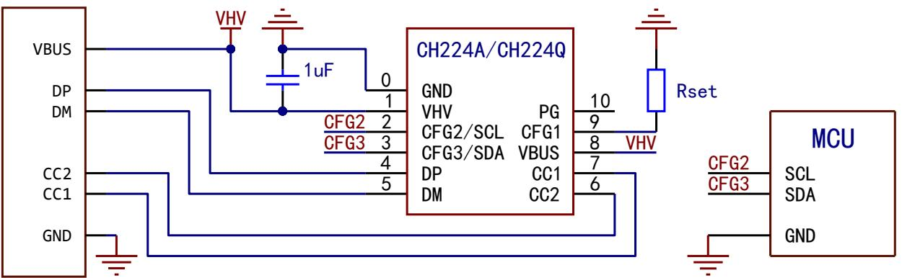

# 6.1.2I/0电平配置参考原理图(I/0电平对应请求电压参考表5-2)

当用电系统无需和CH224进行交互或控制时，CFG1可通过串接100KQ至VHV引脚的方法提供高电平（下图为I/0电平配置20V）。

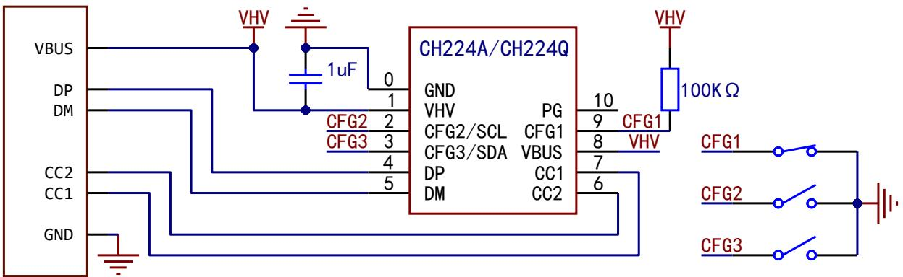

当用电系统存在3.3或5V电源，且需对CH224进行控制时，CFG1可连接系统中MCU的GPI0（如下图)。若系统高电平为3.3V，R1应取0Ω；若系统高电平为5V，R1应取2KΩ。

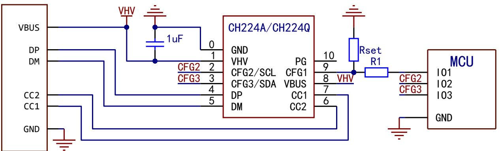

# 6.1.3 使用Type-C公口eMarker模拟功能

# 6.2 CH224K参考原理图（图中为I/0电平配置 20V）

<table><tr><td rowspan=1 colspan=1>CFG1</td><td rowspan=1 colspan=1>CFG2</td><td rowspan=1 colspan=1>CFG3</td><td rowspan=1 colspan=1>请求电压</td></tr><tr><td rowspan=1 colspan=1>1</td><td rowspan=1 colspan=1>X</td><td rowspan=1 colspan=1>X</td><td rowspan=1 colspan=1>5V</td></tr><tr><td rowspan=1 colspan=1>0</td><td rowspan=1 colspan=1>0</td><td rowspan=1 colspan=1>0</td><td rowspan=1 colspan=1>9V</td></tr><tr><td rowspan=1 colspan=1>0</td><td rowspan=1 colspan=1>0</td><td rowspan=1 colspan=1>1</td><td rowspan=1 colspan=1>12V</td></tr><tr><td rowspan=1 colspan=1>0</td><td rowspan=1 colspan=1>1</td><td rowspan=1 colspan=1>1</td><td rowspan=1 colspan=1>15V</td></tr><tr><td rowspan=1 colspan=1>0</td><td rowspan=1 colspan=1>1</td><td rowspan=1 colspan=1>0</td><td rowspan=1 colspan=1>20V</td></tr></table>

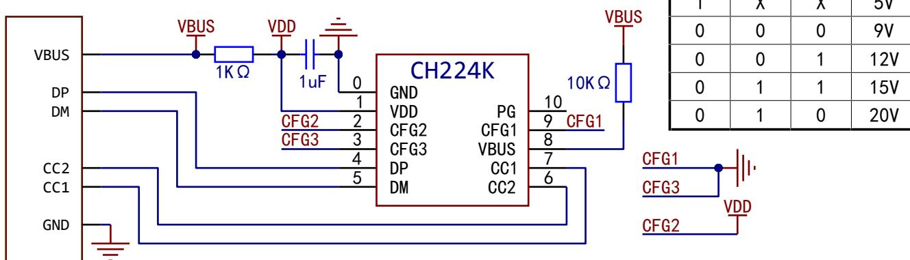  
6.3CH224D参考原理图（图中为单电阻配置9V)

注：建议升级为CH224A芯片，参考7.2节。

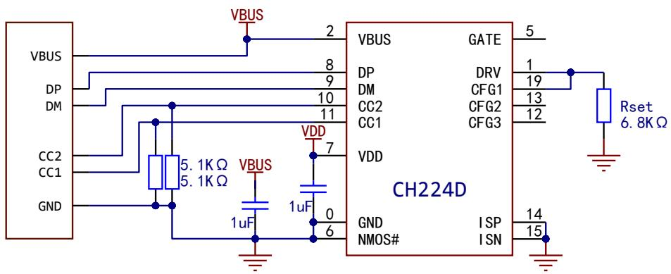

<table><tr><td rowspan=1 colspan=1>Rset阻值</td><td rowspan=1 colspan=1>请求电压</td></tr><tr><td rowspan=1 colspan=1>6.8KΩ</td><td rowspan=1 colspan=1>9V</td></tr><tr><td rowspan=1 colspan=1>24K Ω</td><td rowspan=1 colspan=1>12V</td></tr><tr><td rowspan=1 colspan=1>56KΩ</td><td rowspan=1 colspan=1>15V</td></tr><tr><td rowspan=1 colspan=1>NC</td><td rowspan=1 colspan=1>20V</td></tr></table>

# 6.4CH221K参考原理图（图中为单电阻配置20V)

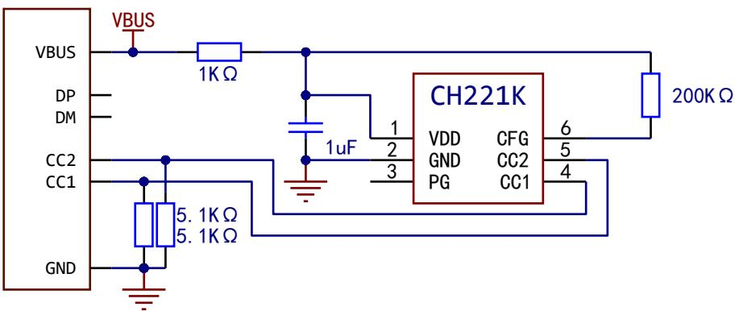

<table><tr><td rowspan=1 colspan=1>Rset阻值</td><td rowspan=1 colspan=1>请求电压</td></tr><tr><td rowspan=1 colspan=1>10K Ω</td><td rowspan=1 colspan=1>5V</td></tr><tr><td rowspan=1 colspan=1>20K Ω</td><td rowspan=1 colspan=1>9V</td></tr><tr><td rowspan=1 colspan=1>47K Ω</td><td rowspan=1 colspan=1>12V</td></tr><tr><td rowspan=1 colspan=1>100KΩ</td><td rowspan=1 colspan=1>15V</td></tr><tr><td rowspan=1 colspan=1>200KΩ</td><td rowspan=1 colspan=1>20V</td></tr></table>

# 7、CH224A 替换 CH224K 指南

CH224A 兼容CH224K引脚，多数情况下可在不更改PCB的情况下通过更换外围器件进行替换，以下为芯片不同点及常见替换示例。

# 7.1 CH224A 和 CH224K 不同点

CH224A的1脚为VHV，耐压32V，CH224K的1脚为VDD，耐压3.6V  
CH224A 的 CFG2和 CFG3 内部自带上拉电阻，CH224K 的CFG2和 CFG3内部无上拉电阻  
CH224A的CFG1耐压3.8V，CH224K的CFG1耐压8V  
CH224A的VBUS 耐压32V，CH224K的VBUS 耐压13.5V

# 7.2常见替换示例

7.2.1原CH224K为单电阻配置模式（预留Rset电阻，且CFG2、CFG3位悬空或短接GND）

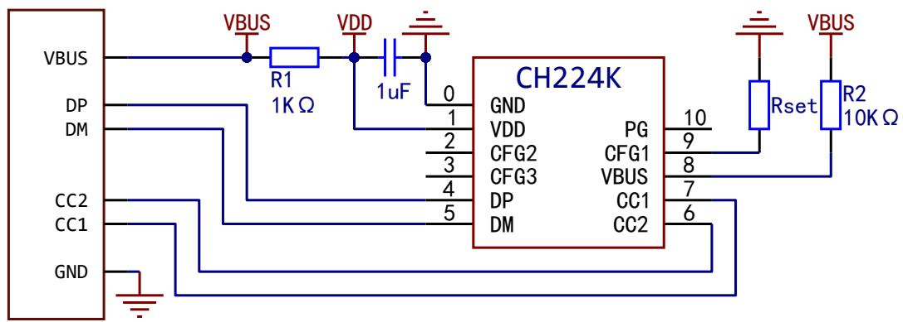  
图7-1原CH224K单电阻配置原理图

需做以下更改：

1.将R1短接或更换为 $0 \Omega$ ；  
2.将 R2短接或更换为 $0 \Omega$ ；  
3.将Rset更改为CH224A 的配置电阻。

7.2.2原CH224K为I/0电平配置模式（CFG1、CFG2、CFG3预留配置焊盘或电阻）

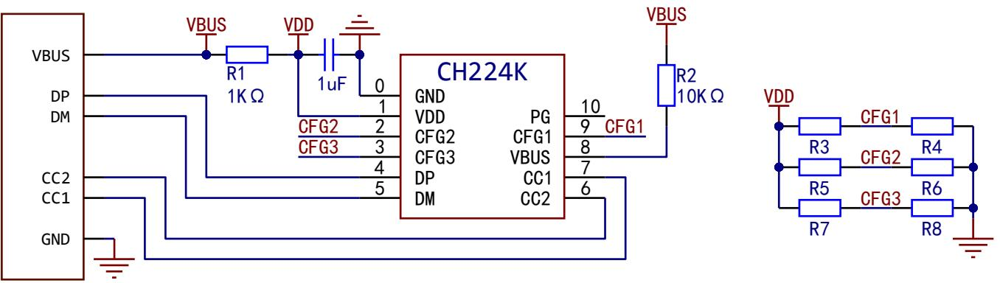  
图7-2原CH224的I/0电平配置原理图

注： $\perp$ 图中R3/R4、R5/R6、R7/R8为预留的电阻或焊盘。

需做以下更改：

1.将R1短接或更换为 $0 \Omega$ ；   
2.将R2短接或更换为 $0 \Omega$ ；

3.原 R3更换为100KΩ，R5、R7不焊接（CH224A的 CFG2和CFG3内部自带上拉）；

4.根据CH224A的I/0电平配置模式选择短接R4、R6、R8。

# 7.3其余注意事项

CH224A与CH224K的单电阻配置和I/0电平配置使用的电阻阻值或I/0电平对应电压不完全相同

# 8、参数

# 8.1绝对最大值

8.1.1 CH224Q/A绝对最大值(临界或者超过绝对最大值将可能导致芯片工作不正常甚至损坏）  

<table><tr><td rowspan=1 colspan=1>名称</td><td rowspan=1 colspan=1>参数说明</td><td rowspan=1 colspan=1>最小值</td><td rowspan=1 colspan=1>最大值</td><td rowspan=1 colspan=1>单位</td></tr><tr><td rowspan=1 colspan=1>TA</td><td rowspan=1 colspan=1>工作时的环境温度</td><td rowspan=1 colspan=1>-40</td><td rowspan=1 colspan=1>105</td><td rowspan=1 colspan=1>℃</td></tr><tr><td rowspan=1 colspan=1>TS</td><td rowspan=1 colspan=1>储存时的环境温度</td><td rowspan=1 colspan=1>-55</td><td rowspan=1 colspan=1>125</td><td rowspan=1 colspan=1>℃</td></tr><tr><td rowspan=1 colspan=1>VHV</td><td rowspan=1 colspan=1>工作电源电压</td><td rowspan=1 colspan=1>-0.5</td><td rowspan=1 colspan=1>32.0</td><td rowspan=1 colspan=1>V</td></tr><tr><td rowspan=1 colspan=1>VI0HV</td><td rowspan=1 colspan=1>支持高压的引脚（PG、VBUS）上的电压</td><td rowspan=1 colspan=1>-0.5</td><td rowspan=1 colspan=1>32.0</td><td rowspan=1 colspan=1>V</td></tr><tr><td rowspan=1 colspan=1>VIOCC</td><td rowspan=1 colspan=1>CC1、CC2引脚上的电压</td><td rowspan=1 colspan=1>-0.5</td><td rowspan=1 colspan=1>32.0</td><td rowspan=1 colspan=1>V</td></tr><tr><td rowspan=1 colspan=1>VIOUX</td><td rowspan=1 colspan=1>DP、DM、CFG1引脚上的电压</td><td rowspan=1 colspan=1>-0.5</td><td rowspan=1 colspan=1>3.8</td><td rowspan=1 colspan=1>V</td></tr><tr><td rowspan=1 colspan=1>VIOFT</td><td rowspan=1 colspan=1>CFG2、CFG3引脚上的电压</td><td rowspan=1 colspan=1>-0.5</td><td rowspan=1 colspan=1>6.5</td><td rowspan=1 colspan=1>V</td></tr><tr><td rowspan=1 colspan=1>PD</td><td rowspan=1 colspan=1>整个芯片的最大功耗（VHV电压*电流）</td><td rowspan=1 colspan=1></td><td rowspan=1 colspan=1>300</td><td rowspan=1 colspan=1>mW</td></tr></table>

8.1.2CH221K绝对最大值 (临界或者超过绝对最大值将可能导致芯片工作不正常甚至损坏)  

<table><tr><td rowspan=1 colspan=1>名称</td><td rowspan=1 colspan=1>参数说明</td><td rowspan=1 colspan=1>最小值</td><td rowspan=1 colspan=1>最大值</td><td rowspan=1 colspan=1>单位</td></tr><tr><td rowspan=1 colspan=1>TA</td><td rowspan=1 colspan=1>工作时的环境温度</td><td rowspan=1 colspan=1>-40</td><td rowspan=1 colspan=1>105</td><td rowspan=1 colspan=1>℃</td></tr><tr><td rowspan=1 colspan=1>TS</td><td rowspan=1 colspan=1>储存时的环境温度</td><td rowspan=1 colspan=1>-55</td><td rowspan=1 colspan=1>125</td><td rowspan=1 colspan=1>℃</td></tr><tr><td rowspan=1 colspan=1>VDD</td><td rowspan=1 colspan=1>工作电源电压（VDD引脚接电源，GND 引脚接地）</td><td rowspan=1 colspan=1>-0.5</td><td rowspan=1 colspan=1>5.8</td><td rowspan=1 colspan=1>V</td></tr><tr><td rowspan=1 colspan=1>VODHV</td><td rowspan=1 colspan=1>高压开漏输出引脚PG上的电压</td><td rowspan=1 colspan=1>-0.5</td><td rowspan=1 colspan=1>13.5</td><td rowspan=1 colspan=1>V</td></tr><tr><td rowspan=1 colspan=1>VIOCC</td><td rowspan=1 colspan=1>CC1、CC2引脚上的电压</td><td rowspan=1 colspan=1>-0.5</td><td rowspan=1 colspan=1>8</td><td rowspan=1 colspan=1>V</td></tr><tr><td rowspan=1 colspan=1>VIOUX</td><td rowspan=1 colspan=1>CFG引脚上的电压</td><td rowspan=1 colspan=1>-0.5</td><td rowspan=1 colspan=1>VDD+0.5</td><td rowspan=1 colspan=1>V</td></tr><tr><td rowspan=1 colspan=1>PD</td><td rowspan=1 colspan=1>整个芯片的最大功耗(VDD 电压*电流)</td><td rowspan=1 colspan=1></td><td rowspan=1 colspan=1>250</td><td rowspan=1 colspan=1>mW</td></tr></table>

8.1.3CH224K绝对最大值 (临界或者超过绝对最大值将可能导致芯片工作不正常甚至损坏)  

<table><tr><td rowspan=1 colspan=1>名称</td><td rowspan=1 colspan=1>参数说明</td><td rowspan=1 colspan=1>最小值</td><td rowspan=1 colspan=1>最大值</td><td rowspan=1 colspan=1>单位</td></tr><tr><td rowspan=1 colspan=1>TA</td><td rowspan=1 colspan=1>工作时的环境温度</td><td rowspan=1 colspan=1>-40</td><td rowspan=1 colspan=1>90</td><td rowspan=1 colspan=1>℃</td></tr><tr><td rowspan=1 colspan=1>TS</td><td rowspan=1 colspan=1>储存时的环境温度</td><td rowspan=1 colspan=1>-55</td><td rowspan=1 colspan=1>125</td><td rowspan=1 colspan=1>℃</td></tr><tr><td rowspan=1 colspan=1>VDD</td><td rowspan=1 colspan=1>工作电源电压（VDD引脚接电源，GND引脚接地）</td><td rowspan=1 colspan=1>3.0</td><td rowspan=1 colspan=1>3.6</td><td rowspan=1 colspan=1>V</td></tr><tr><td rowspan=1 colspan=1>VODHV</td><td rowspan=1 colspan=1>VBUS引脚上的电压</td><td rowspan=1 colspan=1>-0.5</td><td rowspan=1 colspan=1>13.5</td><td rowspan=1 colspan=1>V</td></tr><tr><td rowspan=1 colspan=1>VIOCC</td><td rowspan=1 colspan=1>CC1、CC2、CFG1引脚上的电压</td><td rowspan=1 colspan=1>-0.5</td><td rowspan=1 colspan=1>8</td><td rowspan=1 colspan=1>V</td></tr><tr><td rowspan=1 colspan=1>VIOUX</td><td rowspan=1 colspan=1>DP、DM、CFG2、CFG3引脚上的电压</td><td rowspan=1 colspan=1>-0.5</td><td rowspan=1 colspan=1>VDD+0.5</td><td rowspan=1 colspan=1>V</td></tr><tr><td rowspan=1 colspan=1>PD</td><td rowspan=1 colspan=1>整个芯片的最大功耗（VDD 电压*电流）</td><td rowspan=1 colspan=1></td><td rowspan=1 colspan=1>400</td><td rowspan=1 colspan=1>mW</td></tr></table>

8.1.4 CH224D绝对最大值 (临界或者超过绝对最大值将可能导致芯片工作不正常甚至损坏)  

<table><tr><td rowspan=1 colspan=1>名称</td><td rowspan=1 colspan=1>参数说明</td><td rowspan=1 colspan=1>最小值</td><td rowspan=1 colspan=1>最大值</td><td rowspan=1 colspan=1>单位</td></tr><tr><td rowspan=1 colspan=1>TA</td><td rowspan=1 colspan=1>工作时的环境温度</td><td rowspan=1 colspan=1>-40</td><td rowspan=1 colspan=1>100</td><td rowspan=1 colspan=1>℃</td></tr><tr><td rowspan=1 colspan=1>TS</td><td rowspan=1 colspan=1>储存时的环境温度</td><td rowspan=1 colspan=1>-55</td><td rowspan=1 colspan=1>125</td><td rowspan=1 colspan=1>℃</td></tr><tr><td rowspan=1 colspan=1>VDD</td><td rowspan=1 colspan=1>工作电源电压（VDD引脚接电源，GND 引脚接地）</td><td rowspan=1 colspan=1>-0.5</td><td rowspan=1 colspan=1>6</td><td rowspan=1 colspan=1>V</td></tr><tr><td rowspan=1 colspan=1>VODHV</td><td rowspan=1 colspan=1>VBUS引脚上的电压</td><td rowspan=1 colspan=1>-0.5</td><td rowspan=1 colspan=1>24</td><td rowspan=1 colspan=1>V</td></tr><tr><td rowspan=1 colspan=1>VIOCC</td><td rowspan=1 colspan=1>CC1、CC2引脚上的电压</td><td rowspan=1 colspan=1>-0.5</td><td rowspan=1 colspan=1>20</td><td rowspan=1 colspan=1>V</td></tr><tr><td rowspan=1 colspan=1>VIOUX</td><td rowspan=1 colspan=1>DP、DM、CFG1、CFG2、CFG3、DRV、NMOS#、ISP、ISN引脚上的电压</td><td rowspan=1 colspan=1>-0.5</td><td rowspan=1 colspan=1>VDD+0. 5</td><td rowspan=1 colspan=1>V</td></tr><tr><td rowspan=1 colspan=1>VIOHX</td><td rowspan=1 colspan=1>GATE引脚上的电压</td><td rowspan=1 colspan=1>-0.5</td><td rowspan=1 colspan=1>VI0HV+6. 5</td><td rowspan=1 colspan=1>V</td></tr><tr><td rowspan=1 colspan=1>PD</td><td rowspan=1 colspan=1>整个芯片的最大功耗（VDD 电压*电流）</td><td rowspan=1 colspan=1></td><td rowspan=1 colspan=1>300</td><td rowspan=1 colspan=1>mW</td></tr></table>

# 8.2电气参数

8.2.1 CH224Q/A电气参数（测试条件： ${ \mathsf { T } } { \mathsf { A } } = 2 5 { \mathsf { ^ { \circ } C } } .$ ）  

<table><tr><td rowspan=1 colspan=1>名称</td><td rowspan=1 colspan=1>参数说明</td><td rowspan=1 colspan=1>最小值</td><td rowspan=1 colspan=1>典型值</td><td rowspan=1 colspan=1>最大值</td><td rowspan=1 colspan=1>单位</td></tr><tr><td rowspan=1 colspan=1>VHV</td><td rowspan=1 colspan=1>高压电源电压VHV</td><td rowspan=1 colspan=1>3.3</td><td rowspan=1 colspan=1>5.0</td><td rowspan=1 colspan=1>30</td><td rowspan=1 colspan=1>V</td></tr><tr><td rowspan=1 colspan=1>ICC</td><td rowspan=1 colspan=1>工作时电源电流</td><td rowspan=1 colspan=1></td><td rowspan=1 colspan=1>1.8</td><td rowspan=1 colspan=1>12</td><td rowspan=1 colspan=1>mA</td></tr><tr><td rowspan=1 colspan=1>VILI2C</td><td rowspan=1 colspan=1>I2C低电平有效电压</td><td rowspan=1 colspan=1>0</td><td rowspan=1 colspan=1></td><td rowspan=1 colspan=1>0.8</td><td rowspan=1 colspan=1>V</td></tr><tr><td rowspan=1 colspan=1>VIHI2C</td><td rowspan=1 colspan=1>12C高电平有效电压</td><td rowspan=1 colspan=1>1.5</td><td rowspan=1 colspan=1></td><td rowspan=1 colspan=1>3.3</td><td rowspan=1 colspan=1>V</td></tr><tr><td rowspan=1 colspan=1>RPUFB</td><td rowspan=1 colspan=1>CFG2、CFG3引脚的上拉电阻</td><td rowspan=1 colspan=1>7</td><td rowspan=1 colspan=1>10</td><td rowspan=1 colspan=1>15</td><td rowspan=1 colspan=1>KΩ</td></tr><tr><td rowspan=1 colspan=1>VVHVX</td><td rowspan=1 colspan=1>VHV电源过压复位OVR保护电压</td><td rowspan=1 colspan=1>32</td><td rowspan=1 colspan=1>33</td><td rowspan=1 colspan=1>34</td><td rowspan=1 colspan=1>V</td></tr><tr><td rowspan=1 colspan=1>VR</td><td rowspan=1 colspan=1>电源上电复位的电压门限</td><td rowspan=1 colspan=1>2. 2</td><td rowspan=1 colspan=1>2.4</td><td rowspan=1 colspan=1>2. 65</td><td rowspan=1 colspan=1>V</td></tr></table>

8.2.2CH221K电气参数（测试条件： ${ \mathsf { T A } } = 2 5 { \mathsf { ^ { \circ } C } } .$ ）  

<table><tr><td rowspan=1 colspan=1>名称</td><td rowspan=1 colspan=1>参数说明</td><td rowspan=1 colspan=1>最小值</td><td rowspan=1 colspan=1>典型值</td><td rowspan=1 colspan=1>最大值</td><td rowspan=1 colspan=1>单位</td></tr><tr><td rowspan=1 colspan=1>VLDOK</td><td rowspan=1 colspan=1>内部电源调节器VDD并联稳压</td><td rowspan=1 colspan=1>3.0</td><td rowspan=1 colspan=1>3.3</td><td rowspan=1 colspan=1>3.6</td><td rowspan=1 colspan=1>V</td></tr><tr><td rowspan=1 colspan=1>ILDO</td><td rowspan=1 colspan=1>内部电源调节器VDD并联吸收电流能力</td><td rowspan=1 colspan=1>0</td><td rowspan=1 colspan=1></td><td rowspan=1 colspan=1>30</td><td rowspan=1 colspan=1>mA</td></tr><tr><td rowspan=1 colspan=1>VR</td><td rowspan=1 colspan=1>电源上电复位的电压门限</td><td rowspan=1 colspan=1>2.2</td><td rowspan=1 colspan=1>2.4</td><td rowspan=1 colspan=1>2.6</td><td rowspan=1 colspan=1>V</td></tr></table>

8.2.3CH224K电气参数（测试条件： ${ \mathsf { T } } { \mathsf { A } } = 2 5 { \mathsf { ^ { \circ } C } }$ ）  

<table><tr><td rowspan=1 colspan=1>名称</td><td rowspan=1 colspan=1>参数说明</td><td rowspan=1 colspan=1>最小值</td><td rowspan=1 colspan=1>典型值</td><td rowspan=1 colspan=1>最大值</td><td rowspan=1 colspan=1>单位</td></tr><tr><td rowspan=1 colspan=1>VLDOK</td><td rowspan=1 colspan=1>内部电源调节器VDD并联稳压</td><td rowspan=1 colspan=1>3.24</td><td rowspan=1 colspan=1>3.3</td><td rowspan=1 colspan=1>3.36</td><td rowspan=1 colspan=1>V</td></tr><tr><td rowspan=1 colspan=1>ILDO</td><td rowspan=1 colspan=1>内部电源调节器VDD并联吸收电流能力</td><td rowspan=1 colspan=1>0</td><td rowspan=1 colspan=1></td><td rowspan=1 colspan=1>30</td><td rowspan=1 colspan=1>mA</td></tr><tr><td rowspan=1 colspan=1>TOTA</td><td rowspan=1 colspan=1>超温保护模块OTA的参考阈值温度</td><td rowspan=1 colspan=1>90</td><td rowspan=1 colspan=1>105</td><td rowspan=1 colspan=1>120</td><td rowspan=1 colspan=1>℃</td></tr><tr><td rowspan=1 colspan=1>VR</td><td rowspan=1 colspan=1>电源上电复位的电压门限</td><td rowspan=1 colspan=1>2.2</td><td rowspan=1 colspan=1>2.4</td><td rowspan=1 colspan=1>2.6</td><td rowspan=1 colspan=1>V</td></tr></table>

8.2.4CH224D电气参数（测试条件： ${ \mathsf { T A } } = 2 5 { \mathsf { ^ { o } C } } .$   

<table><tr><td rowspan=1 colspan=1>名称</td><td rowspan=1 colspan=1>参数说明</td><td rowspan=1 colspan=1>最小值</td><td rowspan=1 colspan=1>典型值</td><td rowspan=1 colspan=1>最大值</td><td rowspan=1 colspan=1>单位</td></tr><tr><td rowspan=1 colspan=1>VLDOK</td><td rowspan=1 colspan=1>内部电源调节器VDD输出电压</td><td rowspan=1 colspan=1>4.6</td><td rowspan=1 colspan=1>4.7</td><td rowspan=1 colspan=1>4.8</td><td rowspan=1 colspan=1>V</td></tr><tr><td rowspan=1 colspan=1>ILDO</td><td rowspan=1 colspan=1>内部电源调节器VDD对外负载能力</td><td rowspan=1 colspan=1></td><td rowspan=1 colspan=1></td><td rowspan=1 colspan=1>10</td><td rowspan=1 colspan=1>mA</td></tr><tr><td rowspan=1 colspan=1>VR</td><td rowspan=1 colspan=1>电源上电复位的电压门限</td><td rowspan=1 colspan=1>2.2</td><td rowspan=1 colspan=1>2.4</td><td rowspan=1 colspan=1>2.6</td><td rowspan=1 colspan=1>V</td></tr></table>

# 9、封装信息

说明：尺寸标注的单位是mm（毫米）。  
引脚中心间距是标称值，没有误差，除此之外的尺寸误差不大于 $\pm 0 . 2 \mathsf { m m }$ 。

9.1 ESS0P10

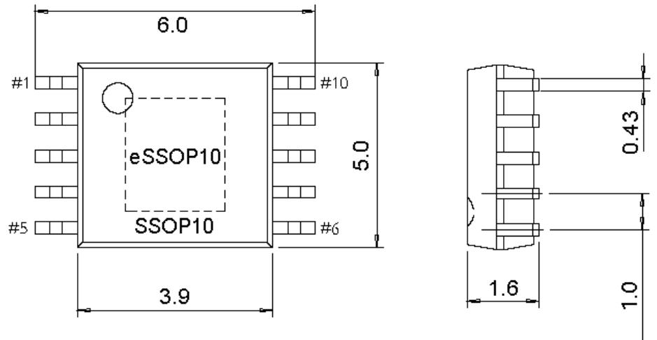

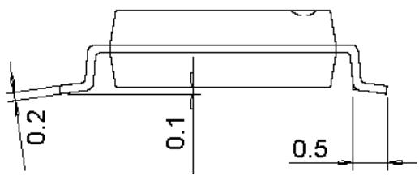

# 9.2 DFN10

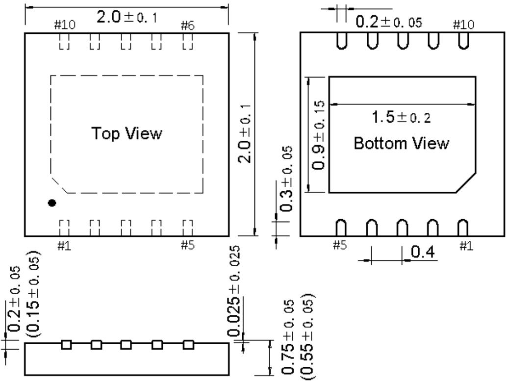

# 9.3 QFN20

# 9.4 S0T23-6

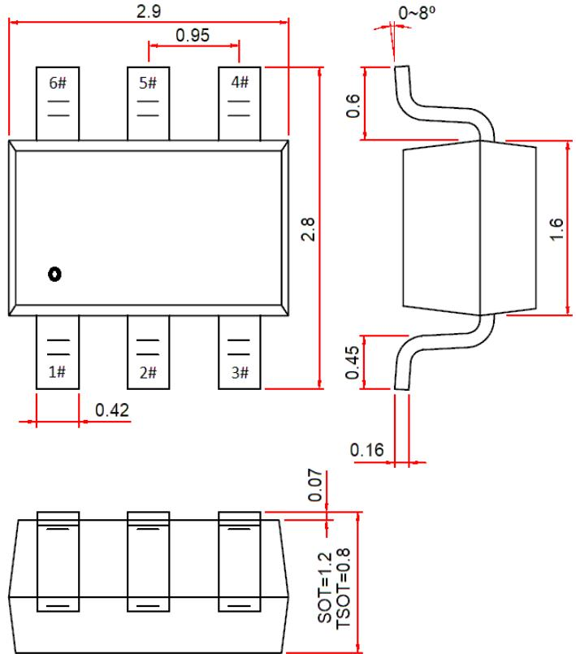