# TPS6293x 3.8-V to 30-V, 2-A, 3-A Synchronous Buck Converters in a SOT583 Package

# 1 Features

# • Configured for a wide range of applications

3.8-V to 30-V input voltage range   
0.8-V to 22-V output voltage range   
Ultra-low quiescent current: $1 2 \mu \mathsf { A }$ (TPS62932,   
TPS62933, and TPS62933P)   
Integrated $7 6 - \mathsf { m } \Omega$ and $3 2 \cdot \mathsf { m } \Omega$ MOSFETs   
$0 . 8 \ : \lor \pm \ : 1 \%$ reference voltage $( 2 5 ^ { \circ } \mathsf { C } )$   
Maximum $9 8 \%$ duty cycle operation   
Precision EN threshold   
2-A (TPS62932) and 3-A (TPS62933 and   
TPS62933x) continuous output current   
$\ 4 0 ^ { \circ } \mathsf { C }$ to $1 5 0 ^ { \circ } \mathsf C$ operating junction temperature TPS62932, TPS62933, and TPS62933F with the SS pin for adjustable soft-start time   
TPS62933P and TPS62933O with the PG pin for a power-good indicator   
TPS62932, TPS62933, and TPS62933P with pulse frequency modulation (PFM) for high light-load efficiency   
TPS62933F with forced continuous current modulation (FCCM)   
TPS62933O with out-of-audio (OOA) feature

• Ease of use and small solution size

Peak current control mode with internal   
compensation   
200-kHz to 2.2-MHz selectable frequency   
EMI friendly with frequency spread spectrum   
(TPS62932, TPS62933, TPS62933P and   
TPS62933O)   
Supports start-up with prebiased output   
Cycle-by-cycle OC limit for both high-side and   
low-side MOSFETs   
Non-latched protections for OTP, OCP, OVP,   
UVP, and UVLO   
1.6-mm × 2.1-mm SOT583 package

Create a custom design with the TPS6293x using the WEBENCH® Power Designer

# 2 Applications

Building automation, appliances, industrial PC   
Multifunction printers, enterprise projectors   
Portable electronics, connected peripherals   
Smart speakers, monitors   
Distributed power systems with 5-V, 12-V, 19-V,   
and 24-V input

range of $3 . 8 \ \vee$ to $^ { 3 0 \ \vee } ,$ and supports up to 2-A (TPS62932) and 3-A (TPS62933 and TPS62933x) continuous output current and $0 . 8 – \lor$ to 22-V output voltage.

The device employs fixed-frequency peak current control mode for fast transient response and good line and load regulation. The optimized internal loop compensation eliminates external compensation components.

The TPS62932, TPS62933, and TPS62933P operate in pulse frequency modulation for high light load efficiency. The TPS62933F operates in forced continuous current modulation which maintains lower output ripple during all load conditions. The TPS62933O operates in out of audio mode to avoid audible noise.

Device Information   

<table><tr><td rowspan=1 colspan=1>Part Number</td><td rowspan=1 colspan=1>Package(1)</td><td rowspan=1 colspan=1>Body Size (NOM)</td></tr><tr><td rowspan=1 colspan=1>TPS6293x</td><td rowspan=1 colspan=1>SOT583 (8)</td><td rowspan=1 colspan=1>1.60 mm × 2.10 mm</td></tr></table>

(1) For all available packages, see the orderable addendum at the end of the data sheet.

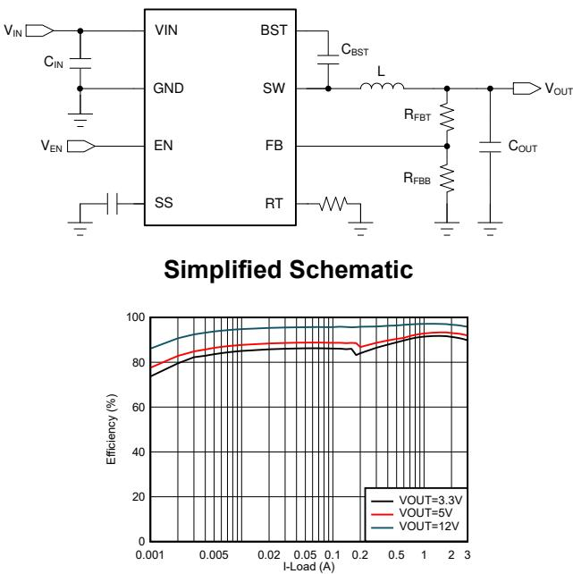

TPS62933 Efficiency, $V _ { | \mathsf { N } } = 2 4 \mathsf { V }$ , $\mathbf { f } _ { \mathsf { S W } } = 5 0 0$ kHz

# 3 Description

The TPS6293x is a high-efficiency, easy-to-use synchronous buck converter with a wide input voltage

# Table of Contents

1 Features.. .1   
2 Applications.. 1   
3 Description.. .1   
4 Revision History.. . 2   
5 Description (continued).. . 3   
6 Device Comparison Table.. 3   
7 Pin Configuration and Functions.. .3   
8 Specifications.. 5   
8.1 Absolute Maximum Ratings.. . 5   
8.2 ESD Ratings.. 5   
8.3 Recommended Operating Conditions.. .5   
8.4 Thermal Information... .6   
8.5 Electrical Characteristics.. .6   
8.6 Typical Characteristics.. 9

# 9 Detailed Description.. .16

9.1 Overview.. . 16   
9.2 Functional Block Diagram.. . 17..18   
9.3 Feature Description..

# 9.4 Device Functional Modes.. .26

# 10 Application and Implementation... .28

10.1 Application Information.. 28   
10.2 Typical Application.. . 28   
10.3 What to Do and What Not to Do. 38

# 11 Power Supply Recommendations.. .39

12 Layout... .40   
12.1 Layout Guidelines . 40   
12.2 Layout Example... . 41

# 13 Device and Documentation Support.. .42

13.1 Device Support.. 42   
13.2 Receiving Notification of Documentation Updates..42   
13.3 Support Resources.. 42   
13.4 Trademarks... . 42   
13.5 Electrostatic Discharge Caution.. 4   
13.6 Glossary.... .42

# 14 Mechanical, Packaging, and Orderable

Information.. 43

# 4 Revision History

NOTE: Page numbers for previous revisions may differ from page numbers in the current version.

Changes from Revision C (July 2022) to Revision D (August 2022)

• Added the TPS62933O..   
• Changed link of WEBENCH $\textsuperscript { \textregistered }$ Power Designer for TPS6293x..

# Changes from Revision B (February 2022) to Revision C (July 2022) Pag

#

• Added the TPS62933F.. ..   
• Added the TPS62933P..

# 5 Description (continued)

The ULQ (ultra-low quiescent) feature is beneficial for long battery lifetime. The switching frequency can be set by the configuration of the RT pin in the range of $2 0 0 ~ { \mathsf { k H z } }$ to $2 . 2 ~ \mathsf { M H z }$ , which can optimize system efficiency, solution size, and bandwidth. The soft-start time of the TPS62932, TPS62933, and TPS62933F can be adjusted by the external capacitor at the SS pin. The TPS62932, TPS62933, TPS62933P and TPS62933O are featured with frequency spread spectrum, which helps with lowering down EMI noise.

The TPS6293x is in a small SOT583 ( $1 . 6 \ \mathrm { m m } \times 2 . 1 \ \mathrm { m m }$ ) package with $0 . 5 \mathrm { - } \mathsf { m m }$ pin pitch, and has an optimized pinout for easy PCB layout and promotes good EMI performance.

# 6 Device Comparison Table

<table><tr><td rowspan=1 colspan=1>Part Number</td><td rowspan=1 colspan=1>Output Current</td><td rowspan=1 colspan=1>PFM or FCCM or OOA</td><td rowspan=1 colspan=1>SS or PG Pin</td></tr><tr><td rowspan=1 colspan=1>TPS62932</td><td rowspan=1 colspan=1>2A</td><td rowspan=1 colspan=1>PFM</td><td rowspan=1 colspan=1>SS</td></tr><tr><td rowspan=1 colspan=1>TPS62933</td><td rowspan=1 colspan=1>3A</td><td rowspan=1 colspan=1>PFM</td><td rowspan=1 colspan=1>SS</td></tr><tr><td rowspan=1 colspan=1>TPS62933F</td><td rowspan=1 colspan=1>3A</td><td rowspan=1 colspan=1>FCCM</td><td rowspan=1 colspan=1>SS</td></tr><tr><td rowspan=1 colspan=1>TPS62933P</td><td rowspan=1 colspan=1>3A</td><td rowspan=1 colspan=1>PFM</td><td rowspan=1 colspan=1>PG</td></tr><tr><td rowspan=1 colspan=1>TPS629330</td><td rowspan=1 colspan=1>3 A</td><td rowspan=1 colspan=1>OOA</td><td rowspan=1 colspan=1>PG</td></tr></table>

# 7 Pin Configuration and Functions

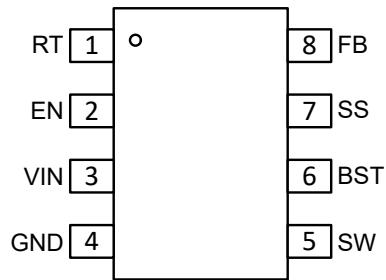  
Figure 7-1. TPS62932, TPS62933, and TPS62933F 8-Pin SOT583 DRL Package (Top View)

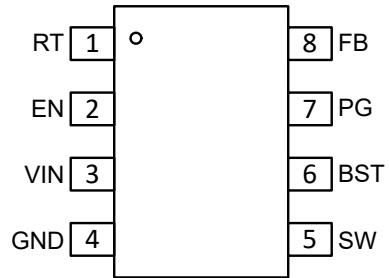  
Figure 7-2. TPS62933P and TPS62933O 8-Pin SOT583 DRL Package (Top View)

# Table 7-1. Pin Functions

<table><tr><td rowspan=1 colspan=2>Pin</td><td rowspan=2 colspan=1>Type(1)</td><td rowspan=2 colspan=1>Description</td></tr><tr><td rowspan=1 colspan=1>Name</td><td rowspan=1 colspan=1>NO.</td></tr><tr><td rowspan=1 colspan=1>RT</td><td rowspan=1 colspan=1>1</td><td rowspan=1 colspan=1>A</td><td rowspan=1 colspan=1>Frequency programming input. Float for 500 kHz, te to GND for 1.2 MHz, or connect to anRT timing resistor. See Section 9.3.5 for details.</td></tr><tr><td rowspan=1 colspan=1>EN</td><td rowspan=1 colspan=1>2</td><td rowspan=1 colspan=1>A</td><td rowspan=1 colspan=1>Enable input to the converter. Driving EN high or leaving this pin floating enables theconverter. An external resistor divider can be used to implement an adjustable Vin UVLOfunction.</td></tr><tr><td rowspan=1 colspan=1>VIN</td><td rowspan=1 colspan=1>3</td><td rowspan=1 colspan=1>P</td><td rowspan=1 colspan=1>Supply input pin to internal LDO and high-side FET. Input bypass capacitors must be directlyconnected to this pin and GND.</td></tr><tr><td rowspan=1 colspan=1>GND</td><td rowspan=1 colspan=1>4</td><td rowspan=1 colspan=1>G</td><td rowspan=1 colspan=1>Ground pin. Connected to the source of the low-side FET as well as the ground pin for thecontroller circuit. Connect to system ground and the ground side of Cin and CouT. The pathto Cin must be as short as possible.</td></tr><tr><td rowspan=1 colspan=1>SW</td><td rowspan=1 colspan=1>5</td><td rowspan=1 colspan=1>P</td><td rowspan=1 colspan=1>Switching output of the convertor. Internally connected to the source of the high-side FETand drain of the low-side FET. Connect to the power inductor.</td></tr><tr><td rowspan=1 colspan=1>BST</td><td rowspan=1 colspan=1>6</td><td rowspan=1 colspan=1>P</td><td rowspan=1 colspan=1>Bootstrap capacitor connection for high-side FET driver. Connect a high-quality, 100-nFceramic capacitor from this pin to the SW pin.</td></tr></table>

Table 7-1. Pin Functions (continued)   

<table><tr><td rowspan=1 colspan=2>Pin</td><td rowspan=2 colspan=1>Type(1)</td><td rowspan=2 colspan=1>Description</td></tr><tr><td rowspan=1 colspan=1>Name</td><td rowspan=1 colspan=1>NO.</td></tr><tr><td rowspan=2 colspan=1>SS/PG</td><td rowspan=2 colspan=1>7</td><td rowspan=1 colspan=1>A</td><td rowspan=1 colspan=1>TPS62932, TPS62933, and TPS62933F soft-start control pin. An external capacitorconnected to this pin sets the internal voltage reference rising time. See Section 9.3.7 fordetails. A minimum 6.8-nF ceramic capacitor must be connected at this pin, which sets theminimum soft-start time to approximately 1 ms. Do not float.</td></tr><tr><td rowspan=1 colspan=1>A</td><td rowspan=1 colspan=1>TPS62933P and TPS62933O open-drain power good indicator, which is asserted low ifoutput voltage is out of PG threshold, overvoltage, or if the device is under thermalshutdown, EN shutdown, or during soft start.</td></tr><tr><td rowspan=1 colspan=1>FB</td><td rowspan=1 colspan=1>8</td><td rowspan=1 colspan=1>A</td><td rowspan=1 colspan=1>Output feedback input. Connect FB to the tap of an external resistor divider from the outputto GND to set output voltage.</td></tr></table>

(1) $\mathsf { A } =$ Analog, $\mathsf { P } =$ Power, $\mathsf { G } =$ Ground

# 8 Specifications 8.1 Absolute Maximum Ratings

Over the recommended operating junction temperature range of $\ 4 0 ^ { \circ } \mathsf { C }$ to $+ 1 5 0 ^ { \circ } \mathrm { C }$ , unless otherwise noted(1)

<table><tr><td></td><td></td><td rowspan=1 colspan=1>MIN</td><td rowspan=1 colspan=1>MAX</td><td rowspan=1 colspan=1>UNIT</td></tr><tr><td rowspan=3 colspan=1>Input voltage</td><td rowspan=1 colspan=1>VIN</td><td rowspan=1 colspan=1>-0.3</td><td rowspan=1 colspan=1>32</td><td rowspan=9 colspan=1>V</td></tr><tr><td rowspan=1 colspan=1>EN</td><td rowspan=1 colspan=1>-0.3</td><td rowspan=1 colspan=1>6</td></tr><tr><td rowspan=1 colspan=1>FB</td><td rowspan=1 colspan=1>-0.3</td><td rowspan=1 colspan=1>6</td></tr><tr><td rowspan=6 colspan=1>Output voltage</td><td rowspan=1 colspan=1>SW, DC</td><td rowspan=1 colspan=1>-0.3</td><td rowspan=1 colspan=1>32</td></tr><tr><td rowspan=1 colspan=1>SW, transient &lt; 10 ns</td><td rowspan=1 colspan=1>-3</td><td rowspan=1 colspan=1>33</td></tr><tr><td rowspan=1 colspan=1>BST</td><td rowspan=1 colspan=1>-0.3</td><td rowspan=1 colspan=1>SW + 6</td></tr><tr><td rowspan=1 colspan=1>BST-SW</td><td rowspan=1 colspan=1>-0.3</td><td rowspan=1 colspan=1>6</td></tr><tr><td rowspan=1 colspan=1>SS/PG</td><td rowspan=1 colspan=1>-0.3</td><td rowspan=1 colspan=1>6</td></tr><tr><td rowspan=1 colspan=1>RT</td><td rowspan=1 colspan=1>-0.3</td><td rowspan=1 colspan=1>6</td></tr><tr><td rowspan=1 colspan=1>Tj</td><td rowspan=1 colspan=1>Operating junction temperature(2)</td><td rowspan=1 colspan=1>-40</td><td rowspan=1 colspan=1>150</td><td rowspan=2 colspan=1>C</td></tr><tr><td rowspan=1 colspan=1>Tstg</td><td rowspan=1 colspan=1>Storage temperature</td><td rowspan=1 colspan=2>-65                  150</td></tr></table>

(1) Operation outside the Absolute Maximum Ratings may cause permanent device damage. Absolute Maximum Ratings do not imply functional operation of the device at these or any other conditions beyond those listed under Recommended Operating Conditions. If used outside the Recommended Operating Conditions but within the Absolute Maximum Ratings, the device may not be fully functional, and this may affect device reliability, functionality, performance, and shorten the device lifetime.   
(2) Operating at junction temperatures greater than $1 5 0 ^ { \circ } \mathsf C$ , although possible, degrades the lifetime of the device.

# 8.2 ESD Ratings

<table><tr><td></td><td></td><td></td><td rowspan=1 colspan=1>VALUE</td><td rowspan=1 colspan=1>UNIT</td></tr><tr><td rowspan=2 colspan=1>V(ESD)</td><td rowspan=2 colspan=1>Electrostatic discharge</td><td rowspan=1 colspan=1>Human body model (HBM), per ANSI/ESDA/JEDECJS-001, all pins(1)</td><td rowspan=1 colspan=1>±2000</td><td rowspan=2 colspan=1>V</td></tr><tr><td rowspan=1 colspan=1>Charged device model (CDM), per ANSI/ESDA/JEDECJS-002, all pins(2)</td><td rowspan=1 colspan=1>±500</td></tr></table>

(1) JEDEC document JEP155 states that 500-V HBM allows safe manufacturing with a standard ESD control process.   
(2) JEDEC document JEP157 states that 250-V CDM allows safe manufacturing with a standard ESD control process.

# 8.3 Recommended Operating Conditions

Over the recommended operating junction temperature range of $\ 4 0 ^ { \circ } \mathsf { C }$ to $+ 1 5 0 ^ { \circ } \mathrm { C }$ , unless otherwise noted(1)

<table><tr><td rowspan=1 colspan=1></td><td rowspan=1 colspan=2></td><td rowspan=1 colspan=1>MIN          NOM</td><td rowspan=1 colspan=1>MAX</td><td rowspan=1 colspan=1>UNIT</td></tr><tr><td rowspan=4 colspan=1>Input voltage</td><td rowspan=1 colspan=2>VIN</td><td rowspan=1 colspan=1>3.8</td><td rowspan=1 colspan=1>30</td><td rowspan=9 colspan=1>V</td></tr><tr><td rowspan=1 colspan=2>EN</td><td rowspan=1 colspan=1>-0.1</td><td rowspan=1 colspan=1>5.5</td></tr><tr><td rowspan=1 colspan=2>FB</td><td rowspan=1 colspan=1>-0.1</td><td rowspan=1 colspan=1>5.5</td></tr><tr><td rowspan=1 colspan=2>PG</td><td rowspan=1 colspan=1>-0.1</td><td rowspan=1 colspan=1>5.5</td></tr><tr><td rowspan=5 colspan=1>Output voltage</td><td rowspan=1 colspan=2>VouT</td><td rowspan=1 colspan=1>0.8</td><td rowspan=1 colspan=1>22</td></tr><tr><td rowspan=1 colspan=2>SW, DC</td><td rowspan=1 colspan=1>-0.1</td><td rowspan=1 colspan=1>30</td></tr><tr><td rowspan=1 colspan=2>SW, transient &lt; 10 ns</td><td rowspan=1 colspan=1>-3</td><td rowspan=1 colspan=1>32</td></tr><tr><td rowspan=1 colspan=2>BST</td><td rowspan=1 colspan=1>-0.1</td><td rowspan=1 colspan=1>SW + 5.5</td></tr><tr><td rowspan=1 colspan=2>BST-SW</td><td rowspan=1 colspan=1>-0.1</td><td rowspan=1 colspan=1>5.5</td></tr><tr><td rowspan=2 colspan=1>Ouput current</td><td rowspan=2 colspan=1>IOUT</td><td rowspan=1 colspan=1>TPS62933, TPS62933x</td><td rowspan=1 colspan=1>0</td><td rowspan=1 colspan=1>3</td><td rowspan=2 colspan=1>A</td></tr><tr><td rowspan=1 colspan=1>TPS62932</td><td rowspan=1 colspan=1>0</td><td rowspan=1 colspan=1>2</td></tr><tr><td rowspan=1 colspan=1>Temperature</td><td rowspan=1 colspan=2>Operating junction temperature, TJ</td><td rowspan=1 colspan=2>-40                            150</td><td rowspan=1 colspan=1>C</td></tr></table>

(1) The Recommended Operating Conditions indicate conditions for which the device is intended to be functional, but do not guarantee specific performance limits. For compliant specifications, see the Electrical Characteristics.

# 8.4 Thermal Information

<table><tr><td rowspan=3 colspan=2>THERMAL METRIC(1)</td><td rowspan=1 colspan=2>TPS6293x</td><td rowspan=3 colspan=1>UNIT</td></tr><tr><td rowspan=1 colspan=2>DRL (SOT583), 8 PINS</td></tr><tr><td rowspan=1 colspan=1>JEDEC(2)</td><td rowspan=1 colspan=1>EVM(3)</td></tr><tr><td rowspan=1 colspan=1>RθJA</td><td rowspan=1 colspan=1>Junction-to-ambient thermal resistance</td><td rowspan=1 colspan=1>112.2</td><td rowspan=1 colspan=1>N/A</td><td rowspan=1 colspan=1>C/W</td></tr><tr><td rowspan=1 colspan=1>ReJC(top)</td><td rowspan=1 colspan=1>Junction-to-case (top) thermal resistance</td><td rowspan=1 colspan=1>29.1</td><td rowspan=1 colspan=1>N/A</td><td rowspan=1 colspan=1>C/W</td></tr><tr><td rowspan=1 colspan=1>R_JB</td><td rowspan=1 colspan=1>Junction-to-board thermal resistance</td><td rowspan=1 colspan=1>19.3</td><td rowspan=1 colspan=1>N/A</td><td rowspan=1 colspan=1>°C/W</td></tr><tr><td rowspan=1 colspan=1>4\sqrt}$</td><td rowspan=1 colspan=1>Junction-to-top characterization parameter</td><td rowspan=1 colspan=1>1.6</td><td rowspan=1 colspan=1>N/A</td><td rowspan=1 colspan=1>C/W</td></tr><tr><td rowspan=1 colspan=1>4JB$</td><td rowspan=1 colspan=1>Junction-to-board characterization parameter</td><td rowspan=1 colspan=1>19.2</td><td rowspan=1 colspan=1>N/A</td><td rowspan=1 colspan=1>°C/W</td></tr><tr><td rowspan=1 colspan=1>RθJA_EVM</td><td rowspan=1 colspan=1>Junction-to-ambient thermal resistance on officialEVM board</td><td rowspan=1 colspan=1>N/A</td><td rowspan=1 colspan=1>60.2</td><td rowspan=1 colspan=1>C/W</td></tr></table>

(1) For more information about traditional and new thermal metrics, see the Semiconductor and IC Package Thermal Metrics application report. (2) The value of $\mathsf { R } _ { \Theta \ J \mathsf { A } }$ given in this table is only valid for comparison with other packages and can not be used for design purposes. These values were simulated on a standard JEDEC board. They do not represent the performance obtained in an actual application. (3) The real $\mathsf { R } _ { \Theta \ J _ { A } }$ is tested on TI EVM (2 layer, 2-ounce copper thickness).

# 8.5 Electrical Characteristics

The electrical ratings specified in this section apply to all specifications in this document, unless otherwise noted. These specifications are interpreted as conditions that do not degrade the device parametric or functional specifications for the life of the product containing it. ${ \sf T } _ { \mathsf { J } } = - 4 0 ^ { \circ } { \mathsf { C } }$ to $+ 1 5 0 ^ { \circ } \mathrm { C }$ , $\mathsf { V } _ { | \mathsf { N } } = 3 . 8 \ : \mathsf { V }$ to $\mathfrak { 3 0 } \vee$ , unless otherwise noted.

<table><tr><td></td><td>PARAMETER</td><td>TEST CONDITIONS</td><td>MIN</td><td>TYP</td><td>MAX</td><td>UNIT</td></tr><tr><td colspan="5">POWER SUPPLY (VIN PIN)</td><td></td><td></td></tr><tr><td colspan="5">VIN Operation input voltage</td><td>30</td><td>V</td></tr><tr><td rowspan="3">|Q</td><td rowspan="3">Nonswitching quiescent current</td><td>EN = 5 V, VFB = 0.85 V, TPS62932,</td><td colspan="2">3.8 12</td><td></td><td rowspan="3">μA</td></tr><tr><td>TPS62933, and TPS62933P EN = 5 V, VFB = 1 V, TPS62933F</td><td colspan="2">125</td><td></td></tr><tr><td>EN = 5 V, VFB = 1 V, TPS62933O</td><td colspan="2">45</td><td></td></tr><tr><td>ISHDN</td><td>Shutdown supply current</td><td>VEN = 0 V</td><td colspan="2">2</td><td></td><td>μA</td></tr><tr><td rowspan="3">VIN_UVLO</td><td rowspan="3">Input undervoltage lockout thresholds</td><td>Rising threshold</td><td colspan="2">3.4 3.6</td><td>3.8</td><td>V</td></tr><tr><td>Falling threshold</td><td colspan="2">3.1 3.3</td><td>3.5</td><td>V</td></tr><tr><td>Hysteresis</td><td colspan="2">300</td><td></td><td>mV</td></tr><tr><td colspan="8">ENABLE (EN PIN)</td></tr><tr><td>VEN_RISE</td><td>Enable threshold</td><td>Rising enable threshold</td><td colspan="2">1.21</td><td>1.28</td><td>V</td></tr><tr><td>VEN_FALL</td><td>Disable threshold</td><td>Falling disable threshold</td><td>1.1</td><td>1.17</td><td></td><td>V</td></tr><tr><td>Ip</td><td>EN pullup current</td><td>VEN = 1.0 V</td><td></td><td>0.7</td><td></td><td>μA</td></tr><tr><td>In</td><td>EN pullup hysteresis current</td><td>VEN = 1.5 V</td><td colspan="2">1.4</td><td></td><td>μA</td></tr><tr><td colspan="8">VOLTAGE REFERENCE (FB PIN)</td></tr><tr><td rowspan="3">VFB FB voltage</td><td rowspan="3"></td><td>Tj=25°C</td><td colspan="2">792 800</td><td>808</td><td>mV</td></tr><tr><td>Tj = 0C to 85°</td><td>788</td><td>800</td><td>812</td><td>mV</td></tr><tr><td>Tj = -40°C to 150</td><td>784</td><td>800</td><td>816</td><td>mV</td></tr><tr><td>IFB</td><td>Input leakage current</td><td>VFB = 0.8 V</td><td></td><td></td><td>0.15</td><td>μA</td></tr><tr><td colspan="8">INTEGRATED POWER MOSFETS</td></tr><tr><td>RDSON_HS</td><td>High-side MOSFET on-resistance</td><td>Tj = 25°C, VBST - SW = 5 V</td><td colspan="2">76</td><td></td><td>mΩ</td></tr><tr><td>RDSON_LS</td><td>Low-side MOSFET on-resistance</td><td>Tj = 25°</td><td colspan="2">32</td><td></td><td>mΩ</td></tr><tr><td colspan="8">CURRENT LIMIT</td></tr><tr><td rowspan="2">IHS_LIMIT High-side MOSFET current limit</td><td rowspan="2"></td><td>TPS62933 and TPS62933x TPS62932</td><td>4.2</td><td>5</td><td>5.8</td><td rowspan="2">A</td></tr><tr><td></td><td>2.8</td><td>3.4</td><td>4</td><td></td></tr></table>

# 8.5 Electrical Characteristics (continued)

The electrical ratings specified in this section apply to all specifications in this document, unless otherwise noted. These specifications are interpreted as conditions that do not degrade the device parametric or functional specifications for the life of the product containing it. ${ \sf T } _ { \mathsf { J } } = - 4 0 ^ { \circ } { \mathsf { C } }$ to $+ 1 5 0 ^ { \circ } \mathrm { C }$ , $\mathsf { V } _ { | \mathsf { N } } = 3 . 8 \ : \mathsf { V }$ to $3 0 \vee ,$ unless otherwise noted.

<table><tr><td rowspan=1 colspan=1>PARAMETER</td><td rowspan=1 colspan=1>TEST CONDITIONS</td><td rowspan=1 colspan=1>MIN   TYP   MAX</td><td rowspan=1 colspan=1>UNIT</td></tr><tr><td rowspan=2 colspan=1> LS_LIMIT    Low-side MOSFET current limit</td><td rowspan=1 colspan=1>TPS62933 and TPS62933x</td><td rowspan=1 colspan=1>2.9    3.8    4.5</td><td rowspan=2 colspan=1>A</td></tr><tr><td rowspan=1 colspan=1>TPS62932</td><td rowspan=1 colspan=1>2     2.5     3</td></tr><tr><td rowspan=1 colspan=1>ILS_NOC     Reverse current limit</td><td rowspan=1 colspan=1>TPS62933F</td><td rowspan=1 colspan=1>1.2    2.4    3.6</td><td rowspan=1 colspan=1>A</td></tr><tr><td rowspan=2 colspan=1>IPEAK_MIN   Minimum peak inductor current</td><td rowspan=1 colspan=1>TPS62933, TPS62933P, and TPS629330</td><td rowspan=1 colspan=1>0.75</td><td rowspan=2 colspan=1>A</td></tr><tr><td rowspan=1 colspan=1>TPS62932</td><td rowspan=1 colspan=1>0.53</td></tr><tr><td rowspan=1 colspan=4>SOFT START (SS PIN)</td></tr><tr><td rowspan=1 colspan=1>Iss         Soft-start charge current</td><td rowspan=1 colspan=1>TPS62932, TPS62933, and TPS62933F</td><td rowspan=1 colspan=1>4.5    5.5    6.5</td><td rowspan=1 colspan=1>μA</td></tr><tr><td rowspan=1 colspan=1>Tss        Fixed internal soft-start time</td><td rowspan=1 colspan=1>TPS62933P and TPS629330</td><td rowspan=1 colspan=1>2</td><td rowspan=1 colspan=1>ms</td></tr><tr><td rowspan=1 colspan=1>POWER GOOD (PG PIN)</td><td rowspan=1 colspan=1></td><td rowspan=1 colspan=1></td><td rowspan=1 colspan=1></td></tr><tr><td rowspan=4 colspan=1>VPGTH      PG threshold, VFB percentage</td><td rowspan=1 colspan=1>VB falling, PG high to low</td><td rowspan=1 colspan=1>85%</td><td rowspan=1 colspan=1></td></tr><tr><td rowspan=1 colspan=1>VFB rising, PG low to high</td><td rowspan=1 colspan=1>90%</td><td rowspan=1 colspan=1></td></tr><tr><td rowspan=1 colspan=1>VFB falling, PG low to high</td><td rowspan=1 colspan=1>110%</td><td rowspan=1 colspan=1></td></tr><tr><td rowspan=1 colspan=1>VFB rising, PG high to low</td><td rowspan=1 colspan=1>115%</td><td rowspan=1 colspan=1></td></tr><tr><td rowspan=1 colspan=1>TPGR      PG delay time</td><td rowspan=1 colspan=1>PG from low to high</td><td rowspan=1 colspan=1>70</td><td rowspan=1 colspan=1>μs</td></tr><tr><td rowspan=1 colspan=1>TPG F      PG delay time</td><td rowspan=1 colspan=1>PG from high to low</td><td rowspan=1 colspan=1>18</td><td rowspan=1 colspan=1>μs</td></tr><tr><td rowspan=1 colspan=1>VIN_PG_VALIDMinimum ViN for valid PG output</td><td rowspan=1 colspan=1>Measured when PG &lt; 0.5 V with 100-kΩpullup to external 5 V</td><td rowspan=1 colspan=1>2     2.5</td><td rowspan=1 colspan=1>V</td></tr><tr><td rowspan=1 colspan=1>VPG_OL     PG output low-level voltage</td><td rowspan=1 colspan=1>|PG = 0.5 mA</td><td rowspan=1 colspan=1>0.3</td><td rowspan=1 colspan=1>V</td></tr><tr><td rowspan=1 colspan=1>|PG_LK      PG leakage current when opendrain is high</td><td rowspan=1 colspan=1>VpG = 5.5 V</td><td rowspan=1 colspan=1>-1                1</td><td rowspan=1 colspan=1>μA</td></tr><tr><td rowspan=1 colspan=1>OSCILLATOR FREQUENCY (RT PIN)</td><td rowspan=1 colspan=1></td><td rowspan=1 colspan=1></td><td rowspan=1 colspan=1></td></tr><tr><td rowspan=4 colspan=1>fsw        Switching center frequency</td><td rowspan=1 colspan=1>RT = floating</td><td rowspan=1 colspan=1>450   500   550</td><td rowspan=4 colspan=1>kHz</td></tr><tr><td rowspan=1 colspan=1>RT = GND</td><td rowspan=1 colspan=1>1000  1200  1350</td></tr><tr><td rowspan=1 colspan=1>RT = 71.5 kΩ</td><td rowspan=1 colspan=1>310</td></tr><tr><td rowspan=1 colspan=1>RT = 9.09 kΩ</td><td rowspan=1 colspan=1>2100</td></tr><tr><td rowspan=1 colspan=1>fsw_min      Minimum switching frequency</td><td rowspan=1 colspan=1>TPS629330</td><td rowspan=1 colspan=1>30</td><td rowspan=1 colspan=1>kHz</td></tr><tr><td rowspan=1 colspan=1>tON_MIN(1)  Minimum ON pulse width</td><td rowspan=1 colspan=1></td><td rowspan=1 colspan=1>70</td><td rowspan=1 colspan=1>ns</td></tr><tr><td rowspan=1 colspan=1>tOFF MIN(1) Minimum OFF pulse width</td><td rowspan=1 colspan=1></td><td rowspan=1 colspan=1>140</td><td rowspan=1 colspan=1>ns</td></tr><tr><td rowspan=1 colspan=1>toN MAx(1) Maximum ON pulse width</td><td rowspan=1 colspan=1></td><td rowspan=1 colspan=1>7</td><td rowspan=1 colspan=1>μs</td></tr><tr><td rowspan=1 colspan=1>OUTPUT OVERVOLTAGE AND UNDERVOLTAGE PROTECTION</td><td rowspan=1 colspan=1></td><td rowspan=1 colspan=1></td><td rowspan=1 colspan=1></td></tr><tr><td rowspan=2 colspan=1>VovP       Output OVP threshold</td><td rowspan=1 colspan=1>OVP detect (L→H)</td><td rowspan=1 colspan=1>112%  115%  118%</td><td rowspan=1 colspan=1></td></tr><tr><td rowspan=1 colspan=1>Hysteresis</td><td rowspan=1 colspan=1>5%</td><td rowspan=1 colspan=1></td></tr><tr><td rowspan=1 colspan=1>VUVP       Output UVP threshold</td><td rowspan=1 colspan=1>UVP detect (H→L)</td><td rowspan=1 colspan=1>65%</td><td rowspan=1 colspan=1></td></tr><tr><td rowspan=1 colspan=1>thiccup_ON   UV hiccup ON time before enteringhiccup mode after soft start ends</td><td rowspan=1 colspan=1></td><td rowspan=1 colspan=1>256</td><td rowspan=1 colspan=1>μs</td></tr><tr><td rowspan=1 colspan=1>thiccup_OFF  UV hiccup OFF time before restart</td><td rowspan=1 colspan=1></td><td rowspan=1 colspan=1>10.5×tss</td><td rowspan=1 colspan=1>S</td></tr><tr><td rowspan=1 colspan=1>THERMAL SHUTDOWN</td><td rowspan=1 colspan=1></td><td rowspan=1 colspan=2></td></tr><tr><td rowspan=1 colspan=1>TSHDN (1)   Thermal shutdown threshold</td><td rowspan=1 colspan=1>Shutdown temperature</td><td rowspan=1 colspan=1>165</td><td rowspan=1 colspan=1>°C</td></tr><tr><td rowspan=1 colspan=1>THYs ()</td><td rowspan=1 colspan=1>Hysteresis</td><td rowspan=1 colspan=1>30</td><td rowspan=1 colspan=1>°C</td></tr><tr><td rowspan=1 colspan=1>SPREAD SPECTRUM FREQUENCY</td><td rowspan=1 colspan=1></td><td rowspan=1 colspan=2></td></tr><tr><td rowspan=1 colspan=1>fm          Modulation frequency</td><td rowspan=1 colspan=1></td><td rowspan=1 colspan=1>f2 </td><td rowspan=1 colspan=1>kHz</td></tr></table>

# 8.5 Electrical Characteristics (continued)

The electrical ratings specified in this section apply to all specifications in this document, unless otherwise noted. These specifications are interpreted as conditions that do not degrade the device parametric or functional specifications for the life of the product containing it. ${ \sf T } _ { \mathsf { J } } = - 4 0 ^ { \circ } { \mathsf { C } }$ to $+ 1 5 0 ^ { \circ } \mathrm { C }$ , $\mathsf { V } _ { | \mathsf { N } } = 3 . 8 \ : \mathsf { V }$ to $3 0 \vee ,$ unless otherwise noted.

<table><tr><td></td><td>PARAMETER</td><td>TEST CONDITIONS</td><td>MIN</td><td>TYP</td><td>MAX</td><td>UNIT</td></tr><tr><td>fpread</td><td>Internal spread oscillator frequency</td><td></td><td></td><td>±6%</td><td></td><td></td></tr></table>

(1) Not production tested, specified by design.

# 8.6 Typical Characteristics

${ \sf T } _ { \mathsf { J } } = - 4 0 ^ { \circ } { \mathsf { C } }$ to $1 5 0 ^ { \circ } \mathrm { C }$ , $\mathsf { V } _ { \mathsf { I N } } = 1 2 \mathsf { V } _ { : }$ , unless otherwise noted.

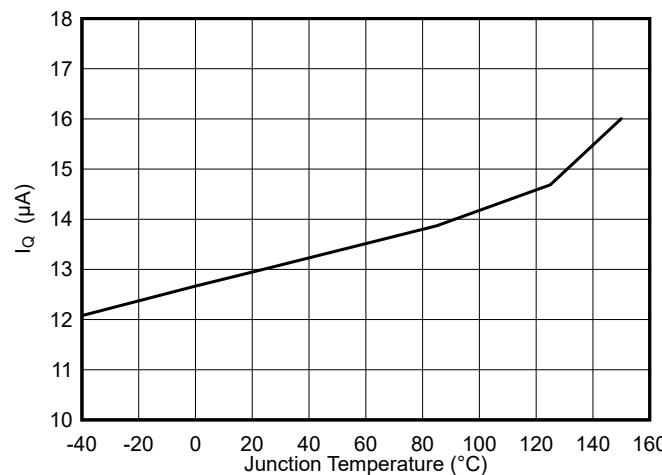  
Figure 8-1. TPS62933 Quiescent Current vs Junction Temperature

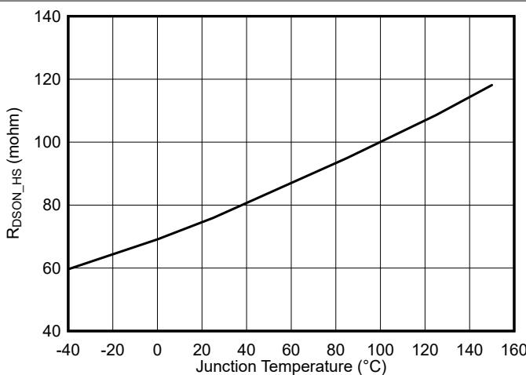  
Figure 8-3. High-Side RDSON vs Junction Temperature

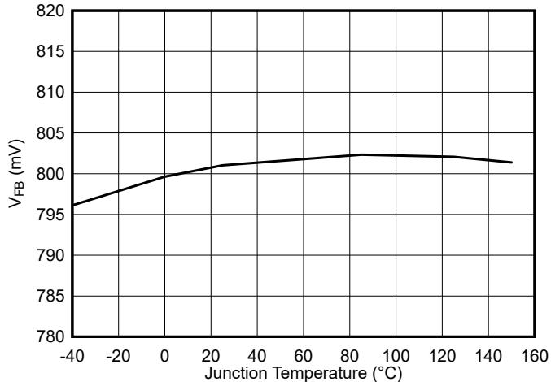  
Figure 8-5. Feedback Voltage vs Junction Temperature

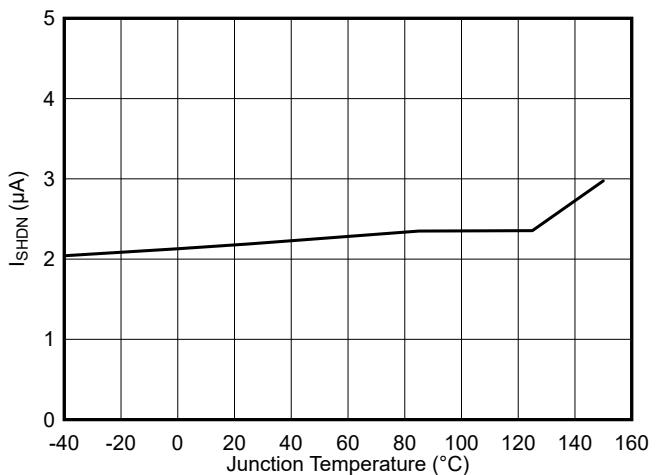  
Figure 8-2. Shutdown Current vs Junction Temperature

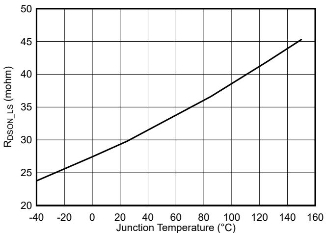  
Figure 8-4. Low-Side RDSON vs Junction Temperature

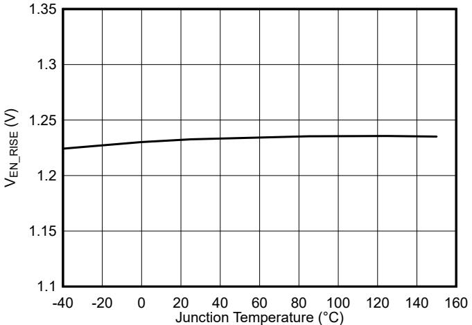  
Figure 8-6. Enable Threshold vs Junction Temperature

# 8.6 Typical Characteristics (continued)

${ \sf T } _ { \mathsf { J } } = - 4 0 ^ { \circ } { \mathsf { C } }$ to $1 5 0 ^ { \circ } \mathrm { C }$ , $\mathsf { V } _ { \mathsf { I N } } = 1 2 \mathsf { V } _ { : }$ , unless otherwise noted.

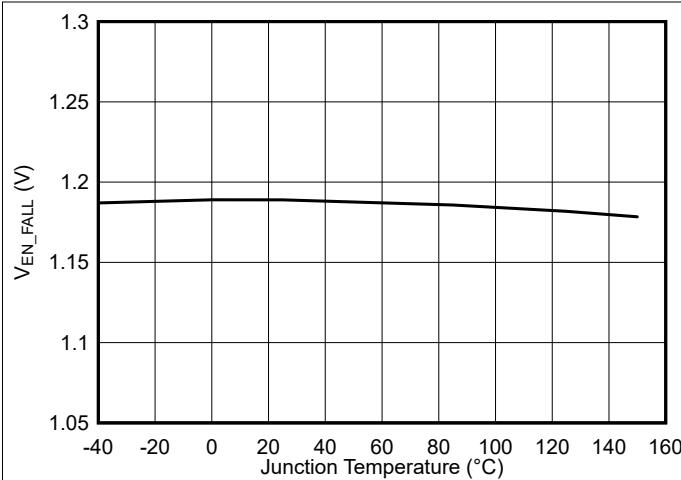  
Figure 8-7. Disable Threshold vs Junction Temperature

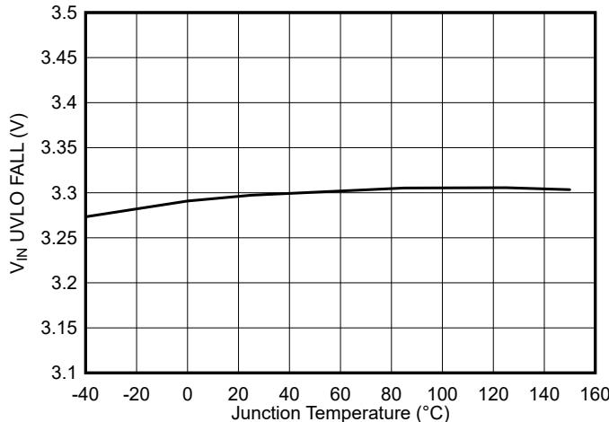  
Figure 8-9. $\mathsf { v } _ { \mathbb { N } }$ UVLO Falling Threshold vs Junction Temperature

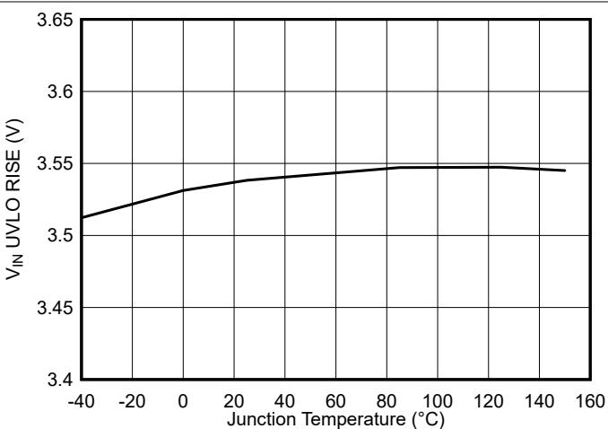  
Figure 8-8. $\mathsf { v } _ { \mathbb { N } }$ UVLO Rising Threshold vs Junction Temperature

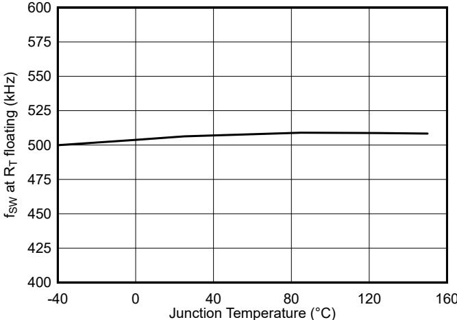  
Figure 8-10. Switching Frequency (RT Floating) vs Junction Temperature

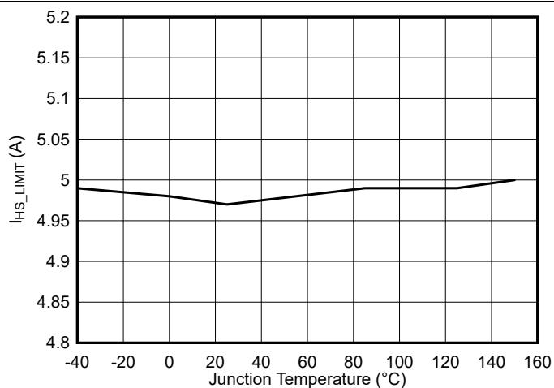  
Figure 8-11. TPS62933 High-Side Current Limit vs Junction Temperature

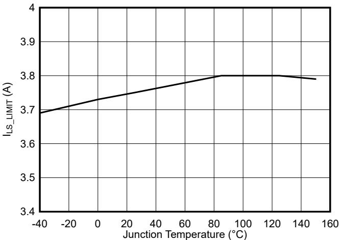  
Figure 8-12. TPS62933 Low-Side Current Limit vs Junction Temperature

# 8.6 Typical Characteristics (continued)

${ \sf T } _ { \mathsf { J } } = - 4 0 ^ { \circ } { \mathsf { C } }$ to $1 5 0 ^ { \circ } \mathrm { C }$ , $\mathsf { V } _ { \mathsf { I N } } = 1 2 \mathsf { V } _ { : }$ , unless otherwise noted.

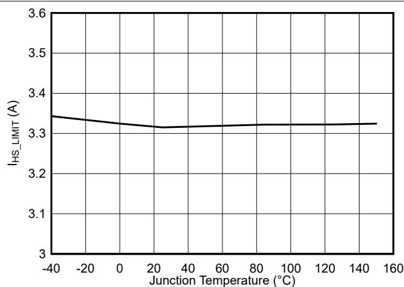  
Figure 8-13. TPS62932 High-Side Current Limit vs Junction Temperature

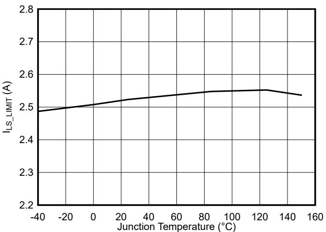  
Figure 8-14. TPS62932 Low-Side Current Limit vs Junction Temperature

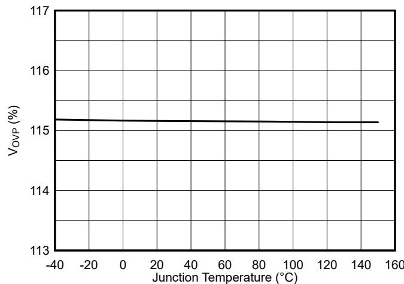  
Figure 8-15. OVP Threshold vs Junction Temperature

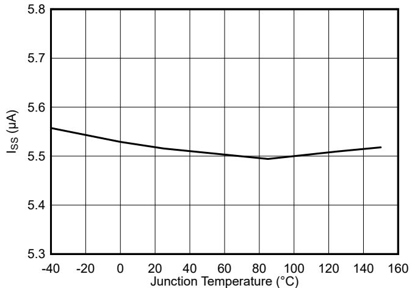  
Figure 8-17. Soft-Start Charge Current vs Junction Temperature

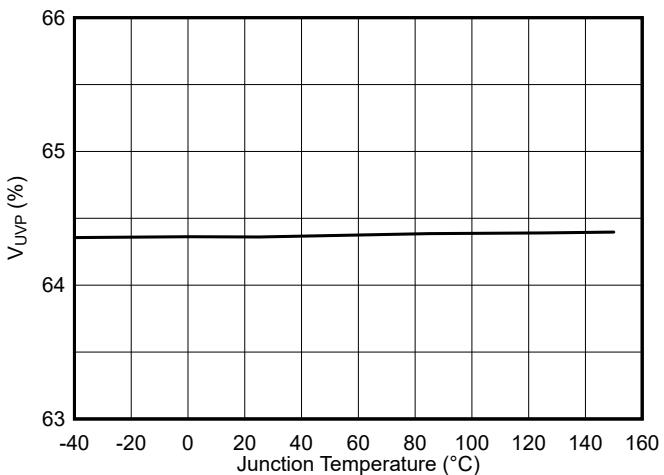  
Figure 8-16. UVP Threshold vs Junction Temperature

  
Figure 8-18. TPS62933 Efficiency, $\mathsf { V } _ { \mathsf { O U T } } = 3 . 3 \mathsf { V } ,$ . fSW = 500 kHz, L = 4.7 µH

# 8.6 Typical Characteristics (continued)

${ \sf T } _ { \mathsf { J } } = - 4 0 ^ { \circ } { \mathsf { C } }$ to $1 5 0 ^ { \circ } \mathrm { C }$ , $\mathsf { V } _ { \mathsf { I N } } = 1 2 \mathsf { V } _ { : }$ , unless otherwise noted.

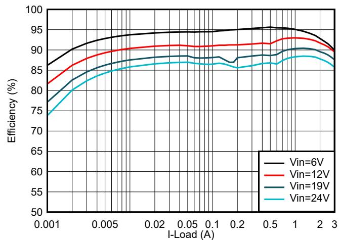  
Figure 8-19. TPS62933 Efficiency, $\mathsf { V } _ { \mathsf { O U T } } = 3 . 3 \mathsf { V } ,$ $\mathsf { f } _ { \mathsf { S W } } = 1 2 0 0 \mathsf { k H z } , \mathsf { L } = 2 . 2 \mu \mathsf { H }$

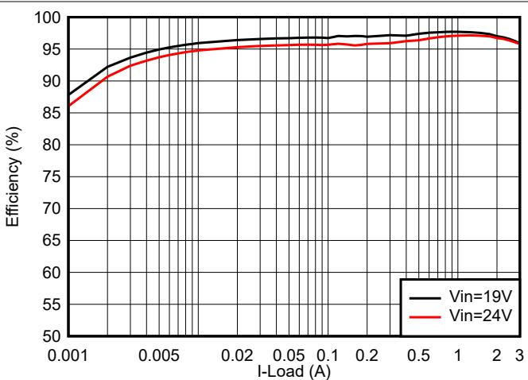  
Figure 8-20. TPS62933 Efficiency, $\mathsf { V } _ { \mathsf { O U T } } = \mathsf { 1 } 2 \mathsf { V } ,$ fSW = 500 kHz, L = 12 µH

  
Figure 8-21. TPS62932 Efficiency, $\mathsf { v } _ { \mathsf { o u r } } = \mathsf { \pmb { 5 } } \mathsf { v } ,$ fSW = 500 kHz, L = 10 µH

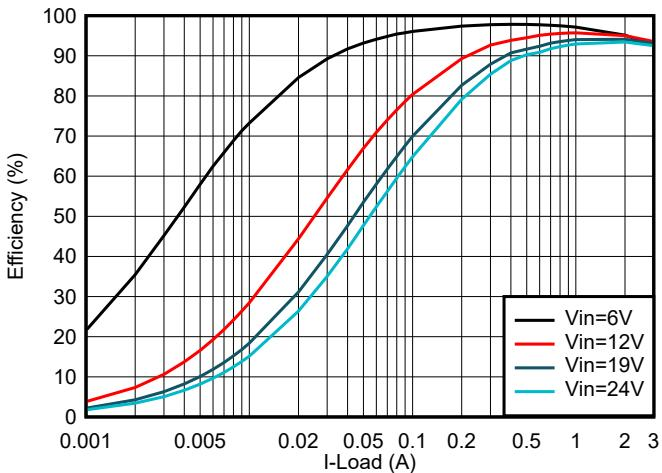  
Figure 8-22. TPS62933F Efficiency, $\mathsf { v } _ { \mathsf { o u r } } = \mathsf { \pmb { 5 } } \mathsf { v } ,$ fSW = 500 kHz, L = 6.8 µH

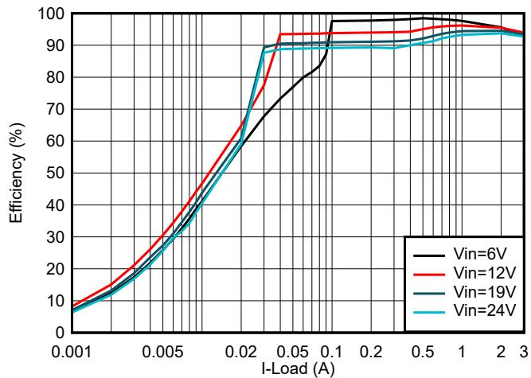  
Figure 8-23. TPS62933O Efficiency, $\mathsf { v } _ { \mathsf { o u r } } = \mathsf { 5 } \mathsf { v } ,$ fSW = 500 kHz, L = 6.8 µH

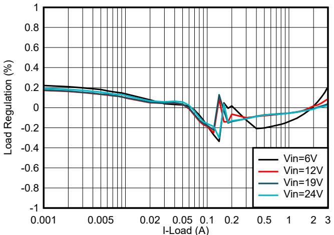  
Figure 8-24. TPS62933 Load Regulation, $\mathsf { v } _ { \mathsf { o u r } } = 3 . 3 \mathsf { V } ,$ fSW = 500 kHz

# 8.6 Typical Characteristics (continued)

${ \sf T } _ { \mathsf { J } } = - 4 0 ^ { \circ } { \mathsf { C } }$ to $1 5 0 ^ { \circ } \mathrm { C }$ , $\mathsf { V } _ { \mathsf { I N } } = 1 2 \mathsf { V } _ { : }$ , unless otherwise noted.

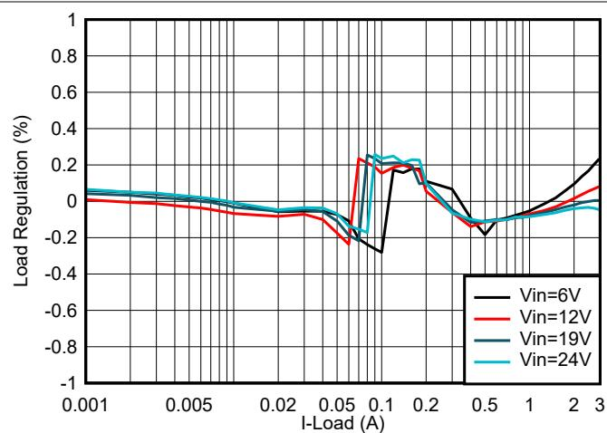  
Figure 8-25. TPS62933 Load Regulation, $\mathsf { V } _ { \mathsf { O U T } } = 3 . 3 \mathsf { V } ,$ fSW = 1200 kHz

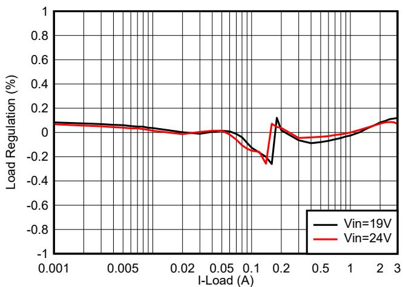  
Figure 8-26. TPS62933 Load Regulation, $\mathsf { V } _ { 0 \mathsf { U T } } = 1 2 \mathsf { V } , \mathsf { f } _ { \mathsf { S W } } = 5 0 0 \mathsf { k H z }$

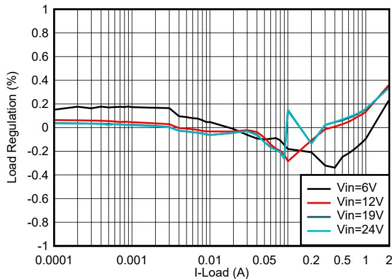  
Figure 8-27. TPS62932 Load Regulation, VOUT = 5 V, fSW = 500 kHz

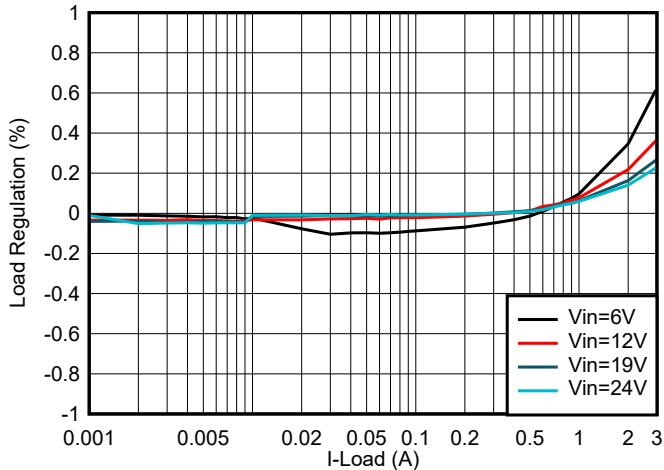  
Figure 8-28. TPS62933F Load Regulation, $\mathsf { V } _ { 0 \mathsf { U T } } = 5 \mathsf { V } , \mathsf { f } _ { \mathsf { S W } } = 5 0 0 \mathsf { k H z }$

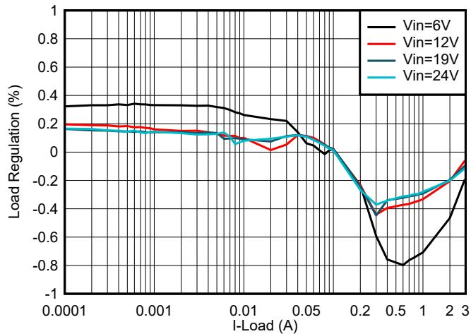  
Figure 8-29. TPS62933O Load Regulation, $\mathsf { V } _ { 0 \mathsf { U T } } = 5 \mathsf { V } , \mathsf { f } _ { \mathsf { S W } } = 5 0 0 \mathsf { k H z }$

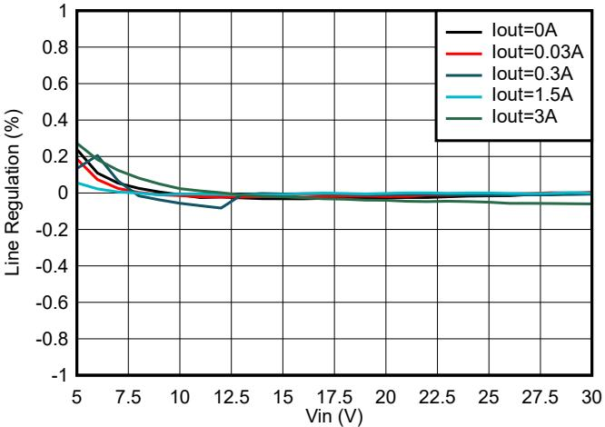  
Figure 8-30. TPS62933 Line Regulation, $\mathsf { v } _ { \mathsf { o u r } } = 3 . 3 \mathsf { V } ,$ fSW = 500 kHz

# 8.6 Typical Characteristics (continued)

${ \sf T } _ { \mathsf { J } } = - 4 0 ^ { \circ } { \mathsf { C } }$ to $1 5 0 ^ { \circ } \mathrm { C }$ , $\mathsf { V } _ { \mathsf { I N } } = 1 2 \mathsf { V } _ { : }$ , unless otherwise noted.

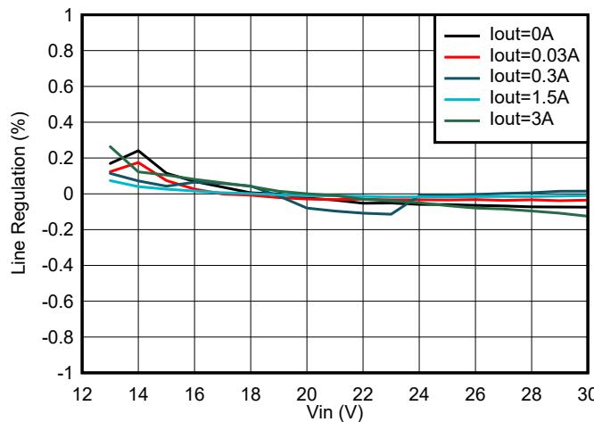  
Figure 8-31. TPS62933 Line Regulation, $\mathsf { V } _ { 0 \mathsf { U T } } = 1 2 \mathsf { V } , \mathsf { f } _ { \mathsf { S W } } = 5 0 0 \mathsf { k H z }$

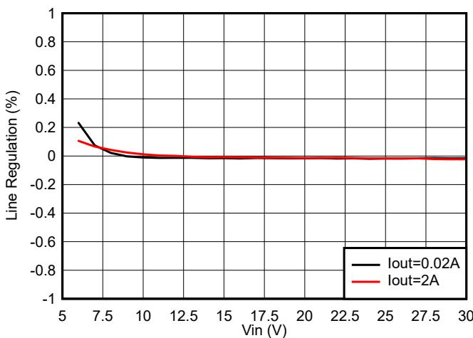  
Figure 8-32. TPS62932 Line Regulation, $\mathsf { v } _ { 0 \mathsf { U T } } = 5 \mathsf { V } ,$ $\boldsymbol { \mathsf { f } } _ { \mathsf { S W } } = 5 0 0$ kHz

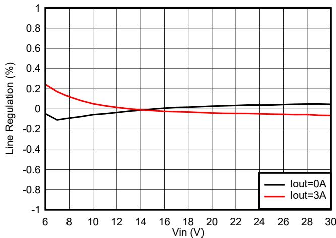  
Figure 8-33. TPS62933F Line Regulation, VOUT = 5 V, fSW = 500 kHz

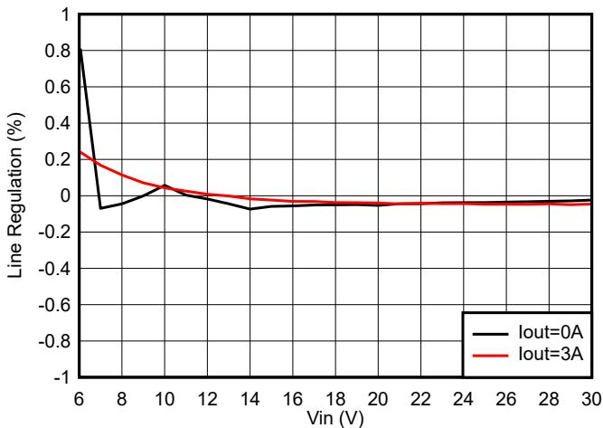  
Figure 8-34. TPS62933O Line Regulation, $\mathsf { v } _ { \mathsf { o u r } } \equiv \mathsf { 5 } \mathsf { v } ,$ , fSW = 500 kHz

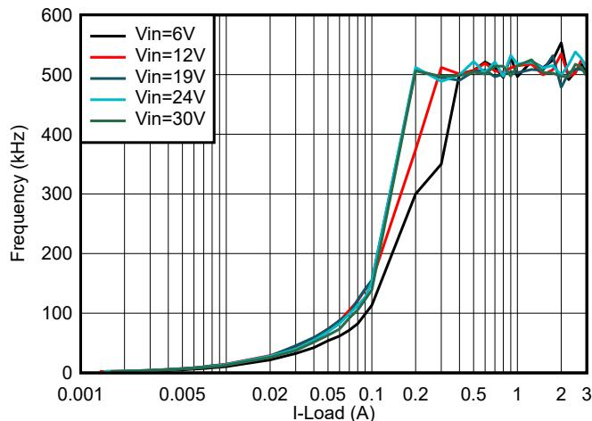  
Figure 8-35. TPS62933 Switching Frequency vs Load Current, $\mathsf { V } _ { \mathsf { O U T } } = 3 . 3 \mathsf { V } ,$ $\mathsf { f } _ { \mathsf { S W } } = 5 0 0 ~ \mathsf { k H z }$ (RT Floating)

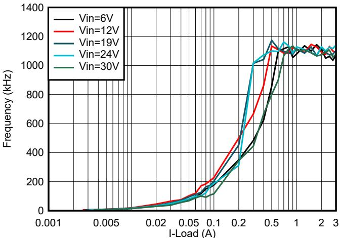  
Figure 8-36. TPS62933 Switching Frequency vs Load Current, $\mathsf { v } _ { \mathsf { o u r } } = 3 . 3 \mathsf { V } ,$ , $\mathsf { f } _ { \mathsf { S W } } = 1 2 0 0 ~ \mathsf { k H z }$ (RT to GND)

# 8.6 Typical Characteristics (continued)

${ \sf T } _ { \mathsf { J } } = - 4 0 ^ { \circ } { \mathsf { C } }$ to $1 5 0 ^ { \circ } \mathrm { C }$ , $\mathsf { V } _ { \mathsf { I N } } = 1 2 \mathsf { V } _ { : }$ , unless otherwise noted.

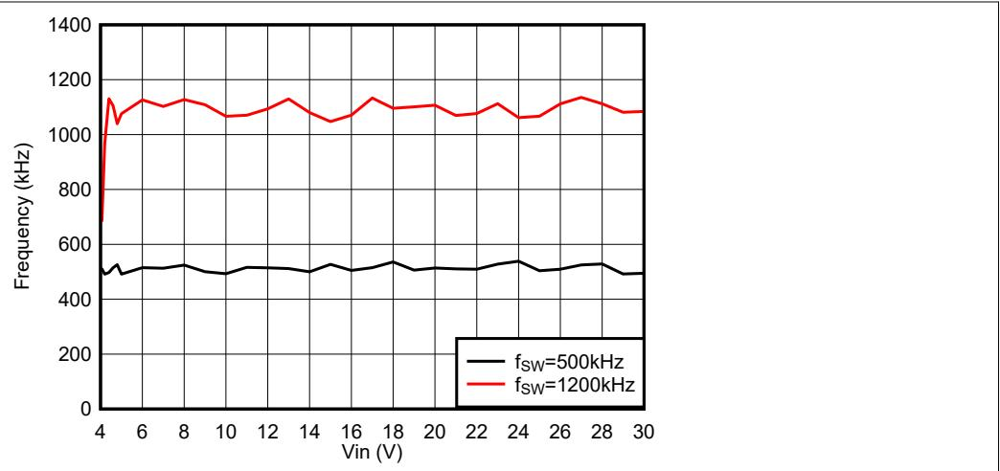  
Figure 8-37. TPS62933 Switching Frequency vs $\mathsf { V } _ { \mathsf { I N } } , \mathsf { V } _ { \mathsf { O U T } } = 3 . 3 \mathsf { V } , \mathsf { I } _ { \mathsf { O U T } } = 3 \mathsf { A }$

# 9 Detailed Description 9.1 Overview

The TPS62932 and TPS62933x are a 30-V, 2-A and 3-A, synchronous buck (step-down) converters with two integrated n-channel MOSFETs. They employ fixed-frequency peak current control mode for fast transient response and good line and load regulation. With the optimized internal loop compensation, the devices eliminate the external compensation components over a wide range of output voltage and switching frequency.

The integrated $7 6 - \mathsf { m } \Omega$ and 32-mΩ MOSFETs allow for high-efficiency power supply designs with continuous output currents up to 2 A (TPS62932) or 3 A (TPS62933 and TPS62933x). The feedback reference voltage is designed at $0 . 8 \lor .$ . The output voltage can be stepped down from $0 . 8 \vee$ to 22 V. The devices are ideally suited for systems powered from 5-V, 12-V, 19-V, and 24-V power-bus rails.

The TPS6293x has been designed for safe monotonic start-up into prebiased loads. The default start-up is at $V _ { \sf I N }$ equal to $3 . 8 \lor .$ After the device is enabled, the output rises smoothly from $0 \vee$ to its regulated voltage. The TPS6293x has low operating current when not switching under no load, especially the TPS62932, TPS62933, and TPS62933P whose operating current is $1 2 \mu \mathsf { A }$ (typical). When the ${ \mathsf { T P S 6 2 9 3 x } }$ is disabled, the supply current is approximately $2 ~ \mu \mathsf { A }$ (typical). These features are extremely beneficial for long battery life time in low-power operation.

Pulse frequency modulation (PFM) mode allows the TPS62932, TPS62933, and TPS62933P to maximize the light-load efficiency. Continuous current mode allows the TPS62933F to have low output ripple in all load conditions. The TPS62933O operates in out of audio mode which can avoid the audible noise.

The EN pin has an internal pullup current that can be used to adjust the input voltage undervoltage lockout (UVLO) with two external resistors. In addition, the EN pin can be floating for the device to operate with the internal pullup current.

The switching frequency can be set by the configuration of the RT pin in the range of $2 0 0 ~ \mathsf { k H z }$ to 2.2 MHz, which allows for efficiency and solution size optimization when selecting the output filter components. The TPS62932, TPS62933, TPS62933P, and TPS62933O also have a frequency spread spectrum feature, which helps with lowering down EMI noise.

A small value capacitor or resistor divider is connected to the SS pin of the TPS62932, TPS62933, and TPS62933F for soft-start time setting or voltage tracking. The TPS62933P and TPS62933O indicate power good through PG pin.

The devices have the on-time extension function with a maximum on time of 7 μs (typical). During low dropout operation, the high-side MOSFET can turn on up to $7 ~ \mu \ s$ , then the high-side MOSFET turns off and the low-side MOSFET turns on with a minimum off time of 140 ns (typical). The devices support the maximum $98 \%$ duty cycle.

The devices reduce the external component count by integrating the bootstrap circuit. The bias voltage for the integrated high-side MOSFET is supplied by a capacitor between the BST and SW pins. A UVLO circuit monitors the bootstrap capacitor voltage, VBST-SW. When it falls below a preset threshold of $_ { 2 . 5 \times }$ (typical), the SW pin is pulled low to recharge the bootstrap capacitor.

Cycle-by-cycle current limiting on the high-side MOSFET protects the device in overload situations and is enhanced by a low-side sourcing current limit, which prevents current runaway. The TPS6293x provides output undervoltage protection (UVP) when the regulated output voltage is lower than $65 \%$ of the nominal voltage due to overcurrent being triggered, approximately 256-μs (typical) deglitch time later, both the high-side and low-side MOSFET turn off, the device steps into hiccup mode.

The devices minimize excessive output overvoltage transient by taking advantage of the overvoltage comparator. When the regulated output voltage is greater than $1 1 5 \%$ of the nominal voltage, the overvoltage comparator is activated, and the high-side MOSFET is turned off and masked from turning on until the output voltage is lower than $110 \%$ .

Thermal shutdown disables the devices when the die temperature, ${ \mathsf { T } } _ { \mathsf { J } } ,$ exceeds $1 6 5 ^ { \circ } \mathsf { C }$ and enables the devices again after ${ \sf T } _ { \sf J }$ decreases below the hysteresis amount of $3 0 ^ { \circ } \mathsf { C }$ .

# 9.2 Functional Block Diagram

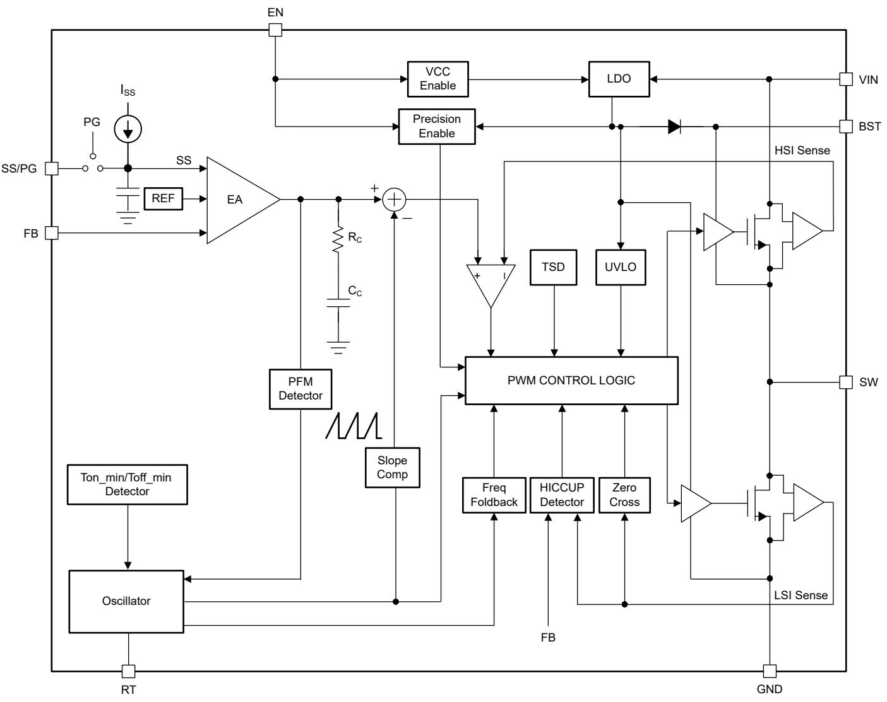

# 9.3 Feature Description

# 9.3.1 Fixed Frequency Peak Current Mode

The following operation description of the TPS6293x refers to the functional block diagram and to the waveforms in Figure 9-1. The TPS6293x is a synchronous buck converter with integrated high-side (HS) and low-side (LS) MOSFETs (synchronous rectifier). The TPS6293x supplies a regulated output voltage by turning on the HS and LS NMOS switches with controlled duty cycle. During high-side switch on time, the SW pin voltage swings up to approximately $V _ { \mathsf { I N } }$ , and the inductor current, $\dot { \mathsf { I } } _ { \mathsf { L } }$ , increases with linear slope $( \mathsf { V } _ { \mathsf { I N } } - \mathsf { V } _ { \mathsf { O U T } } ) \mathrm { ~ / ~ L ~ }$ . When the HS switch is turned off by the control logic, the LS switch is turned on after an anti-shoot–through dead time. Inductor current discharges through the low-side switch with a slope of $- \mathsf { V } _ { \mathsf { O U T } } / \mathsf { L }$ . The control parameter of a buck converter is defined as Duty Cycle $\mathsf { D } = \mathsf { t } _ { \mathsf { O N } } / \mathsf { t } _ { \mathsf { S W } }$ , where $\mathsf { t } _ { \mathsf { O N } }$ is the high-side switch on time and $\mathfrak { t } _ { \mathsf { S W } }$ is the switching period. The converter control loop maintains a constant output voltage by adjusting the duty cycle D. In an ideal buck converter where losses are ignored, D is proportional to the output voltage and inversely proportional to the input voltage: $\mathsf { D } = \mathsf { V } _ { \mathsf { O U T } } / \mathsf { V } _ { \mathsf { I N } }$ .

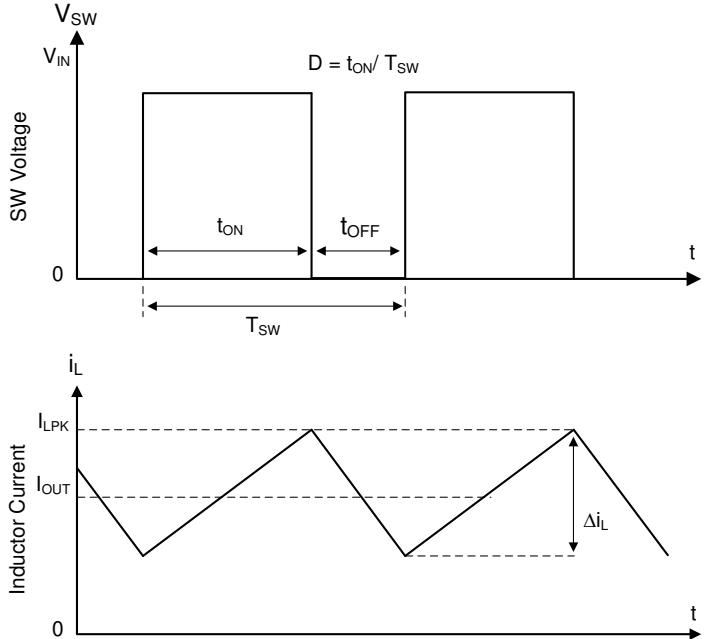  
Figure 9-1. SW Node and Inductor Current Waveforms in Continuous Conduction Mode (CCM)

The TPS6293x employs the fixed-frequency peak current mode control. A voltage feedback loop is used to get accurate DC voltage regulation by adjusting the peak current command based on voltage offset. The peak inductor current is sensed from the HS switch and compared to the peak current threshold to control the on time of the HS switch. The voltage feedback loop is internally compensated, which allows for fewer external components, makes it easy to design, and provides stable operation with almost any combination of output capacitors.

# 9.3.2 Pulse Frequency Modulation

The TPS62932, TPS62933, and TPS62933P are designed to operate in pulse frequency modulation (PFM) mode at light load currents to boost light load efficiency.

When the load current is lower than half of the peak-to-peak inductor current in CCM, the devices operate in discontinuous conduction mode (DCM). In DCM operation, the low-side switch is turned off when the inductor current drops to ILS_ZC to improve efficiency. Both switching losses and conduction losses are reduced in DCM, compared to forced CCM operation at light load.

At even lighter current load, pulse frequency modulation (PFM) mode is activated to maintain high-efficiency operation. When either the minimum high-side switch on time, tON_MIN, or the minimum peak inductor current IPEAK_MIN is reached, the switching frequency decreases to maintain regulation. In PFM mode, the switching frequency is decreased by the control loop to maintain output voltage regulation when load current reduces.

Switching loss is further reduced in PFM operation due to less frequent switching actions. Since the integrated current comparator catches the peak inductor current only, the average load current entering PFM mode varies with the applications and external output LC filters.

In PFM mode, the high-side MOSFET is turned on in a burst of one or more pulses to provide energy to the load. The duration of the burst depends on how long it takes the feedback voltage catches $V _ { \mathsf { R E F } }$ . The periodicity of these bursts is adjusted to regulate the output, while zero current crossing detection turns off the low-side MOSFET to maximize efficiency. This mode provides high light-load efficiency by reducing the amount of input supply current required to regulate the output voltage at small loads. This trades off very good light-load efficiency for larger output voltage ripple and variable switching frequency.

# 9.3.3 Voltage Reference

The internal reference voltage, $V _ { \mathsf { R E F } }$ , is designed at $0 . 8 \ V$ (typical). The negative feedback system of converter produces a precise $\pm 2 \%$ feedback voltage, $V _ { F B }$ , over full temperature by scaling the output of a temperaturestable internal band-gap circuit.

# 9.3.4 Output Voltage Setting

A precision $0 . 8 – \lor$ reference voltage, $V _ { \mathsf { R E F } }$ , is used to maintain a tightly regulated output voltage over the entire operating temperature range. The output voltage is set by a resistor divider from the output voltage to the FB pin. TI recommends using $1 \%$ tolerance resistors with a low temperature coefficient for the FB divider. Select the bottom-side resistor, $\mathsf { R } _ { \mathsf { F B B } }$ , for the desired divider current and use Equation 1 to calculate the top-side resistor, $\mathsf { R } _ { \mathsf { F B T } }$ . Lower $\mathsf { R } _ { \mathsf { F B B } }$ increases the divider current and reduces efficiency at very light load. Larger RFBB makes the FB voltage more susceptible to noise, so larger $\mathsf { R } _ { \mathsf { F B B } }$ values require a more carefully designed feedback path on the PCB. Setting $\mathsf { R } _ { \mathsf { F B B } } = 1 0 ~ \mathsf { k } \Omega$ and $\mathsf { R } _ { \mathsf { F B T } }$ in the range of $1 0 \mathsf { k } \Omega$ to $3 0 0 ~ \mathsf { k } \Omega$ is recommended for most applications.

The tolerance and temperature variation of the resistor dividers affect the output voltage regulation.

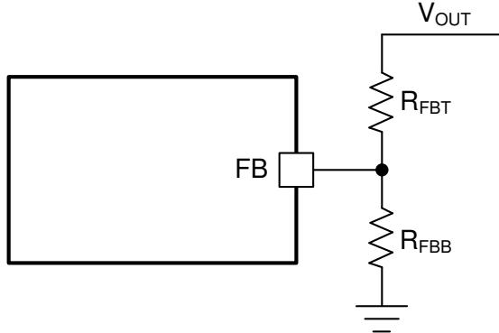  
Figure 9-2. Output Voltage Setting

$$
\mathsf { R } _ { \mathsf { F B T } } = \frac { \mathsf { V } _ { \mathsf { o u T } } - \mathsf { V } _ { \mathsf { R E F } } } { \mathsf { V } _ { \mathsf { R E F } } } \times \mathsf { R } _ { \mathsf { F B B } }
$$

# where

• $V _ { \mathsf { R E F } }$ is the $0 . 8 \vee$ (the internal reference voltage).   
• RFBB is $1 0 \mathsf { k } \Omega$ (recommended).

# 9.3.5 Switching Frequency Selection

The switching frequency is set by the condition of the RT input. The condition of this input is detected when the device is first enabled. Once the converter is running, the switching frequency selection is fixed and cannot be changed until the next power-on cycle or EN toggle. Table 9-1 shows the selection programming. In adjustable frequency mode, the switching frequency can be set between $2 0 0 ~ \mathsf { k H z }$ and $2 2 0 0 ~ \mathsf { k H z }$ by proper selection of RT resistor. See Equation 2.

$$
\mathrm { f _ { S W } ( k H z ) } = 1 7 2 9 3 \times \mathrm { R T ( k \Omega ) ^ { - 0 . 9 4 2 } }
$$

where

• RT is the value of RT timing resistor in $\mathsf { k } \Omega$ .   
• fSW is the switching frequency in kHz.

Table 9-1. RT Pin Resistor Settings   

<table><tr><td rowspan=1 colspan=1>RT Pin</td><td rowspan=1 colspan=1>Resistance</td><td rowspan=1 colspan=1>Switching Frequency</td></tr><tr><td rowspan=1 colspan=1>Floating</td><td rowspan=1 colspan=1>&gt; 280 kΩ</td><td rowspan=1 colspan=1>500 kHz</td></tr><tr><td rowspan=1 colspan=1>GND</td><td rowspan=1 colspan=1>&lt;1 kΩ</td><td rowspan=1 colspan=1>1200 kHz</td></tr><tr><td rowspan=1 colspan=1>RT to GND</td><td rowspan=1 colspan=1>8.9 kΩ to 111 kΩ</td><td rowspan=1 colspan=1>200 kHz to 2200 kHz</td></tr></table>

  
Figure 9-3 indicates the required resistor value for RT to set a desired switching frequency.   
Figure 9-3. Switching Frequency vs $\mathsf { R } _ { \mathsf { T } }$

There are four cases where the switching frequency does not conform to the condition set by the RT pin:

Light load operation (PFM mode) Low dropout operation Minimum on-time operation Current limit tripped

Under all of these cases, the switching frequency folds back, meaning it is less than that programmed by the RT pin. During these conditions, the output voltage remains in regulation, except for current limit operation.

# 9.3.6 Enable and Adjusting Undervoltage Lockout

The EN pin provides electrical ON and OFF control of the device. When the EN pin voltage exceeds the enable threshold voltage, VEN_RISE, the TPS6293x begins operation. If the EN pin voltage is pulled below the disable threshold voltage, $V _ { E N \_ F A L L }$ , the converter stops switching and enters shutdown mode.

The EN pin has an internal pullup current source, which allows the user to float the EN pin to enable the device. If an application requires control of the EN pin, use an open-drain or open-collector or GPIO output logic to interface with the pin.

The TPS6293x implements internal undervoltage-lockout (UVLO) circuitry on the VIN pin. The device is disabled when the VIN pin voltage falls below the internal $V _ { \mathsf { I N } }$ _UVLO threshold. The internal $V _ { \mathsf { I N } }$ _UVLO threshold has a hysteresis of typical $3 0 0 ~ \mathsf { m V } .$ If an application requires a higher UVLO threshold on the VIN pin, the EN pin can be configured as shown in Figure 9-4. When using the external UVLO function, setting the hysteresis at a value greater than $5 0 0 ~ \mathrm { m V }$ is recommended.

The EN pin has a small pullup current, $\mathsf { I } _ { \mathsf { p } }$ , which sets the default state of the EN pin to enable when no external components are connected. The pullup hysteresis current, $\mathsf { I } _ { \mathsf { h } }$ , is used to control the hysteresis voltage for the UVLO function when the EN pin voltage crosses the enable threshold. Use Equation 3 and Equation 4 to calculate the values of R1 and R2 for a specified UVLO threshold. Once R1 and R2 are settled down, $V _ { E N }$ can be calculated by Equation 5, which must be lower than $5 . 5 \lor$ with the maximum $V _ { \mathsf { I N } }$ .

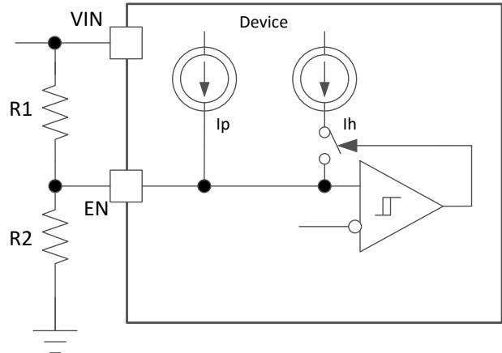  
Figure 9-4. Adjustable $\mathsf { v } _ { \mathsf { I N } }$ Undervoltage Lockout

$$
\mathrm { R _ { 1 } } = \frac { \mathrm { V _ { S T A R T } \times \frac { V _ { E N \_ F A L L } } { V _ { E N \_ R I S E } } - V _ { S T O P } } } { \mathrm { I _ { p } \times \left( 1 - \frac { V _ { E N \_ F A L L } } { V _ { E N \_ R I S E } } \right) + I _ { h } } }
$$

$$
\begin{array} { r l } & { \mathsf { R } _ { 2 } = \frac { \mathsf { R } _ { 1 } \times \mathsf { V } _ { \mathsf { E N \_ F A L } } } { \mathsf { V } _ { \mathsf { S T O P \_ V } } - \mathsf { V } _ { \mathsf { E N \_ F A L } } + \mathsf { R } _ { 1 } \times \left( \mathsf { I } _ { \mathsf { p } } + \mathsf { I } _ { \mathsf { h } } \right) } } \\ & { \mathsf { V } _ { \mathsf { E N } } = \frac { \mathsf { R } _ { 2 } \times \mathsf { V } _ { \mathsf { I N } } + \mathsf { R } _ { 1 } \times \mathsf { R } _ { 2 } \times \left( \mathsf { I } _ { \mathsf { p } } + \mathsf { I } _ { \mathsf { h } } \right) } { \mathsf { R } _ { 1 } + \mathsf { R } _ { 2 } } } \end{array}
$$

# where

• $\mathsf { I } _ { \mathsf { p } }$ is $0 . 7 \mu \mathsf { A }$ . $\boldsymbol { \vert } _ { \mathsf { h } }$ is $1 . 4 \mu \mathsf { A } .$ .   
VEN_FALL is 1.17 V. VEN_RISE is $1 . 2 1 \lor .$ VSTART is the input voltage enabling the device.   
VSTOP is the input voltage disabling the device.

# 9.3.7 External Soft Start and Prebiased Soft Start

The SS pin of TPS62932, TPS62933, and TPS62933F are used to minimize inrush current when driving capacitive load. The devices use the lower voltage of the internal voltage reference, $V _ { \mathsf { R E F } }$ , or the SS pin voltage as the reference voltage and regulates the output accordingly. A capacitor on the SS pin to ground implements a soft-start time. The device has an internal pullup current source that charges the external soft-start capacitor. Use Equation 6 to calculate the soft-start time (tSS, $0 \%$ to $1 0 0 \%$ ) and soft-start capacitor $( \mathsf { C } _ { \mathsf { S S } } )$ .

$$
\mathsf { I } _ { \mathsf { S S } } = \frac { \mathsf { C } _ { \mathsf { S S } } \times \mathsf { V } _ { \mathsf { R E F } } } { \mathsf { I } _ { \mathsf { S S } } }
$$

where

• $V _ { \mathsf { R E F } }$ is $0 . 8 \vee$ (the internal reference voltage).   
• $\mathsf { I } _ { \mathsf { S } \mathsf { S } }$ is $5 . 5 \mu \mathsf { A }$ (typical), the internal pullup current.

If the output capacitor is prebiased at start-up, the devices initiate switching and start ramping up only after the internal reference voltage becomes greater than the feedback voltage, $V _ { F B }$ . This scheme makes sure that the converters ramp up smoothly into regulation point.

A resistor divider connected to the SS pin can implement voltage tracking of the other power rail.

# 9.3.8 Power Good

The TPS62933P and TPS62933O have a built-in power good (PG) function to indicate whether the output voltage has reached its appropriate level or not. The PG signal can be used for start-up sequencing of multiple rails. The PG pin is an open-drain output that requires a pullup resistor to any voltage below $5 . 5 ~ \lor .$ TI recommends a pullup resistor of $1 0 ~ \mathsf { k } \Omega - 1 0 0 ~ \mathsf { k } \Omega$ . The device can sink approximately $4 \mathsf { m } \mathsf { A }$ of current and maintain its specified logic low level. After the FB pin voltage is between $90 \%$ and $1 1 0 \%$ of the internal reference voltage $( V _ { \mathsf { R E F } } )$ and after a deglitch time of $7 0 ~ \mu \ s$ , the PG turns to high impedance status. The PG pin is pulled low after a deglitch time of 18 μs when FB pin voltage is lower than $8 5 \%$ of the internal reference voltage or greater than $11 5 \%$ of the internal reference voltage, or in events of thermal shutdown, EN shutdown, or UVLO conditions. VIN must remain present for the PG pin to stay low.

Table 9-2. PG Status   

<table><tr><td rowspan=2 colspan=2>Device State</td><td rowspan=1 colspan=2>PG Logic Status</td></tr><tr><td rowspan=1 colspan=1>High Impedance</td><td rowspan=1 colspan=1>Low</td></tr><tr><td rowspan=2 colspan=1>Enable (EN = High)</td><td rowspan=1 colspan=1>VFB does not trigger VpGTH</td><td rowspan=1 colspan=1>√</td><td rowspan=1 colspan=1></td></tr><tr><td rowspan=1 colspan=1>VFB triggers VpGTH</td><td rowspan=1 colspan=1></td><td rowspan=1 colspan=1>√</td></tr><tr><td rowspan=1 colspan=1>Shutdown (EN = Low)</td><td rowspan=1 colspan=1></td><td rowspan=1 colspan=1></td><td rowspan=1 colspan=1>√</td></tr><tr><td rowspan=1 colspan=1>UVLO</td><td rowspan=1 colspan=1>2.5 V &lt; VIN &lt; VUVLO</td><td rowspan=1 colspan=1></td><td rowspan=1 colspan=1>√</td></tr><tr><td rowspan=1 colspan=1>Thermal shutdown</td><td rowspan=1 colspan=1>T_j&gt;TsD</td><td rowspan=1 colspan=1></td><td rowspan=1 colspan=1>√</td></tr><tr><td rowspan=1 colspan=1>Power supply removal</td><td rowspan=1 colspan=1>VIN &lt; 2.5 V</td><td rowspan=1 colspan=1>√</td><td rowspan=1 colspan=1></td></tr></table>

# 9.3.9 Minimum On Time, Minimum Off Time, and Frequency Foldback

Minimum on time $( \mathsf { t _ { O N \ M I N } } )$ is the smallest duration of time that the high-side switch can be on. tON_MIN is typically 70 ns in the TPS6293x. Minimum off time (tOFF_MIN) is the smallest duration that the high-side switch can be off. tOFF_MIN is typically 140 ns. In CCM operation, $\mathsf { \bar { t } _ { O N \_ M I N } }$ , and tOFF_MIN, limit the voltage conversion range without switching frequency foldback.

The minimum duty cycle without frequency foldback allowed is:

$$
\mathrm { D } _ { \mathrm { M I N } } = \mathrm { t } _ { 0 \mathrm { N } \_ \mathrm { M I N } } \times \mathrm { f } _ { \mathrm { S W } }
$$

The maximum duty cycle without frequency foldback allowed is:

$$
\mathrm { D } _ { \mathrm { M A X } } = 1 - \mathrm { t } _ { \mathrm { O F F \_ M I N } } \times \mathrm { f } _ { \mathrm { S W } }
$$

Given a required output voltage, the maximum $V _ { \mathsf { I N } }$ without frequency foldback is:

$$
\mathsf { V } _ { \mathrm { I N \_ M A X } } = \frac { \mathsf { V } _ { \mathrm { O U T } } } { \mathsf { f } _ { \mathrm { S W } } \times \mathsf { t } _ { \mathrm { O N \_ M I N } } }
$$

The minimum $V _ { \mathsf { I N } }$ without frequency foldback is:

$$
\mathrm { \Delta V _ { I N \_ M I N } = \frac { V _ { 0 U T } } { 1 \_ \mathrm { I \_ S W } \times t _ { 0 F F \_ M I N } } }
$$

In TPS6293x, a frequency foldback scheme is employed once tON_MIN or tOFF_MIN is triggered, which can extend the maximum duty cycle or lower the minimum duty cycle.

The on time decreases while $V _ { \mathsf { I N } }$ voltage increases. Once the on time decreases to tON_MIN, the switching frequency starts to decrease while $V _ { \mathsf { I N } }$ continues to go up, which lowers the duty cycle further to keep $\mathsf { V } _ { \mathsf { O U T } }$ in regulation according to Equation 7.

The frequency foldback scheme also works once larger duty cycle is needed under low $V _ { \mathsf { I N } }$ condition. The frequency decreases once the device hits its tOFF_MIN, which extends the maximum duty cycle according to Equation 8. A wide range of frequency foldback allows the TPS6293x output voltage to stay in regulation with a much lower supply voltage $V _ { \sf I N }$ , which allows a lower effective dropout.

With frequency foldback, $\mathsf { V } _ { \mathsf { I N \_ M A X } }$ is raised, and $\mathsf { V } _ { \mathsf { I N \_ M I N } }$ is lowered by decreased fSW.

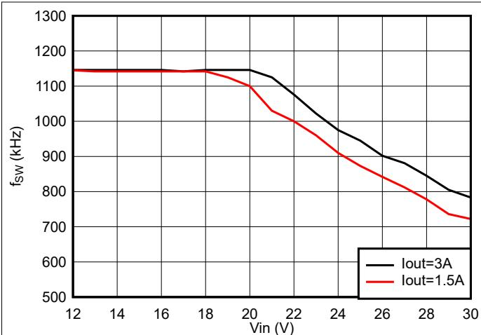  
Figure 9-5. Frequency Foldback at tON_MIN, $\mathsf { V } _ { \mathsf { O U T } } = 1 . 8 \mathsf { V } _ { \mathrm { i } }$ , $\mathsf { f } _ { \mathsf { S W } } = 1 2 0 0 ~ \mathsf { k H z }$

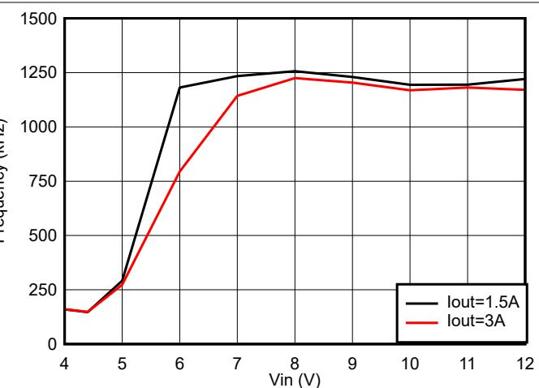  
Figure 9-6. Frequency Foldback at tOFF_MIN, $\mathsf { V } _ { 0 \mathsf { U T } } = 5 \mathsf { V } _ { \mathrm { i } }$ , $\mathsf { f } _ { \mathsf { S W } } = 1 2 0 0 ~ \mathsf { k H z }$

# 9.3.10 Frequency Spread Spectrum

To reduce EMI, the TPS62932, TPS62933, TPS62933P, and TPS62933O introduce frequency spread spectrum. The jittering span is typically $\Delta \mathsf { f c } = \pm 6 \%$ of the switching frequency with the modulation frequency of $\mathsf { f } _ { \mathsf { m } } = \mathsf { \Gamma }$ fSW / 128. The purpose of spread spectrum is to eliminate peak emissions at specific frequencies by spreading emissions across a wider range of frequencies than a part with fixed frequency operation. Figure 9-7 shows the frequency spread spectrum modulation. Figure 9-8 shows the energy is spread out at the center frequency, $\mathsf { f } _ { \mathsf { c } }$ .

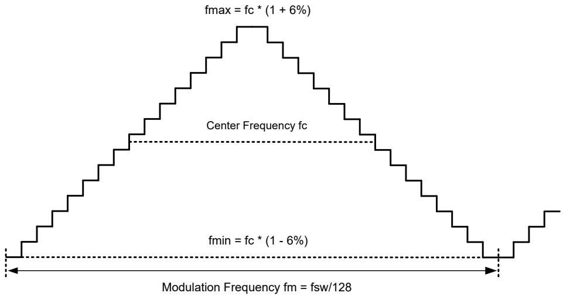  
Figure 9-7. Frequency Spread Spectrum Diagram

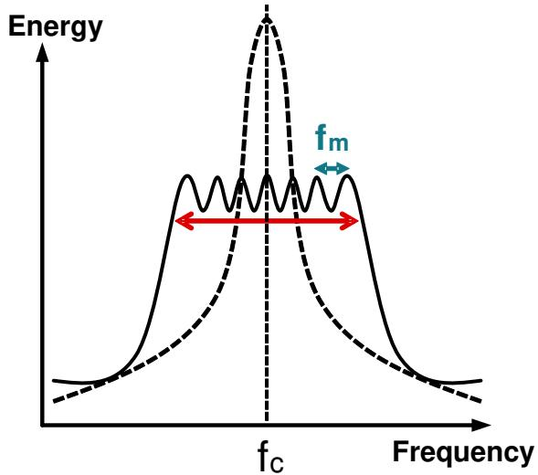  
Figure 9-8. Energy vs Frequency

# 9.3.11 Overvoltage Protection

The device incorporates an output overvoltage protection (OVP) circuit to minimize output voltage overshoot. The OVP feature minimizes the overshoot by comparing the FB pin voltage to the OVP threshold. If the FB pin voltage is greater than the OVP threshold of $11 5 \%$ , the high-side MOSFET is turned off, which prevents current from flowing to the output and minimizes output overshoot. When the FB pin voltage drops lower than the OVP threshold minus hysteresis, the high-side MOSFET is allowed to turn on at the next clock cycle. This function is non-latch operation.

# 9.3.12 Overcurrent and Undervoltage Protection

The TPS6293x incorporates both peak and valley inductor current limits to provide protection to the device from overloads and short circuits and limit the maximum output current. Valley current limit prevents inductor current run-away during short circuits on the output, while both peak and valley limits work together to limit the maximum output current of the converter. Hiccup mode is also incorporated for sustained short circuits.

The high-side switch current is sensed when it is turned on after a set blanking time (tON_MIN), the peak current of high-side switch is limited by the peak current threshold, IHS_LIMIT. The current going through low-side switch is also sensed and monitored. When the low-side switch turns on, the inductor current begins to ramp down.

As the device is overloaded, a point is reached where the valley of the inductor current cannot reach below ILS_LIMIT before the next clock cycle, then the low-side switch is kept on until the inductor current ramps below the valley current threshold, ILS_LIMIT, then the low-side switch is turned off and the high-side switch is turned on after a dead time. When this occurs, the valley current limit control skips that cycle, causing the switching frequency to drop. Further overload causes the switching frequency to continue to drop, but the output voltage remains in regulation. As the overload is increased, both the inductor current ripple and peak current increase until the high-side current limit, IHS_LIMIT, is reached. When this limit is tripped, the switch duty cycle is reduced and the output voltage falls out of regulation. This represents the maximum output current from the converter and is given approximately by Equation 11. The output voltage and switching frequency continue to drop as the device moves deeper into overload while the output current remains at approximately IOMAX. There is another situation, if the inductor ripple current is large, the high-side current limit can be tripped before the low-side limit is reached. In this case, Equation 12 gives the approximate maximum output current.

$$
\begin{array} { r l } & { \mathsf { I } _ { \mathsf { O M A X } } \approx \frac { \mathsf { I } _ { \mathsf { H S } _ { - } \lfloor \mathsf { M } \rfloor \mathsf { T } } + \mathsf { I } _ { \mathsf { L S } _ { - } \lfloor \mathsf { M } \rfloor \mathsf { T } } } { 2 } } \\ & { \mathsf { I } _ { \mathsf { O M A X } } \approx \mathsf { I } _ { \mathsf { H S } _ { - } \lfloor \mathsf { M } \rfloor \mathsf { T } } - \frac { ( \mathsf { V } _ { \mathsf { I N } } - \mathsf { V } _ { \mathsf { O U T } } ) } { 2 \times \mathsf { L } \times \mathsf { f } _ { \mathsf { S W } } } \times \frac { \mathsf { V } _ { \mathsf { O U T } } } { \mathsf { V } _ { \mathsf { I N } } } } \end{array}
$$

Furthermore, if a severe overload or short circuit causes the FB voltage to fall below the $\mathsf { V } _ { \mathsf { U V P } }$ threshold, $65 \%$ of the $V _ { \mathsf { R E F } }$ , and triggering current limit, and the condition occurs for more than the hiccup on time (typical $2 5 6 ~ \mu \mathsf { s } )$ , the converter enters hiccup mode. In this mode, the device stops switching for hiccup off time, 10.5 $\times$ tSS, and then goes to a normal restart with soft-start time. If the overload or short-circuit condition remains, the device runs in current limit and then shuts down again. This cycle repeats as long as the overload or short-circuit condition persists. This mode of operation reduces the temperature rise of the device during a sustained overload or short circuit condition on the output. Once the output short is removed, the output voltage recovers normally to the regulated value.

For FCCM version, the inductor current is allowed to go negative. When this current exceed the LS negative current limit ILS_NEG, the LS switch is turned off and HS switch is turned on immediately, which is used to protect the LS switch from excessive negative current.

# 9.3.13 Thermal Shutdown

The junction temperature $( \mathsf { T } _ { \mathsf { J } } )$ of the device is monitored by an internal temperature sensor. If ${ \mathsf T } _ { \mathsf J }$ exceeds $1 6 5 ^ { \circ } \mathsf { C }$ (typical), the device goes into thermal shutdown, both the high-side and low-side power FETs are turned off. When ${ \mathsf { T } } _ { \mathsf { J } }$ decreases below the hysteresis amount of $3 0 ^ { \circ } \mathsf { C }$ (typical), the converter resumes normal operation, beginning with a soft start.

# 9.4 Device Functional Modes

# 9.4.1 Modes Overview

The TPS6293x moves between CCM, DCM, PFM, OOA and FCCM mode as the load changes. Depending on the load current, the TPS6293x is in one of below modes:

Continuous conduction mode (CCM) with fixed switching frequency when load current is above half of the   
peak-to-peak inductor current ripple   
Discontinuous conduction mode (DCM) with fixed switching frequency when load current is lower than half of   
the peak-to-peak inductor current ripple in CCM operation   
Pulse frequency modulation mode (PFM) when switching frequency is decreased at very light load   
Out of audio (OOA) mode when switching frequency is decreased but is always above $3 0 ~ \mathsf { k H z }$ at very light   
load   
Forced continuous conduction mode (FCCM) with fixed switching frequency even at light load

# 9.4.2 Heavy Load Operation

The TPS6293x operates in continuous conduction mode (CCM) when the load current is higher than half of the peak-to-peak inductor current. In CCM operation, the output voltage is regulated by switching at a constant frequency and modulating the duty cycle to control the power to the load. Regulating the output voltage provides excellent line and load regulation and minimum output voltage ripple, and the maximum continuous output current of 2 A or 3 A can be supplied by the TPS6293x.

# 9.4.3 Light Load Operation

The TPS62932, TPS62933, and TPS62933P are designed to operate in pulse frequency modulation (PFM) mode at light load currents to boost light load efficiency.

When the load current is lower than half of the peak-to-peak inductor current in CCM, the device operates in discontinuous conduction mode (DCM), also known as diode emulation mode (DEM). In DCM operation, the LS switch is turned off when the inductor current drops to ILS_ZC to improve efficiency. Both switching losses and conduction losses are reduced in DCM, compared to forced CCM operation at light load.

At even lighter current load, pulse frequency modulation (PFM) mode is activated to maintain high efficiency operation. When either the minimum on time, tON_MIN, or the minimum peak inductor current, IPEAK_MIN (750 mA typical), is reached, the switching frequency decreases to maintain regulation. In PFM mode, switching frequency is decreased by the control loop to maintain output voltage regulation when load current reduces. Switching loss is further reduced in PFM operation due to less frequent switching actions. The output current for mode change depends on the input voltage, inductor value, and the programmed switching frequency. For applications where the switching frequency must be known for a given condition, the transition between PFM and CCM must be carefully tested before the design is finalized.

# 9.4.4 Out of Audio Operation

TPS62933O implements the out of audio (OOA) mode which is a unique control feature that keeps the switching frequency above audible frequency ( $2 0 ~ \mathsf { H z }$ to $2 0 ~ \mathsf { k H z } )$ ) even at no load condition. When operates in OOA mode, the minimum switching frequency is clamped above $3 0 ~ \mathsf { k H z }$ which avoids the audible noise in the system. The loading to enter OOA mode depends on output LC filter.

# 9.4.5 Forced Continuous Conduction Operation

The TPS62933F is designed to operate in forced continuous conduction mode (FCCM) under light load conditions. During FCCM, the switching frequency is maintained at a constant level over the entire load range, which is suitable for applications requiring tight control of the switching frequency and output voltage ripple at the cost of lower efficiency under light load. For some audio applications, this mode can help avoid switching frequency drop into audible range that can introduce some noise.

# 9.4.6 Dropout Operation

The dropout performance of any buck converter is affected by the RDSON of the power MOSFETs, the DC resistance of the inductor, and the maximum duty cycle that the controller can achieve. As the input voltage level approaches the output voltage, the off time of the high-side MOSFET starts to approach the minimum value. Beyond this point, the switching frequency becomes erratic and the output voltage can fall out of regulation. To avoid this problem, the TPS6293x automatically reduces the switching frequency (on-time extension function) to increase the effective duty cycle and maintain in regulation until the switching frequency reach to the lowest limit of about $1 4 0 ~ \mathsf { k H z }$ , the period is equal to tON_MAX $^ +$ tOFF_MIN $7 . 1 4 ~ \mu \mathsf { S }$ typical). In this condition, the difference voltage between $V _ { \mathsf { I N } }$ and $\mathsf { V } _ { \mathsf { O U T } }$ is defined as dropout voltage. The typical overall dropout characteristics can be found as Figure 9-9.

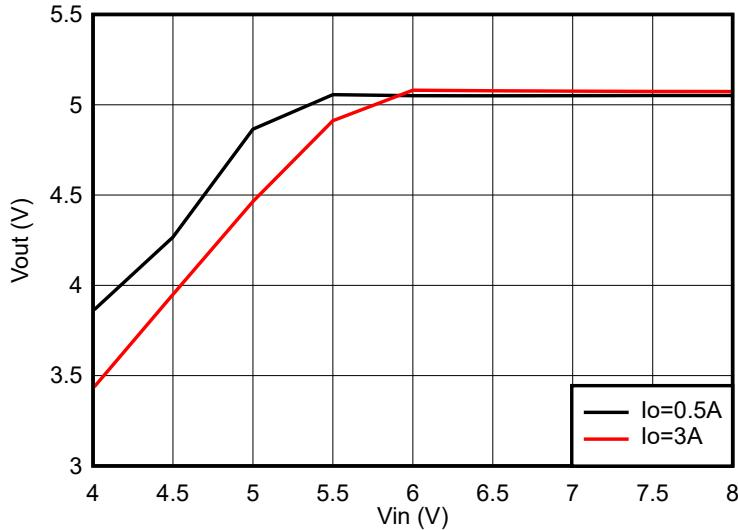  
Figure 9-9. Overall Dropout Characteristic, $\mathsf { V } _ { 0 \mathsf { U T } } = 5 \mathsf { V }$

# 9.4.7 Minimum On-Time Operation

Every switching converter has a minimum controllable on time dictated by the inherent delays and blanking times associated with the control circuits, which imposes a minimum switch duty cycle and, therefore, a minimum conversion ratio. The constraint is encountered at high input voltages and low output voltages. To help extend the minimum controllable duty cycle, the TPS6293x automatically reduces the switching frequency when the minimum on-time limit is reached. This way, the converter can regulate the lowest programmable output voltage at the maximum input voltage. Use Equation 13 to find an estimate for the approximate input voltage for a given output voltage before frequency foldback occurs. The values of tON_MIN and fSW can be found in Section 8.5.

$$
\mathsf { V } _ { \mathsf { I N } } \leq \frac { \mathsf { V } _ { \mathsf { O U T } } } { \mathsf { I } _ { \mathsf { O N } \bot \mathsf { M I N } } \times \mathsf { f } _ { \mathsf { S W } } }
$$

As the input voltage is increased, the switch on time (duty-cycle) reduces to regulate the output voltage. When the on time reaches the minimum on time, tON_MIN, the switching frequency drops while the on time remains fixed.

# 9.4.8 Shutdown Mode

The EN pin provides electrical ON and OFF control for the device. When $V _ { E N }$ is below typical $1 . 1 \ V ,$ the TPS6293x is in shutdown mode. The device also employs VIN UVLO protection. If $V _ { \sf I N }$ voltage is below their respective UVLO level, the converter is turned off too.

# 10 Application and Implementation

# Note

Information in the following applications sections is not part of the TI component specification, and TI does not warrant its accuracy or completeness. TI’s customers are responsible for determining suitability of components for their purposes, as well as validating and testing their design implementation to confirm system functionality.

# 10.1 Application Information

The TPS62933 is a highly integrated, synchronous, step-down, DC-DC converter. This device is used to convert a higher DC input voltage to a lower DC output voltage, with a maximum output current of 3 A.

# 10.2 Typical Application

The application schematic of Figure 10-1 was developed to meet the requirements of the device. This circuit is available as the TPS62933EVM evaluation module. The design procedure is given in this section.

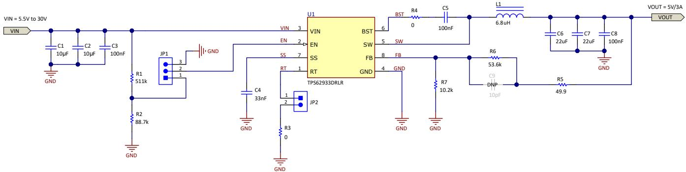  
Figure 10-1. TPS62933 5-V Output, 3-A Reference Design

# 10.2.1 Design Requirements

Table 10-1 shows the design parameters for this application.

Table 10-1. Design Parameters   

<table><tr><td>Parameter</td><td></td><td>Conditions</td><td>MIN</td><td>TYP</td><td>MAX</td><td>Unit</td></tr><tr><td>VIN</td><td>Input voltage</td><td></td><td>5.5</td><td>24</td><td>30</td><td>V</td></tr><tr><td>VoUT</td><td>Output voltage</td><td></td><td></td><td>5</td><td></td><td>V</td></tr><tr><td>IOUT</td><td>Output current rating</td><td></td><td></td><td>3</td><td></td><td>A</td></tr><tr><td>ΔVOUT</td><td>Transient response</td><td>Load step from 0.5 A→2.5 A→0.5 A, 0.8-A/μS slew rate</td><td></td><td>±5% × VoUT</td><td></td><td>V</td></tr><tr><td>VIN(ripple)</td><td>Input ripple voltage</td><td></td><td></td><td>400</td><td></td><td>mV</td></tr><tr><td>VouT(ripple)</td><td>Output ripple voltage</td><td></td><td></td><td>30</td><td></td><td>mV</td></tr><tr><td>Fsw</td><td>Switching frequency</td><td>RT = floating</td><td></td><td>500</td><td></td><td>kHz</td></tr><tr><td>tss</td><td>Soft-start time</td><td>Css = 33 nF</td><td></td><td>5</td><td></td><td>mS</td></tr><tr><td>VSTART</td><td>Start input voltage (Rising ViN)</td><td></td><td></td><td>8</td><td></td><td>V</td></tr><tr><td>VSTOP</td><td>Stop input voltage (Falling ViN)</td><td></td><td></td><td>7</td><td></td><td>V</td></tr><tr><td>TA</td><td>Ambient temperature</td><td></td><td></td><td>25</td><td></td><td>°C</td></tr></table>

# 10.2.2 Detailed Design Procedure

# 10.2.2.1 Custom Design With WEBENCH® Tools

Create a custom design with the TPS6293x using the WEBENCH® Power Designer.

1. Start by entering the input voltage $( \mathsf { V } _ { \mathsf { I N } } )$ , output voltage $( \mathsf { V } _ { \mathsf { O U T } } )$ , and output current (IOUT) requirements.   
2. Optimize the design for key parameters such as efficiency, footprint, and cost using the optimizer dial.   
3. Compare the generated design with other possible solutions from Texas Instruments.

The WEBENCH Power Designer provides a customized schematic along with a list of materials with real-time pricing and component availability.

In most cases, these actions are available:

Run electrical simulations to see important waveforms and circuit performance Run thermal simulations to understand board thermal performance Export customized schematic and layout into popular CAD formats Print PDF reports for the design, and share the design with colleagues

Get more information about WEBENCH tools at www.ti.com/WEBENCH.

# 10.2.2.2 Output Voltage Resistors Selection

The output voltage is set with a resistor divider from the output node to the FB pin. TI recommends using $1 \%$ tolerance or better divider resistors. Referring to the application schematic of Figure 10-1, start with $1 0 . 2 \ \mathsf { k } \Omega$ for R7 and use Equation 14 to calculate ${ \sf R } 6 = 5 3 . 6 ~ { \sf k } \Omega$ . To improve efficiency at light loads, consider using larger value resistors. If the values are too high, the converter is more susceptible to noise and voltage errors from the FB input leakage current are noticeable.

$$
\mathsf { R } _ { 6 } = \frac { \mathsf { V } _ { \sf O U T } - \mathsf { V } _ { \sf R E F } } { \mathsf { V } _ { \sf R E F } } \times \mathsf { R } _ { 7 }
$$

Table 10-2 shows the recommended components value for common output voltages.

# 10.2.2.3 Choosing Switching Frequency

The choice of switching frequency is a compromise between conversion efficiency and overall solution size. Higher switching frequency allows the use of smaller inductors and output capacitors, and hence, a more compact design. However, lower switching frequency implies reduced switching losses and usually results in higher system efficiency, so the 500-kHz switching frequency was chosen for this example, remove the jumper on JP2 and leave RT pin floating.

Please note the switching frequency is also limited by the following as mentioned in Section 9.3.9:

Minimum on time of the integrated power switch   
Input voltage   
Output voltage   
Frequency shift limitation

# 10.2.2.4 Soft-Start Capacitor Selection

The large $\mathtt { C } _ { \mathtt { S S } }$ can reduce inrush current when driving large capacitive load. 33 nF is chosen for C4, which sets the soft-start time, tSS, to approximately 5 ms.

In addition, the SS pin cannot be floated, so a minimum 6.8-nF capacitor must be connected at this pin.

# 10.2.2.5 Bootstrap Capacitor Selection

A $0 . 1 \mathsf { - } \mu \mathsf { F }$ ceramic capacitor must be connected between the BST to SW pins for proper operation. TI recommends to use a ceramic capacitor with X5R or better grade dielectric. The capacitor C5 must have a 16-V or higher voltage rating.

In addition, adding one BST resistor R4 to reduce the spike voltage on the SW node, TI recommends the resistance smaller than $1 0 \Omega$ be used between BST to the bootstrap capacitor.

# 10.2.2.6 Undervoltage Lockout Setpoint

The undervoltage lockout (UVLO) can be adjusted using the external voltage divider network of R1 and R2. R1 is connected between VIN and the EN pin and R2 is connected between EN and GND. The UVLO has two thresholds: one for power up when the input voltage is rising and one for power down or brownouts when the input voltage is falling. For the example design, the supply turns on and starts switching when the input voltage increases above 8 V $( \mathsf { V } _ { \mathsf { S T A R T } } )$ . After the converter starts switching, it continues to do so until the input voltage falls below 7 V (VSTOP). Equation 3 and Equation 4 can be used to calculate the values for the upper and lower resistor values. For the stop voltages specified, the nearest standard resistor value for R1 is $5 1 1 ~ \mathsf { k } \Omega$ and for R2 is $8 0 . 7 \mathsf { k } \Omega$ .

# 10.2.2.7 Output Inductor Selection

The most critical parameters for the inductor are the inductance, saturation current, and the RMS current. The inductance is based on the desired peak-to-peak ripple current, $\Delta \dot { \mathfrak l } _ { \mathsf { L } }$ , which can be calculated by Equation 15.

$$
\Delta \mathrm { I _ { L } } = \frac { \mathrm { V _ { 0 U T } } } { \mathrm { V _ { I N \_ M A X } } } \times \frac { \mathrm { V _ { I N \_ M A X } } - \mathrm { V _ { 0 U T } } } { \mathrm { L } \times \mathrm { f _ { S W } } }
$$

Usually, define K coefficient represents the amount of inductor ripple current relative to the maximum output current of the device, a reasonable value of $\mathsf { K }$ is $20 \%$ to $60 \%$ . Experience shows that the best value of K is $40 \%$ . Since the ripple current increases with the input voltage, the maximum input voltage is always used to calculate the minimum inductance L. Use Equation 16 to calculate the minimum value of the output inductor.

$$
{ \sf L } = \frac { ( \mathsf { V } _ { \sf I N } - \mathsf { V } _ { \sf O U T } ) } { \mathsf { f } _ { \sf S W } \times \mathsf { K } \times \mathsf { I } _ { \sf O U T \_ M A X } } \times \frac { \mathsf { V } _ { \sf O U T } } { \mathsf { V } _ { \sf I N } }
$$

where

• K is the ripple ratio of the inductor current $( \Delta \mathsf { I } _ { \mathsf { L } } / \mathsf { I } _ { \mathsf { O U T } \_ \mathsf { M A X } } ) .$

In general, it is preferable to choose lower inductance in switching power supplies, because it usually corresponds to faster transient response, smaller DCR, and reduced size for more compact designs. Too low of an inductance can generate too large of an inductor current ripple such that overcurrent protection at the full load can be falsely triggered. The device also generates more inductor core loss since the current ripple is larger. Larger inductor current ripple also implies larger output voltage ripple with the same output capacitors.

After inductance L is determined, the maximum inductor peak current and RMS current can be calculated by Equation 17 and Equation 18.

$$
\mathrm { I } _ { \mathrm { L } _ { \mathrm { - } } \mathrm { P E A K } } = \mathrm { I } _ { \mathrm { O U T } } + \frac { \Delta \mathrm { I } _ { \mathrm { L } } } { 2 }
$$

$$
\mathrm { I } _ { \mathrm { L } _ { \mathrm { - } } \mathrm { R M S } } = \sqrt { \mathrm { I } _ { 0 \mathrm { U T } } { } ^ { 2 } + \frac { { \Delta { \mathrm { I } _ { \mathrm { L } } } ^ { 2 } } } { 1 2 } }
$$

Ideally, the saturation current rating of the inductor is at least as large as the high-side switch current limit, IHS_LIMIT (see Section 8.5). This ensures that the inductor does not saturate even during a short circuit on the output. When the inductor core material saturates, the inductance falls to a very low value, causing the inductor current to rise very rapidly. Although the valley current limit, ILS_LIMIT, is designed to reduce the risk of current runaway, a saturated inductor can cause the current to rise to high values very rapidly, this can lead to component damage, so do not allow the inductor to saturate. In any case, the inductor saturation current must not be less than the maximum peak inductor current at full load.

For this design example, choose the following values:

$$
\begin{array} { r l } { \cdot } & { { } \mathsf { K } = 0 . 4 } \\ { \cdot } & { { } \mathsf { V } _ { | \mathsf { N } \_ \mathsf { M A X } } = 3 0 \mathsf { V } } \end{array}
$$

• fSW = 500 kHz • IOUT_MAX = 3 A

The inductor value is calculated to be $6 . 9 4 ~ \mu \ H$ . Choose the nearest standard value of $6 . 8 ~ \mu \mathsf { H }$ , which gives a new K value of 0.408. The maximum $1 _ { \mathsf { H S \_ L I M I } }$ is $5 . 8 \mathsf { A }$ , the calculated peak current is 3.61 A, and the calculated RMS current is 3.02 A. The chosen inductor is a Würth Elektronik, 74439346068, $6 . 8 ~ \mu \mathsf { H }$ , which has a saturation current rating of 10 A and a RMS current rating of 6.5 A.

The maximum inductance is limited by the minimum current ripple required for the peak current mode control to perform correctly. To avoid subharmonic oscillation, as a rule-of-thumb, the minimum inductor ripple current must be no less than approximately $10 \%$ of the device maximum rated current (3 A) under nominal conditions.

# 10.2.2.8 Output Capacitor Selection

The device is designed to be used with a wide variety of LC filters, so it is generally desired to use as little output capacitance as possible to keep cost and size down. Choose the output capacitance, ${ \mathsf { C } } _ { \mathsf { O U T } }$ , with care since it directly affects the following specifications:

• Steady state output voltage ripple   
• Loop stability   
• Output voltage overshoot and undershoot during load current transient

The output voltage ripple is essentially composed of two parts. One is caused by the inductor current ripple going through the Equivalent Series Resistance (ESR) of the output capacitors:

$$
\Delta \mathrm { V } _ { \mathrm { O U T \_ E S R } } = \Delta \mathrm { I _ { L } } \times \mathrm { E S R } = \mathrm { K } \times \mathrm { I _ { O U T } } \times \mathrm { E S R }
$$

The other is caused by the inductor current ripple charging and discharging the output capacitors:

$$
\Delta \mathrm { V } _ { \mathrm { 0 U T \_ C } } = \frac { \Delta \mathrm { I _ { L } } } { 8 \times \mathrm { f _ { S W } } \times \mathrm { C _ { 0 U T } } } = \frac { \mathrm { K } \times \mathrm { I _ { 0 U T } } } { 8 \times \mathrm { f _ { S W } } \times \mathrm { C _ { 0 U T } } }
$$

where

• K is the ripple ratio of the inductor current $( \Delta \mathsf { I } _ { \mathsf { L } } / \mathsf { I } _ { \mathsf { O U T } \_ \mathsf { M A X } } ) .$

The two components in the voltage ripple are not in phase, so the actual peak-to-peak ripple is smaller than the sum of the two peaks.

Output capacitance is usually limited by the load transient requirements rather than the output voltage ripple if the system requires tight voltage regulation with presence of large current steps and fast slew rate. When a large load step happens, output capacitors provide the required charge before the inductor current can slew up to the appropriate level. The control loop of the converter usually needs eight or more clock cycles to regulate the inductor current equal to the new load level. The output capacitance must be large enough to supply the current difference for about eight clock cycles to maintain the output voltage within the specified range. Equation 21 shows the minimum output capacitance needed for specified $\mathsf { V } _ { \mathsf { O U T } }$ overshoot and undershoot.

$$
\mathsf { C } _ { \mathsf { O U T } } \geq \frac { \Delta \mathsf { I } _ { \mathsf { O U T } } } { \mathsf { f } _ { \mathsf { S W } } \times \Delta \mathsf { V } _ { \mathsf { O U T } } \times \mathsf { K } } \times \left[ ( 1 - \mathsf { D } ) \times ( 1 + \mathsf { K } ) + \frac { \mathsf { K } ^ { 2 } } { 1 2 } ( 2 - \mathsf { D } ) \right]
$$

# where

• D is $\mathsf { V } _ { \mathsf { O U T } } / \mathsf { V } _ { \mathsf { I N } }$ , duty cycle of steady state.   
• $\Delta \mathsf { V } _ { \mathsf { O U T } }$ is the output voltage change.   
• $\Delta \mathsf { I } _ { \mathsf { O U T } }$ is the output current change.

For this design example, the target output ripple is $3 0 \ \mathsf { m V } .$ Presuppose $\Delta \mathsf { V } _ { \mathsf { O U T \ E S R } } = \Delta \mathsf { V } _ { \mathsf { O U T \complement } } = 3 0 \mathsf { \ m V }$ and choose $\mathsf { K } = 0 . 4$ . Equation 19 yields ESR no larger than $2 5 ~ \mathsf { m } \Omega$ and Equation 20 yields $\bar { \mathsf { C } } _ { \mathsf { O U T } }$ no smaller than $1 0 ~ \mu \mathsf { F } .$ . For the target overshoot and undershoot limitation of this design, $\Delta \mathsf { V } _ { \mathsf { O U T \_ S H O O T } } < 5 \mathsf { ^ { o } / _ { 0 } } \times \mathsf { V } _ { \mathsf { O U T } }$ $= 2 5 0 \mathrm { ~ m V }$ for an output current step of $\Delta \mathsf { l } _ { \mathsf { O U T } } = \ 1 . 5$ A. ${ \mathsf { C } } _ { \mathsf { O U T } }$ is calculated to be no smaller than $2 5 ~ \mu \mathsf { F }$ by Equation 21. In summary, the most stringent criterion for the output capacitor is $2 5 ~ \mu \mathsf { F } .$ . Considering the ceramic capacitor has DC bias de-rating, it can be achieved with a bank of $2 \times 2 2 – \mu \mathsf { F } ,$ , 35-V, ceramic capacitor C3216X5R1V226M160AC in the 1206 case size.

More output capacitors can be used to improve the load transient response. Ceramic capacitors can easily meet the minimum ESR requirements. In some cases, an aluminum electrolytic capacitor can be placed in parallel with the ceramics to build up the required value of capacitance. When using a mixture of aluminum and ceramic capacitors, use the minimum recommended value of ceramics and add aluminum electrolytic capacitors as needed.

The recommendations given in Table 10-2 provide typical and minimum values of output capacitance for the given conditions. These values are the effective figures. If the minimum values are to be used, the design must be tested over all of the expected application conditions, including input voltage, output current, and ambient temperature. This testing must include both bode plot and load transient assessments. The maximum value of total output capacitance can be referred to ${ \mathsf { C } } _ { \mathsf { O U T } }$ selection and $C _ { F F }$ selection in the TPS62933 Thermal Performance with SOT583 Package Application Report. Large values of output capacitance can adversely affect the start-up behavior of the converter as well as the loop stability. If values larger than noted here must be used, then a careful study of start-up at full load and loop stability must be performed.

In practice, the output capacitor has the most influence on the transient response and loop phase margin. Load transient testing and bode plots are the best way to validate any given design and must always be completed before the application goes into production. In addition to the required output capacitance, a small ceramic placed on the output can reduce high frequency noise. Small case size ceramic capacitors in the range of 1 nF to 100 nF can help reduce spikes on the output caused by inductor and board parasitics.

Table 10-2 shows the recommended LC combination.

Table 10-2. Recommended LC Combination for TPS62933   

<table><tr><td rowspan=1 colspan=1>Vouτ(V)</td><td rowspan=1 colspan=1>fsw (kHz)</td><td rowspan=1 colspan=1>RTop(kΩ)</td><td rowspan=1 colspan=1>RDown(kΩ)</td><td rowspan=1 colspan=1>Typical Inductor L (μH)</td><td rowspan=1 colspan=1>Typical Effective CouT (μF)</td><td rowspan=1 colspan=1>Minimum Effective CouT(μF)</td></tr><tr><td rowspan=2 colspan=1>3.3</td><td rowspan=1 colspan=1>500</td><td rowspan=2 colspan=1>31.3</td><td rowspan=2 colspan=1>10.0</td><td rowspan=1 colspan=1>4.7</td><td rowspan=1 colspan=1>40</td><td rowspan=1 colspan=1>15</td></tr><tr><td rowspan=1 colspan=1>1200</td><td rowspan=1 colspan=1>2.2</td><td rowspan=1 colspan=1>30</td><td rowspan=1 colspan=1>10</td></tr><tr><td rowspan=2 colspan=1>5</td><td rowspan=1 colspan=1>500</td><td rowspan=2 colspan=1>52.5</td><td rowspan=2 colspan=1>10.0</td><td rowspan=1 colspan=1>6.8</td><td rowspan=1 colspan=1>20</td><td rowspan=1 colspan=1>10</td></tr><tr><td rowspan=1 colspan=1>1200</td><td rowspan=1 colspan=1>3.3</td><td rowspan=1 colspan=1>20</td><td rowspan=1 colspan=1>10</td></tr><tr><td rowspan=1 colspan=1>12</td><td rowspan=1 colspan=1>500</td><td rowspan=1 colspan=1>140.0</td><td rowspan=1 colspan=1>10.0</td><td rowspan=1 colspan=1>12</td><td rowspan=1 colspan=1>15</td><td rowspan=1 colspan=1>10</td></tr></table>

# 10.2.2.9 Input Capacitor Selection

The TPS6293x device requires an input decoupling capacitor and, depending on the application, a bulk input capacitor. The typical recommended value for the decoupling capacitor is $1 0 ~ \mu \mathsf { F } ,$ and an additional $0 . 1 \Join \mathsf { H F }$ capacitor from the VIN pin to ground is recommended to provide high frequency filtering.

The value of a ceramic capacitor varies significantly over temperature and the amount of DC bias applied to the capacitor. X5R and X7R ceramic dielectrics are recommended because they have a high capacitance-to-volume ratio and are fairly stable over temperature. The capacitor must also be selected with the DC bias taken into account. The effective capacitance value decreases as the DC bias increases.

The capacitor voltage rating needs to be greater than the maximum input voltage. The capacitor must also have a ripple current rating greater than the maximum input current ripple. The input ripple current can be calculated using Equation 22.

$$
| \mathsf { \_ m p s u s } = | \mathsf { \_ m u T } \times \sqrt { \frac { \mathsf { V _ { O U T } } } { \mathsf { V _ { \mathsf { I N \_ M I N } } } } \times \frac { \mathsf { V _ { \mathsf { I N \_ M I N } } - V _ { O U T } } } { \mathsf { V _ { I N \_ M I N } } } }
$$

For this example design, two TDK CGA5L1X7R1H106K160AC (10-μF, 50-V, 1206, X7R) capacitors have been selected. The effective capacitance under input voltage of $^ { 2 4 \mathrm { ~ V ~ } }$ for each one is $3 . 4 5 ~ \mu \mathsf { F }$ . The input capacitance value determines the input ripple voltage of the converter. The input voltage ripple can be calculated using

Equation 23. Using the design example values, $\mathsf { I } _ { \mathsf { O U T \_ M A X } } = 3 \ A$ , $\mathsf { C } _ { \mathsf { I N \_ E F F } } = 2 \times 3 . 4 5 = 6 . 9 \mu \mathsf { F }$ , and $\mathsf { f } _ { \mathsf { S W } } = 5 0 0 ~ \mathsf { k H z }$ yields an input voltage ripple of $2 2 2 \mathsf { m V }$ and a RMS input ripple current of 1.22 A.

$$
\Delta V _ { \mathsf { I N } } = \frac { \mathsf { I _ { O U T \_ M A X } } \times 0 . 2 5 } { \mathsf { C _ { I N } } \times \mathsf { f _ { S W } } } + ( \mathsf { I _ { O U T \_ M A X } } \times \mathsf { R _ { E S R \_ M A X } } )
$$

where

• RESR_MAX is the maximum series resistance of the input capacitor, which is approximately $1 . 5 { \mathsf { m } } \Omega$ of two capacitors in paralleled.

# 10.2.2.10 Feedforward Capacitor $c _ { F F }$ Selection

In some cases, a feedforward capacitor can be used across $\mathsf { R } _ { \mathsf { F B T } }$ to improve the load transient response or improve the loop phase margin. This is especially true when values of $\mathsf { R } _ { \mathsf { F B T } } > 1 0 0 ~ \mathsf { k } \Omega$ are used. Large values of $\mathsf { R } _ { \mathsf { F B T } }$ in combination with the parasitic capacitance at the FB pin can create a small signal pole that interferes with the loop stability. A $C _ { F F }$ helps mitigate this effect. Use lower values to determine if any advantage is gained by the use of a $C _ { F F }$ capacitor.

The Optimizing Transient Response of Internally Compensated DC-DC Converters with Feedforward Capacitor Application Report is helpful when experimenting with a feedforward capacitor.

For this example design, a 10-pF capacitor C9 can be mounted to boost load transient performance.

# 10.2.2.11 Maximum Ambient Temperature

As with any power conversion device, the TPS6293x dissipates internal power while operating. The effect of this power dissipation is to raise the internal temperature of the converter above ambient. The internal die temperature $( \mathsf { T } _ { \mathsf { J } } )$ is a function of the following:

Ambient temperature • Power loss • Effective thermal resistance, $\mathsf { R } _ { \Theta \ J { \mathsf { A } } } .$ , of the device • PCB combination

The maximum internal die temperature must be limited to $1 5 0 ^ { \circ } \mathrm { C }$ . This establishes a limit on the maximum device power dissipation and, therefore, the load current. Equation 24 shows the relationships between the important parameters. It is easy to see that larger ambient temperatures $( \mathsf { T } _ { \mathsf { A } } )$ and larger values of $\mathsf { R } _ { \Theta \ J _ { A } }$ reduce the maximum available output current. The converter efficiency can be estimated by using the curves provided in this data sheet. Note that these curves include the power loss in the inductor. If the desired operating conditions cannot be found in one of the curves, then interpolation can be used to estimate the efficiency. Alternatively, the EVM can be adjusted to match the desired application requirements and the efficiency can be measured directly. The correct value of $\mathsf { R } _ { \Theta \ J _ { A } }$ is more difficult to estimate. As stated in the Semiconductor and IC Package Thermal Metrics Application Report, the value of $\mathsf { R } _ { \Theta \ J _ { A } }$ given in the Thermal Information table is not valid for design purposes and must not be used to estimate the thermal performance of the application. The values reported in that table were measured under a specific set of conditions that are rarely obtained in an actual application. The data given for $\mathsf { R } _ { \Theta \mathsf { J C } ( \mathsf { b o t t } ) }$ and $\Psi _ { \ J \top }$ can be useful when determining thermal performance. See the Semiconductor and IC Package Thermal Metrics Application Report for more information and the resources given at the end of this section.

$$
\mathsf { I } _ { \mathsf { O U T \_ M A X } } = \frac { ( \mathsf { T _ { J } } \mathsf { - T _ { A } } ) } { \mathsf { R _ { \boldsymbol { \theta J A } } } } \times \frac { \mathsf { \Pi } \eta } { 1 - \mathsf { \Pi } } \times \frac { 1 } { \mathsf { V _ { O U T } } }
$$

where

• $\boldsymbol { \mathsf { I } }$ is efficiency.

The effective $\mathsf { R } _ { \Theta \ J _ { A } }$ is a critical parameter and depends on many factors such as the following:

• Power dissipation

Air temperature and flow   
PCB area Copper heat-sink area   
Number of thermal vias under the package Adjacent component placement

# 10.2.3 Application Curves

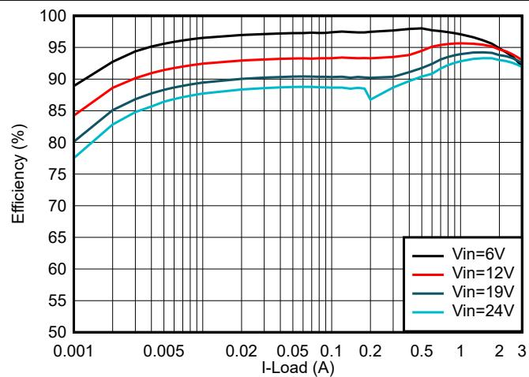  
nless otherwise noted)

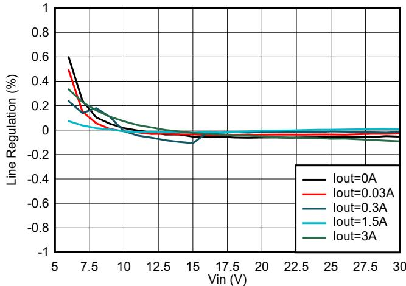  
Figure 10-2. Efficiency

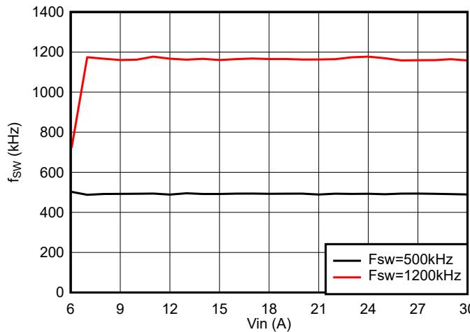  
Figure 10-4. Line Regulation   
Figure 10-6. Switching Frequency vs $\mathsf { V } _ { \mathsf { I N } } , \mathsf { V } _ { \mathsf { O U T } } = 5$ V

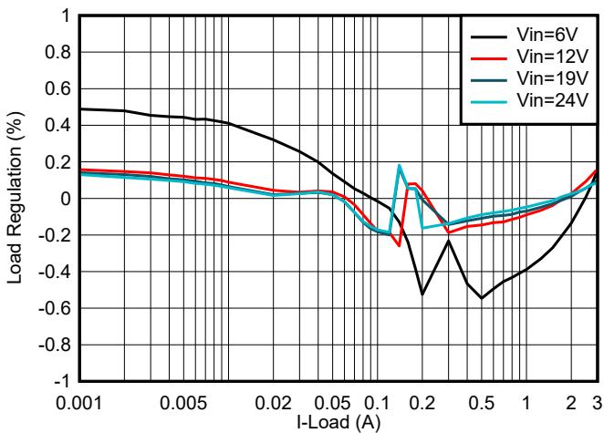  
Figure 10-3. Load Regulation

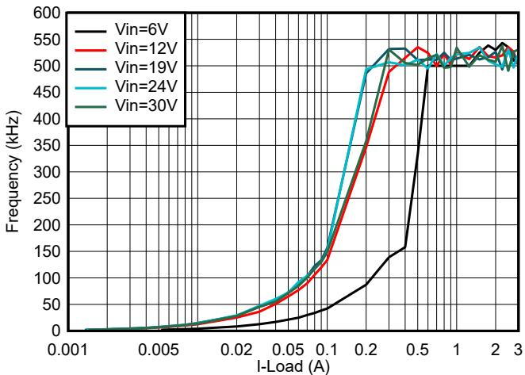  
Figure 10-5. Switching Frequency vs Load Current

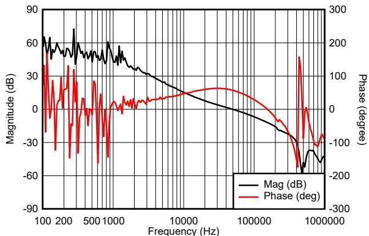  
Figure 10-7. Loop Frequency Response, $\mathsf { I } _ { \mathsf { O U T } } = 3 \mathsf { A }$ $\mathsf { B W } = 4 9 . 4 \ \mathsf { k H z }$ , $P M = 5 7 ^ { \circ }$ , $\mathsf { G M } = - 1 2$ dB

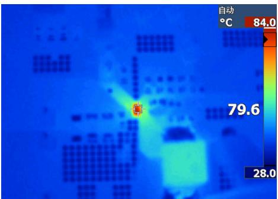  
Figure 10-8. Case Temperature, $V _ { | \mathsf { N } } = 2 4 \mathsf { V }$ , IOUT = 3 A, fSW = 500 kHz

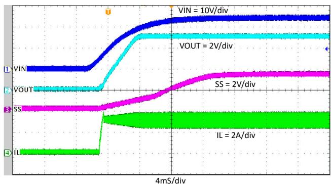  
Figure 10-9. Start-Up Relative to $\mathsf { V } _ { \mathsf { I N } } , \mathsf { I _ { O U T } } = 3 \mathsf { A }$ A

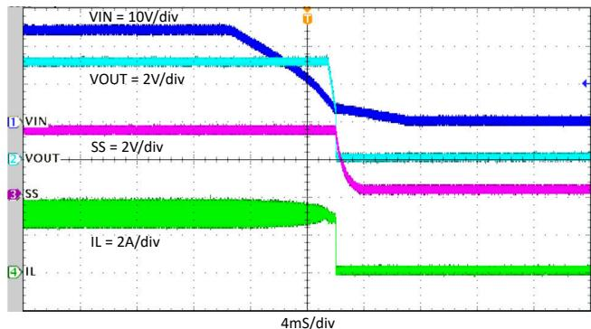  
Figure 10-10. Shutdown Relative to $\mathsf { V } _ { \mathsf { I N } } , \mathsf { I _ { O U T } } = 3 \mathsf { A }$

  
Figure 10-12. Shutdown Through EN, IOUT = 3 A

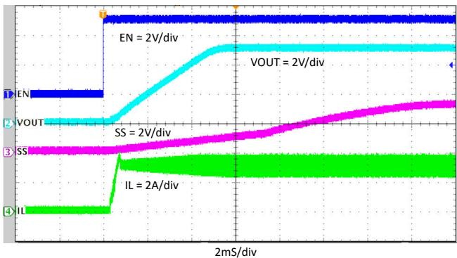  
Figure 10-11. Start-Up Through EN, IOUT = 3 A

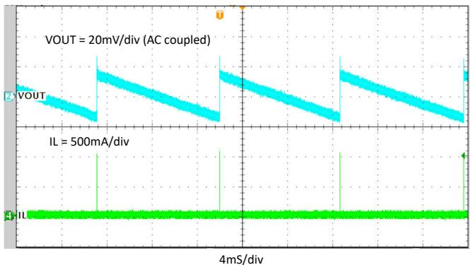  
Figure 10-13. Steady State, $\mathsf { l o u r } = \pmb { 0 } \mathscr { k }$ A

  
Figure 10-14. Steady State, $\mathsf { l } _ { \mathsf { O U T } } = \mathbf { 0 } . 1 \ \mathsf { A }$

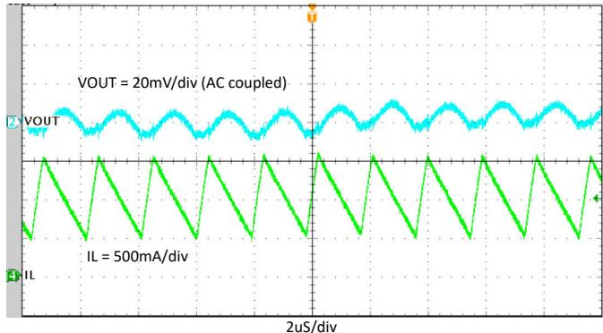  
Figure 10-16. Steady State, IOUT = 1 A

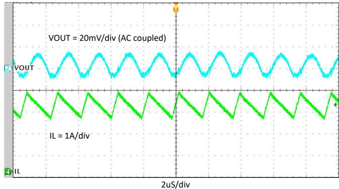  
Figure 10-18. Steady State, IOUT $\mathbf { \lambda } = :$ 3 A

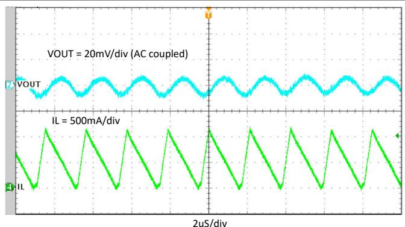  
Figure 10-15. Steady State, $\mathsf { l } _ { 0 \mathsf { U T } } = \pmb { 0 . 5 } \mathsf { \pmb { A } }$

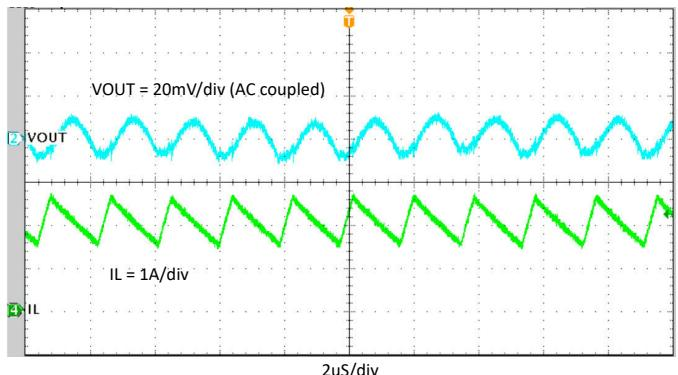  
Figure 10-17. Steady State, IOUT = 2 A

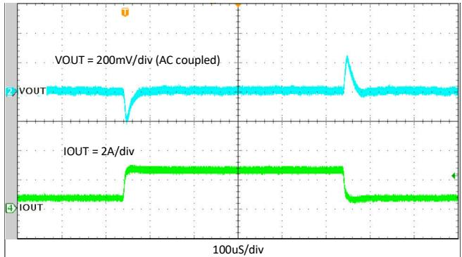  
Figure 10-19. Load Transient Response, 0.5 to 2.5 A, Slew Rate $\mathbf { \lambda } = 0 . 8 \mathbf { \mathbb { A } } I \mathbf { \mu s }$

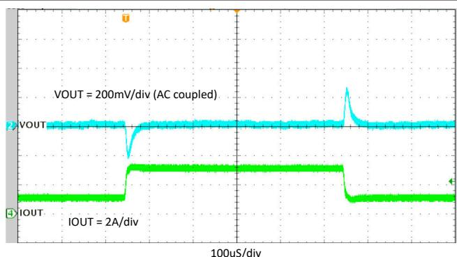  
Figure 10-20. Load Transient Response, 1 to 3 A, Slew Rate $\mathbf { \lambda } = 0 . 8 \mathbf { \mathbb { A } } / \mu \mathbf { S }$

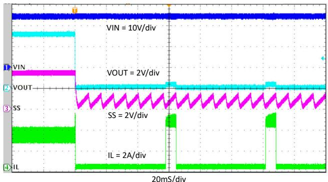  
Figure 10-21. VOUT Hard Short Protection

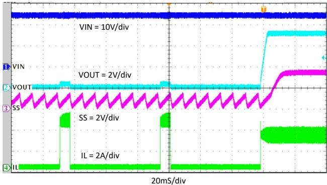  
Figure 10-22. VOUT Hard Short Recovery

# 10.3 What to Do and What Not to Do

Do not exceed the Absolute Maximum Ratings.   
Do not exceed the Recommended Operating Conditions.   
Do not exceed the ESD Ratings.   
Do not allow the SS pin floating.   
Do not allow the output voltage to exceed the input voltage, nor go below ground.   
Do not use the value of $\mathsf { R } _ { \Theta \ J _ { A } }$ given in the Thermal Information table to design your application. See Section 10.2.2.11.   
Follow all the guidelines and suggestions found in this data sheet before committing the design to production TI application engineers are ready to help critique your design and PCB layout to help make your project a success.   
Use a 100-nF capacitor connected directly to the VIN and GND pins of the device. See Section 10.2.2.9 for details.

# 11 Power Supply Recommendations

The devices are designed to operate from an input voltage supply range between $3 . 8 \ V$ and $3 0 \ \mathsf { V } .$ This input supply must be well regulated and compatible with the limits found in the specifications of this data sheet. In addition, the input supply must be capable of delivering the required input current to the loaded converter. The average input current can be estimated with Equation 25.

$$
\mathsf { I } _ { \mathsf { I N } } = \frac { \mathsf { V } _ { \mathsf { O U T } } \times \mathsf { I } _ { \mathsf { O U T } } } { \mathsf { V } _ { \mathsf { I N } } \times \mathsf { \Omega } _ { \mathsf { I } } }
$$

where

• $\boldsymbol { \mathsf { I } }$ is efficiency.

If the converter is connected to the input supply through long wires or PCB traces, special care is required to achieve good performance. The parasitic inductance and resistance of the input cables can have an adverse effect on the operation of the converter. The parasitic inductance, in combination with the low-ESR, ceramic input capacitors, can form an under-damped resonant circuit, resulting in overvoltage transients at the input to the converter. The parasitic resistance can cause the voltage at the VIN pin to dip whenever a load transient is applied to the output. If the application is operating close to the minimum input voltage, this dip can cause the converter to momentarily shutdown and reset. The best way to solve these kind of issues is to reduce the distance from the input supply to the converter and use an aluminum or tantalum input capacitor in parallel with the ceramics. The moderate ESR of these types of capacitors help damp the input resonant circuit and reduce any overshoots. A value in the range of $2 0 ~ \mu \mathsf { F }$ to $1 0 0 ~ \mu \mathsf { F }$ is usually sufficient to provide input damping and help hold the input voltage steady during large load transients.

TI recommends that the input supply must not be allowed to fall below the output voltage by more than 0.3 V. Under such conditions, the output capacitors discharges through the body diode of the high-side power MOSFET. The resulting current can cause unpredictable behavior, and in extreme cases, possible device damage. If the application allows for this possibility, then use a Schottky diode from VIN to VOUT to provide a path around the converter for this current.

In some cases, a transient voltage suppressor (TVS) is used on the input of converters. One class of this device has a snap-back characteristic (thyristor type). The use of a device with this type of characteristic is not recommended. When the TVS fires, the clamping voltage falls to a very low value. If this voltage is less than the output voltage of the converter, the output capacitors discharges through the device, as mentioned above.

Sometimes, for other system considerations, an input filter is used in front of the converter, which can lead to instability as well as some of the effects mentioned above, unless it is designed carefully. The AN-2162 Simple Success with Conducted EMI from DCDC Converters User's Guide provides helpful suggestions when designing an input filter for any switching converter.

# 12 Layout

# 12.1 Layout Guidelines

The PCB layout of any DC/DC converter is critical to the optimal performance of the design. Bad PCB layout can disrupt the operation of a good schematic design. Even if the converter regulates correctly, bad PCB layout can mean the difference between a robust design and one that cannot be mass produced. Furthermore, the EMI performance of the converter is dependent on the PCB layout to a great extent. In a buck converter, the most critical PCB feature is the loop formed by the input capacitors and power ground, as shown in Figure 12-1. This loop carries large transient currents that can cause large transient voltages when reacting with the trace inductance. These unwanted transient voltages disrupt the proper operation of the converter. Because of this, the traces in this loop must be wide and short, and the loop area as small as possible to reduce the parasitic inductance.

TI recommends a 2-layer board with 2-oz copper thickness of top and bottom layer, and proper layout provides low current conduction impedance, proper shielding, and lower thermal resistance. Figure 12-2 and Figure 12-3 show the recommended layouts for the critical components of the TPS62933.

Place the inductor, input and output capacitors, and the IC on the same layer.   
Place the input and output capacitors as close as possible to the IC. The VIN and GND traces must be as wide as possible and provide sufficient vias on them to minimize trace impedance. The wide areas are also of advantage from the view point of heat dissipation.   
Place a $0 . 1 \mathsf { - } \mu \mathsf { F }$ ceramic decoupling capacitor or capacitors as close as possible to VIN and GND pins, which is key to EMI reduction.   
Keep the SW trace as physically short and wide as practical to minimize radiated emissions.   
Place a BST capacitor and resistor close to the BST pin and SW node. $\mathsf { A } > 1 0$ -mil width trace is   
recommended to reduce the parasitic inductance.   
Place the feedback divider as close as possible to the FB pin. $\mathsf { A } > 1 0 \mathsf { . }$ -mil width trace is recommended for heat dissipation. Connect a separate $\mathsf { V } _ { \mathsf { O U T } }$ trace to the upper feedback resistor. Place the voltage feedback loop away from the high-voltage switching trace. The voltage feedback loop preferably has ground shield. Place the SS capacitor and RT resistor close to the IC and routed with minimal lengths of trace. $\mathsf { A } > 1 0 \mathsf { - m i l }$ width trace is recommended for heat dissipation.

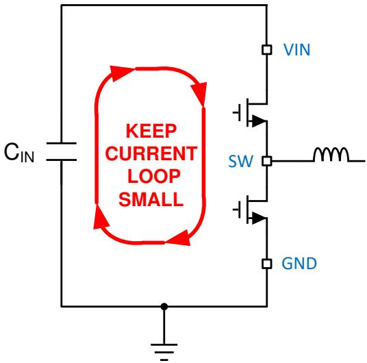  
Figure 12-1. Current Loop With Fast Edges

# 12.2 Layout Example

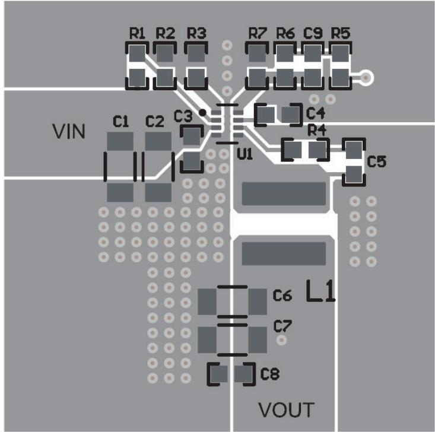  
Figure 12-2. TPS62933 Top Layout Example

  
Figure 12-3. TPS62933 Bottom Layout Example

# 13 Device and Documentation Support 13.1 Device Support

# 13.1.1 Third-Party Products Disclaimer

TI'S PUBLICATION OF INFORMATION REGARDING THIRD-PARTY PRODUCTS OR SERVICES DOES NOT CONSTITUTE AN ENDORSEMENT REGARDING THE SUITABILITY OF SUCH PRODUCTS OR SERVICES OR A WARRANTY, REPRESENTATION OR ENDORSEMENT OF SUCH PRODUCTS OR SERVICES, EITHER ALONE OR IN COMBINATION WITH ANY TI PRODUCT OR SERVICE.

# 13.1.2 Development Support

# 13.1.2.1 Custom Design With WEBENCH® Tools

Create a custom design with the TPS6293x using the WEBENCH® Power Designer.

1. Start by entering the input voltage $( \mathsf { V } _ { \mathsf { I N } } )$ , output voltage $( \mathsf { V } _ { \mathsf { O U T } } )$ , and output current (IOUT) requirements.   
2. Optimize the design for key parameters such as efficiency, footprint, and cost using the optimizer dial.   
3. Compare the generated design with other possible solutions from Texas Instruments.

The WEBENCH Power Designer provides a customized schematic along with a list of materials with real-time pricing and component availability.

In most cases, these actions are available:

Run electrical simulations to see important waveforms and circuit performance Run thermal simulations to understand board thermal performance Export customized schematic and layout into popular CAD formats Print PDF reports for the design, and share the design with colleagues

Get more information about WEBENCH tools at www.ti.com/WEBENCH.

# 13.2 Receiving Notification of Documentation Updates

To receive notification of documentation updates, navigate to the device product folder on ti.com. Click on Subscribe to updates to register and receive a weekly digest of any product information that has changed. For change details, review the revision history included in any revised document.

# 13.3 Support Resources

TI E2E™ support forums are an engineer's go-to source for fast, verified answers and design help — straight from the experts. Search existing answers or ask your own question to get the quick design help you need.

Linked content is provided "AS IS" by the respective contributors. They do not constitute TI specifications and do not necessarily reflect TI's views; see TI's Terms of Use.

# 13.4 Trademarks

TI E2E™ is a trademark of Texas Instruments.   
WEBENCH® is a registered trademark of Texas Instruments.   
All trademarks are the property of their respective owners.

# 13.5 Electrostatic Discharge Caution

This integrated circuit can be damaged by ESD. Texas Instruments recommends that all integrated circuits be handled with appropriate precautions. Failure to observe proper handling and installation procedures can cause damage.

ESD damage can range from subtle performance degradation to complete device failure. Precision integrated circuits may be more susceptible to damage because very small parametric changes could cause the device not to meet its published specifications.

# 13.6 Glossary

This glossary lists and explains terms, acronyms, and definitions.

# 14 Mechanical, Packaging, and Orderable Information

The following pages include mechanical, packaging, and orderable information. This information is the most current data available for the designated devices. This data is subject to change without notice and revision of this document. For browser-based versions of this data sheet, refer to the left-hand navigation.

PACKAGING INFORMATION   

<table><tr><td>Orderable part number</td><td>Status (1)</td><td>Material type (2)</td><td>Package | Pins</td><td>Package qty | Carrier</td><td>RoHS (3)</td><td>Lead finish/ Bal material</td><td>MSL rating/ ak reflow</td><td>Op temp ()</td><td>Part marking (6)</td></tr><tr><td>TPS62932DRLR</td><td>Active</td><td>Production</td><td>SOT-5X3 (DRL) |8</td><td>4000 | LARGE T&amp;R</td><td>Yes</td><td>(4) Call TI | Sn</td><td>(5) Level-1-260C-UNLIM</td><td>-40 to 150</td><td>2932</td></tr><tr><td>TPS62932DRLR.A</td><td>Active</td><td>Production</td><td>SOT-5X3 (DRL) | 8</td><td>4000 | LARGE T&amp;R</td><td>Yes</td><td>SN</td><td>Level-1-260C-UNLIM</td><td>-40 to 150</td><td>2932</td></tr><tr><td>TPS62933DRLR</td><td>Active</td><td>Production</td><td>SOT-5X3 (DRL) | 8</td><td>4000 | LARGE T&amp;R</td><td>Yes</td><td>Call TI | Sn</td><td>Level-1-260C-UNLIM</td><td>-40 to 150</td><td>2933</td></tr><tr><td>TPS62933DRLR.A</td><td>Active</td><td>Production</td><td>SOT-5X3 (DRL) | 8</td><td>4000 | LARGE T&amp;R</td><td>Yes</td><td>SN</td><td>Level-1-260C-UNLIM</td><td>-40 to 150</td><td>2933</td></tr><tr><td>TPS62933FDRLR</td><td>Active</td><td>Production</td><td>SOT-5X3 (DRL) | 8</td><td>4000 | LARGE T&amp;R</td><td>Yes</td><td>Call TI Sn</td><td>Level-1-260C-UNLIM</td><td>-40 to 150</td><td>933F</td></tr><tr><td>TPS62933FDRLR.A</td><td>Active</td><td>Production</td><td>SOT-5X3 (DRL) |8</td><td>4000 | LARGE T&amp;R</td><td>Yes</td><td>SN</td><td>Level-1-260C-UNLIM</td><td>-40 to 150</td><td>933F</td></tr><tr><td>TPS62933ODRLR</td><td>Active</td><td>Production</td><td>SOT-5X3 (DRL) | 8</td><td>4000 | LARGE T&amp;R</td><td>Yes</td><td>Call TI | Sn</td><td>Level-1-260C-UNLIM</td><td>-40 to 150</td><td>9330</td></tr><tr><td>TPS62933ODRLR.A</td><td>Active</td><td>Production</td><td>SOT-5X3 (DRL) | 8</td><td>4000 | LARGE T&amp;R</td><td>Yes</td><td>SN</td><td>Level-1-260C-UNLIM</td><td>-40 to 150</td><td>9330</td></tr><tr><td>TPS62933PDRLR</td><td>Active</td><td>Production</td><td>SOT-5X3 (DRL) | 8</td><td>4000 | LARGE T&amp;R</td><td>Yes</td><td>Call TI I Sn</td><td>Level-1-260C-UNLIM</td><td>-40 to 150</td><td>933P</td></tr><tr><td>TPS62933PDRLR.A</td><td>Active</td><td>Production</td><td>SOT-5X3 (DRL) | 8</td><td>4000 | LARGE T&amp;R</td><td>Yes</td><td>SN</td><td>Level-1-260C-UNLIM</td><td>-40 to 150</td><td>933P</td></tr></table>

(1) Status: For more details on status, see our product life cycle.

(2) Material type: When designated, preproduction parts are prototypes/experimental devices, and are not yet approved or released for full production. Testing and final process, including without limitation quality assurance, reliability performance testing, and/or process qualification, may not yet be complete, and this item is subject to further changes or possible discontinuation. If available for ordering, purchases will be subject to an additional waiver at checkout, and are intended for early internal evaluation purposes only. These items are sold without warranties of any kind.

(3) RoHS values: Yes, No, RoHS Exempt. See the TI RoHS Statement for additional information and value definition.

(4) Lead finish/Ball material: Parts may have multiple material finish options. Finish options are separated by a vertical ruled line. Lead finish/Ball material values may wrap to two lines if the finish value exceeds the maximumcolumn width.

(5) MSL rating/Peak reflow: The moisture sensitivity level ratings and peak solder (reflow) temperatures. In the event that a part has multiple moisture sensitivity ratings, only the lowest level per JEDEC standards is shown.Refer to the shipping label for the actual reflow temperature that will be used to mount the part to the printed circuit board.

(6) Part marking: There may be an additional marking, which relates to the logo, the lot trace code information, or the environmental category of the part.

Multiple part markings will be inside parentheses. Only one part marking contained in parentheses and separated by a "\~" will appear on a part. If a line is indented then it is a continuation of the previous line and the two combined represent the entire part marking for that device.

and Disclaimer:The information provided on this page represents TI's knowledge and belief as of the date that it is provided. TI bases its knowledge and belief on information provided by third parties, and or warranty as to the accuracy of such information. Efforts are underway to better integrate information from third parties. TI has taken and continues to take reasonable steps to provide representative

and accurate information but may not have conducted destructive testing or chemical analysis on incoming materials and chemicals. TI and TI suppliers consider certain information to be proprietary, and thus CAS numbers and other limited information may not be available for release.

no event shall TI's liability arising out of such information exceed the total purchase price of the TI part(s) at issue in this document sold by TI to Customer on an annual basis.

# TAPE AND REEL INFORMATION

<table><tr><td rowspan=1 colspan=1>A0</td><td rowspan=1 colspan=1>A0 Dimension designed to accommodate the component width</td></tr><tr><td rowspan=1 colspan=1>B0</td><td rowspan=1 colspan=1>Dimension designed to accommodate the component length</td></tr><tr><td rowspan=1 colspan=1>K0</td><td rowspan=1 colspan=1>Dimension designed to accommodate the component thickness</td></tr><tr><td rowspan=1 colspan=1>W</td><td rowspan=1 colspan=1>Overall width of the carrier tape</td></tr><tr><td rowspan=1 colspan=1>P1</td><td rowspan=1 colspan=1>Pitch between successive cavity centers</td></tr></table>

# QUADRANT ASSIGNMENTS FOR PIN 1 ORIENTATION IN TAPE

\*All dimensions are nominal   

<table><tr><td rowspan=1 colspan=1>Device</td><td rowspan=1 colspan=1>PackageType</td><td rowspan=1 colspan=1>PackageDrawing</td><td rowspan=1 colspan=1>Pins</td><td rowspan=1 colspan=1>SPQ</td><td rowspan=1 colspan=1>ReelDiameter(mm)</td><td rowspan=1 colspan=1>ReelWidthW1 (mm)</td><td rowspan=1 colspan=1>A0(mm)</td><td rowspan=1 colspan=1>BO(mm)</td><td rowspan=1 colspan=1>KO(mm)</td><td rowspan=1 colspan=1>P1(mm)</td><td rowspan=1 colspan=1>w(mm)</td><td rowspan=1 colspan=1>Pin1Quadrant</td></tr><tr><td rowspan=1 colspan=1>TPS62932DRLR</td><td rowspan=1 colspan=1>SOT-5X3</td><td rowspan=1 colspan=1>DRL</td><td rowspan=1 colspan=1>8</td><td rowspan=1 colspan=1>4000</td><td rowspan=1 colspan=1>180.0</td><td rowspan=1 colspan=1>8.4</td><td rowspan=1 colspan=1>2.75</td><td rowspan=1 colspan=1>1.9</td><td rowspan=1 colspan=1>0.8</td><td rowspan=1 colspan=1>4.0</td><td rowspan=1 colspan=1>8.0</td><td rowspan=1 colspan=1>Q3</td></tr><tr><td rowspan=1 colspan=1>TPS62933DRLR</td><td rowspan=1 colspan=1>SOT-5X3</td><td rowspan=1 colspan=1>DRL</td><td rowspan=1 colspan=1>8</td><td rowspan=1 colspan=1>4000</td><td rowspan=1 colspan=1>180.0</td><td rowspan=1 colspan=1>8.4</td><td rowspan=1 colspan=1>2.75</td><td rowspan=1 colspan=1>1.9</td><td rowspan=1 colspan=1>0.8</td><td rowspan=1 colspan=1>4.0</td><td rowspan=1 colspan=1>8.0</td><td rowspan=1 colspan=1>Q3</td></tr><tr><td rowspan=1 colspan=1>TPS62933FDRLR</td><td rowspan=1 colspan=1>SOT-5X3</td><td rowspan=1 colspan=1>DRL</td><td rowspan=1 colspan=1>8</td><td rowspan=1 colspan=1>4000</td><td rowspan=1 colspan=1>180.0</td><td rowspan=1 colspan=1>8.4</td><td rowspan=1 colspan=1>2.75</td><td rowspan=1 colspan=1>1.9</td><td rowspan=1 colspan=1>0.8</td><td rowspan=1 colspan=1>4.0</td><td rowspan=1 colspan=1>8.0</td><td rowspan=1 colspan=1>Q3</td></tr><tr><td rowspan=1 colspan=1>TPS62933ODRLR</td><td rowspan=1 colspan=1>SOT-5X3</td><td rowspan=1 colspan=1>DRL</td><td rowspan=1 colspan=1>8</td><td rowspan=1 colspan=1>4000</td><td rowspan=1 colspan=1>180.0</td><td rowspan=1 colspan=1>8.4</td><td rowspan=1 colspan=1>2.75</td><td rowspan=1 colspan=1>1.9</td><td rowspan=1 colspan=1>0.8</td><td rowspan=1 colspan=1>4.0</td><td rowspan=1 colspan=1>8.0</td><td rowspan=1 colspan=1>Q3</td></tr><tr><td rowspan=1 colspan=1>TPS62933PDRLR</td><td rowspan=1 colspan=1>SOT-5X3</td><td rowspan=1 colspan=1>DRL</td><td rowspan=1 colspan=1>8</td><td rowspan=1 colspan=1>4000</td><td rowspan=1 colspan=1>180.0</td><td rowspan=1 colspan=1>8.4</td><td rowspan=1 colspan=1>2.75</td><td rowspan=1 colspan=1>1.9</td><td rowspan=1 colspan=1>0.8</td><td rowspan=1 colspan=1>4.0</td><td rowspan=1 colspan=1>8.0</td><td rowspan=1 colspan=1>Q3</td></tr></table>

\*All dimensions are nominal   

<table><tr><td rowspan=1 colspan=1>Device</td><td rowspan=1 colspan=1>Package Type</td><td rowspan=1 colspan=1>Package Drawing</td><td rowspan=1 colspan=1>Pins</td><td rowspan=1 colspan=1>SPQ</td><td rowspan=1 colspan=1>Length (mm)</td><td rowspan=1 colspan=1>Width (mm)</td><td rowspan=1 colspan=1>Height (mm)</td></tr><tr><td rowspan=1 colspan=1>TPS62932DRLR</td><td rowspan=1 colspan=1>SOT-5X3</td><td rowspan=1 colspan=1>DRL</td><td rowspan=1 colspan=1>8</td><td rowspan=1 colspan=1>4000</td><td rowspan=1 colspan=1>210.0</td><td rowspan=1 colspan=1>185.0</td><td rowspan=1 colspan=1>35.0</td></tr><tr><td rowspan=1 colspan=1>TPS62933DRLR</td><td rowspan=1 colspan=1>SOT-5X3</td><td rowspan=1 colspan=1>DRL</td><td rowspan=1 colspan=1>8</td><td rowspan=1 colspan=1>4000</td><td rowspan=1 colspan=1>210.0</td><td rowspan=1 colspan=1>185.0</td><td rowspan=1 colspan=1>35.0</td></tr><tr><td rowspan=1 colspan=1>TPS62933FDRLR</td><td rowspan=1 colspan=1>SOT-5X3</td><td rowspan=1 colspan=1>DRL</td><td rowspan=1 colspan=1>8</td><td rowspan=1 colspan=1>4000</td><td rowspan=1 colspan=1>210.0</td><td rowspan=1 colspan=1>185.0</td><td rowspan=1 colspan=1>35.0</td></tr><tr><td rowspan=1 colspan=1>TPS62933ODRLR</td><td rowspan=1 colspan=1>SOT-5X3</td><td rowspan=1 colspan=1>DRL</td><td rowspan=1 colspan=1>8</td><td rowspan=1 colspan=1>4000</td><td rowspan=1 colspan=1>210.0</td><td rowspan=1 colspan=1>185.0</td><td rowspan=1 colspan=1>35.0</td></tr><tr><td rowspan=1 colspan=1>TPS62933PDRLR</td><td rowspan=1 colspan=1>SOT-5X3</td><td rowspan=1 colspan=1>DRL</td><td rowspan=1 colspan=1>8</td><td rowspan=1 colspan=1>4000</td><td rowspan=1 colspan=1>210.0</td><td rowspan=1 colspan=1>185.0</td><td rowspan=1 colspan=1>35.0</td></tr></table>

PLASTIC SMALL OUTLINE

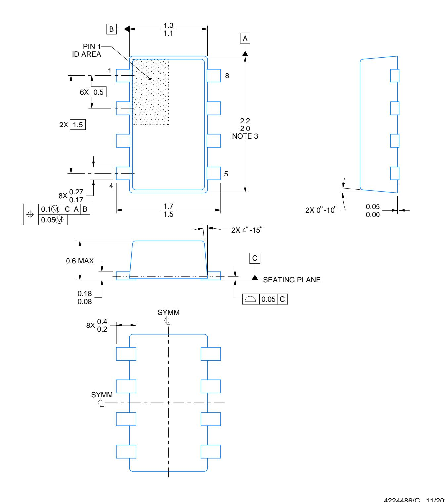

4224486/G 11/2024

# NOTES:

1. All linear dimensions are in millimeters. Any dimensions in parenthesis are for reference only. Dimensioning and tolerancing per ASME $\mathsf { Y } 1 4 . 5 \mathsf { M }$ .   
2. This drawing is subject to change without notice.   
3. This dimension does not include mold flash, protrusions, or gate burrs. Mold flash, interlead flash, protrusions, or gate burrs shall not exceed $0 . 1 5 \mathsf { m m }$ per side.   
4.Reference JEDEC Registration MO-293, Variation UDAD

PLASTIC SMALL OUTLINE

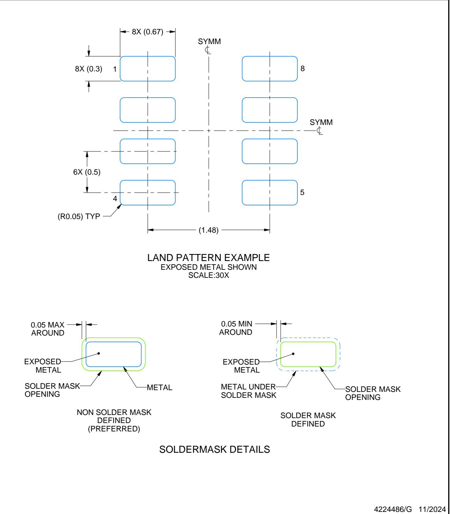  
NOTES: (continued)

PLASTIC SMALL OUTLINE

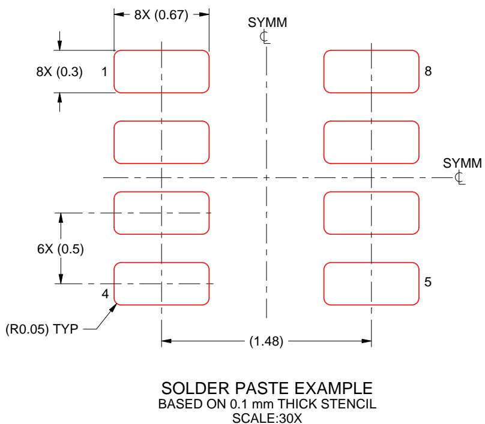  
NOTES: (continued)

8. Laser cutting apertures with trapezoidal walls and rounded corners may offer better paste release. IPC-7525 may have alternate design recommendations.   
9. Board assembly site may have different recommendations for stencil design.

# IMPORTANT NOTICE AND DISCLAIMER

TI PROVIDES TECHNICAL AND RELIABILITY DATA (INCLUDING DATASHEETS), DESIGN RESOURCES (INCLUDING REFERENCE DESIGNS), APPLICATION OR OTHER DESIGN ADVICE, WEB TOOLS, SAFETY INFORMATION, AND OTHER RESOURCES “AS IS” AND WITH ALL FAULTS, AND DISCLAIMS ALL WARRANTIES, EXPRESS AND IMPLIED, INCLUDING WITHOUT LIMITATION ANY IMPLIED WARRANTIES OF MERCHANTABILITY, FITNESS FOR A PARTICULAR PURPOSE OR NON-INFRINGEMENT OF THIRD PARTY INTELLECTUAL PROPERTY RIGHTS.

These resources are intended for skilled developers designing with TI products. You are solely responsible for (1) selecting the appropriate TI products for your application, (2) designing, validating and testing your application, and (3) ensuring your application meets applicable standards, and any other safety, security, regulatory or other requirements.

These resources are subject to change without notice. TI grants you permission to use these resources only for development of an application that uses the TI products described in the resource. Other reproduction and display of these resources is prohibited. No license is granted to any other TI intellectual property right or to any third party intellectual property right. TI disclaims responsibility for, and you fully indemnify TI and its representatives against any claims, damages, costs, losses, and liabilities arising out of your use of these resources.

TI’s products are provided subject to TI’s Terms of Sale, TI’s General Quality Guidelines, or other applicable terms available either on ti.com or provided in conjunction with such TI products. TI’s provision of these resources does not expand or otherwise alter TI’s applicable warranties or warranty disclaimers for TI products. Unless TI explicitly designates a product as custom or customer-specified, TI products are standard, catalog, general purpose devices.

TI objects to and rejects any additional or different terms you may propose.