# TVS0500 5-V Flat-Clamp Surge Protection Device

# 1 Features

1• Protection Against $2 \kappa \nu$ , 42 Ω IEC 61000-4-5 Surge Test for Industrial Signal Lines

Max Clamping Voltage of $\mathfrak { 9 . 2 V }$ at 43 A of $8 / 2 0 ~ \mu \ s$ Surge Current

• Standoff Voltage: 5 V

• Tiny $4 \mathsf { m m } ^ { 2 }$ Footprint

Survives over 5,000 Repetitive Strikes of 35 A $8 / 2 0 ~ \mu \ s$ Surge Current at $1 2 5 ^ { \circ } \mathrm { C }$

• Robust Surge Protection: – IEC61000-4-5 (8/20 µs): 43 A IEC61643-321 (10/1000 µs): 22 A

• Low Leakage Current – 70 pA typical at $\scriptstyle 2 7 ^ { \circ } \complement$ – 6.5 nA typical at $8 5 ^ { \circ } \mathsf { C }$

• Low Capacitance: 155 pF • Integrated Level 4 IEC 61000-4-2 ESD Protection

# 2 Applications

• Industrial Sensors • PLC I/O Modules • 5 V Power Lines • Appliances Medical Equipment • Smart Meters

# 3 Description

The TVS0500 robustly shunts up to 43 A of IEC 61000-4-5 fault current to protect systems from high power transients or lightning strikes. The device offers a solution to the common industrial signal line EMC requirement to survive up to $2 ~ \mathsf { k V }$ IEC 61000-4- 5 open circuit voltage coupled through a 42 Ω impedance. The TVS0500 uses a unique feedback mechanism to ensure precise flat clamping during a fault, assuring system exposure below $ 1 0 \lor .$ . The tight voltage regulation allows designers to confidently select system components with a lower voltage tolerance, lowering system costs and complexity without sacrificing robustness.

In addition, the TVS0500 is available in a small $2 \mathsf { m m }$ × 2 mm SON footprint which is ideal for space constrained applications, offering a 70 percent reduction in size compared to industry standard SMA and SMB packages. The extremely low device leakage and capacitance ensure a minimal effect on the protected line. To ensure robust protection over the lifetime of the product, TI tests the TVS0500 against 5000 repetitive surge strikes at high temperature with no shift in device performance.

The TVS0500 is part of TI's Flat-Clamp family of surge devices. For more information on the other devices in the family, see the Device Comparison Table

Device Information(1)   

<table><tr><td rowspan=1 colspan=1>PART NUMBER</td><td rowspan=1 colspan=1>PACKAGE</td><td rowspan=1 colspan=1>BODY SIZE (NOM)</td></tr><tr><td rowspan=1 colspan=1>TVS0500</td><td rowspan=1 colspan=1>SON (6)</td><td rowspan=1 colspan=1>2.00 mm x 2.00 mm</td></tr></table>

(1) For all available packages, see the orderable addendum at the end of the data sheet.

# Footprint Comparison

# Voltage Clamp Response to ${ \bf 8 } / 2 0 ~ { \bf \mu \leq }$ Surge Event

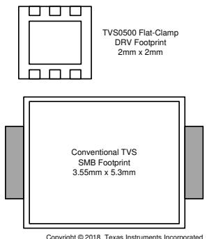

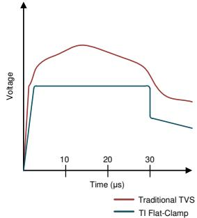

# Table of Contents

# 1 Features.. 1

3 Description .

# 4 Revision History... 2

5 Device Comparison Table.. 3

6 Pin Configuration and Functions.. 4

# 7 Specifications... 5

7.1 Absolute Maximum Ratings ..... 5   
7.2 ESD Ratings - JEDEC . 5   
7.3 ESD Ratings - IEC . 5   
7.4 Recommended Operating Conditions.. 5   
7.5 Thermal Information.. 5   
7.6 Electrical Characteristics. 6   
7.7 Typical Characteristics .. 7

# 8 Detailed Description . 9

8.1 Overview .. 9   
8.2 Functional Block Diagram .... 9   
8.3 Feature Description.. 9   
8.4 Reliability Testing ... 9   
8.5 Device Functional Modes . 9

# 9 Application and Implementation .. 11

9.1 Application Information.... 11   
9.2 Typical Application 11

# 10 Power Supply Recommendations 12

# 11 Layout.. 13

11.1 Layout Guidelines ... 13   
11.2 Layout Example . 13

# 12 Device and Documentation Support .. 14

12.1 Receiving Notification of Documentation Updates 14   
12.2 Community Resources. 14   
12.3 Trademarks. 14   
12.4 Electrostatic Discharge Caution... 14   
12.5 Glossary .... 14

# 13 Mechanical, Packaging, and Orderable

Information .. 14

# 4 Revision History

# Changes from Revision B (February 2018) to Revision C

Page

• Fixed grammar error in the Reliability Testing section ................. 9

# Changes from Revision A (February 2018) to Revision B Page

Changed DC Breakdown Current MAX from 100 to 50 in the Specifications Absolute Maximum Ratings table 5 Changed Break-down Voltage MIN from 7.6 to 7.5 and MAX from 8.2 to 8.4 in the Specifications Electrical Characteristics table ...... 5

# Changes from Original (December 2017) to Revision A Page

• Changed device document status from Advance Information to Production Data............

# 5 Device Comparison Table

<table><tr><td rowspan=1 colspan=1>Device</td><td rowspan=1 colspan=1>Vrwm</td><td rowspan=1 colspan=1>Vclamp at Ipp</td><td rowspan=1 colspan=1>Ipp (8/20 µμs)</td><td rowspan=1 colspan=1>Vrwm leakage(nA)</td><td rowspan=1 colspan=1>Package Options</td><td rowspan=1 colspan=1>Polarity</td></tr><tr><td rowspan=1 colspan=1>TVS0500</td><td rowspan=1 colspan=1>5</td><td rowspan=1 colspan=1>9.2</td><td rowspan=1 colspan=1>43</td><td rowspan=1 colspan=1>0.07</td><td rowspan=1 colspan=1>SON</td><td rowspan=1 colspan=1>Unidirectional</td></tr><tr><td rowspan=1 colspan=1>TVS1400</td><td rowspan=1 colspan=1>14</td><td rowspan=1 colspan=1>18.4</td><td rowspan=1 colspan=1>43</td><td rowspan=1 colspan=1>2</td><td rowspan=1 colspan=1>SON</td><td rowspan=1 colspan=1>Unidirectional</td></tr><tr><td rowspan=1 colspan=1>TVS1800</td><td rowspan=1 colspan=1>18</td><td rowspan=1 colspan=1>22.8</td><td rowspan=1 colspan=1>40</td><td rowspan=1 colspan=1>0.5</td><td rowspan=1 colspan=1>SON</td><td rowspan=1 colspan=1>Unidirectional</td></tr><tr><td rowspan=1 colspan=1>TVS2200</td><td rowspan=1 colspan=1>22</td><td rowspan=1 colspan=1>27.7</td><td rowspan=1 colspan=1>40</td><td rowspan=1 colspan=1>3.2</td><td rowspan=1 colspan=1>SON</td><td rowspan=1 colspan=1>Unidirectional</td></tr><tr><td rowspan=1 colspan=1>TVS2700</td><td rowspan=1 colspan=1>27</td><td rowspan=1 colspan=1>32.5</td><td rowspan=1 colspan=1>40</td><td rowspan=1 colspan=1>1.7</td><td rowspan=1 colspan=1>SON</td><td rowspan=1 colspan=1>Unidirectional</td></tr><tr><td rowspan=1 colspan=1>TVS3300</td><td rowspan=1 colspan=1>33</td><td rowspan=1 colspan=1>38</td><td rowspan=1 colspan=1>35</td><td rowspan=1 colspan=1>19</td><td rowspan=1 colspan=1>WCSP, SON</td><td rowspan=1 colspan=1>Unidirectional</td></tr></table>

# 6 Pin Configuration and Functions

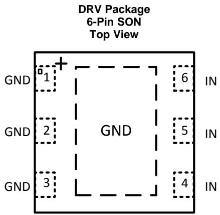

Pin Functions   

<table><tr><td rowspan=1 colspan=2>PIN</td><td rowspan=2 colspan=1>TYPE</td><td rowspan=2 colspan=1>DESCRIPTION</td></tr><tr><td rowspan=1 colspan=1>NAME</td><td rowspan=1 colspan=1>No.</td></tr><tr><td rowspan=1 colspan=1>IN</td><td rowspan=1 colspan=1>4,5, 6</td><td rowspan=1 colspan=1>I</td><td rowspan=1 colspan=1>ESD and surge protected channel</td></tr><tr><td rowspan=1 colspan=1>GND</td><td rowspan=1 colspan=1>1, 2, 3, exposed thermalpad</td><td rowspan=1 colspan=1>GND</td><td rowspan=1 colspan=1>Ground</td></tr></table>

# 7 Specifications

# 7.1 Absolute Maximum Ratings

$\mathsf { T } _ { \mathsf { A } } = 2 7 ^ { \circ } \mathsf { C }$ (unless otherwise noted)(1)

<table><tr><td></td><td></td><td rowspan=1 colspan=1>MIN           MAX</td><td rowspan=1 colspan=1>UNIT</td></tr><tr><td rowspan=4 colspan=1>MaximumSurge</td><td rowspan=1 colspan=1>IEC 61000-4-5 Current (8/20 μs)</td><td rowspan=1 colspan=1>43</td><td rowspan=1 colspan=1>A</td></tr><tr><td rowspan=1 colspan=1>IEC 61000-4-5 Power (8/20 µs)</td><td rowspan=1 colspan=1>400</td><td rowspan=1 colspan=1>W</td></tr><tr><td rowspan=1 colspan=1>IEC 61643-321 Current (10/1000 µs)</td><td rowspan=1 colspan=1>20</td><td rowspan=1 colspan=1>A</td></tr><tr><td rowspan=1 colspan=1>IEC 61643-321 Power (10/1000 µs)</td><td rowspan=1 colspan=1>180</td><td rowspan=1 colspan=1>W</td></tr><tr><td rowspan=4 colspan=1>MaximumForward Surge</td><td rowspan=1 colspan=1>IEC 61000-4-5 Current (8/20 μs)</td><td rowspan=1 colspan=1>50</td><td rowspan=1 colspan=1>A</td></tr><tr><td rowspan=1 colspan=1>IEC 61000-4-5 Power (8/20 µs)</td><td rowspan=1 colspan=1>80</td><td rowspan=1 colspan=1>W</td></tr><tr><td rowspan=1 colspan=1>IEC 61643-321 Current (10/1000 μs)</td><td rowspan=1 colspan=1>23</td><td rowspan=1 colspan=1>A</td></tr><tr><td rowspan=1 colspan=1>IEC 61643-321 Power (10/1000 µs)</td><td rowspan=1 colspan=1>60</td><td rowspan=1 colspan=1>W</td></tr><tr><td rowspan=1 colspan=2>EFT            IEC 61000-4-4 EFT Protection</td><td rowspan=1 colspan=1>80</td><td rowspan=1 colspan=1>A</td></tr><tr><td rowspan=1 colspan=2>IBR             DC Breakdown Current</td><td rowspan=1 colspan=1>50</td><td rowspan=1 colspan=1>mA</td></tr><tr><td rowspan=1 colspan=2>IF              DC Forward Current</td><td rowspan=1 colspan=1>500</td><td rowspan=1 colspan=1>mA</td></tr><tr><td rowspan=1 colspan=2>TA             Ambient Operating Temperature</td><td rowspan=1 colspan=1>-40            125</td><td rowspan=1 colspan=1>°C</td></tr><tr><td rowspan=1 colspan=2>Tstg            Storage Temperature</td><td rowspan=1 colspan=1>-65            150</td><td rowspan=1 colspan=1>C</td></tr></table>

(1) Stresses beyond those listed under Absolute Maximum Rating may cause permanent damage to the device. These are stress ratings only, which do not imply functional operation of the device at these or any other conditions beyond those indicated under Recommended Operating Condition. Exposure to absolute-maximum-rated conditions for extended periods may affect device reliability.

# 7.2 ESD Ratings - JEDEC

<table><tr><td></td><td></td><td rowspan=1 colspan=1>VALUE</td><td rowspan=1 colspan=1>UNIT</td></tr><tr><td rowspan=2 colspan=1>V(ESD)     Electrostatic discharge</td><td rowspan=1 colspan=1>Human body model (HBM), perANSI/ESDA/JEDEC JS-001, all pins (1)</td><td rowspan=1 colspan=1>±2000</td><td rowspan=2 colspan=1>V</td></tr><tr><td rowspan=1 colspan=1>Charged device model (CDM), per JEDECspecification JESD22-C101, all pins (2)</td><td rowspan=1 colspan=1>±500</td></tr></table>

(1) JEDEC document JEP155 states that 500-V HBM allows safe manufacturing with a standard ESD control process.   
(2) JEDEC document JEP157 states that 250-V CDM allows safe manufacturing with a standard ESD control process.

# 7.3 ESD Ratings - IEC

<table><tr><td></td><td></td><td rowspan=1 colspan=1>VALUE</td><td rowspan=1 colspan=1>UNIT</td></tr><tr><td rowspan=2 colspan=1>V(ESD)     Electrostatic discharge</td><td rowspan=1 colspan=1>IEC 61000-4-2 contact discharge</td><td rowspan=1 colspan=1>±24</td><td rowspan=2 colspan=1>kV</td></tr><tr><td rowspan=1 colspan=1>IEC 61000-4-2 air-gap discharge</td><td rowspan=1 colspan=1>±30</td></tr></table>

# 7.4 Recommended Operating Conditions

over operating free-air temperature range (unless otherwise noted)

<table><tr><td>PARAMETER</td><td>MIN</td><td>NOM</td><td>MAX</td><td>UNIT</td></tr><tr><td>VRWM</td><td>Reverse Stand-off Voltage</td><td></td><td>5</td><td>V</td></tr></table>

# 7.5 Thermal Information

<table><tr><td rowspan=3 colspan=1>THERMAL METRIC(1)</td><td rowspan=1 colspan=1>TVS0500</td><td rowspan=3 colspan=1>UNIT</td></tr><tr><td rowspan=1 colspan=1>DRV (SON)</td></tr><tr><td rowspan=1 colspan=1>6 PINS</td></tr><tr><td rowspan=1 colspan=1>RqJA            Junction-to-ambient thermal resistance</td><td rowspan=1 colspan=1>70.4</td><td rowspan=1 colspan=1>C/W</td></tr><tr><td rowspan=1 colspan=1>RqJC(top)         Junction-to-case (top) thermal resistance</td><td rowspan=1 colspan=1>73.7</td><td rowspan=1 colspan=1>C/W</td></tr><tr><td rowspan=1 colspan=1>RqJB            Junction-to-board thermal resistance</td><td rowspan=1 colspan=1>40</td><td rowspan=1 colspan=1>C/W</td></tr><tr><td rowspan=1 colspan=1>Y\sqra}$             Junction-to-top characterization parameter</td><td rowspan=1 colspan=1>2.2</td><td rowspan=1 colspan=1>C/W</td></tr></table>

(1) For more information about traditional and new thermal metrics, see the Semiconductor and IC Package Thermal Metrics application report.

# Thermal Information (continued)

<table><tr><td rowspan=3 colspan=1>THERMAL METRIC(1)</td><td rowspan=1 colspan=1>TVS0500</td><td rowspan=3 colspan=1>UNIT</td></tr><tr><td rowspan=1 colspan=1>DRV (SON)</td></tr><tr><td rowspan=1 colspan=1>6 PINS</td></tr><tr><td rowspan=1 colspan=1>Y{\BB}$             Junction-to-board characterization parameter</td><td rowspan=1 colspan=1>40.3</td><td rowspan=1 colspan=1>C/W</td></tr><tr><td rowspan=1 colspan=1>RqJC(bot)         Junction-to-case (bottom) thermal resistance</td><td rowspan=1 colspan=1>11</td><td rowspan=1 colspan=1>C/W</td></tr></table>

# 7.6 Electrical Characteristics

over operating free-air temperature range (unless otherwise noted)

<table><tr><td colspan="2">PARAMETER</td><td>TEST CONDITIONS</td><td>MIN</td><td>TYP</td><td>MAX</td><td>UNIT</td></tr><tr><td rowspan="3">Leak</td><td rowspan="3">Leakage Current</td><td>Measured at VIN = VRWM, TA = 27</td><td></td><td>0.07</td><td>5.5</td><td>nA</td></tr><tr><td>Measured at VIN = VRwM, TA = 85°C</td><td></td><td>6.5</td><td>220</td><td>nA</td></tr><tr><td>Measured at VIN = VRwM, TA = 105°</td><td></td><td>38</td><td>755</td><td>nA</td></tr><tr><td>VF$</td><td>Forward Voltage</td><td>IN = 1 mA from GND to I0 IN = 1 mA from IO to GND</td><td>0.25</td><td>0.5</td><td>0.65</td><td>V</td></tr><tr><td>V_BR VFCLAMP</td><td>Break-down Voltage Forward Clamp Voltage</td><td>35 A IEC 61000-4-5 Surge (8/20 µs)</td><td>7.5</td><td>7.9</td><td>8.4</td><td>V</td></tr><tr><td></td><td></td><td>from GND to IO, 27° 24 A IEC 61000-4-5 Surge (8/20 µs)</td><td></td><td>2</td><td>5</td><td>V</td></tr><tr><td rowspan="3">VCLAMP</td><td rowspan="3">Clamp Voltage</td><td>from IO to GND, VIN = 0 V before surge, 27°C</td><td></td><td>8.6</td><td>8.8</td><td>V</td></tr><tr><td>43 A IEC 61000-4-5 Surge (8/20 µs) from IO to GND, VIN = 0 V before surge, 27°C 35 A IEC 61000-4-5 Surge (8/20 µs)</td><td></td><td>9.2</td><td>9.5</td><td>V</td></tr><tr><td>from IO to GND, ViN = VRwM before surge, TA = 125°C</td><td></td><td>9.2</td><td>9.5</td><td>V</td></tr><tr><td>RDyN</td><td>8/20 µs surge dynamic resistance</td><td>Calculate om   p surge current levels, 27 ViN = 5 V, f = 1 MHz, 30 mVpp, IO to</td><td></td><td>30</td><td>50</td><td>mΩ</td></tr><tr><td>CIN</td><td>Input pin capacitance Maximum Slew Rate</td><td>GND</td><td></td><td>155</td><td></td><td>pF</td></tr><tr><td>SR</td><td></td><td>0-VRwm rising edge, sweep rise time and measure slew rate when IpEAK = 1 mA, 27</td><td></td><td>2.5</td><td></td><td>V/μs</td></tr><tr><td></td><td></td><td>0-VRwm rising edge, sweep rise time and measure slew rate when IpEAK = 1 mA, 105C</td><td></td><td>0.7</td><td></td><td>V/μs</td></tr></table>

# 7.7 Typical Characteristics

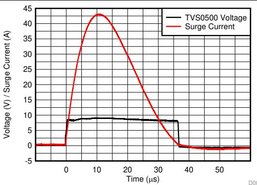  
Figure 1. 8/20 µs Surge Response at 43 A

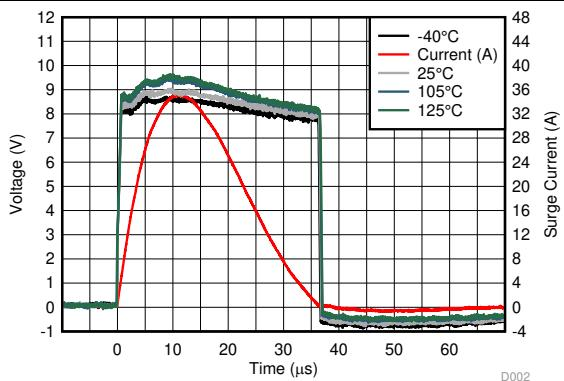

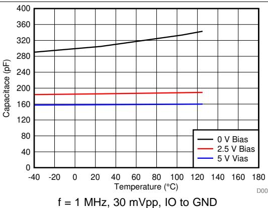  
Figure 3. Capacitance vs Temperature Across Bias

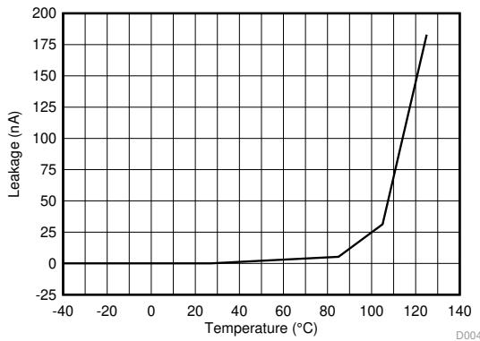  
Figure 2. 8/20 µs Surge Response at 35 A Across Temperature

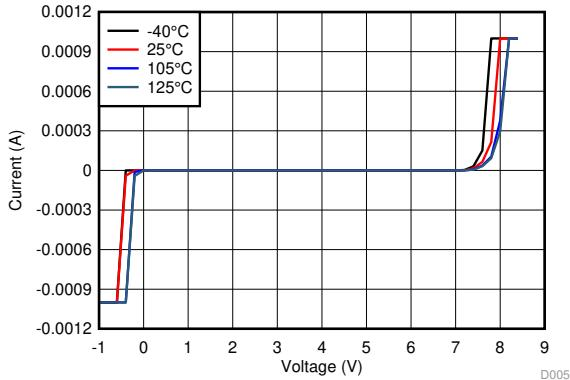  
Figure 5. I/V Curve Across Temperature

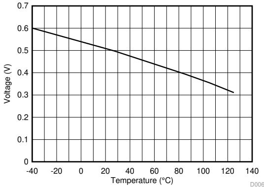  
Figure 4. Leakage Current vs Temperature at 5 V   
Figure 6. Forward Voltage vs Temperature

# Typical Characteristics (continued)

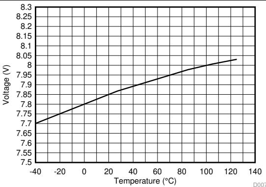

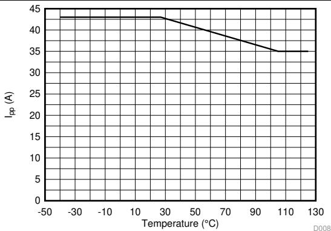

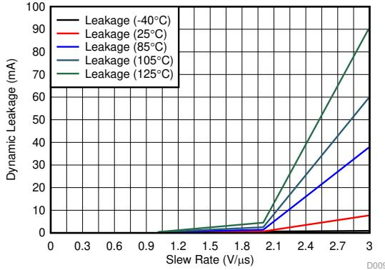  
Figure 7. Breakdown Voltage (1 mA) vs Temperature   
Figure 8. Max Surge Current $( 8 / 2 0 ~ \mu \leq )$ vs Temperature   
Figure 9. Dynamic Leakage vs Signal Slew Rate across Temperature

# 8 Detailed Description

# 8.1 Overview

The TVS0500 is a precision clamp with a low, flat clamping voltage during transient overvoltage events like surge and protecting the system with zero voltage overshoot.

# 8.2 Functional Block Diagram

# 8.3 Feature Description

The TVS0500 is a precision clamp that handles 43 A of IEC 61000-4-5 8/20 µs surge pulse. The flat clamping feature helps keep the clamping voltage very low to keep the downstream circuits from being stressed. The flat clamping feature can also help end-equipment designers save cost by opening up the possibility to use lowercost, lower voltage tolerant downstream ICs. The TVS0500 has minimal leakage under the standoff voltage of 5 V, making it an ideal candidate for applications where low leakage and power dissipation is a necessity. IEC 61000-4-2 and IEC 61000-4-4 ratings make it a robust protection solution for ESD and EFT events. Wide ambient temperature range of $\scriptscriptstyle - 4 0 ^ { \circ } \mathsf { C }$ to $+ 1 2 5 ^ { \circ } \mathsf C$ a good candidate for most applications. Compact packages enable it to be used in small devices and save board area.

# 8.4 Reliability Testing

To ensure device reliability, the TVS0500 is characterized against 5000 repetitive pulses of 35 A IEC 61000-4-5 $8 / 2 0 ~ { \mu \mathrm { s } }$ surge pulses at $1 2 5 ^ { \circ } \mathrm { C }$ . The test is performed with less than 10 seconds between each pulse at high temperature to simulate worst case scenarios for fault regulation. After each surge pulse, the TVS0500 clamping voltage, breakdown voltage, and leakage are recorded to ensure that there is no variation or performance degradation. By ensuring robust, reliable, high temperature protection, the TVS0500 enables fault protection in applications that must withstand years of continuous operation with no performance change.

# 8.5 Device Functional Modes

# 8.5.1 Protection Specifications

The TVS0500 is specified according to both the IEC 61000-4-5 and IEC 61643-321 standards. This enables usage in systems regardless of which standard is required in relevant product standards or best matches measured fault conditions. The IEC 61000-4-5 standards requires protection against a pulse with a rise time of 8 µs and a half length of $2 0 ~ { \mu \ s }$ , while the IEC 61643-321 standard requires protection against a much longer pulse with a rise time of $1 0 ~ \mu \mathsf { s }$ and a half length of $1 0 0 0 ~ { \mu \mathsf { s } }$ .

# Device Functional Modes (continued)

The positive and negative surges are imposed to the TVS0500 by a combinational waveform generator (CWG) with a $_ { 2 - \Omega }$ coupling resistor at different peak voltage levels. For powered on transient tests that need power supply bias, inductances are usually used to decouple the transient stress and protect the power supply. The TVS0500 is post tested by assuring that there is no shift in device breakdown or leakage at $\mathsf { V } _ { \mathsf { r w m } }$ .

In addition, the TVS0500 has been tested according to IEC 61000-4-5 to pass a $\pm 2 \mathsf { k V }$ surge test through a 42-Ω coupling resistor and a $0 . 5 \mu \mathsf { F }$ capacitor. This test is a common test requirement for industrial signal $_ { 1 / 0 }$ lines and the TVS0500 will serve an ideal protection solution for applications with that requirement.

The TVS0500 allow integrates IEC 61000-4-2 level 4 ESD Protection and 80 A of IEC 61000-4-4 EFT Protection. These combine to ensure that the device can protect against most transient conditions regardless of length or type.

For more information on TI's test methods for Surge, ESD, and EFT testing, reference TI's IEC 61000-4-x Testing Application Note

# 8.5.2 Minimal Derating

Unlike traditional diodes the TVS0500 has very little derating of max power dissipation and ensures robust performance up to $1 2 5 ^ { \circ } \mathrm { C }$ , shown in Figure 8. Traditional TVS diodes lose up to $50 \%$ of their current carrying capability when at high temperatures, so a surge pulse above $8 5 ^ { \circ } \mathrm { C }$ ambient can cause failures that are not seen at room temperature. The TVS0500 prevents this and ensures that you will see the same level of protection regardless of temperature.

# 8.5.3 Transient Performance

During large transient swings, the TVS0500 will begin clamping the input signal to protect downstream conditions. While this prevents damage during fault conditions, it can cause leakage when the intended input signal has a fast slew rate. In order to keep power dissipation low and remove the chance of signal distortion, it is recommended to keep the slew rate of any input signal on the TVS0500 below $2 . 5 \lor / \mu \ s$ at room temperature and below $0 . 7 \ : \forall / \mu \ s$ at $1 2 5 ^ { \circ } \mathrm { C }$ shown in Figure 9. Faster slew rates will cause the device to clamp the input signal and draw current through the device for a few microseconds, increasing the rise time of the signal. This will not cause any harm to the system or to the device, however if the fast input voltage swings occur regularly it can cause device overheating.

# 9 Application and Implementation

# NOTE

Information in the following applications sections is not part of the TI component specification, and TI does not warrant its accuracy or completeness. TI’s customers are responsible for determining suitability of components for their purposes. Customers should validate and test their design implementation to confirm system functionality.

# 9.1 Application Information

The TVS0500 can be used to protect any power, analog, or digital signal from transient fault conditions caused by the environment or other electrical components.

# 9.2 Typical Application

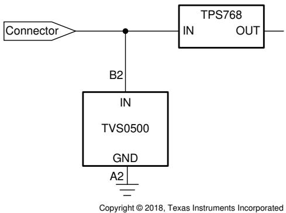  
Figure 10. TVS0500 Application Schematic

# 9.2.1 Design Requirements

A typical operation for the TVS0500 would be protecting a nominal $\boldsymbol { 5 } \lor$ input to an LDO similar to Figure 10. In this example, the TVS0500 is protecting the input to a TPS768, a standard 1 A LDO with an input voltage range of $2 . 7 \mathrm { ~ V ~ }$ to $ 1 0 ~ \mathsf { V }$ . Without any input protection, if a surge event is caused by lightning, coupling, ringing, or any other fault condition this input voltage will rise to hundreds of volts for multiple microseconds, violating the absolute maximum input voltage and harming the device. An ideal surge protection diode will maximize the useable voltage range while still clamping at a safe level for the system, TI's Flat-Clamp technology provides the best protection solution.

# 9.2.2 Detailed Design Procedure

If the TVS0500 is in place to protect the device, during a surge event the voltage will rise to the breakdown of the diode at $7 . 9 \ V$ , and then the TVS0500 will turn on, shunting the surge current to ground. With the low dynamic resistance of the TVS0500, large amounts of surge current will have minimal impact on the clamping voltage. The dynamic resistance of the TVS0500 is around $3 0 \ m \Omega$ , which means 30 A of surge current will cause a voltage raise of $3 0 \mathrm { ~ A ~ } \times 3 0 \mathrm { ~ m } \Omega = 0 . 9 \mathrm { ~ l ~ }$ V. Because the device turns on at $7 . 9 \ V$ , this means the LDO input will be exposed to a maximum of $7 . 9 ~ \lor \mathrm { ~ + ~ } 0 . 9 ~ \lor \mathrm { ~ = ~ } 8 . 8 ~ \lor$ during surge pulses, well within the absolute maximum input voltage. This ensures robust protection of your circuit.

The small size of the device also improves fault protection by lowering the effect of fault current coupling onto neighboring traces. The small form factor of the TVS0500 allows the device to be placed extremely close to the input connector, lowering the length of the path fault current will take through the system compared to larger protection solutions.

Finally, the low leakage of the TVS0500 will have low input power losses. At $\boldsymbol { 5 } \lor$ , the device will see typical 70 pA leakage for a constant power dissipation of less than 1 nW, a negligible quantity that will not effect overall efficiency metrics or add heating concerns.

# Typical Application (continued)

# 9.2.3 Configuration Options

The TVS0500 can be used in either unidirectional or bidirectional configuration. Figure 10 shows unidirectional usage to protect an input. By placing two TVS0500's in series with reverse orientation, bidirectional operation can be used, allowing a working voltage of ±5 V. TVS0500 operation in bidirectional will be similar to unidirectional operation, with a minor increase in breakdown voltage and clamping voltage. The TVS3300 bidirectional performance has been characterized in the TVS3300 Configurations Characterization. While the TVS0500 in bidirectional configuration has not specifically been characterized, it will have similar relative changes to the TVS3300 in bidirectional configuration.

# 10 Power Supply Recommendations

The TVS0500 is a clamping device so there is no need to power it. To ensure the device functions properly do not violate the recommended $\mathsf { V } _ { \mathsf { I N } }$ voltage range (0 V to $5 \lor$ ) .

# 11 Layout

# 11.1 Layout Guidelines

The optimum placement is close to the connector. EMI during an ESD event can couple from the trace being struck to other nearby unprotected traces, resulting in early system failures. The PCB designer must minimize the possibility of EMI coupling by keeping any unprotected traces away from the protected traces which are between the TVS and the connector.

Route the protected traces straight.

Eliminate any sharp corners on the protected traces between the TVS0500 and the connector by using rounded corners with the largest radii possible. Electric fields tend to build up on corners, increasing EMI coupling.

# 11.2 Layout Example

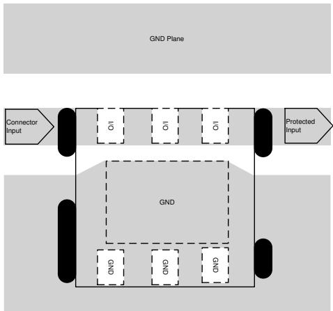  
Figure 11. TVS0500 Layout

# 12 Device and Documentation Support

# 12.1 Receiving Notification of Documentation Updates

To receive notification of documentation updates, navigate to the device product folder on ti.com. In the upper right corner, click on Alert me to register and receive a weekly digest of any product information that has changed. For change details, review the revision history included in any revised document.

# 12.2 Community Resources

TI E2E™ support forums are an engineer's go-to source for fast, verified answers and design help — straight from the experts. Search existing answers or ask your own question to get the quick design help you need.

Linked content is provided "AS IS" by the respective contributors. They do not constitute TI specifications and do not necessarily reflect TI's views; see TI's Terms of Use.

# 12.3 Trademarks

E2E is a trademark of Texas Instruments.

# 12.4 Electrostatic Discharge Caution

This integrated circuit can be damaged by ESD. Texas Instruments recommends that all integrated circuits be handled with appropriate precautions. Failure to observe proper handling and installation procedures can cause damage.

ESD damage can range from subtle performance degradation to complete device failure. Precision integrated circuits may be more susceptible to damage because very small parametric changes could cause the device not to meet its published specifications.

# 12.5 Glossary

SLYZ022 — TI Glossary.

This glossary lists and explains terms, acronyms, and definitions.

# 13 Mechanical, Packaging, and Orderable Information

The following pages include mechanical, packaging, and orderable information. This information is the most current data available for the designated devices. This data is subject to change without notice and revision of this document. For browser-based versions of this data sheet, refer to the left-hand navigation.

# PACKAGING INFORMATION

<table><tr><td>Orderable part number</td><td>Status (1)</td><td>Material type (2)</td><td>Package | Pins</td><td>Package qty | Carrier</td><td>RoHS (3)</td><td>Lead finish/ a Bal material</td><td>MSL rating/ e k reflow</td><td>Op temp ()</td><td>Part marking (6)</td></tr><tr><td>TVS0500DRVR</td><td>Active</td><td>Production</td><td>WSON (DRV) | 6</td><td>3000 | LARGE T&amp;R</td><td>Yes</td><td>(4) NIPDAU</td><td>(5) Level-1-260C-UNLIM</td><td>-40 to 125</td><td>1HRH</td></tr><tr><td>TVS0500DRVR.A</td><td>Active</td><td>Production</td><td>WSON (DRV) | 6</td><td>3000 | LARGE T&amp;R</td><td>Yes</td><td>NIPDAU</td><td>Level-1-260C-UNLIM</td><td>-40 to 125</td><td>1HRH</td></tr><tr><td>TVS0500DRVRG4</td><td>Active</td><td>Production</td><td>WSON (DRV) | 6</td><td>3000 | LARGE T&amp;R</td><td>Yes</td><td>NIPDAU</td><td>Level-1-260C-UNLIM</td><td>-40 to 125</td><td>1HRH</td></tr><tr><td>TVS0500DRVRG4.A</td><td>Active</td><td>Production</td><td>WSON (DRV) | 6</td><td>3000 | LARGE T&amp;R</td><td>Yes</td><td>NIPDAU</td><td>Level-1-260C-UNLIM</td><td>-40 to 125</td><td>1HRH</td></tr></table>

(1) Status: For more details on status, see our product life cycle.

(2) Material type: When designated, preproduction parts are prototypes/experimental devices, and are not yet approved or released for full production. Testing and final process, including without limitation quality assurance, reliability performance testing, and/or process qualification, may not yet be complete, and this item is subject to further changes or possible discontinuation. If available for ordering, purchases will be subject to an additional waiver at checkout, and are intended for early internal evaluation purposes only. These items are sold without warranties of any kind.

(3) RoHS values: Yes, No, RoHS Exempt. See the TI RoHS Statement for additional information and value definition.

Parts may have multiple material finish options. Finish options are separated by a vertical ruled line. Lead finish/Ball material values may wrap to two lines if the finish value exceeds the maximum (5) MSL rating/Peak reflow: The moisture sensitivity level ratings and peak solder (reflow) temperatures. In the event that a part has multiple moisture sensitivity ratings, only the lowest level per JEDEC standards is shown.Refer to the shipping label for the actual reflow temperature that will be used to mount the part to the printed circuit board.

(6) Part marking: There may be an additional marking, which relates to the logo, the lot trace code information, or the environmental category of the part.

Multiple part markings will be inside parentheses. Only one part marking contained in parentheses and separated by a "\~" will appear on a part. If a line is indented then it is a continuation of the previous line and the two combined represent the entire part marking for that device.

Important Information and Disclaimer:The information provided on this page represents TI's knowledge and belief as of the date that it is provided. TI bases its knowledge and belief on information provided by third parties, and makes no representation or warranty as to the accuracy of such information. Efforts are underway to better integrate information from third parties. TI has taken and continues to take reasonable steps to provide representative and accurate information but may not have conducted destructive testing or chemical analysis on incoming materials and chemicals. TI and TI suppliers consider certain information to be proprietary, and thus CAS numbers and other limited information may not be available for release.

n no event shall TI's liability arising out of such information exceed the total purchase price of the TI part(s) at issue in this document sold by TI to Customer on an annual basis.

# TAPE AND REEL INFORMATION

<table><tr><td rowspan=1 colspan=1>A0</td><td rowspan=1 colspan=1>A0 Dimension designed to accommodate the component width</td></tr><tr><td rowspan=1 colspan=1>B0</td><td rowspan=1 colspan=1>Dimension designed to accommodate the component length</td></tr><tr><td rowspan=1 colspan=1>K0</td><td rowspan=1 colspan=1>Dimension designed to accommodate the component thickness</td></tr><tr><td rowspan=1 colspan=1>W</td><td rowspan=1 colspan=1>Overall width of the carrier tape</td></tr><tr><td rowspan=1 colspan=1>P1</td><td rowspan=1 colspan=1>Pitch between successive cavity centers</td></tr></table>

# QUADRANT ASSIGNMENTS FOR PIN 1 ORIENTATION IN TAPE

\*All dimensions are nominal   

<table><tr><td rowspan=1 colspan=1>Device</td><td rowspan=1 colspan=1>PackageType</td><td rowspan=1 colspan=1>PackageDrawing</td><td rowspan=1 colspan=1>Pins</td><td rowspan=1 colspan=1>SPQ</td><td rowspan=1 colspan=1>ReelDiameter(mm)</td><td rowspan=1 colspan=1>ReelWidthW1 (mm)</td><td rowspan=1 colspan=1>A0(mm)</td><td rowspan=1 colspan=1>B0(mm)</td><td rowspan=1 colspan=1>KO(mm)</td><td rowspan=1 colspan=1>P1(mm)</td><td rowspan=1 colspan=1>W(mm)</td><td rowspan=1 colspan=1>Pin1Quadrant</td></tr><tr><td rowspan=1 colspan=1>TVS0500DRVR</td><td rowspan=1 colspan=1>WSON</td><td rowspan=1 colspan=1>DRV</td><td rowspan=1 colspan=1>6</td><td rowspan=1 colspan=1>3000</td><td rowspan=1 colspan=1>180.0</td><td rowspan=1 colspan=1>8.4</td><td rowspan=1 colspan=1>2.3</td><td rowspan=1 colspan=1>2.3</td><td rowspan=1 colspan=1>1.15</td><td rowspan=1 colspan=1>4.0</td><td rowspan=1 colspan=1>8.0</td><td rowspan=1 colspan=1>Q2</td></tr><tr><td rowspan=1 colspan=1>TVS0500DRVRG4</td><td rowspan=1 colspan=1>WSON</td><td rowspan=1 colspan=1>DRV</td><td rowspan=1 colspan=1>6</td><td rowspan=1 colspan=1>3000</td><td rowspan=1 colspan=1>180.0</td><td rowspan=1 colspan=1>8.4</td><td rowspan=1 colspan=1>2.3</td><td rowspan=1 colspan=1>2.3</td><td rowspan=1 colspan=1>1.15</td><td rowspan=1 colspan=1>4.0</td><td rowspan=1 colspan=1>8.0</td><td rowspan=1 colspan=1>Q2</td></tr></table>

\*All dimensions are nominal   

<table><tr><td rowspan=1 colspan=1>Device</td><td rowspan=1 colspan=1>Package Type</td><td rowspan=1 colspan=1>Package Drawing</td><td rowspan=1 colspan=1>Pins</td><td rowspan=1 colspan=1>SPQ</td><td rowspan=1 colspan=1>Length (mm)</td><td rowspan=1 colspan=1>Width (mm)</td><td rowspan=1 colspan=1>Height (mm)</td></tr><tr><td rowspan=1 colspan=1>TVS0500DRVR</td><td rowspan=1 colspan=1>WSON</td><td rowspan=1 colspan=1>DRV</td><td rowspan=1 colspan=1>6</td><td rowspan=1 colspan=1>3000</td><td rowspan=1 colspan=1>210.0</td><td rowspan=1 colspan=1>185.0</td><td rowspan=1 colspan=1>35.0</td></tr><tr><td rowspan=1 colspan=1>TVS0500DRVRG4</td><td rowspan=1 colspan=1>WSON</td><td rowspan=1 colspan=1>DRV</td><td rowspan=1 colspan=1>6</td><td rowspan=1 colspan=1>3000</td><td rowspan=1 colspan=1>210.0</td><td rowspan=1 colspan=1>185.0</td><td rowspan=1 colspan=1>35.0</td></tr></table>

PLASTIC SMALL OUTLINE - NO LEAD

PLASTIC SMALL OUTLINE - NO LEAD

4222173/B 04/2018

NOTES:

1. All linear dimensions are in millimeters. Any dimensions in parenthesis are for reference only. Dimensioning and tolerancing per ASME Y14.5M.   
2. This drawing is subject to change without notice.   
3. The package thermal pad must be soldered to the printed circuit board for thermal and mechanical performance.

PLASTIC SMALL OUTLINE - NO LEAD

  
NOTES: (continued)

4. This package is designed to be soldered to a thermal pad on the board. For more information, see Texas Instruments literature number SLUA271 (www.ti.com/lit/slua271). 5. Vias are optional depending on application, refer to device data sheet. If some or all are implemented, recommended via locations are show

PLASTIC SMALL OUTLINE - NO LEAD

SOLDER PASTE EXAMPLE BASED ON 0.125 mm THICK STENCIL

EXPOSED PAD #7 $8 8 \%$ PRINTED SOLDER COVERAGE BY AREA UNDER PACKAGE SCALE:30X

6. Laser cutting apertures with trapezoidal walls and rounded corners may offer better paste release. IPC-7525 may have alternate design recommendations.

# IMPORTANT NOTICE AND DISCLAIMER

TI PROVIDES TECHNICAL AND RELIABILITY DATA (INCLUDING DATASHEETS), DESIGN RESOURCES (INCLUDING REFERENCE DESIGNS), APPLICATION OR OTHER DESIGN ADVICE, WEB TOOLS, SAFETY INFORMATION, AND OTHER RESOURCES “AS IS” AND WITH ALL FAULTS, AND DISCLAIMS ALL WARRANTIES, EXPRESS AND IMPLIED, INCLUDING WITHOUT LIMITATION ANY IMPLIED WARRANTIES OF MERCHANTABILITY, FITNESS FOR A PARTICULAR PURPOSE OR NON-INFRINGEMENT OF THIRD PARTY INTELLECTUAL PROPERTY RIGHTS.

These resources are intended for skilled developers designing with TI products. You are solely responsible for (1) selecting the appropriate TI products for your application, (2) designing, validating and testing your application, and (3) ensuring your application meets applicable standards, and any other safety, security, regulatory or other requirements.

These resources are subject to change without notice. TI grants you permission to use these resources only for development of an application that uses the TI products described in the resource. Other reproduction and display of these resources is prohibited. No license is granted to any other TI intellectual property right or to any third party intellectual property right. TI disclaims responsibility for, and you fully indemnify TI and its representatives against any claims, damages, costs, losses, and liabilities arising out of your use of these resources.

TI’s products are provided subject to TI’s Terms of Sale, TI’s General Quality Guidelines, or other applicable terms available either on ti.com or provided in conjunction with such TI products. TI’s provision of these resources does not expand or otherwise alter TI’s applicable warranties or warranty disclaimers for TI products. Unless TI explicitly designates a product as custom or customer-specified, TI products are standard, catalog, general purpose devices.

TI objects to and rejects any additional or different terms you may propose.