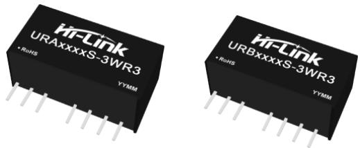
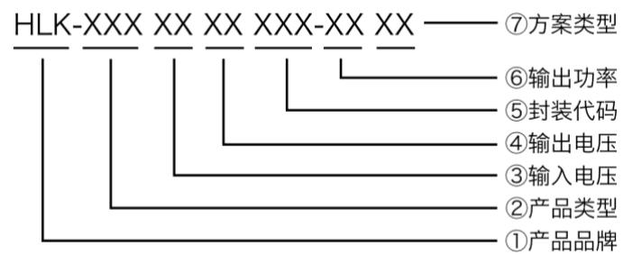
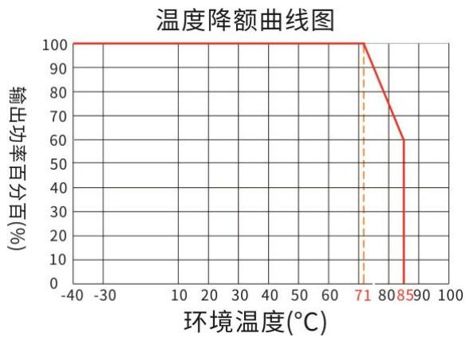
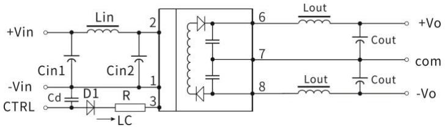
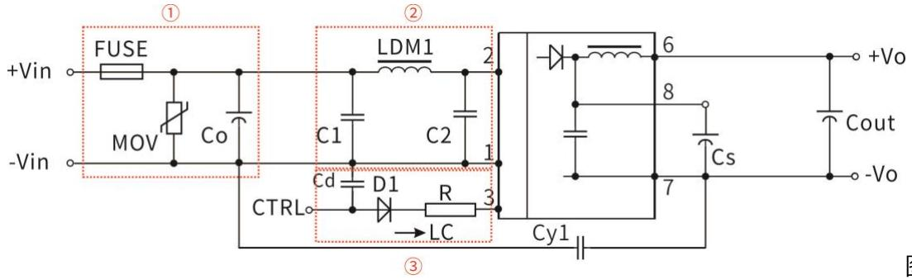
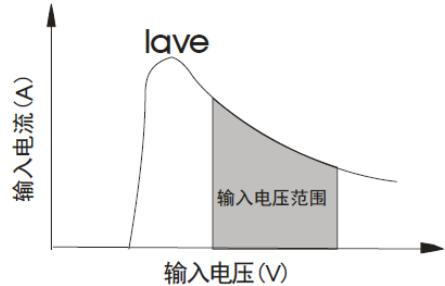
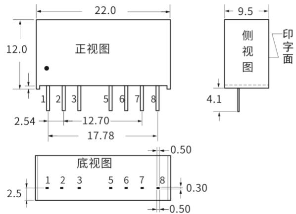
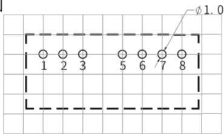
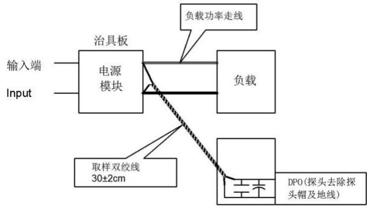

# 典型性能

超小型 SIP封装

宽输入电压范围：4:1

工作温度范围： $- 4 0 ^ { \circ } \mathsf { C } \sim + 8 5 ^ { \circ } \mathsf { C }$

隔离电压1500VDC

低纹波噪声

短路保护(自恢复)

效率：最高效率高达 $8 1 \%$

# 3W，宽电压输入，隔离稳压正负双路/

单路输出，DC/DC模块电源

# 隔离稳压输出/RoHS

URA_S-3WR3/URB_S-3WR3系列产品是4:1输入，隔离稳压输出3W。该产品为 SIP-8的引脚封装，较高的效率，满足- $4 0 ^ { \circ } C { \sim } { + } 8 5 ^ { \circ } C$ 工作温度，具有输入欠压保护，输出过流和可持续短路保护功能。可广泛应用于工控、电力、仪器仪表、通信等领域。

  
产品编码规则

产品选型表  

<table><tr><td rowspan=2 colspan=1>认证</td><td rowspan=2 colspan=1>产品型号①</td><td rowspan=1 colspan=3>输入电压范围(Vdc)</td><td rowspan=1 colspan=2>输出电压/电流</td><td rowspan=1 colspan=1>纹波与噪声</td><td rowspan=1 colspan=1>效率@满载</td><td rowspan=1 colspan=1>最大容性</td></tr><tr><td rowspan=1 colspan=3>标称值(范围值）</td><td rowspan=1 colspan=1>输出电压(Vdc)</td><td rowspan=1 colspan=1>输出电流（mA）(Max.Min.)</td><td rowspan=1 colspan=1>满载（mVp-p)Typ./Max.</td><td rowspan=1 colspan=1>%（Min./Typ.)</td><td rowspan=1 colspan=1>uF</td></tr><tr><td rowspan=1 colspan=1></td><td rowspan=1 colspan=1>URB1203S-3WR3</td><td rowspan=10 colspan=3>12.0(4.5~18.0)</td><td rowspan=1 colspan=1>3.3</td><td rowspan=1 colspan=1>909</td><td rowspan=1 colspan=1>50/100</td><td rowspan=1 colspan=1>72/74</td><td rowspan=1 colspan=1>2200</td></tr><tr><td rowspan=1 colspan=1></td><td rowspan=1 colspan=1>URB1205S-3WR3</td><td rowspan=1 colspan=1>5</td><td rowspan=1 colspan=1>600</td><td rowspan=1 colspan=1>50/100</td><td rowspan=1 colspan=1>76/78</td><td rowspan=1 colspan=1>2200</td></tr><tr><td rowspan=1 colspan=1></td><td rowspan=1 colspan=1>URB1212S-3WR3</td><td rowspan=1 colspan=1>12</td><td rowspan=1 colspan=1>250</td><td rowspan=1 colspan=1>50/100</td><td rowspan=1 colspan=1>78/80</td><td rowspan=1 colspan=1>680</td></tr><tr><td rowspan=1 colspan=1></td><td rowspan=1 colspan=1>URB1215S-3WR3</td><td rowspan=1 colspan=1>15</td><td rowspan=1 colspan=1>200</td><td rowspan=1 colspan=1>50/100</td><td rowspan=1 colspan=1>78/80</td><td rowspan=1 colspan=1>470</td></tr><tr><td rowspan=1 colspan=1></td><td rowspan=1 colspan=1>URB1224S-3WR3</td><td rowspan=1 colspan=1>24</td><td rowspan=1 colspan=1>125</td><td rowspan=1 colspan=1>50/100</td><td rowspan=1 colspan=1>78/80</td><td rowspan=1 colspan=1>330</td></tr><tr><td rowspan=1 colspan=1></td><td rowspan=1 colspan=1>URA1205S-3WR3</td><td rowspan=1 colspan=1>±5</td><td rowspan=1 colspan=1>±300</td><td rowspan=1 colspan=1>50/100</td><td rowspan=1 colspan=1>76/78</td><td rowspan=1 colspan=1>1000</td></tr><tr><td rowspan=2 colspan=1></td><td rowspan=2 colspan=1>URA1212S-3WR3</td><td rowspan=2 colspan=2></td><td rowspan=2 colspan=1>±12</td><td rowspan=2 colspan=1>±125</td><td rowspan=2 colspan=1>50/100</td><td rowspan=2 colspan=1>78/80</td><td rowspan=2 colspan=1>470</td></tr><tr><td rowspan=1 colspan=1></td></tr><tr><td rowspan=1 colspan=1></td><td rowspan=1 colspan=1>URA1215S-3WR3</td><td rowspan=1 colspan=1>±15</td><td rowspan=1 colspan=1>±100</td><td rowspan=1 colspan=1>50/100</td><td rowspan=1 colspan=1>78/80</td><td rowspan=1 colspan=1>220</td></tr><tr><td rowspan=1 colspan=1></td><td rowspan=1 colspan=1>URA1224S-3WR3</td><td rowspan=1 colspan=1>±24</td><td rowspan=1 colspan=1>±62</td><td rowspan=1 colspan=1>50/100</td><td rowspan=1 colspan=1>78/80</td><td rowspan=1 colspan=1>100</td></tr><tr><td rowspan=1 colspan=1></td><td rowspan=1 colspan=1>URB2403S-3WR3</td><td rowspan=4 colspan=3>24.0(9.0~36.0)</td><td rowspan=1 colspan=1>3.3</td><td rowspan=1 colspan=1>909</td><td rowspan=1 colspan=1>50/100</td><td rowspan=1 colspan=1>73/75</td><td rowspan=1 colspan=1>2200</td></tr><tr><td rowspan=1 colspan=1></td><td rowspan=1 colspan=1>URB2405S-3WR3</td><td rowspan=1 colspan=1>5</td><td rowspan=1 colspan=1>600</td><td rowspan=1 colspan=1>50/100</td><td rowspan=1 colspan=1>78/80</td><td rowspan=1 colspan=1>2200</td></tr><tr><td rowspan=1 colspan=1></td><td rowspan=1 colspan=1>URB2412S-3WR3</td><td rowspan=1 colspan=1>12</td><td rowspan=1 colspan=1>250</td><td rowspan=1 colspan=1>50/100</td><td rowspan=1 colspan=1>79/81</td><td rowspan=1 colspan=1>680</td></tr><tr><td rowspan=1 colspan=1></td><td rowspan=1 colspan=1>URB2415S-3WR3</td><td rowspan=1 colspan=1>15</td><td rowspan=1 colspan=1>200</td><td rowspan=1 colspan=1>50/100</td><td rowspan=1 colspan=1>79/81</td><td rowspan=1 colspan=1>470</td></tr></table>

# DC/DC 隔离电源模块

版本：2021-4 A/0

<table><tr><td rowspan=1 colspan=1>URB2424S-3WR3</td><td rowspan=2 colspan=5></td><td rowspan=1 colspan=1>24</td><td rowspan=1 colspan=1>125</td><td rowspan=1 colspan=1>50/100</td><td rowspan=1 colspan=1>79/81</td><td rowspan=1 colspan=1>330</td></tr><tr><td rowspan=1 colspan=1>URA2405S-3WR3</td><td rowspan=1 colspan=1>±5</td><td rowspan=1 colspan=1>±300</td><td rowspan=1 colspan=1>50/100</td><td rowspan=1 colspan=1>77/79</td><td rowspan=1 colspan=1>1000</td></tr><tr><td rowspan=2 colspan=1>URA2412S-3WR3</td><td rowspan=2 colspan=3></td><td rowspan=1 colspan=2></td><td rowspan=2 colspan=1></td><td rowspan=2 colspan=1>±12</td><td rowspan=2 colspan=1>±125</td><td rowspan=2 colspan=1>50/100</td><td rowspan=2 colspan=1>78/80</td></tr><tr><td rowspan=1 colspan=2></td><td></td></tr><tr><td rowspan=1 colspan=1>URA2415S-3WR3</td><td rowspan=2 colspan=5></td><td rowspan=1 colspan=1></td><td rowspan=1 colspan=1>±15</td><td rowspan=1 colspan=1>±100</td><td rowspan=1 colspan=1>50/100</td><td rowspan=1 colspan=1>79/81</td></tr><tr><td rowspan=1 colspan=1>URA2424S-3WR3</td><td rowspan=1 colspan=1>±24</td><td rowspan=1 colspan=1>±62</td><td rowspan=1 colspan=1>50/100</td><td rowspan=1 colspan=1>79/81</td><td rowspan=1 colspan=1>100</td></tr><tr><td rowspan=1 colspan=1>URB4803S-3WR3</td><td rowspan=3 colspan=5></td><td rowspan=1 colspan=1>3.3</td><td rowspan=1 colspan=1>909</td><td rowspan=1 colspan=1>50/100</td><td rowspan=1 colspan=1>72/74</td><td rowspan=1 colspan=1>2200</td></tr><tr><td rowspan=2 colspan=1>URB4805S-3WR3</td><td rowspan=2 colspan=1></td><td rowspan=1 colspan=3></td><td rowspan=2 colspan=1></td><td rowspan=2 colspan=1>5</td><td rowspan=2 colspan=1>600</td><td rowspan=2 colspan=1>50/100</td><td rowspan=2 colspan=1>76/78</td><td rowspan=2 colspan=1>2200</td></tr><tr><td rowspan=1 colspan=3></td></tr><tr><td rowspan=1 colspan=1>URB4812S-3WR3</td><td rowspan=1 colspan=1></td><td rowspan=2 colspan=4>48.0</td><td rowspan=1 colspan=1></td><td rowspan=1 colspan=1>12</td><td rowspan=1 colspan=1>250</td><td rowspan=1 colspan=1>50/100</td><td rowspan=1 colspan=1>78/80</td></tr><tr><td rowspan=1 colspan=1>URB4815S-3WR3</td><td rowspan=1 colspan=1></td><td rowspan=1 colspan=1></td><td rowspan=1 colspan=1>15</td><td rowspan=1 colspan=1>200</td><td rowspan=1 colspan=1>50/100</td><td rowspan=1 colspan=1>78/80</td><td rowspan=1 colspan=1>470</td></tr><tr><td rowspan=1 colspan=1>URB4824S-3WR3</td><td rowspan=1 colspan=5>(18.0~75.0)</td><td rowspan=1 colspan=1>24</td><td rowspan=1 colspan=1>125</td><td rowspan=1 colspan=1>50/100</td><td rowspan=1 colspan=1>78/80</td><td rowspan=1 colspan=1>330</td></tr><tr><td rowspan=1 colspan=1>URA4805S-3WR3</td><td rowspan=4 colspan=5></td><td rowspan=1 colspan=1>±5</td><td rowspan=1 colspan=1>±300</td><td rowspan=1 colspan=1>50/100</td><td rowspan=1 colspan=1>76/78</td><td rowspan=1 colspan=1>1000</td></tr><tr><td rowspan=1 colspan=1>URA4812S-3WR3</td><td rowspan=1 colspan=1>±12</td><td rowspan=1 colspan=1>±125</td><td rowspan=1 colspan=1>50/100</td><td rowspan=1 colspan=1>78/80</td><td rowspan=1 colspan=1>470</td></tr><tr><td rowspan=1 colspan=1>URA4815S-3WR3</td><td rowspan=1 colspan=1>±15</td><td rowspan=1 colspan=1>±100</td><td rowspan=1 colspan=1>50/100</td><td rowspan=1 colspan=1>78/80</td><td rowspan=1 colspan=1>220</td></tr><tr><td rowspan=1 colspan=1>URA4824S-3WR3</td><td rowspan=1 colspan=1>±24</td><td rowspan=1 colspan=1>±62</td><td rowspan=1 colspan=1>50/100</td><td rowspan=1 colspan=1>78/80</td><td rowspan=1 colspan=1>100</td></tr></table>

主：1、因篇幅有限，以上只是典型产品列表，若需列表以外产品，请与本公司销售部联系。2、最大容性负载表示 $+ \mathsf { V } 0$ 或-Vo可接的最大电容性负载，若超过该值，产品将无法正常启动。

测试条件：如无特殊指定，所有参数测试均在标称输入电压、纯阻性额定负载及25℃室温环境下测得。  

<table><tr><td rowspan=1 colspan=6>输入特性</td></tr><tr><td rowspan=1 colspan=1>项目</td><td rowspan=1 colspan=1>工作条件</td><td rowspan=1 colspan=1>Min.</td><td rowspan=1 colspan=1>Typ.</td><td rowspan=1 colspan=1>Max.</td><td rowspan=1 colspan=1>单位</td></tr><tr><td rowspan=3 colspan=1>输入电压范围</td><td rowspan=1 colspan=1>12VDC输入系列</td><td rowspan=1 colspan=1>4.5</td><td rowspan=1 colspan=1>12</td><td rowspan=1 colspan=1>18</td><td rowspan=3 colspan=1>VDC</td></tr><tr><td rowspan=1 colspan=1>24VDC输入系列</td><td rowspan=1 colspan=1>9</td><td rowspan=1 colspan=1>24</td><td rowspan=1 colspan=1>36</td></tr><tr><td rowspan=1 colspan=1>48VDC输入系列</td><td rowspan=1 colspan=1>18</td><td rowspan=1 colspan=1>48</td><td rowspan=1 colspan=1>75</td></tr><tr><td rowspan=3 colspan=1>输入电流 (满载/空载）</td><td rowspan=1 colspan=1>12VDC输入系列</td><td rowspan=1 colspan=1>1</td><td rowspan=1 colspan=1>320/15</td><td rowspan=1 colspan=1>328/30</td><td rowspan=3 colspan=1>mA</td></tr><tr><td rowspan=1 colspan=1>24VDC输入系列</td><td rowspan=1 colspan=1>1</td><td rowspan=1 colspan=1>160/6</td><td rowspan=1 colspan=1>164/10</td></tr><tr><td rowspan=1 colspan=1>48VDC输入系列</td><td rowspan=1 colspan=1></td><td rowspan=1 colspan=1>80/4</td><td rowspan=1 colspan=1>82/6</td></tr><tr><td rowspan=3 colspan=1>反射纹波电流</td><td rowspan=1 colspan=1>12VDC输入系列</td><td rowspan=1 colspan=1></td><td rowspan=1 colspan=1>40</td><td rowspan=1 colspan=1>-</td><td rowspan=3 colspan=1>mA</td></tr><tr><td rowspan=1 colspan=1>24VDC输入系列</td><td rowspan=1 colspan=1></td><td rowspan=1 colspan=1>55</td><td rowspan=1 colspan=1>1</td></tr><tr><td rowspan=1 colspan=1>48VDC输入系列</td><td rowspan=1 colspan=1></td><td rowspan=1 colspan=1>45</td><td rowspan=1 colspan=1>-</td></tr><tr><td rowspan=4 colspan=1>冲击电压(1sec.max.)</td><td rowspan=1 colspan=1>5VDC输入系列</td><td rowspan=1 colspan=1>-0.7</td><td rowspan=1 colspan=1>-</td><td rowspan=1 colspan=1>12</td><td rowspan=1 colspan=1></td></tr><tr><td rowspan=1 colspan=1>12VDC输入系列</td><td rowspan=1 colspan=1>-0.7</td><td rowspan=1 colspan=1>1</td><td rowspan=1 colspan=1>25</td><td rowspan=7 colspan=1>VDC</td></tr><tr><td rowspan=1 colspan=1>24VDC输入系列</td><td rowspan=1 colspan=1>-0.7</td><td rowspan=1 colspan=1>1</td><td rowspan=1 colspan=1>50</td></tr><tr><td rowspan=1 colspan=1>24VDC输入系列</td><td rowspan=1 colspan=1>-0.7</td><td rowspan=1 colspan=1>1</td><td rowspan=1 colspan=1>100</td></tr><tr><td rowspan=4 colspan=1>启动电压</td><td rowspan=1 colspan=1>5VDC标称输入系列，标称输入电压</td><td rowspan=1 colspan=1>-</td><td rowspan=1 colspan=1>1</td><td rowspan=1 colspan=1>4.5</td></tr><tr><td rowspan=1 colspan=1>12VDC标称输入系列，标称输入电压</td><td rowspan=1 colspan=1>1</td><td rowspan=1 colspan=1>1</td><td rowspan=1 colspan=1>9</td></tr><tr><td rowspan=1 colspan=1>24VDC标称输入系列，标称输入电压</td><td rowspan=1 colspan=1>1</td><td rowspan=1 colspan=1>1</td><td rowspan=1 colspan=1>18</td></tr><tr><td rowspan=1 colspan=1>48VDC标称输入系列，标称输入电压</td><td rowspan=1 colspan=1></td><td rowspan=1 colspan=1>1</td><td rowspan=1 colspan=1>36</td></tr><tr><td rowspan=1 colspan=1>输入滤波器类型</td><td rowspan=1 colspan=1></td><td rowspan=1 colspan=4>电容滤波</td></tr><tr><td rowspan=1 colspan=1>热插拔</td><td rowspan=1 colspan=1></td><td rowspan=1 colspan=4>不支持</td></tr><tr><td rowspan=1 colspan=1>遥控脚(Ctrl)*</td><td rowspan=1 colspan=1>模块开启</td><td rowspan=1 colspan=4>Ctrl端悬空或高阻</td></tr></table>

# DC/DC 隔离电源模块

<table><tr><td></td><td>模块关断</td><td>接高电平（相对于输入地），使流入Ctrl 的电流为5-10mA</td></tr></table>

<table><tr><td rowspan=1 colspan=7>输出特性</td></tr><tr><td rowspan=1 colspan=1>项目</td><td rowspan=1 colspan=2>工作及测试条件</td><td rowspan=1 colspan=1>Min.</td><td rowspan=1 colspan=1>Typ.</td><td rowspan=1 colspan=1>Max.</td><td rowspan=1 colspan=1>单位</td></tr><tr><td rowspan=2 colspan=1>输出电压精度</td><td rowspan=2 colspan=1>5%~100%负载，输入电压范围</td><td rowspan=1 colspan=1>3.3V/5V输出</td><td rowspan=1 colspan=1>-</td><td rowspan=1 colspan=1>±3.0</td><td rowspan=1 colspan=1>±5.0</td><td rowspan=1 colspan=1>%</td></tr><tr><td rowspan=1 colspan=1>其他</td><td rowspan=1 colspan=1>1</td><td rowspan=1 colspan=1>±1.0</td><td rowspan=1 colspan=1>±3.0</td><td rowspan=1 colspan=1>%</td></tr><tr><td rowspan=1 colspan=1>空载输出电压精度</td><td rowspan=1 colspan=2>输入电压范围</td><td rowspan=1 colspan=1>1-</td><td rowspan=1 colspan=1>±1.5</td><td rowspan=1 colspan=1>±5.0</td><td rowspan=1 colspan=1>%</td></tr><tr><td rowspan=1 colspan=1>线性调整率</td><td rowspan=1 colspan=2>满载，输入电压从低电压到高电压</td><td rowspan=1 colspan=1>1</td><td rowspan=1 colspan=1>±0.2</td><td rowspan=1 colspan=1>±0.5</td><td rowspan=1 colspan=1>%</td></tr><tr><td rowspan=1 colspan=1>负载调整率</td><td rowspan=1 colspan=2>5%~100%负载</td><td rowspan=1 colspan=1>1</td><td rowspan=1 colspan=1>±0.4</td><td rowspan=1 colspan=1>±1.0</td><td rowspan=1 colspan=1>%</td></tr><tr><td rowspan=1 colspan=1>瞬态恢复时间</td><td rowspan=2 colspan=2>25%负载阶跃变化</td><td rowspan=1 colspan=1>1-</td><td rowspan=1 colspan=1>0.5</td><td rowspan=1 colspan=1>2</td><td rowspan=1 colspan=1>mS</td></tr><tr><td rowspan=1 colspan=1>瞬态响应偏</td><td rowspan=1 colspan=1>1-</td><td rowspan=1 colspan=1>±2.5</td><td rowspan=1 colspan=1>±5</td><td rowspan=1 colspan=1>%</td></tr><tr><td rowspan=1 colspan=1>纹波&amp;噪声</td><td rowspan=1 colspan=2>纯电阻负载，20MHz带宽，峰峰值</td><td rowspan=1 colspan=1></td><td rowspan=1 colspan=1>50</td><td rowspan=1 colspan=1>100</td><td rowspan=1 colspan=1>mVp-p</td></tr><tr><td rowspan=1 colspan=1>温度漂移系数</td><td rowspan=1 colspan=2>满载</td><td rowspan=1 colspan=1>--</td><td rowspan=1 colspan=1>±0.02</td><td rowspan=1 colspan=1>±0.03</td><td rowspan=1 colspan=1>%/℃</td></tr><tr><td rowspan=1 colspan=1>输出短路保护</td><td rowspan=1 colspan=2></td><td rowspan=1 colspan=4>可持续，自恢复</td></tr></table>

注:\*遥控脚（Ctrl）功能说明请参考本手册中之“典型应用参考电路”部分。  
注： $\textcircled{1}$ 纹波和噪声的测试方法双绞线测试法。

<table><tr><td rowspan=1 colspan=6>一般特性</td></tr><tr><td rowspan=1 colspan=1>项目</td><td rowspan=1 colspan=1>工作条件</td><td rowspan=1 colspan=1>Min.</td><td rowspan=1 colspan=1>Typ.</td><td rowspan=1 colspan=1>Max.</td><td rowspan=1 colspan=1>单位</td></tr><tr><td rowspan=1 colspan=1>绝缘电压</td><td rowspan=1 colspan=1>输入-输出，测试时间1分钟，漏电流小于1mA</td><td rowspan=1 colspan=1>1500</td><td rowspan=1 colspan=1>-</td><td rowspan=1 colspan=1>11</td><td rowspan=1 colspan=1>VDC</td></tr><tr><td rowspan=1 colspan=1>绝缘电阻</td><td rowspan=1 colspan=1>输入-输出，绝缘电压500VDC</td><td rowspan=1 colspan=1>1000</td><td rowspan=1 colspan=1>1</td><td rowspan=1 colspan=1>11</td><td rowspan=1 colspan=1>MΩ</td></tr><tr><td rowspan=1 colspan=1>隔离电容</td><td rowspan=1 colspan=1>输入-输出，100KHz/0.1V</td><td rowspan=1 colspan=1>-</td><td rowspan=1 colspan=1>120</td><td rowspan=1 colspan=1>1</td><td rowspan=1 colspan=1>pF</td></tr><tr><td rowspan=1 colspan=1>工作温度</td><td rowspan=1 colspan=1>使用参考温度降额曲线图</td><td rowspan=1 colspan=1>-40</td><td rowspan=1 colspan=1>-</td><td rowspan=1 colspan=1>+85</td><td rowspan=1 colspan=1></td></tr><tr><td rowspan=1 colspan=1>储存温度</td><td rowspan=1 colspan=1></td><td rowspan=1 colspan=1>-40</td><td rowspan=1 colspan=1>-</td><td rowspan=1 colspan=1>+125</td><td rowspan=1 colspan=1>℃</td></tr><tr><td rowspan=1 colspan=1>工作时外壳温升</td><td rowspan=1 colspan=1></td><td rowspan=1 colspan=1>-</td><td rowspan=1 colspan=1>25</td><td rowspan=1 colspan=1>-</td><td rowspan=1 colspan=1></td></tr><tr><td rowspan=1 colspan=1>储存湿度</td><td rowspan=1 colspan=1>无凝结</td><td rowspan=1 colspan=1>5</td><td rowspan=1 colspan=1>11</td><td rowspan=1 colspan=1>95</td><td rowspan=1 colspan=1>%RH</td></tr><tr><td rowspan=1 colspan=1>引脚耐焊接温度</td><td rowspan=1 colspan=1>焊点距离外壳1.5mm,10秒</td><td rowspan=1 colspan=1>11</td><td rowspan=1 colspan=1>-</td><td rowspan=1 colspan=1>+300</td><td rowspan=1 colspan=1>℃</td></tr><tr><td rowspan=1 colspan=1>开关频率</td><td rowspan=1 colspan=1>满载，标称电压输入</td><td rowspan=1 colspan=1>1-</td><td rowspan=1 colspan=1>300</td><td rowspan=1 colspan=1>1-</td><td rowspan=1 colspan=1>KHz</td></tr><tr><td rowspan=1 colspan=1>震动</td><td rowspan=1 colspan=1></td><td rowspan=1 colspan=4>10-55Hz,10G,30Min.alongX,YandZ</td></tr><tr><td rowspan=1 colspan=1>外壳材料</td><td rowspan=1 colspan=1></td><td rowspan=1 colspan=4>黑色阻燃耐热塑料 (UL94V-0)</td></tr><tr><td rowspan=1 colspan=1>平均无故障时间</td><td rowspan=1 colspan=1>MIL-HDBK-217F@25C</td><td rowspan=1 colspan=1>1000</td><td rowspan=1 colspan=1>1-</td><td rowspan=1 colspan=1>1-</td><td rowspan=1 colspan=1>KHrs</td></tr></table>

# 典型应用参考电路 (推荐参数)

# 1.典型应用电路：

所有该系列的DC/DC转换器在出厂前，都是按照（图2）推荐的测试电路进行测试的。

若要求进一步减小输入输出纹波，可将输入输出外接电容Cin1、Cs和Cout适当加大或选用串联等效阻抗值小的电容器，Cs用于降低纹波，若纹波已满足需求，则无需再添加Cs。但应选用合适的滤波电容值，若电容太大，很可能会造成启动问题。对于每一路输出，在确保安全可靠工作的条件下，其滤波电容的最大容值须小于最大容性负载。

单路

Lin N 3 6 +Vo   
+Vino 33 8 Cin1↑ Cin2 市cout   
cVin cd R 3 -Vo →LC

双路

  
图2

# 2.EMC典型应用电路

<table><tr><td rowspan=1 colspan=1>输入电压</td><td rowspan=1 colspan=1>5VDC&amp;12VDC</td><td rowspan=1 colspan=1>24VDC&amp;48VDC</td></tr><tr><td rowspan=1 colspan=1>Cin1</td><td rowspan=1 colspan=1>100uF/25V</td><td rowspan=1 colspan=1>10uF/100V</td></tr><tr><td rowspan=1 colspan=1>Cin2</td><td rowspan=1 colspan=1>47uF/25V</td><td rowspan=1 colspan=1>1uF/100V</td></tr><tr><td rowspan=1 colspan=1>Lin</td><td rowspan=1 colspan=2>4.7uH-12uH</td></tr><tr><td rowspan=1 colspan=1>Cs</td><td rowspan=1 colspan=2>10uF-22uF/50V</td></tr><tr><td rowspan=1 colspan=1>Cout</td><td rowspan=1 colspan=2>100uF/50V(Typ)</td></tr><tr><td rowspan=1 colspan=1>Lout</td><td rowspan=1 colspan=2>2.2uH-10uH</td></tr><tr><td rowspan=1 colspan=1>Cd</td><td rowspan=1 colspan=2>47nF/100V</td></tr></table>

  
图3

# DC/DC 隔离电源模块

该版权及产品最终解释权归深圳市海凌科电子有限公司所有

版本：2021-4 A/0

<table><tr><td rowspan=1 colspan=1>器件代号</td><td rowspan=1 colspan=1>5V输入产品</td><td rowspan=1 colspan=1>12V输入产品</td><td rowspan=1 colspan=1>24V输入产品</td><td rowspan=1 colspan=1>48V输入产品</td></tr><tr><td rowspan=1 colspan=1>FMSE保险丝</td><td rowspan=1 colspan=4>慢熔断保险丝，根据客户实际输入电流选择</td></tr><tr><td rowspan=1 colspan=1>MOV压敏电阻</td><td rowspan=1 colspan=1></td><td rowspan=1 colspan=1>14D390K</td><td rowspan=1 colspan=1>14D560K</td><td rowspan=1 colspan=1>14D101K</td></tr><tr><td rowspan=1 colspan=1>LDM1电感</td><td rowspan=1 colspan=1>12uH</td><td rowspan=1 colspan=1>12uH</td><td rowspan=1 colspan=1>12uH</td><td rowspan=1 colspan=1>12uH</td></tr><tr><td rowspan=1 colspan=1>Co电解电容</td><td rowspan=1 colspan=1>1000uF/16V</td><td rowspan=1 colspan=1>1000uF/25V</td><td rowspan=1 colspan=1>330uF/50V</td><td rowspan=1 colspan=1>330uF/100V</td></tr><tr><td rowspan=1 colspan=1>C1陶瓷电容</td><td rowspan=1 colspan=1>4.7uF/50V</td><td rowspan=1 colspan=1>4.7μF/50V</td><td rowspan=1 colspan=1>4.7uF/50V</td><td rowspan=1 colspan=1>4.7uF/100V</td></tr><tr><td rowspan=1 colspan=1>C2陶瓷电容</td><td rowspan=1 colspan=1>4.7uF/50V</td><td rowspan=1 colspan=1>4.7μF/50V</td><td rowspan=1 colspan=1>4.7uF/50V</td><td rowspan=1 colspan=1>4.7μF/100V</td></tr><tr><td rowspan=1 colspan=1>Cout陶瓷电容</td><td rowspan=1 colspan=4>参照图2中Cout参数</td></tr><tr><td rowspan=1 colspan=1>CY1安规电容</td><td rowspan=1 colspan=4>1nF/2KV</td></tr><tr><td rowspan=1 colspan=1>D1二极管</td><td rowspan=1 colspan=4>RB160M-60V/1A</td></tr><tr><td rowspan=1 colspan=1>R电阻</td><td rowspan=1 colspan=4>根据公式:R=(Vc-Vd-1.0)/Ic)-300Ω</td></tr><tr><td rowspan=1 colspan=1>Cd</td><td rowspan=1 colspan=4>47nF/100V</td></tr></table>

注：

$\textcircled{2}$ 图3中第 $\textcircled{1}$ 部分用于EMS测试；第 $\textcircled{2}$ 部分用于 EMI滤波，可依据需求选择；

$\textcircled { 2 } \textcircled { \vee } $ 为Ctrl端相对于输入地GND的电压，VD为D1的正向导通压降，IC为流入Ctrl端的电流，一般取 $5 { \cdot } 1 0 \mathsf { m } \mathsf { A } ,$ ，Ctrl端外围电路如图3- $\textcircled{3}$ ；

$\textcircled{3}$ 若图中元器件无附其参数说明，则此型号外围中不需要这个元器件。

3.Ctrl端

悬空或高阻时，模块正常输出；接高电平（相对于输入地）时，模块关断；注意流入该引脚的电流在5－10mA关宜，电流超过其最大值（一般为

$2 0 \mathsf { m A } )$ 会造成模块的永久性损坏。其中R值可按:

$$
R = \frac { V _ { C } - V _ { d } - 1 . 0 } { 1 { 0 } } - 3 0 0
$$

计算得到，详细参数参考“EMC典型应用电路”部分。

4.输入电流

当使用不稳定的电源供电时，请确保电源的输出电压波动范围和纹波电压并无超出模块本身的指标。输入电源的输出流必须足够应付该DC/DC模块的瞬时启动平均电流lave（见图5）。

一般 $\mathsf { V i n } { = } 5 \mathsf { V }$ 系列lave=1335mAVin $= 1 2 \mathsf { V }$ 系列lave=631mAVin $= 2 4 \lor$ 系列lave=312mA$V i n { = } 4 8 V$ 系列 $\mathsf { \Gamma } _ { \mathsf { a v e } = 1 5 9 \mathsf { m A } }$

  
图5

5.输出负载要求

使用时，模块输出最小负载不能小于额定负载的 $1 5 \text{‰}$ 以符合本技术手册的性能指标，请在输出端并联一个 $5 \%$ 的假负载，假负载一般为电阻，请注意电阻需降额使用。

# DC/DC 隔离电源模块

# 封装尺寸与引脚功能图

1)外观尺寸(单位：mm,公差: $\times \times \pm 0 . 2 5 ,$

# 2)引脚定义

<table><tr><td rowspan=1 colspan=1>引脚方式</td><td rowspan=1 colspan=1>1</td><td rowspan=1 colspan=1>2</td><td rowspan=1 colspan=1>3</td><td rowspan=1 colspan=1>4</td><td rowspan=1 colspan=1>5</td><td rowspan=1 colspan=1>6</td><td rowspan=1 colspan=1>7</td><td rowspan=1 colspan=1>8</td></tr><tr><td rowspan=2 colspan=1>单路</td><td rowspan=1 colspan=1>-Vin</td><td rowspan=1 colspan=1>+Vin</td><td rowspan=1 colspan=1>CTRL</td><td rowspan=1 colspan=1>NP</td><td rowspan=1 colspan=1>NC</td><td rowspan=1 colspan=1>+Vout</td><td rowspan=1 colspan=1>-Vout</td><td rowspan=1 colspan=1>CS</td></tr><tr><td rowspan=1 colspan=1>输入负</td><td rowspan=1 colspan=1>输入正</td><td rowspan=1 colspan=1>遥控端</td><td rowspan=1 colspan=1>空脚</td><td rowspan=1 colspan=1>无电气</td><td rowspan=1 colspan=1>输出正</td><td rowspan=1 colspan=1>输出负</td><td rowspan=1 colspan=1>外接电容</td></tr><tr><td rowspan=2 colspan=1>正负双路</td><td rowspan=1 colspan=1>-Vin</td><td rowspan=1 colspan=1>+Vin</td><td rowspan=1 colspan=1>CTRL</td><td rowspan=1 colspan=1>NP</td><td rowspan=1 colspan=1>NC</td><td rowspan=1 colspan=1>+Vout</td><td rowspan=1 colspan=1>COM</td><td rowspan=1 colspan=1>-Vout</td></tr><tr><td rowspan=1 colspan=1>输入负</td><td rowspan=1 colspan=1>输入正</td><td rowspan=1 colspan=1>遥控端</td><td rowspan=1 colspan=1>空脚</td><td rowspan=1 colspan=1>无电气</td><td rowspan=1 colspan=1>输出正</td><td rowspan=1 colspan=1>公共地</td><td rowspan=1 colspan=1>输出负</td></tr></table>

3)建议印刷版图

  
备注：栅格距离为：2. $5 4 * 2$ .54mm

\*注意：电源模块的各管脚定义如与选型手册不符，应以实物标签上的标注为准。

<table><tr><td colspan="3">封装描述</td></tr><tr><td>封装代号</td><td></td><td>LxWxH</td></tr><tr><td>E</td><td>22.0x9.5x12.0mm</td><td>0.866×0.374×0.472inch</td></tr></table>

# 测试应用参考

纹波&噪声测试： (双绞线法20MHZ带宽)

测试方法：

1、纹波噪声是利用12#双绞线连接，示波器带宽设置为20MHz，100M带宽探头，且在探头端上并联0.1uF聚丙烯电容和 4.7uF 高频低阻电解电容，示波器采样使用 Sample 取样模式。

2、输出纹波噪声测试示意图：

把电源输入端连接到输入电源,电源输出通过治具板连接到电子负载，测试单独用 $3 0 c m { \pm } 2 0 c m$ 取样线直接从电源输出端口取样。功率线根据输出电流的大小选取相应线径的带绝缘皮的导线。

# 应用注意事项

．建议在 $5 \%$ 以上负载使用，如果低于 $5 \%$ 负载，则产品的纹波指标可能超出规格，但是不影响产品的可靠性；

2．建议双路输出模块负载不平衡度： $\leqslant \pm 5 \%$ ，如果超出土 $5 \%$ ，不能保证产品性能均符合本手册中之所有性能指标，具体情况可直接与我司技术人员联系;

3．最大容性负载均在输入电压范围、满负载条件下测试;

．除特殊说明外，本手册所有指标都在 ${ \sf T a } = 2 5 ^ { \circ } \mathsf { C }$ ，湿度 ${ < } 7 5 \% \mathsf { R H }$ ，标称输入电压和输出额定负载时测得;

5．本手册所有指标测试方法均依据本公司企业标准;

6．我司可提供产品定制，具体需求可直接联系我司技术人员；

7．产品规格变更恕不另行通知。

# DC/DC 隔离电源模块

# 联系方式

# 深圳市海凌科电子有限公司

Shenzhen Hi-Link Electronic Co.， Ltd

地址：深圳市龙华区民治街道民乐社区星河WORLD二期E栋1705、1706、1709A  
官网：www.hlktech.com  
邮箱：info@hlktech.com  
电话：0755-2315 2658

# DC/DC 隔离电源模块

该版权及产品最终解释权归深圳市海凌科电子有限公司所有

版本：2021-4 A/0