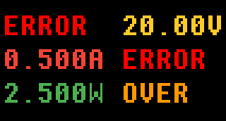

# GC9307 正常界面（UI 设计）

适用硬件：`tps-sw`。  
规范基线：`docs/plan/0001:gc9307-normal-ui/PLAN.md`（本文为**界面设计**与效果图，不替代规范基线）。

---

## 1. 设计目标

- “正常界面”仅展示两口的 V/A/W（无标题、无菜单、无交互）。
- 通过**绝对位置**（左/右两列）对应屏幕下方的 USB‑A / USB‑C(PD) 两接口。
- 采用**定宽字符格**，避免闪烁与布局跳动。

---

## 2. 版式（字符格）

### 2.1 行/列

- 3 行：Voltage / Current / Power
- 2 列：左=USB‑A，右=USB‑C(PD)

### 2.2 单元与整行宽度

- 单元宽度：6 字符（参见 Spec 的 `dddd.dU` / `--.--U` / `ERROR ` / `OVER  `）
- 行宽：13 字符 = `左(6) + 空格(1) + 右(6)`

---

## 3. 像素与渲染约束（用于 1:1 效果图）

本项目当前屏幕字符渲染方式为：

- 每个字符占一个“tile”：
  - `TILE_W=24px`, `TILE_H=48px`
  - 每行 13 个 tile（总宽 `312px`），共 3 行（总高 `144px`）
- 屏幕分辨率：`320×172`，居中放置：
  - `X_OFFSET=(320-312)/2=4px`
  - `Y_OFFSET=(172-144)/2=14px`
- 字形源：6×8
- 放大比例：`SX=3`, `SY=4` → 字形像素为 `18×32`，在 tile 内居中（上/下留黑边）
- 颜色：背景恒为黑；前景色按 `docs/plan/0001:gc9307-normal-ui/PLAN.md` 的 “需求（Requirements）/MUST/颜色”（1bpp：每个字符 tile 仅有前景/背景两色）

> 以上参数用于生成“与固件同渲染方式”的 1:1 像素效果图；实现阶段如更改渲染策略或配色，需要同步更新本文档的效果图。

---

## 4. 配色（已选定）

配色原则：Voltage 黄色系 / Current 红色系 / Power 绿色系；状态色固定（见 Spec §5.5）。

选定方案（Material 风格）：

- V：`#FFCA28`
- I：`#F44336`
- P：`#4CAF50`

### 4.1 1:1 像素效果图（320×172）

正常示例（覆盖三种量级格式）：

未插入：

错误/超量程：

---

## 5. 字符集需求（对实现的约束提醒）

为满足单位与状态文本，需要确保字形表至少包含：

- 单位：`V`、`A`、`W`
- 状态：`E`、`R`、`O`、`V`（用于 `ERROR` / `OVER`）
- 基础：数字 `0..9`、`.`、`-`、空格
