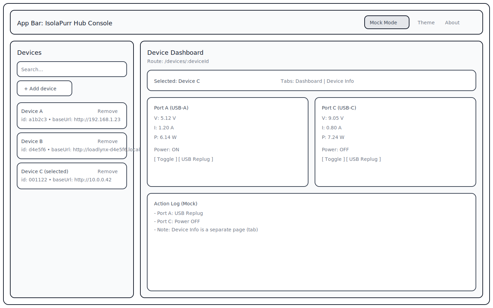
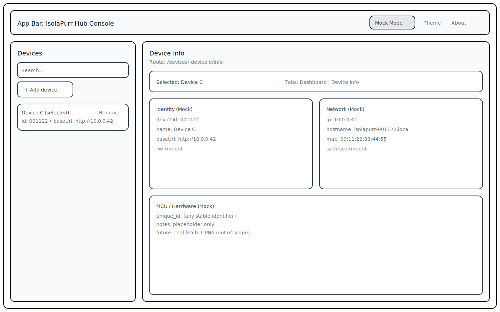
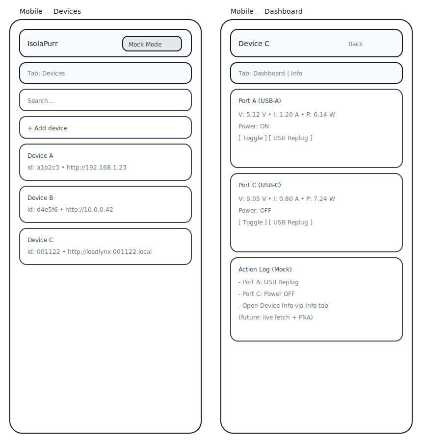

# GitHub Pages Web：双口遥测与控制台（Mock，多设备）（#0004）

## 状态

- Status: 待验收
- Created: 2026-01-10
- Last: 2026-01-10

## 背景 / 问题陈述

- 目标是提供一个部署在 GitHub Pages 上的 Web 界面，用于展示**两路端口**的电参量（电压/电流/功率）并提供端口操作（模拟“USB 重新插拔”与“电源开关”），同时支持“多设备”的基础交互骨架。
- “设备信息/硬件信息”（例如：可唯一标记设备的 ID、网络地址、MCU 信息等）属于次要功能，作为**独立页面**呈现，并从 Dashboard 提供入口进入即可。
- 当前仓库已包含 `web/`（Vite + React + TypeScript + Bun + Biome）与 Pages 部署工作流，但 Web 内容仍是默认模板，且缺少 DaisyUI / Storybook / 分层测试与完善的工程化基座。
- 本计划在**不要求立即具备真实设备功能**的前提下，把 Web 工程（UI 体系 + 测试 + 质量门槛 + CI/Pages）搭建到可持续迭代的状态，为后续接入真实设备数据做好结构准备。

## 目标 / 非目标

### Goals

- GitHub Pages 可用：推送到 `main` 后自动构建并部署，站点可稳定访问。
- 工程化基座就绪（对齐 `loadlynx` 的实践风格）：
  - UI：DaisyUI（基于 Tailwind CSS）基础样式可用；
  - 组件验收：Storybook 可运行并包含至少一组“端口遥测/端口操作”相关的 stories；
  - 测试分层：具备最小可跑通的 unit / storybook / e2e 测试管线；
  - 质量门槛：lint/typecheck/format 统一由 Biome + tsc 驱动，并纳入 CI；
  - Git hooks：在不拖慢日常开发的前提下，保证提交前的基本质量检查。
- Dashboard UI 骨架（Hello World 级别、可扩展）：
  - 每台设备的 Dashboard 展示 **2 个端口卡片**（Port A / Port C 或 Port 1 / Port 2）；
  - 每个端口卡片包含：电压/电流/功率（Mock）+ 两个动作（Mock）：
    - “USB Replug”（模拟重新插拔：短暂 busy/禁用态 + toast 文案）
    - “Power”（模拟电源开关：toggle 状态 + UI 变化）
  - 次要信息：Dashboard 顶部提供 “Device Info” 入口（Tab/按钮）进入独立信息页；Dashboard 仅展示必要的 identity 摘要（如 `deviceId/name/baseUrl`，Mock）。
- 多设备骨架：
  - 设备列表（含“添加/移除/选择”）；
  - 本地持久化（`localStorage`）。

### Non-goals

- 不要求本计划内完成“真实设备数据拉取与协议/接口定义”（可在后续计划中实现）。
- 不要求本计划内实现任何真实设备控制能力（仅做 UI mock 与状态模拟）。
- 不引入本仓库既有规范以外的质量工具（例如新增另一套 formatter/linter）。

## 用户与场景（Users & Scenarios）

- 主人/协作者希望通过一个固定 URL 访问 Web UI，快速看到“端口遥测 + 端口操作”的界面形态与工程化基座是否完备。
- 后续（接入真实设备时）用户在同一局域网中管理多台设备：手动添加设备后进入 Dashboard 查看两路端口状态，并执行端口操作。

## UI 设计（骨架 + 线框图）

> 本计划仅交付 Mock UI，因此“设备连通性/真实数据拉取”在 UI 上以占位与禁用态表达，不实现真实请求。

### 信息架构（Routes）

| Route | Purpose | Notes |
| --- | --- | --- |
| `/` | 设备列表（选择/添加/移除） | 默认入口 |
| `/devices/:deviceId` | 设备 Dashboard（双口遥测 + 端口操作，Mock） | 以 `deviceId` 为路由参数；主页面 |
| `/devices/:deviceId/info` | 设备信息（Mock） | 另一个界面；从 Dashboard 入口进入 |

### 页面骨架（Desktop / Mobile）

- Desktop（1440×900）：顶部 App Bar + 左侧设备列表 + 右侧 Dashboard（双口卡片 + 动作区）。  
  
- Desktop Device Info（1440×900）：与 Dashboard 同布局，内容区展示设备信息（Identity/Network/MCU），由 Dashboard 入口进入。  
  
- Mobile（390×844）：单列布局；设备页内用 Tab（Dashboard / Info）切换。  
  
- Mobile Device Info（390×844）：设备信息页（Info tab）。  
  

### 关键交互（Mock）

- 添加设备：
  - 入口：Devices 侧栏/列表顶部 “+ Add device”
  - 表单字段：`name`（必填）、`baseUrl`（必填，形如 `http://192.168.1.23`）、`id`（可选；未填则生成本地唯一 id）
  - 提交后：写入 `localStorage`，并在列表中可见
- 选择设备：
  - 点击设备条目 → 跳转 `/devices/:deviceId` 并高亮选中态
- 移除设备：
  - 列表条目上的 “Remove” → 二次确认（dialog）→ 删除并更新 `localStorage`
- 设备 Dashboard（核心）：
  - 双端口卡片（Mock telemetry）：显示每个端口的 `V/I/P`，并包含两个操作控件：
    - “USB Replug”：点击后进入短暂 `replugging` 状态（按钮 loading、其他操作 disabled），随后恢复并提示 “Mock action only”
    - “Power”：点击切换 `powerEnabled` 状态（UI 上 dim/灰化 + 数值归零或保持上次值但标注冻结，二选一在实现阶段定）
- 设备信息页入口：
  - Dashboard 顶部提供 “Device Info” 入口（Tab/按钮）→ 打开 `/devices/:deviceId/info`
- 设备信息页（Mock）：
  - Identity：`deviceId`、`name`、`baseUrl`
  - Network：`ip` / `hostname` / `mac`（占位）
  - MCU：任意可唯一标记设备的 ID（占位）
  - 顶部提供 “Back to Dashboard” 入口

### 组件拆分（用于 Storybook）

| Component | Responsibility | Story(s) |
| --- | --- | --- |
| `AppLayout` | 顶栏 + 内容区布局 | `Layouts/AppLayout` |
| `DeviceListPanel` | 设备列表 + Add/Remove | `Panels/DeviceListPanel`（empty / with-devices） |
| `DeviceCard` | 单个设备条目展示 | `Cards/DeviceCard`（selected / normal） |
| `AddDeviceDialog` | 添加设备表单 dialog | `Dialogs/AddDeviceDialog`（validation errors） |
| `PortCard` | 单端口卡片：V/I/P + actions | `Cards/PortCard`（power on / power off / replugging） |
| `DeviceDashboardPanel` | 双端口区块 + identity 摘要 + Device Info 入口 | `Panels/DeviceDashboardPanel`（mock device） |
| `DeviceInfoPanel` | 设备信息页内容 | `Panels/DeviceInfoPanel`（mock identity/network/mcu） |
| `DevicePageTabs` | Dashboard/Info 切换入口 | `Nav/DevicePageTabs`（dashboard-active / info-active） |

## 需求（Requirements）

### MUST

- Pages 部署与基础可用性：
  - GitHub Pages（GitHub Actions 部署）可用；
  - 站点在 `/<repo>/` 路径下资源加载正确（不白屏、资源不 404）。
- Web 工程化基座：
  - 引入 DaisyUI（Tailwind CSS），并提供一个可验证的页面/组件样式（Hello World 也要“像样”）。
  - 引入 Storybook，并至少包含 1 个与“端口卡片（V/I/P + actions）”相关的 story（可用 Mock 数据）。
  - 引入并跑通分层测试（最小闭环）：
    - unit（例如：数据模型/校验逻辑）；
    - storybook tests（最少 smoke）；
    - e2e（Playwright：打开页面并断言关键元素存在）。
- Dashboard UI 骨架（Mock）：
  - 设备列表（本地持久化） + 设备 Dashboard；
  - Dashboard 中展示 2 个端口的 `V/I/P`（Mock）；
  - 每个端口提供 “USB Replug” 与 “Power toggle” 两个操作控件（Mock，改变 UI 状态但不发真实请求）。
  - 提供“设备信息页”入口（可打开 `/devices/:deviceId/info`）。
  - 设备信息页展示 `deviceId/name/baseUrl/ip/hostname/mac` 与 MCU 唯一 ID（全部 Mock）。

### SHOULD

- Pages 工作流仅在 Web 或相关工作流脚本变更时触发（减少无效构建）。
- 若引入前端路由（多页面）：补齐 SPA 刷新/直达兼容策略（`404.html` 回退或等价方案）。
- UI 展示构建版本信息（例如短 `GITHUB_SHA` + 构建日期），便于定位线上版本。

### COULD

- 提供一个“设备添加向导”样式对话框（仍然只做 Mock）。
- 预留“连接真实设备”的入口与文案（但默认不启用）。

## 接口清单（Interface Inventory）

| Name | Kind | Scope | Change | Owner | Consumers | Notes |
| --- | --- | --- | --- | --- | --- | --- |
| GitHub Pages 站点（`https://<owner>.github.io/<repo>/`） | HTTP (static site) | external | Modify | Web | Users | 站点内容从模板页升级为“双口遥测与控制台（Mock）” |
| `web/` scripts（`bun run ...`） | CLI | internal | Modify | Web | Dev/CI | 增加/对齐 storybook/tests/quality gate 脚本 |
| 浏览器本地持久化（设备列表） | File (localStorage) | internal | New | Web | Web UI | 存储多设备配置（Mock 阶段仍需） |
| `.github/workflows/ci.yml` | Config | internal | Modify | Repo | GitHub Actions | 增加 storybook/tests 等检查 |
| `.github/workflows/pages.yml` | Config | internal | Modify | Repo | GitHub Actions | 增加路径过滤、（可选）SPA 404、版本注入等 |

## 契约（Contract Specs）

### File formats

#### `localStorage`：设备列表

- Key: `isolapurr_usb_hub.devices`
- Encoding: UTF-8 JSON（数组）
- Schema（TypeScript 形状，用于 Mock 阶段 UI）：

```ts
export type StoredDevice = {
  id: string; // 能唯一标记设备即可（例如 MAC 派生 short id / 芯片唯一 ID / 自定义 device_id）
  name: string; // 用户可编辑显示名
  baseUrl: string; // 例如 "http://192.168.1.23" 或 "http://<hostname>.local"
  lastSeenAt?: string; // ISO8601
};
```

- Migration:
  - `StoredDevice` 增字段采用向后兼容（可选字段）；删字段需给出迁移策略。

### UI Components

#### `DeviceCard`

```ts
export type DeviceCardProps = {
  device: StoredDevice;
  selected?: boolean;
  onSelect: (deviceId: string) => void;
  onRemove: (deviceId: string) => void;
};
```

#### `AddDeviceDialog`

```ts
export type AddDeviceInput = {
  name: string;
  baseUrl: string;
  id?: string;
};

export type AddDeviceDialogProps = {
  open: boolean;
  onClose: () => void;
  onCreate: (input: AddDeviceInput) => void;
};
```

#### `PortCard`

```ts
export type PortId = "port_a" | "port_c";

export type PortTelemetry = {
  voltage_mv: number;
  current_ma: number;
  power_mw: number;
  updated_at?: string; // ISO8601 (mock)
};

export type PortState = {
  power_enabled: boolean;
  replugging: boolean;
};

export type PortCardProps = {
  portId: PortId;
  label: string; // e.g. "USB-A" / "USB-C"
  telemetry: PortTelemetry;
  state: PortState;
  onTogglePower: () => void;
  onReplug: () => void;
};
```

### CLI

#### `web/package.json` scripts（最低要求）

- `bun run check`：Biome check（exit code 非 0 表示失败）
- `bun run build`：生产构建（exit code 非 0 表示失败）
- `bun run test:unit`：Unit tests（Bun test runner；CI 用）
- `bun run storybook`：本地启动 Storybook（开发用）
- `bun run build-storybook`：构建 Storybook（CI 用）
- `bun run test:e2e`：Playwright（CI 用）
- `bun run test:storybook`：Storybook test runner（CI 用）

## 约束与风险（Constraints & Risks）

- **浏览器安全限制（关键）**：GitHub Pages 为 HTTPS；当设备端仅支持 HTTP（无 HTTPS）时，“从 Pages 直接 `fetch()` 设备”会触发 Mixed Content 阻断；且本地不允许另起代理程序。
  - 决策：采用 Chromium 的 **Local Network Access / Private Network Access 权限提示** 作为“HTTPS 页面访问内网 HTTP 设备接口”的兼容策略。
  - 实现要点（未来接入真实设备时需要；本计划不强制实现固件端）：
    - Web：对设备请求使用 PNA/LNA 相关的 fetch 选项（例如 `targetAddressSpace: "private"`），触发权限提示；具体参数与行为以目标 Chrome 版本实测为准。
    - Device（HTTP server）：需支持 PNA 预检与 CORS：
      - 处理 `OPTIONS` 预检请求（含 `Access-Control-Request-Private-Network: true`）
      - 在预检响应中返回 `Access-Control-Allow-Private-Network: true`，并返回必要的 CORS 头（Allow-Origin / Allow-Methods / Allow-Headers 等）
- **跨浏览器一致性**：若选择依赖浏览器侧对 Private Network Access 的新能力，可能出现“仅部分浏览器/版本可用”的现实。
  - 目标浏览器：优先支持 Chrome（及 Chromium 系），Safari 不在支持范围内（不实现 PNA）。

## 验收标准（Acceptance Criteria）

- **Pages 可访问**
  - Given：仓库 Settings → Pages 使用 “GitHub Actions” 部署
  - When：向 `main` 推送一次包含 `web/` 变更的提交
  - Then：Pages 工作流成功完成，站点可在 `https://<owner>.github.io/<repo>/` 打开
- **工程化基座可跑通**
  - When：在 CI 中执行 Web 检查
  - Then：`bun run check`、`bun run build`、`bun run test:unit`、`bun run build-storybook`、`bun run test:storybook`、`bun run test:e2e` 全部通过
- **UI 骨架存在（Mock）**
  - When：用户打开站点
  - Then：存在“设备列表”入口与“设备 Dashboard”页面；Dashboard 中可看到两个端口卡片（V/I/P + Replug/Power 操作）
  - And：从 Dashboard 可进入“设备信息”页（Mock），并可返回 Dashboard

### Quality Gates

- `cd web && bun run check`
- `cd web && bun run build`
- `cd web && bun run test:unit`
- `cd web && bun run build-storybook`
- `cd web && bun run test:storybook`
- `cd web && bun run test:e2e`

## 文档更新（Docs to Update）

- `README.md`：
  - Web 访问入口（Pages URL）
  - Web 开发/测试命令清单（含 Storybook / Playwright）

## 里程碑（Milestones）

- [x] M1: 需求对齐与验收标准冻结（工程化基座 + Mock Dashboard + Pages）
- [x] M2: （impl）UI：双端口 Dashboard（V/I/P + Replug/Power mock）+ 设备信息独立页入口
- [x] M3: （impl）Web 工程升级：Tailwind + DaisyUI + 基础布局
- [x] M4: （impl）Storybook：组件 stories + 可在 CI 构建/测试
- [x] M5: （impl）测试分层：unit + storybook + e2e 最小闭环
- [x] M6: （impl）CI/Pages：触发条件对齐、质量门槛接入、部署稳定
- [x] M7: （impl）文档补齐：README 中的 Web 使用说明与质量门槛

## 开放问题（Open Questions）

None（本计划范围已冻结）：

- 仅交付 Mock UI（不访问真实设备）。
- 多设备骨架以 `localStorage` 为持久化。
- UI/工程化风格对齐 `loadlynx`（Tailwind + DaisyUI + Storybook + Playwright）。

## 假设（Assumptions）

- 设备唯一标记（ID）在后续接入真实设备时可从设备侧获取（例如 MAC 派生 short id / 芯片唯一 ID / 自定义 device_id），但本计划不冻结其具体定义。

## 参考（References）

- 参考仓库（工程化与 Pages 部署实践）：`https://github.com/IvanLi-CN/loadlynx`
