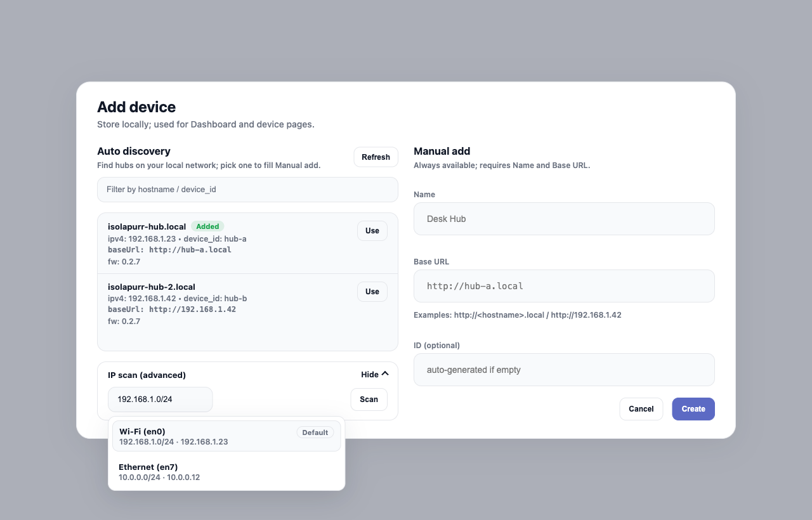
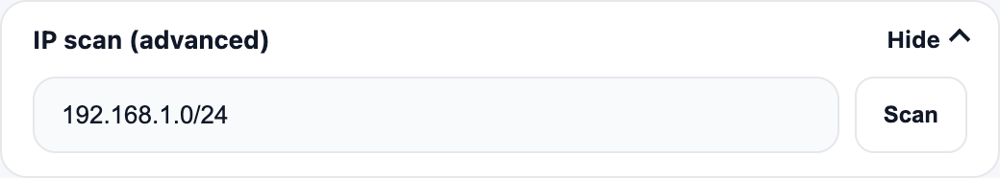
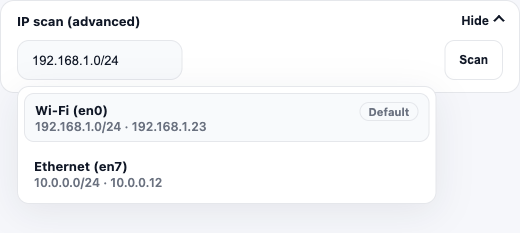
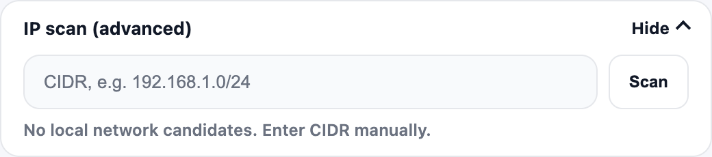

# IP scan (advanced) 设计说明

## 范围

- 仅覆盖 Add device → IP scan（advanced）区块。
- 仅 Desktop App（Tauri WebView）场景；远程 Web 保持现状。

## 设计目标

- 将本机局域网候选 CIDR 作为默认值，降低首次扫描门槛。
- 多网卡时提供下拉/自动完成，避免“填错网段”。
- 视觉与既有 UI 规范严格对齐，不引入新视觉语义。

## 视觉规范对齐

- 颜色/圆角/阴影：沿用 `web/src/index.css` 与 `docs/web-ui-visual-spec.md` 的 tokens。
- 圆角：卡片/输入保持 12px 级别的圆角；边框 1px。
- 字号：标题 13px/700；正文 13px/500；辅助 12px/600。

## 版式与布局

- 卡片宽度与 Add device 对话框一致（示意图中为 520px，实际随容器自适应）。
- 输入行：IP 输入框占满剩余宽度，`Scan` 按钮固定高度 40px。
- 下拉建议：默认贴齐输入框左边缘，宽度与输入框一致；展开时不影响 `Scan` 按钮对齐。
- Auto discovery 列表区域随右侧高度拉伸，列表卡片填充剩余空间，内容超出时在卡片内滚动。

## 组件与交互说明

- IP 输入框：
  - 有默认候选时直接填充 `defaultCidr`。
  - 多候选时聚焦或点击输入框出现建议列表（自动完成）。
  - 用户手动输入后，不自动覆盖。
- 候选列表：
  - 每项包含网卡名 + CIDR + 本机 IP（如 `Wi‑Fi (en0)` / `192.168.1.0/24 · 192.168.1.23`）。
  - 默认候选显示 `Default` badge。
  - 最大高度 180px，超出滚动。
- 候选下拉为**浮层**（不占用布局高度），允许在弹窗边界外溢出显示。
- 空态：无候选时，输入框为空并展示提示文案。
- 扫描触发：仅点击 `Scan` 后才开始扫描，不随默认值自动触发。

## 文案

- Placeholder：`CIDR, e.g. 192.168.1.0/24`
- Empty helper：`No local network candidates. Enter CIDR manually.`
- 区块标题：`IP scan (advanced)`

## 状态与验收参考图

> 说明：下拉为“展开态”示意图，实际实现为输入框下方的浮层列表。

- Add device 弹窗（整体效果，含 IP scan 展开态）
  - `add-device-dialog--ip-scan-expanded.png`

- 折叠态
  - `ip-scan-advanced--collapsed.png`

- 展开态（单候选默认填充）
  - `ip-scan-advanced--expanded-single.png`

- 展开态（多候选 + 下拉）
  - `ip-scan-advanced--expanded-multi.png`

- 展开态（无候选）
  - `ip-scan-advanced--expanded-empty.png`

