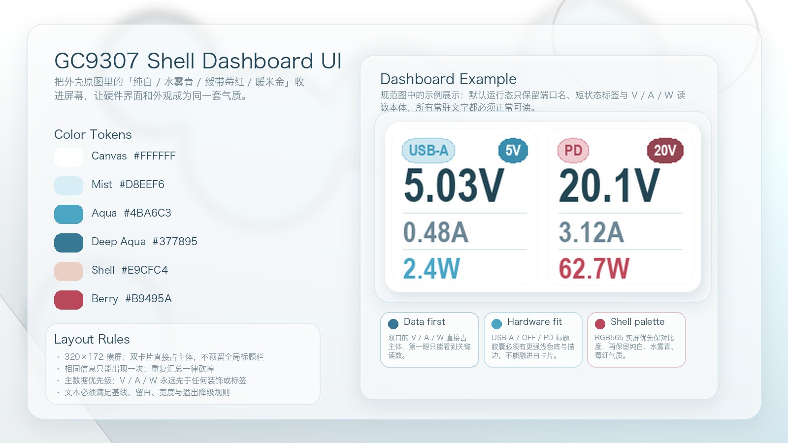
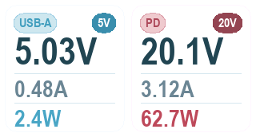

# GC9307 外壳联动 Dashboard UI 规格（#3j4df）

## 状态

- Status: 已完成
- Created: 2026-04-11
- Last: 2026-04-13

## 背景 / 问题陈述

- 现状：当前 GC9307 默认界面已经完成白底浅色化，但视觉语言仍偏“功能字符墙”，与硬件外壳上采用的原图配色没有建立明显联动。
- 主人要求：以外壳原图为配色参考，重新设计屏幕 UI 规范；规范需要同时包含文档与一张介绍图，并在介绍图中用 Dashboard 界面做示例展示。
- 本规格的目标不是立刻改写现有固件，而是冻结“下一版默认屏幕 UI”的视觉基线，为后续实现提供单一口径。

## 目标 / 非目标

### Goals

- 建立与外壳原图一致、但默认运行态坚持纯白底的屏幕视觉系统：纯白画布、水雾青主色、暖米金辅助、莓红点睛。
- 将默认运行态从“纯字符排布”升级为“glance-first dashboard”，保留双口电参量的可读性与排障效率。
- 冻结配色 token、版式骨架、状态色映射、示例图与视觉约束。

### Non-goals

- 不在本规格中引入历史曲线、触摸菜单、动画背景、主题切换或新的传感器数据源。
- 不修改 PD 协商、电源控制、INA226 采样链路与网络协议行为。
- 不在本回合直接替换当前已完成的 `j9twf` 运行规格；`j9twf` 仍是当前固件 UI 的事实基线。

## 范围（Scope）

### In scope

- GC9307 横屏 `320×172` 的默认 Dashboard 界面视觉设计。
- 色彩系统、信息层级、卡片样式、状态映射与装饰约束。
- 一张规范介绍图与一张 Dashboard 示例图。

### Out of scope

- Toast、网络提示页、设置页、调试页的逐页重设计。
- 真机实现代码、渲染性能优化、字体资源裁剪。
- Web 端 Dashboard 的同步改版。

## 原图分析结论（Reference Analysis）

外壳原图的主视觉可以收敛为四类信号：

- **高占比底色**：纯白运行底 + 近白高光（默认 Dashboard canvas 固定 `#FFFFFF`；近白层次只允许作为高光/反射，不得替代默认底）
- **冷色氛围**：水雾青 / 银蓝灰（`#D8EEF6`、`#C6DAE5`、`#377895`、`#4BA6C3`）
- **暖色缓冲**：发丝与皮肤带来的暖米金（`#E9CFC4`）
- **点睛强调**：领结/眼部中的莓红紫（`#B9495A`）

据此，本规格采用“**高亮底 + 冷色信息层 + 暖色柔化 + 少量莓红警示**”的 UI 语言，而不是把整张原图直接搬进屏幕。

## 需求（Requirements）

### MUST

- 默认运行态必须基于 `320×172` 横屏画布设计，且保留如下安全区：左右 `12px`、上下 `10px`。
- 界面骨架必须以双口卡片为主体，不得预留单独的全局标题栏或汇总栏来重复端口内已经可见的信息。
- 常驻可见文本不得依赖 1x 字号；凡是给主人直接阅读的信息，至少应使用可正常辨认的放大级别。
- 本规格的字体目标是“清晰、现代、工具化”，不是刻意追求复古像素风；Dashboard 预览与后续实现都不得把“位图放大感”当成视觉风格本身。
- 中部双口卡片必须一左一右固定映射：左卡=`USB-A` 常规口；右卡=高压 / 复用输出通道。右卡标题必须显示当前输出模式 token（如 `PD`、`PPS`、`DC`），不得直接写连接器名称 `USB-C`。
- 每张卡片必须包含 4 个层级元素：
  - 端口名（可读字号）
  - 极简但有实际意义的状态 / 电压档位标签（例如 `5V`、`20V`）
  - 主数据（Voltage，超大字号）
  - 次数据（Current / Power，必须达到正常阅读所需字号）
- Dashboard 示例必须继续承载当前正常界面的同一类核心数据：`V / A / W`；不得依赖本项目当前不存在的新硬件输入。
- 配色 token 至少包含以下角色：
  - `Canvas / Pure White`: `#FFFFFF`
  - `Mist`: `#D8EEF6`
  - `Aqua`: `#4BA6C3`
  - `Deep Aqua / Ink`: `#377895` / `#214457`
  - `Shell`: `#E9CFC4`
  - `Berry`: `#B9495A`
- 颜色使用规则必须满足：
  - 默认 Dashboard canvas 必须直接使用 `#FFFFFF` 纯白填满；禁止把 `#F8FBFD` 或任何蓝白 / 珍珠白偏色继续当作默认运行态背景
  - 常规正文与主数字使用 `Deep Aqua / Ink`
  - 活跃态、在线态、主引导使用 `Aqua / Deep Aqua`
  - 暖米金仅用于柔化背景、分区高光、非关键装饰
  - `Berry` 仅用于警示、故障、强调点缀；禁止把整屏做成粉红/玫红底
- 实屏硬件适配必须优先于桌面预览：GC9307 的 RGB565 量化、偏冷白点与高亮面板会吞掉过淡 pastel 层次，任何“看起来像没画”的浅色 token 都视为不合格。
- 标题胶囊（如 `USB-A`、`PD`、`PPS`、`DC`、`OFF`）必须满足以下实屏约束：
  - 不能只依赖非常淡的底色区分，必须保留清晰的胶囊轮廓
  - 推荐使用“较强浅色底 + 更明确描边 + 深色文字”的组合
  - 当前实屏校正口径：卡片底色≈`accent@10`，标题胶囊底色≈`accent@74`，标题胶囊描边≈`accent@132`，标题字形高度按上一版再增加约 `2px`，胶囊总高再增加约 `4px`
- 深色档位胶囊（如 `5V`、`20V`）继续使用“深色实底 + 浅色字”策略，不得被标题胶囊的视觉修正带回低对比方案。
- 装饰元素（雾面光斑、高光弧线、珍珠反射）不得覆盖主数字、端口名和状态 pill；所有关键数据前景对比度必须优先于装饰。
- 不得出现没有明确语义的装饰性条形、主题标签或只起“好看”作用的文案。
- 规范目录必须包含一张介绍图，且介绍图内必须展示 Dashboard 示例界面。
- 介绍图中的 Dashboard 示例必须按实屏 AA 轮廓裁切，不得额外套一层与实际屏幕无关的深色假边框。
- 规范目录必须保留可直接被文档引用的产物文件：
  - `./assets/gc9307-shell-dashboard-intro.png`
  - `./assets/gc9307-shell-dashboard-example.png`
  - `./assets/gc9307-shell-dashboard-example.framebuffer.bin`
- Dashboard 示例渲染图必须通过 host-side firmware preview 链路生成：
  - 场景入口：`./tools/render_dashboard_preview.rs`
  - Dashboard 字形资产：`src/display_ui/dashboard_font.rs`
  - raw framebuffer -> PNG：`$firmware-display-preview/scripts/fb_to_png.py`

### SHOULD

- 双口卡片底色应保持高亮半透明白，边界使用低对比描边，不使用重阴影硬分割。
- 若补充信息已经在卡片内可见，则不得再占用独立区域重复显示。
- 缺席态（not present）应保留卡片骨架但弱化颜色，避免布局跳动。
- 错误态与超量程态应改“颜色 + 标签”，不靠整卡闪烁表达。

### COULD

- 后续实现阶段可在不影响对比度的前提下加入极轻的静态雾面纹理或珍珠高光。

## 实屏校准结论（Hardware Validation）

- 本规格最终以 GC9307 实屏观察为准，而不是只以桌面 PNG 为准。
- 标题胶囊最终采用以下校准口径：
  - 标题字形较初版再增高约 `2px`
  - 胶囊总高较初版再增加约 `4px`
  - 标题胶囊保持“较强浅色底 + 明确描边 + 深色字”
- 真机验证证明：过淡的 pastel 标题底色会在实屏上与白卡片融为一体，因此最终口径不允许只靠轻微浅色差来表达 token。
- 运行态实现还需要满足一个额外硬约束：标题胶囊必须作为**整块圆角 patch** 正确写回显示，不能再出现以下实现缺陷：
  - 文字叠加时带出矩形背景块
  - 离屏缓冲按错误行步长打包，导致 `USB-A` / `OFF` / `PD` 等 token 像素行错乱
- 任何后续重构若重新引入“矩形底块”或“标题像素花屏”，都视为违反本规格。

## 版式与尺寸基线（Layout Baseline）

以 `320×172` 为基准：

- 安全区：`x=10..309`，`y=10..161`
- 左卡片：`x=6..155`
- 右卡片：`x=164..313`
- 卡片间距：`8px`
- 卡片高度：尽量占满可用高度，避免把屏幕切成多个低效条带
- 卡片圆角：建议 `12px`

信息优先级：

1. V / A / W 主读数
2. 端口身份与最小必要状态（如 5V / 20V）
3. 低对比背景装饰

## 文本约束（Text Constraints）

主界面文案必须受硬约束，保证这块 `320×172` 小屏上的每一个字符都服务于读数：

- **常驻文本白名单** 仅允许以下三类：
  - 身份 / 模式 token：`USB-A`、`PD`、`PPS`、`DC`
  - 极简状态 / 档位标签：如 `5V`、`20V`、`OFF`、`ERR`、`OVR`
  - 读数字符串本体：如 `5.03V`、`0.48A`、`62.7W`
- **禁止文案类型**：
  - 标题、口号、副标题、主题名
  - 与卡内信息重复的汇总文案
  - 解释性长句、装饰性短语、纯品牌感词汇
- **字符集约束**：实时界面默认只使用当前固件字形可稳定覆盖的字符集合：大写拉丁字母、数字、空格、`.`、`-`、`/`，避免依赖 CJK 或小写长串文本。
- **长度约束**：
  - 左卡身份 token 最长 `5` 个可见字符单元（`USB-A`）
  - 右卡模式 token 最长 `3` 个可见字符单元，限定在 `PD` / `PPS` / `DC`
  - 状态 / 档位标签最长 `4` 个可见字符单元，优先 `2~4` 字符
  - 每条常驻文本必须单行容纳，禁止换行、跑马灯、滚动字幕
- **字号约束**：
  - 端口名与状态 / 档位标签：至少达到 `16~18px` 级别可读高度
  - 电压主读数：必须达到 `48px` 左右的主读数高度级别
  - 电流 / 功率读数：至少达到 `30px` 左右的次级读数高度级别
  - 禁止把单位或关键状态降成“角标式小字”
- **对比度约束**：
  - 右侧状态 / 档位胶囊必须保证一眼可读，优先使用“深色实底 + 浅色字”或“浅底 + 深色字”的高对比组合
  - 不得使用接近底色的低对比淡色胶囊，让 `5V`、`20V` 这类短 token 淹没在背景里
- **格式约束**：
  - 数值与单位必须合并成单一读数字符串，不再额外占位写 `V / I / P` 键名
  - 默认格式：Voltage=`X.XXV`，Current=`X.XXA`，Power=`X.XW`
  - 缺席占位必须保持与真实读数同类宽度，例如 `--.--V`、`--.--A`、`--.-W`
- **信息优先级约束**：
  - 若某条文本不能直接帮助判断供电状态、负载状态或异常状态，就不应常驻显示
  - 任何额外文字都必须先证明它比“把主读数做得更大”更值这块面积

## 文本排版与像素约束（Typography / Pixel Layout Constraints）

以下约束直接服务于 `320×172` 的可读性，属于实现阶段不得随意突破的硬边界：

### 卡片内文本框架

每张卡片内部按固定垂直栈布局：

- **Header band**：`y=10..29`
  - 左卡左侧：`USB-A` 身份 token；右卡左侧：模式 token（`PD` / `PPS` / `DC`），左内边距 `12px`
  - 右侧：电压档位 / 合约标签（如 `5V`、`20V`），右内边距 `12px`
- **Voltage band**：`y=34..69`
  - 放置主电压读数，左内边距 `12px`
  - 该区域不得再叠加任何次级标签
- **Current band**：`y=82..109`
  - 放置电流读数字符串
- **Power band**：`y=118..145`
  - 放置功率读数字符串

### 对齐规则

- 同一卡片内的 `Voltage / Current / Power` 必须共享同一左对齐起点。
- 左右两张卡片的主电压首字符应落在同一基线高度，避免双卡出现上下漂移。
- 状态 / 档位标签必须固定右对齐，不得因字符串变短而漂浮在卡片中部。
- 卡片内部禁止居中排正文；实时读数统一采用左对齐，保证扫视路径稳定。

### 最大宽度与留白

- 所有文本都必须完全落在卡片内容区内，卡片文字可用宽度按 `card_width - 24px` 计算。
- 主电压读数右侧至少保留 `8px` 呼吸留白；不得把数字顶到描边。
- 电流 / 功率行之间至少保留 `8px` 垂直间隔，避免低分辨率下粘连。
- 端口名与右侧状态标签之间必须始终保留至少 `10px` 的空白，不得互相碰撞。
- Header band 内的胶囊体必须保留明确内边距：左右至少 `8px`，上下至少 `5px`；不得出现文字视觉上“贴边”的情况。
- 若胶囊体宽度受限，应先收紧字间距或缩短 token，再考虑缩小胶囊本身；禁止直接牺牲内边距。

### 溢出与降级策略

- 若主电压读数在 `4x` 字号下超出宽度，第一降级动作是压缩小数位，而不是缩小字号。
- 默认读数精度优先级：
  - Voltage：`X.XXV` → 超宽时降级为 `XX.XV`
  - Current：`X.XXA` → 超宽时降级为 `XX.XA`
  - Power：`X.XW` → 超宽时降级为 `XXW`
- 若状态 / 档位标签超宽，必须先替换为更短 token（如 `READY` 不如 `5V` / `ON` 有效），不得挤占主读数空间。
- 右卡模式 token 不允许退化为 `USB-C` 这类物理连接器名；固定 PDO 显示 `PD`，可调压协商显示 `PPS`，复用接口定压 / 定流输出显示 `DC`。
- 禁止使用自动滚动、裁切省略号或缩放到 `1x` 的方式处理常驻关键文本。

### 基线与实现约束

- Dashboard 预览与后续实现应优先使用更高分辨率的离线栅格字形资产，而不是直接放大 `6×8` 位图字形。
- 同一行文本的所有字符必须共享同一像素基线，不得单独上浮 / 下沉单位字符。
- 单位字符 `V / A / W` 必须与数字一起放大并对齐，不得做右上角小角标。
- 若后续加入负号、占位符或错误 token，其字宽必须先通过 host-side preview 验证，再允许进入默认界面。
- Dashboard 默认字形应使用更高分辨率的显示字体资产；若某条实现路径仍只能退回 `6×8` 位图放大，则只能作为临时 fallback，不得覆盖本规格定义的主视觉。
- Dashboard 主字形应优先选择**更高、更窄、阅读距离友好**的 sans-serif / condensed 轮廓，让主电压与次级读数在有限宽度内保持更强竖向存在感，而不是横向摊开。

### 验证要求

- 每次调整实时界面文案、精度或字号时，都必须重新生成 `320×172` 预览图检查碰撞与留白。
- 只要出现以下任一情况，即视为不合格：
  - 文本触边
  - 左右卡片基线不齐
  - 小数点或单位难以辨认
  - 需要眯眼才能读清状态标签

## 状态映射（Visual State Mapping）

- `Active / Online`：`Aqua` 填充或描边，文本走 `Deep Aqua`
- `Standby / Not Present`：`Mist` 背景 + `ink_soft` 文本，数据使用占位符（例如 `--.--V`）
- `Warning / Over`：偏暖的 `#D58A63`，只用于该字段或该状态标签
- `Error / Fault`：`Berry`，只用于错误 pill、关键数字标红或细描边

## 功能与行为规格（Functional / Behavior Spec）

- 默认 Dashboard 仍然是“双口电参量总览页”，本质上承接现有正常界面的信息目标，但信息组织方式改为卡片 dashboard。
- 左卡 `USB-A` 与右卡高压 / 复用输出通道的基础数据仍是 `Voltage / Current / Power`。
- 右卡标题语义采用“当前输出模式”而不是“物理接口名”：
  - `PD`：固定 PDO / PD Fixed
  - `PPS`：Programmable Power Supply
  - `DC`：通过复用接口输出特定电压 / 电流
- 卡片之外默认不再单独展示 total power、online ports 或全局标题；若必须展示，必须证明它不重复且比扩大主读数更有价值。
- 端口缺席时：
  - 卡片仍保留原位置
  - 主数据与次数据显示占位值
  - 状态 pill 切换为弱化态
- 端口错误或超量程时：
  - 不改变布局
  - 仅改变对应状态 pill、描边或字段颜色

## 验收标准（Acceptance Criteria）

- Given：查看本规格目录
  When：打开 `SPEC.md`
  Then：可以看到完整的配色、布局、状态映射与示例图引用。
- Given：打开规范介绍图
  When：阅读主视觉板
  Then：图中同时包含 palette、关键规则与一张 Dashboard 示例界面。
- Given：查看 Dashboard 示例图
  When：观察主界面结构
  Then：必须首先清楚读到左右两口的 `V / A / W`，且这些文字在正常观看距离下可辨认，不存在依赖 1x 小字的关键信息。
- Given：查看 Dashboard 示例图
  When：检查所有常驻文字
  Then：只能看到端口身份、极简状态 / 档位标签与 `V / A / W` 读数字符串本体；不得出现标题、口号、重复汇总或换行小字。
- Given：右卡处于 `20V` 固定 PDO 场景
  When：查看 Header band
  Then：左侧模式 token 显示 `PD`，而不是 `USB-C`；右侧档位标签显示 `20V`。
- Given：查看 Dashboard 示例图
  When：检查对齐、留白与溢出
  Then：左右卡片主读数基线一致，文本不触边，状态标签不挤占主读数空间，且不存在靠缩小字号硬塞进去的情况。
- Given：查看 Dashboard 示例图
  When：检查 Header band 内的端口名 / 状态胶囊
  Then：胶囊体文字四周存在明确呼吸空间，不会贴边，也不会因为 token 变长而牺牲内边距。
- Given：将本规格用于后续实现
  When：设计/实现对照文档
  Then：可以直接依据本规格中的 token、尺寸与状态映射落实现代化 dashboard 风格，而不需要回头猜配色。
- Given：查看真实 GC9307 面板照片
  When：检查 Header band 内的 `USB-A` / `PD` / `OFF` 等标题胶囊
  Then：不得出现矩形背景残块、离屏缓冲错行导致的花屏、或“胶囊轮廓存在但文字像素散掉”的情况。

## 实现前置条件（Definition of Ready / Preconditions）

- 需要主人确认本规格的总体视觉方向可作为后续实现基线。
- 真机实现前，需要在 GC9307 实屏上复核 aqua / berry / shell 色在实际亮度下的可读性。
- 若后续采用位图字体或 1bpp glyph 渲染，需要先评估卡片样式与排版层级的最小可实现版本。

## 非功能性验收 / 质量门槛（Quality Gates）

### Quality checks

- 关键数据文字与背景应满足阳光下/高亮屏条件下的可辨识性优先。
- 标题胶囊在真实面板上必须一眼能看出轮廓，不能出现“文字有了，但胶囊像没画”的情况。
- 若实屏照片中 `USB-A` / `PD` / `OFF` 等标题 token 的底色边界难以直接辨认，则视为配色不合格，必须先提高对比度再继续。
- 若实屏照片中标题胶囊后面出现矩形背景块、或标题字形出现横向错行 / 花屏，则视为实现不合格，必须先修正渲染路径再继续。
- 装饰不得遮挡关键数据。
- 文档引用的视觉证据文件必须存在于 spec 目录中，且使用相对路径引用。
- 规范介绍图与 `gc9307-shell-dashboard-example.png` 的 owner-facing 预览图都必须尊重 `T147BG-C08-06` 机械图 page 5 的圆角外形；该页未直接给出 `R` 标注，当前预览口径采用经机械图轮廓拟合后的 `14px` 圆角，并要求后续真机再复核。

## 文档更新（Docs to Update）

- `docs/specs/README.md`
- `docs/specs/3j4df-gc9307-shell-dashboard-ui/SPEC.md`
- `docs/specs/3j4df-gc9307-shell-dashboard-ui/assets/gc9307-shell-dashboard-intro.png`
- `docs/specs/3j4df-gc9307-shell-dashboard-ui/assets/gc9307-shell-dashboard-example.png`
- `docs/specs/3j4df-gc9307-shell-dashboard-ui/assets/gc9307-shell-dashboard-example.framebuffer.bin`
- `docs/specs/3j4df-gc9307-shell-dashboard-ui/tools/render_dashboard_preview.rs`
- `docs/specs/3j4df-gc9307-shell-dashboard-ui/tools/generate_dashboard_font.py`
- `docs/specs/3j4df-gc9307-shell-dashboard-ui/tools/render_spec_art.py`
- `src/display_ui/dashboard_font.rs`

## 实现里程碑（Milestones / Delivery checklist）

- [x] M1: 在固件显示层引入本规格定义的 dashboard 骨架、卡片边界与配色 token
- [x] M2: 将双口正常态 / 缺席态 / 错误态 / 超量程态映射到新的卡片视觉规则
- [x] M3: 更新固件预览链路，补齐 Dashboard 版本的稳定渲染图与必要说明文档

## 方案概述（Approach, high-level）

- 视觉上，采用“纯白运行底 + 水雾青主节奏 + 少量暖米金 + 莓红警示”的组合，保证与外壳同气质但不失嵌入式可读性。
- 结构上，将原有的三行字符信息直接扩展为两张高占比数据卡片，让远看先读清每口的 V / A / W；任何卡片外信息都必须证明自己不重复且真的更值这块面积。
- 交付上，先冻结视觉规范与介绍图；后续实现时再决定最合适的渲染技术路径。

## 风险 / 开放问题 / 假设（Risks, Open Questions, Assumptions）

- 风险：实际 GC9307 屏幕的亮度、Gamma 与视角可能让 `Mist` / `Shell` 这类浅色层次比设计图更接近，需要真机微调。
- 风险：标题胶囊若沿用桌面预览里过淡的 pastel 填充，会在实屏上与卡片背景融为一体；这类问题必须以实屏为准修正，而不是坚持桌面图。
- 风险：若继续使用强约束位图字形，必须优先保住 `V / A / W` 的可读性，必要时继续削减装饰和辅助信息。
- 开放问题：后续是否把 toast / 网络页也一并纳入同主题，目前未冻结。
- 假设：默认界面仍以“快速读数”优先，不追求大面积插画化背景。

## Visual Evidence

规范介绍图（包含 Dashboard 示例）：

Dashboard 示例图（由 `tools/render_dashboard_preview.rs` 生成 `framebuffer.bin`，再经 `$firmware-display-preview/scripts/fb_to_png.py` 转出）：

## 参考（References）

- `docs/specs/j9twf-gc9307-normal-ui/SPEC.md`
- 主人提供的外壳原图（本地参考，未入库）
