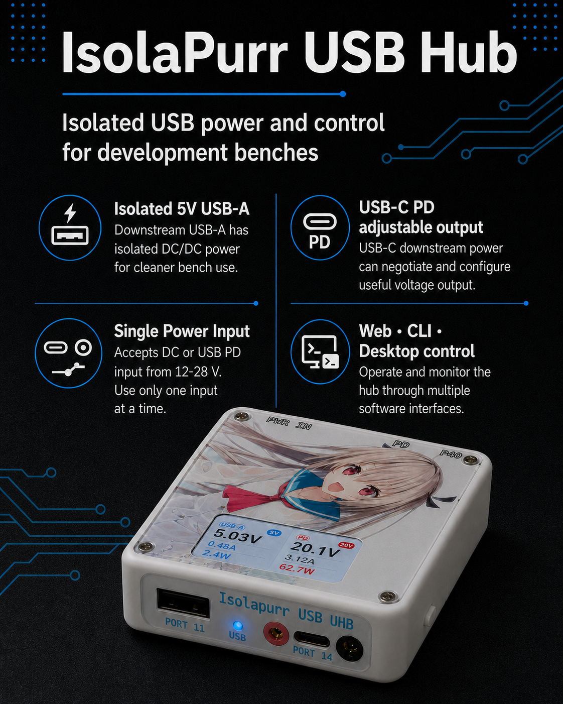
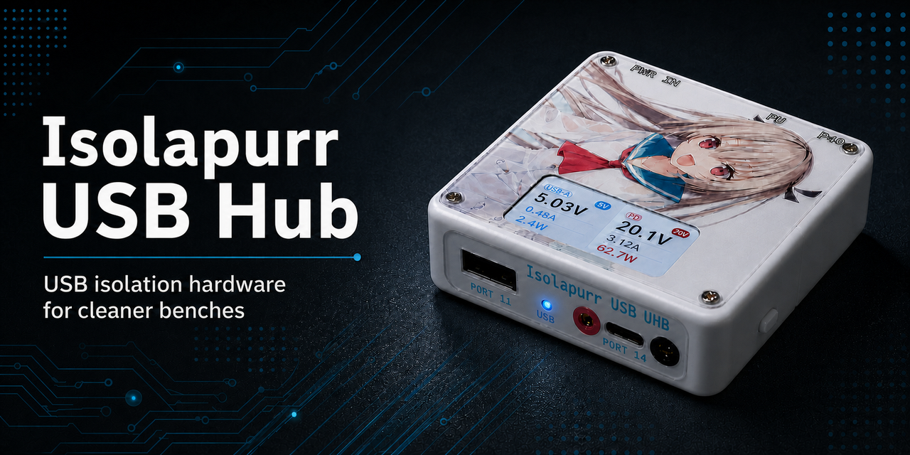

# Brand Marketing Asset Themes

## Background

The published bright product poster already used the required 4:5 geometry, but
its source image and export contract still described an obsolete portrait size.
The marketing surface also lacked approved dark companions for its poster and
social preview.

## Goals

- Maintain one reproducible bright and dark asset for each required marketing
  format.
- Keep the approved marketing composition, copy, product layout, and visual
  details stable during export.
- Define restrained, physically plausible dark-environment rendering for the
  white hardware.

## Non-Goals

- Replacing the existing bright GitHub Open Graph preview.
- Changing product-render, cutout, logo, or install-icon contracts.
- Introducing theme-specific Web UI behavior.

## Asset Contract

- Bright poster source: `web/src/assets/brand/product-poster-source.png`.
- Dark poster source: `web/src/assets/brand/product-poster-dark-source.png`.
- Bright social source: `web/src/assets/brand/github-social-preview-source.png`.
- Dark social source: `web/src/assets/brand/github-social-preview-dark-source.png`.
- Public bright poster export: `web/public/brand/isolapurr-product-poster.png`,
  `3072x3840`.
- Public dark poster export: `web/public/brand/isolapurr-product-poster-dark.png`,
  `1122x1402` (native 4:5 `gpt-image-2` output).
- Public social exports: `web/public/brand/github-social-preview.png` and
  `web/public/brand/github-social-preview-dark.png`, both `1280x640`.
- `.github/social-preview.png` remains the bright Open Graph preview.
- `bun run brand-assets` is the single export command. The approved dark poster
  is copied byte-for-byte from its generated source; it is never resized,
  cropped, recolored, or locally composited. `bun run test:icons` verifies all
  four public marketing output dimensions and this exact-copy constraint.
- Both 4:5 posters are excluded from the PWA precache because they are large,
  non-core marketing assets; the dark poster follows the existing bright-poster
  cache policy.

## Dark Rendering Requirements

- The white hardware remains visibly white under a neutral-cool key light.
- Shadow-facing enclosure planes and contact reflections use only a subtle,
  low-saturation blue-gray environmental bounce shared with the dark workbench.
- Contact shadows must make the device sit on the workbench rather than appear
  composited above it.
- The assets must not introduce cyan rim lighting, blue strips, neon halos,
  colored light pools, or self-illuminated hardware.
- The dark poster is a single full-image `gpt-image-2` generation that uses the
  approved product render as reference; no local product replacement or image
  post-processing is allowed.

## Acceptance Criteria

- Given the four source images, when `bun run brand-assets` runs, then the four
  public output paths exist at their required dimensions and the dark poster is
  byte-identical to its approved generated source.
- Given the generated assets, when `bun run test:icons` runs, then the
  marketing dimension contract passes.
- Given the dark assets are reviewed beside the approved bright assets, then the
  product remains white and integrated with the dark blue-gray environment
  without an emissive or blue-rimmed appearance.

## Visual Evidence

## Related ADRs

- None
