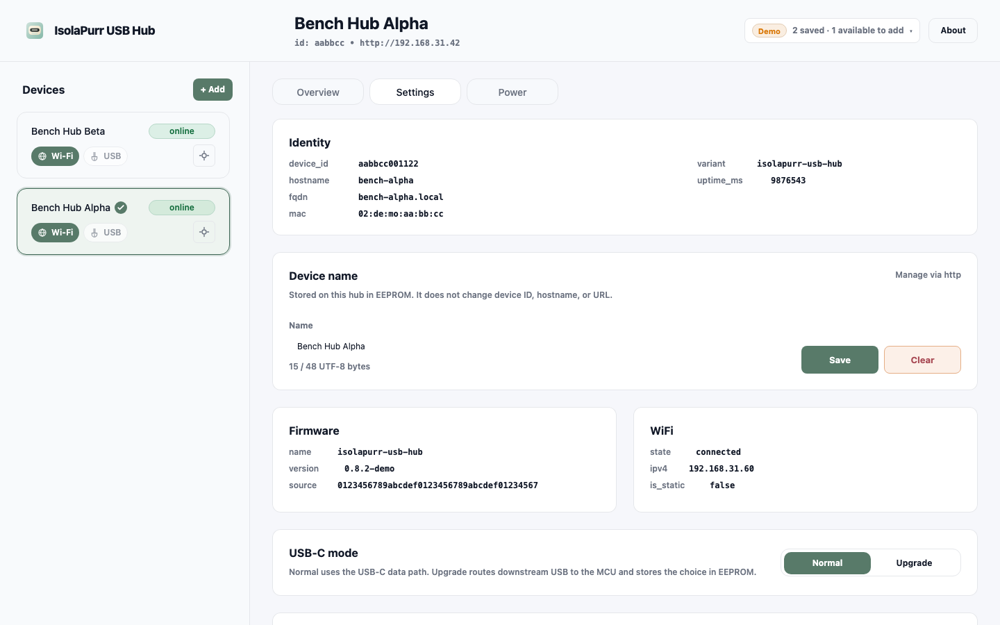
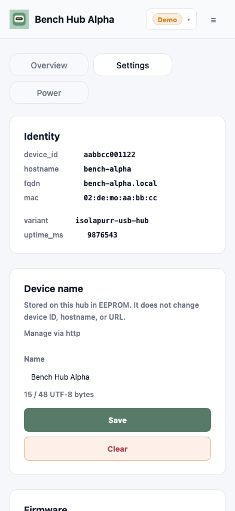
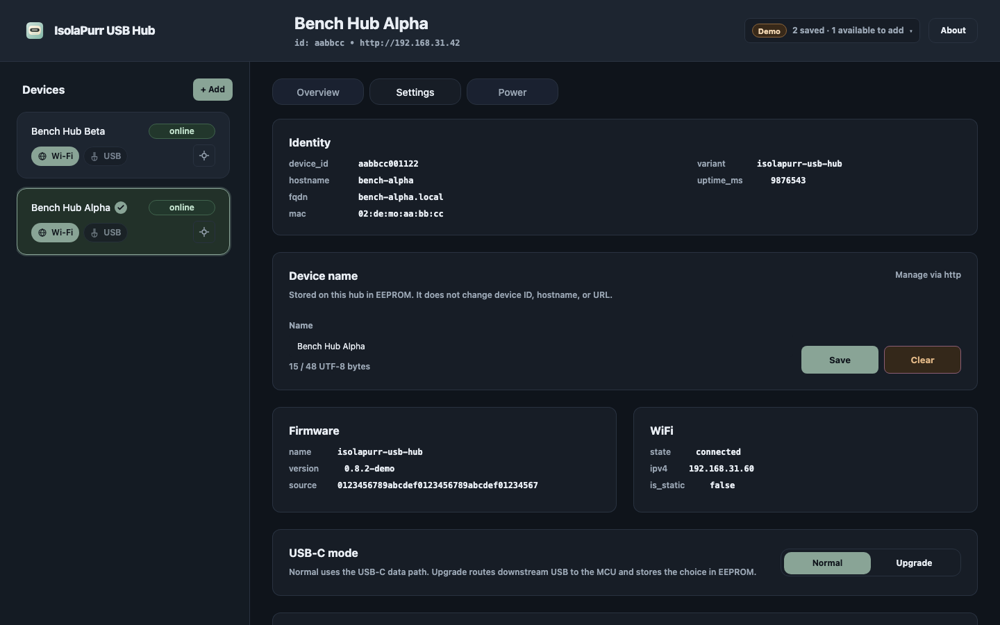
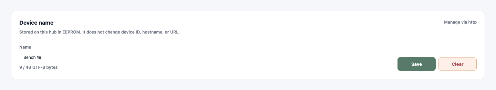

# Device Display Name

## Context and Scope

- Context: Operators need a human-readable name that remains consistent across the Hub, CLI, Web App, and Desktop clients without changing the stable hardware identity or network address.
- In scope: UTF-8 name persistence in EEPROM, the shared device information and mutation contracts, host/client cache precedence, CLI commands, and the Web Settings interaction.
- Out of scope: mDNS hostname changes, device selectors, cloud naming, fleet management, and arbitrary UTF-8 rendering on the hardware LCD.

## Terms and Interfaces

- `device display name`: An optional owner-assigned UTF-8 label persisted by one Hub and used as its primary operator-facing designation.
- `local device profile name`: A client-held fallback label used only when the hardware display name is not readable.
- `device_id`: The immutable 12-character eFuse-derived selector used for discovery deduplication, routing, and normal control.
- `display_name`: The additive `info.device` field. New firmware returns a string when set and `null` when the record is valid but unset; legacy firmware omits the field.
- `device_name` capability: The additive boolean capability that enables name mutation on new firmware.
- Name mutation: HTTP `PUT`/`DELETE /api/v1/settings/name`, JSONL `settings.name.set`/`settings.name.clear`, corresponding devd IPC/bridge methods, and `isolapurr settings name show|set|clear --device-id <device_id>`.

## Requirements

### REQ-DNAME-001

- The system MUST persist an optional device display name in a dedicated 64-byte EEPROM record at offset `0x0200` on U21.
- Inputs: record magic `IPNAME01`, version `1`, length `0..48`, UTF-8 payload occupying 48 bytes, two reserved bytes, and a CRC32 over the record with the checksum bytes cleared.
- Outputs: a valid record loads after reboot; an erased, malformed, or checksum-invalid record behaves as unset without changing device identity.

### REQ-DNAME-002

- The system MUST accept only canonical name input after client trim: 1..48 UTF-8 bytes, no Unicode control characters, and no leading or trailing whitespace in the submitted bytes.
- Outputs: invalid input returns a structured validation error; firmware never silently trims or normalizes the value.

### REQ-DNAME-003

- The HTTP `GET /api/v1/info` and USB JSONL `info` responses MUST add `device.display_name` and `capabilities.device_name` without removing existing identity fields.
- Legacy firmware responses that omit the additive fields MUST remain readable by clients.

### REQ-DNAME-004

- The HTTP, USB JSONL, devd IPC, bridge, CLI, and Web runtime mutation paths MUST share set and clear semantics, report EEPROM failures, and serialize writes with existing device busy handling.
- A successful mutation MUST mean the EEPROM write completed; `settings reset wifi|other` MUST preserve the display-name record.

### REQ-DNAME-005

- Clients MUST treat a confirmed hardware display name as authoritative, retain a three-state cache (`unknown`, `unset`, or `value`) for offline use, and keep `hardware save --name` as a local profile operation.
- Display precedence MUST be hardware value, stable hostname for confirmed unset, then the legacy local profile name when the hardware name is unknown.

### REQ-DNAME-006

- The Web Settings surface MUST provide a labeled name field with byte count, save feedback, clear confirmation, and accessible busy, unsupported, validation, and EEPROM-error states.
- A successful set or clear MUST refresh the shared display-name resolver used by the shell header, device cards, Dashboard, Power surfaces, and action toasts.

## Verification

### VER-DNAME-001

- Method: Shared firmware-core record tests and firmware endpoint tests.
- covers: `REQ-DNAME-001`, `REQ-DNAME-002`
- Pass condition: Valid ASCII and multi-byte UTF-8 values round-trip; boundary, control, whitespace, erased, CRC, and write-failure cases produce the specified outcomes.

### VER-DNAME-002

- Method: HTTP, USB JSONL, devd, bridge, and CLI contract tests.
- covers: `REQ-DNAME-003`, `REQ-DNAME-004`
- Pass condition: Additive info/capability fields, set/clear responses, legacy fallback, busy/error mapping, and reset preservation agree across transports.

### VER-DNAME-003

- Method: Browser and Desktop storage migration tests plus shared display-name resolver tests.
- covers: `REQ-DNAME-005`
- Pass condition: Unknown/null/string cache states select the specified name, stale aliases do not reappear after clear, and existing hardware-save behavior remains local.

### VER-DNAME-004

- Method: Web unit tests, Storybook states, and the production `?demo=true` Settings flow at desktop and `393x852` CSS viewports.
- covers: `REQ-DNAME-006`
- Pass condition: The form and all primary name surfaces remain readable, keyboard accessible, and free of overlap or clipping in supported themes.

## Related ADRs

- [ADR-0002: Hardware-Owned Device Display Name](../../adr/0002-hardware-device-display-name.md)

## Visual Evidence

- `source_type=ui_demo`, `evidence_surface=page`, `margin_policy=trim_only`, `requested_viewport=1440x900`, `viewport_strategy=devtools-emulate`, `state=Settings with hardware display name`, `evidence_note=production SPA Settings route with the EEPROM-backed name field and primary labels`
  
- `source_type=ui_demo`, `evidence_surface=page`, `margin_policy=trim_only`, `requested_viewport=393x852`, `viewport_strategy=devtools-emulate`, `state=responsive Settings with hardware display name`, `evidence_note=production SPA Settings route remains readable without overlap or clipping on the narrow CSS viewport`
  
- `source_type=ui_demo`, `evidence_surface=page`, `margin_policy=trim_only`, `requested_viewport=1440x900`, `viewport_strategy=devtools-emulate`, `state=dark-theme Settings`, `evidence_note=production SPA dark theme keeps the name form, validation copy, and actions legible`
  
- `source_type=storybook_canvas`, `target_program=mock-only`, `capture_scope=element`, `requested_viewport=isolapurrDesktop`, `viewport_strategy=storybook-viewport`, `margin_policy=require_margin`, `evidence_surface=component`, `surface_selector=[data-visual-evidence-surface]`, `target_selector=[data-visual-evidence-target]`, `story_id_or_title=Panels/DeviceNameSettingsSection/Resting`, `state=resting`, `evidence_note=component surface with 32px source-managed margins and UTF-8 byte counter`
  

## References

- `./IMPLEMENTATION.md`
- `./HISTORY.md`
