# USB-C TPS Power Config（#dzcaw）

## Background

The `tps-sw` hardware uses `SW2303` for USB-C protocol negotiation and
`TPS55288` for the programmable output stage. Existing firmware applied a fixed
SW2303 full profile and followed the negotiated SW2303 request into the TPS
setpoint. Operators needed a controlled way to persist and immediately apply
USB-C source capability and manual TPS bench settings without relying on
temporary firmware edits.

The USB-C INA226 sits upstream of the SW2303 path, so its raw current and power
readings also include the SW2303 empty-load draw. Operators need a device-level
calibration flow that measures this bias with USB-C disconnected and subtracts
it from the main USB-C telemetry without losing access to the raw INA226 data
for diagnostics.

## Goals

- Persist a SW2303-only power configuration record in EEPROM.
- Apply saved settings immediately through HTTP, Web Serial, and Local USB.
- Keep the API write model as a whole-config transaction.
- Preserve the current full SW2303 profile as the restore-defaults behavior.
- Provide a Web USB-C / Power settings page with host lock protection.
- Show the live USB-C source semantics on the Web Dashboard.
- Provide on-device preset and advanced power pages for the GC9307 settings
  menu.
- Provide a USB-C idle-bias calibration flow that stores a per-voltage EEPROM
  dataset, exposes raw plus corrected telemetry, and lets Web or CLI enable the
  correction explicitly.

## Non-Goals

- Runtime support for SW2305, VOOC, or non-SW2303 hardware.
- Per-field query updates for power settings.
- Fine-grained voltage/current editing from the two-button GC9307 UI.
- Bypassing SW2303 protection to make sink-side measurements appear valid.
- USB-A idle-bias calibration or per-port generalization in this release.

## Requirements

- `hardware` MUST accept only `sw2303` in this release.
- `tps_mode` MUST mean only the TPS output target source mode with values
  `auto_follow|manual`.
- `light_load_mode` MUST mean only the TPS55288 light-load switching mode
  with values `pfm|fpwm`.
- `manual.tps_cdc_rise_mv` MUST accept only
  `0|100|200|300|400|500|600|700`.
- `sw2303_line_compensation` MUST accept only
  `off|0mohm|50mohm|100mohm|150mohm`.
- Defaults MUST restore the full SW2303 profile: PD, PPS, QC2, QC3, FCP, AFC,
  SCP, PE2.0, BC1.2, SFCP, fixed 9/12/15/20 V PDOs, and 100 W cap.
- Manual TPS voltage MUST stay in the 3 V to 21 V range.
- Manual TPS current MUST be capped by both TPS capability and the 100 W product
  ceiling.
- Manual TPS output MUST target the banana / 2 mm output path by default.
- The Power surface MUST expose a runtime-only `Power` action for the USB-C /
  banana output stage that maps directly to TPS55288 `OE` and does not persist
  to EEPROM.
- The Power surface MAY expose TPS55288 `DISCHG` only as an advanced runtime
  control for the TPS output-off state, and MUST NOT present it as a fix for
  SW2303 high-voltage heating.
- The persisted power-config surface MUST store `light_load_mode` inside the
  existing EEPROM power record without changing record length or forcing a
  record wipe.
- Missing or legacy power-config EEPROM bytes for `light_load_mode` MUST decode
  as `pfm`.
- Power config get/set/defaults/reset-other MUST expose `light_load_mode` at
  the top level of the existing `power/config` payload instead of introducing a
  dedicated route or EEPROM record.
- Power config get/set/defaults/reset-other MUST expose
  `sw2303_line_compensation` at the top level of the existing `power/config`
  payload and `manual.tps_cdc_rise_mv` inside the existing manual object
  instead of introducing dedicated routes or records.
- Legacy EEPROM power-config records that predate the compensation fields MUST
  decode as `manual.tps_cdc_rise_mv=0` and
  `sw2303_line_compensation=50mohm` without wiping the record.
- TPS55288 cable compensation MUST be limited to internal `CDC[2:0]` control on
  register `0x05`; the current board MUST NOT expose or apply external CDC pin
  compensation.
- Firmware MUST preserve `SC_MASK`, `OCP_MASK`, `OVP_MASK`, and reserved bits
  when updating TPS55288 register `0x05`.
- SW2303 line compensation MUST remain an owner-facing single choice even
  though firmware expands it to register `0x14`, register `0xA4`, and register
  `0xAD bit7`.
- In `auto_follow`, firmware MUST force TPS cable compensation to `0V rise`
  and apply the saved SW2303 line-compensation value.
- In `manual`, firmware MUST force SW2303 line compensation off and apply the
  saved TPS cable-compensation rise.
- Web UI MUST add `TPS cable compensation` inside `Output mode` between
  `Current limit` and `USB-C path`.
- Web UI MUST add `SW2303 line compensation` below `TPS light-load mode` with
  helper copy that makes clear the value applies in `Auto follow`.
- Owner-facing CLI MUST expose both saved settings and clearly state that the
  line-compensation setting applies in `Auto follow`.
- Saving `light_load_mode=fpwm` MUST immediately force TPS55288 light-load
  behavior through the `MODE` register while explicitly preserving the board's
  external-VCC and `0x74` I2C-address semantics.
- Saving `light_load_mode=pfm` MUST immediately return TPS55288 light-load
  control to the board strap semantics without disturbing `OE`, `DISCHG`, or
  unrelated MODE bits.
- USB-C manual path mode MUST have three values:
  - `default`: force-close when no valid SW2303 request exists, or when manual
    VOUT exceeds the SW2303 request; otherwise clear force bits and return path
    control to SW2303 automatic behavior.
  - `disconnect`: force-close unconditionally.
  - `force`: force-open unconditionally.
- HTTP, Web Serial, and Local USB MUST expose config get, config set, defaults,
  and lock commands.
- HTTP power-config writes MUST accept the full browser LAN request envelope,
  including request line, CORS/PNA-related headers, and the whole-config JSON
  payload, so Web saves behave the same as CLI and Local USB writes.
- Firmware MUST store USB-C idle-bias state in a dedicated EEPROM record that
  is independent from the main power-config record.
- The idle-bias dataset MUST sweep `3000..21000 mV` in `500 mV` steps for a
  total of `37` points.
- Missing, invalid, or CRC-mismatched idle-bias EEPROM data MUST boot as
  `dataset missing` with `correction disabled`.
- Firmware MUST expose USB-C raw INA226 telemetry and corrected telemetry at
  the same time; the main `/ports` telemetry surface MUST report corrected
  values while a sibling raw field preserves the original INA226 reading.
- Firmware MUST expose `/api/v1/pd-diagnostics.tps_setpoint.iout_limit_ma` as
  the applied TPS55288 `IOUT_LIMIT` output current limit setpoint, not as the
  TPS55288 `ILIM` pin average-inductor-current limit.
- Firmware MUST expose `/api/v1/pd-diagnostics.tps_iout_limit_readback` as the
  raw TPS55288 `IOUT_LIMIT` register readback used for CLI/API/HIL write-path
  verification.
- Corrected USB-C current MUST clamp at `0 mA` after subtracting the
  interpolated idle-bias offset, and corrected USB-C power MUST be recomputed
  from raw voltage times corrected current.
- HTTP, Web Serial, and Local USB MUST expose idle-bias get, correction set,
  run, and clear commands.
- Idle-bias calibration MUST run as a device-side async sweep job with host
  lock and busy-state checks. Partial sweeps or EEPROM failures MUST preserve
  the previous dataset and restore the prior runtime configuration.
- Each idle-bias sweep point MUST hold the target output for about `1 s`,
  spending the first `500 ms` settling and averaging multiple samples across
  the final `500 ms`.
- Device-level `settings.reset scope=other` MUST erase the persisted power
  config EEPROM record, restore the runtime config to the full SW2303 defaults,
  report `persisted=false`, and preserve the Wi-Fi EEPROM record.
- Device-level `settings.reset scope=other` MUST also erase the idle-bias
  EEPROM record and force `correction_enabled=false`.
- Host lock MUST use a TTL heartbeat. A host holding the lock MAY refresh it;
  other hosts MUST be rejected until the lock expires or is released.
- Local advanced controls MUST be blocked while a host lock is active, except
  existing USB-C power on/off behavior.
- Web UI MUST show write/read errors instead of staying in a loading state.
- Web UI Power settings MUST expose `light_load_mode` inside the existing power
  settings panel and reflect the persisted value after reload or reconnect.
- Web UI and owner-facing CLI MUST warn that manual output above 5 V can still
  heat SW2303, that USB-C path options do not guarantee cooler operation, and
  that `auto_follow` is the preferred mode for sustained high-voltage use.
- Web UI protocol cards MUST label `PD` and `PPS` with a `CC` negotiation
  badge, and label the current non-PD protocol cards with a `DPDM` negotiation
  badge.
- Web UI protocol cards MUST hide the negotiation badge when an individual card
  is too narrow to fit the protocol name, badge, state, and toggle without a
  cramped layout.
- Web UI protocol cards MUST use card click as the enable/disable action and
  MUST NOT require a separate switch control inside the card.
- Web UI protocol cards MUST stay compact enough to fit within the existing
  Power panel without forcing the protocol matrix to dominate the page height.
- Web UI protocol cards MUST expose saved per-protocol option selectors inline
  when that protocol has additional persisted capability settings, including:
  `PPS`, `PPS3`, `PD/PPS 5 A`, fixed PD PDOs, `Type-C` current, `SCP` current,
  `FCP/AFC/SFCP` current, `QC2.0 20 V`, `QC3.0 20 V`, `PE2.0 20 V`, and
  non-PD `12 V`.
- Web UI protocol cards MUST visually distinguish the currently active
  negotiated protocol from merely enabled protocols by consuming live PD
  diagnostics `active_protocol` instead of inferring it only from saved config.
- Web UI MUST reserve `success` semantics for real positive device or port
  state, and MUST use the shared warm-amber `secondary` informational tone for
  active protocol / live emphasis instead of reusing the success fill.
- Dashboard, device cards, demo-panel badges, idle-bias summary cards, and
  toast success states MUST use the shared bordered semantic badge/surface
  tokens so bright and dark themes keep a consistent hierarchy.
- Manual TPS output live semantics MUST come from the shared USB-C display
  contract: `manual + output_enabled` sets the left USB-C badge to the manual
  TPS setpoint formatted as `x.xxV`; `force` fixes the right badge to `FOCUS`;
  other manual path modes show `ON/OFF` from the actual SW2303 VBUS path
  state.
- When `/api/v1/pd-diagnostics.tps_setpoint.iout_limit_ma` resolves to a live
  value, the Web Dashboard USB-C card header MUST also show an output current
  limit badge formatted as `x.xx A`, using that applied TPS55288
  `IOUT_LIMIT` setpoint rather than live measured current.
- When live USB-C display badges are present and USB-C telemetry resolves
  cleanly, the Web Dashboard USB-C card header MUST render the shared
  mode/setpoint label plus the shared live state badge, and MAY prepend the
  output current limit badge when `iout_limit_ma` is present. In this live
  badge mode, no separate legacy status chip may replace those inline badges.
- When live USB-C display badges are absent, or USB-C telemetry is not `ok`,
  the Dashboard MUST preserve the existing USB-C status chip instead of hiding
  fault/legacy state behind the live badges.
- Web UI MUST add a `USB-C Idle Bias Calibration` section with dataset,
  correction, and run-state summaries, confirmation flows for destructive or
  calibration actions, and explicit copy telling the operator to disconnect
  USB-C before calibration.
- The power surface MUST follow the repository Web demo-surface policy:
  production route validation happens on `/devices/:deviceId/power`, mock-only
  verification happens through composite Storybook stories such as
  `Panels/DevicePowerPanel` and `Panels/DeviceDashboardPanel`, and owner-facing
  screenshots bind through this spec's `## Visual Evidence`. It MUST NOT
  introduce a dedicated Web demo page, route, or any power-specific demo query
  contract beyond the repository-wide controlled `?demo=true|false` mode.
- When a saved idle-bias dataset exists, the Web UI MUST keep the dataset
  detail surface collapsed by default, open into a chart-first review mode,
  and allow switching between a single-series voltage-to-offset chart and a
  wide-screen optimized table view for exact point inspection.
- Web UI and human CLI MUST show corrected USB-C telemetry by default and keep
  the raw INA226 reading on debug or JSON surfaces only.
- `/api/v1/pd-diagnostics.usb_c_actual` MUST keep exposing the raw U17 INA226
  reading used by the PD diagnostics surface so HIL can distinguish control
  faults from idle-bias correction effects.
- Storybook coverage MUST include normal, host-locked, failure, save, restore,
  and narrow states for the power panel; power-panel idle-bias uncalibrated,
  correction off, correction on, running, confirmation, and failure states;
  plus Dashboard USB-C card inline live-badge states for auto-follow, `FOCUS`,
  `ON`, and `OFF`, the legacy no-diagnostics fallback, and the telemetry-error
  regression where a real error status chip must remain visible.
- Power visual verification MUST NOT rely on page-level Storybook route stories.
  Route-level proof belongs to the production `/devices/:deviceId/power` page
  and this spec's live or mock-only evidence entries.

## Acceptance

- Given a missing or invalid EEPROM power record, when firmware boots, then it
  uses the full SW2303 auto-follow defaults and reports `persisted=false`.
- Given an old EEPROM power record that predates `light_load_mode`, when
  firmware boots, then it keeps the saved power settings and resolves
  `light_load_mode=pfm`.
- Given a valid saved record, when firmware boots, then it loads the record and
  applies the selected SW2303 capability profile after the SW2303 read gate.
- Given a legacy EEPROM power-config record with `version < 3`, when firmware
  boots, then it keeps the saved capability/manual/path settings and resolves
  `manual.tps_cdc_rise_mv=0` plus `sw2303_line_compensation=50mohm`.
- Given a whole power config write over HTTP, Web Serial, or Local USB, when the
  request validates and the lock allows it, then firmware stores the config to
  EEPROM, updates the API snapshot, and reapplies the SW2303 profile.
- Given a whole power config write that sets `light_load_mode=fpwm`, when the
  request succeeds, then TPS55288 immediately switches to forced PWM while
  preserving external-VCC and `0x74` board semantics.
- Given a whole power config write that sets `light_load_mode=pfm`, when the
  request succeeds, then TPS55288 immediately returns to strap-controlled PFM
  semantics without changing `OE` or `DISCHG`.
- Given `manual.usb_c_path_mode=default`, when no explicit SW2303 protocol
  request exists and manual VOUT is less than or equal to 5 V, then firmware
  clears SW2303 force-open and force-close bits as the Type-C fallback path.
- Given `manual.usb_c_path_mode=default`, when manual VOUT is higher than the
  latest explicit SW2303 protocol request, or higher than the 5 V Type-C
  fallback when no explicit request exists, then firmware force-closes the
  SW2303 path.
- Given `manual.usb_c_path_mode=default`, when manual VOUT is less than or
  equal to the explicit SW2303 protocol request, then firmware clears SW2303
  force-open and force-close bits.
- Given `tps_mode=auto_follow`, when firmware applies runtime power policy,
  then TPS55288 cable compensation is forced to `0V rise` and SW2303 line
  compensation is expanded from the saved owner-facing setting into
  `0x14 + 0xA4 + 0xAD bit7`.
- Given `tps_mode=manual`, when firmware applies runtime power policy, then
  SW2303 line compensation is forced off while TPS55288 applies the saved
  `manual.tps_cdc_rise_mv` value using internal CDC mode only.
- Given a remote host lock, when another host attempts a config write, then the
  write is rejected as busy and the UI presents the locked state.
- Given the runtime `Power` action turns output off, when the request
  succeeds, then TPS55288 clears `OE`, the API reports
  `runtime.output_enabled=false`, and the saved power config remains unchanged.
- Given the runtime `Power` action turns output on again, when the request
  succeeds, then the PD/TPS coordinator restarts from its boot setpoint path
  before resuming follow or manual behavior.
- Given the default desktop power panel story, when the safe-profile protocol
  cards are wide enough, then `PD` and `PPS` show `CC`, and the current non-PD
  protocol cards show `DPDM`.
- Given manual TPS output with `usb_c_path_mode=force`, when the Dashboard
  USB-C card refreshes, then the left inline badge shows the manual setpoint
  (for example `3.30V`), the right inline badge shows `FOCUS`, the output
  current limit badge shows the applied `iout_limit_ma` when available, and
  the USB-C V/A/W on that card continue to come from the live U17 telemetry.
- Given manual TPS output with `usb_c_path_mode!=force`, when the Dashboard
  USB-C card refreshes, then the left inline badge shows the manual setpoint
  (for example `9.00V`), the right inline badge shows `ON` or `OFF` from the
  real VBUS path state, the output current limit badge shows the applied
  `iout_limit_ma` when available, and the USB-C V/A/W on that card continue
  to come from the live U17
  telemetry.
- Given PD diagnostics without `tps_setpoint.iout_limit_ma`, when the
  Dashboard USB-C card refreshes, then the output current limit badge stays
  hidden while the shared mode/setpoint and live state badges continue to
  render normally.
- Given legacy firmware without PD diagnostics, when the Dashboard USB-C card
  refreshes, then inline live badges stay absent and the existing USB-C status
  chip remains visible.
- Given live USB-C display badges and a USB-C telemetry error, when the
  Dashboard USB-C card refreshes, then the live mode/setpoint badges remain
  visible and the existing USB-C error status chip also remains visible.
- Given the narrow power panel story, when a protocol card becomes too narrow,
  then its negotiation badge is hidden without clipping the protocol card
  content or toggle.
- Given multiple protocols stay enabled, when live PD diagnostics report one
  `active_protocol`, then only that protocol card is visually highlighted as
  active while the remaining enabled cards keep the non-active enabled style.
- Given the GC9307 settings menu, when the owner opens Power Preset, then the
  screen shows the current preset and a second confirm restores defaults.
- Given the GC9307 settings menu, when the owner opens Power Advanced, then the
  screen shows mode, manual voltage/current, and path policy; a second confirm
  toggles auto-follow/manual TPS through the same pending EEPROM transaction.
- Given a saved power config exists, when Web, Local USB, or CLI runs
  `settings.reset scope=other`, then the power config record is erased, runtime
  power config returns to defaults, the API reports `persisted=false`, and Wi-Fi
  credentials remain configured.
- Given `power defaults` or `settings.reset scope=other`, when the runtime power
  config is restored, then `light_load_mode` becomes `pfm`.
- Given a missing or invalid idle-bias EEPROM record, when firmware boots, then
  the API reports `dataset.status="missing"` and `correction_enabled=false`.
- Given a successful USB-C idle-bias calibration run, when the MCU completes
  all `37` points, then firmware writes the full dataset to EEPROM, restores
  the previous runtime output config, and leaves the correction enable state
  unchanged.
- Given an idle-bias calibration point is running, when the MCU samples that
  voltage, then it waits about `500 ms` for settling and averages multiple
  readings collected across the following `500 ms`.
- Given idle-bias correction is enabled and a valid dataset exists, when
  `/api/v1/ports` reports USB-C telemetry, then `ports[].telemetry` is the
  corrected value, `ports[].telemetry_raw` remains the raw INA226 value, and
  corrected current never goes below zero.
- Given a calibration run fails due to attach detection, controller readiness,
  telemetry gaps, or EEPROM write failure, when the job stops, then the prior
  dataset remains intact and the run state reports `failed` with a structured
  error.
- Given the operator clears the idle-bias dataset, when the request succeeds,
  then EEPROM no longer contains the dataset and correction is forced off.
- Given the Web power panel idle-bias confirmation story, when the operator
  requests calibration, then the modal warns them to disconnect USB-C and
  states that the sweep spans 3.0 V to 21.0 V before restoring the prior power
  configuration.

## Milestones

- [x] Firmware config model, validation, and path policy helpers.
- [x] EEPROM record load/store and startup default fallback.
- [x] HTTP and JSONL API commands for config, defaults, and host lock.
- [x] Runtime TPS/SW2303 application path for manual mode and path control.
- [x] Web power settings page and runtime transport integration.
- [x] Storybook state coverage and interaction checks.
- [x] GC9307 settings menu preset and advanced power pages.
- [x] Visual evidence.
- [x] USB-C idle-bias EEPROM dataset, corrected telemetry split, async sweep
  job, host/CLI/Web contracts, and calibration UI.

## Visual Evidence

- source_type: storybook_canvas
  story_id_or_title: `Brand/ThemePalette/Review`
  state: light theme token review with warm-amber `secondary`
  requested_viewport: `1440x2000`
  viewport_strategy: `storybook-viewport`
  capture_scope: `element`
  target_program: `mock-only`
  evidence_note: verifies the formal light-theme token palette keeps `primary`
  on task actions while the warm-amber `secondary` tone is reserved for live
  protocol emphasis and not confused with success semantics.

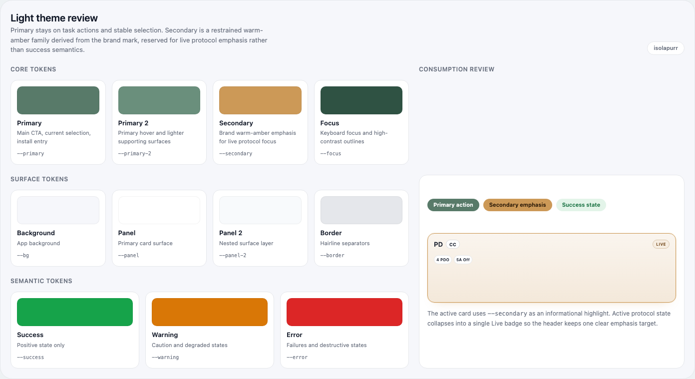

- source_type: storybook_canvas
  story_id_or_title: `Brand/ThemePalette/Review`
  state: dark theme token review with warm-amber `secondary`
  requested_viewport: `1440x2000`
  viewport_strategy: `storybook-viewport`
  capture_scope: `element`
  target_program: `mock-only`
  evidence_note: verifies the dark-theme token palette preserves the same
  warm-amber active emphasis and keeps semantic status colors separate from the
  active protocol lift.

- source_type: storybook_canvas
  story_id_or_title: `Panels/DevicePowerPanel/CalibrationApplied`
  state: semantic surfaces on power page summaries
  requested_viewport: `1440x1500`
  viewport_strategy: `storybook-viewport`
  capture_scope: `element`
  target_program: `mock-only`
  evidence_note: verifies the idle-bias summary cards now consume the shared
  semantic surface tokens instead of ad-hoc tinted fills, keeping the panel
  aligned with the rest of the page hierarchy.

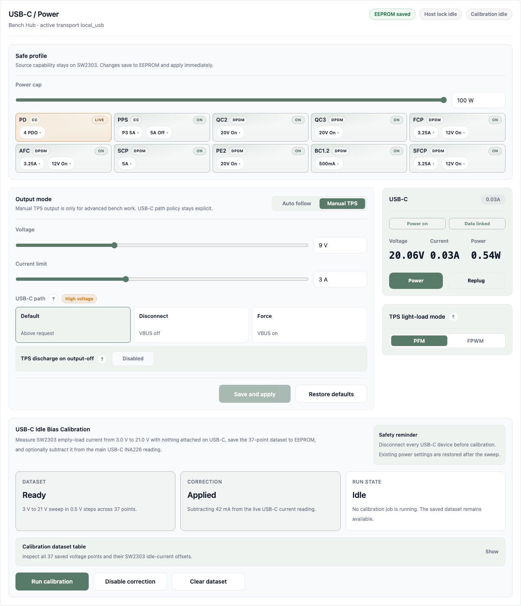

- source_type: storybook_canvas
  story_id_or_title: `Panels/DeviceDashboardPanel/Default`
  state: bordered semantic badges on dashboard and USB-C live header
  requested_viewport: `1440x1400`
  viewport_strategy: `storybook-viewport`
  capture_scope: `element`
  target_program: `mock-only`
  evidence_note: verifies the dashboard status chips, success surfaces, and
  USB-C live header now share the bordered semantic badge treatment while the
  live informational emphasis remains visually distinct from success state.

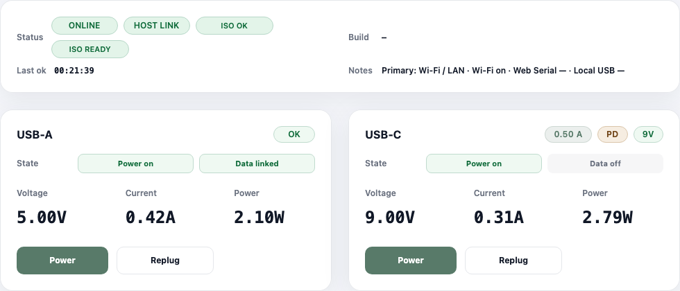

- source_type: storybook_canvas
  story_id_or_title: `Panels/DevicePowerPanel/ManualForceConfigOnly`
  state: power panel configuration-only manual force
  requested_viewport: `1440x1400`
  viewport_strategy: `storybook-viewport`
  capture_scope: `element`
  target_program: `mock-only`
  evidence_note: proves the Web power settings page stays configuration-only
  during manual `Force`, without trying to duplicate the live USB-C state
  badges that now belong on the Dashboard card.

PR: include
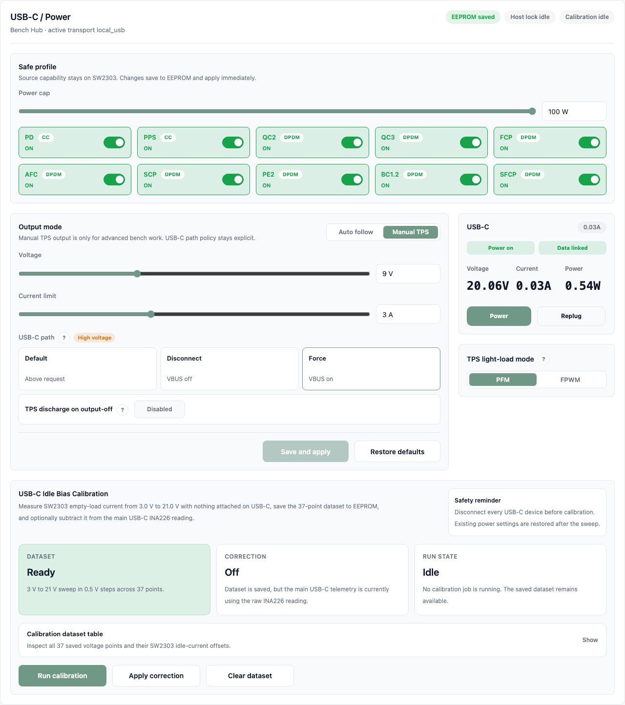

- source_type: storybook_canvas
  story_id_or_title: `Panels/DevicePowerPanel/Default`
  state: default desktop
  requested_viewport: `1280x900`
  viewport_strategy: `storybook-viewport`
  capture_scope: `element`
  target_program: `mock-only`
  evidence_note: verifies the normal SW2303 manual TPS settings layout,
  `CC`/`DPDM` negotiation badges on wide protocol cards, path mode choices,
  actions, and the uncalibrated USB-C idle-bias section, with the manual TPS
  cable-compensation slider and separate SW2303 line-compensation card both
  visible in the same saved power surface.

PR: include
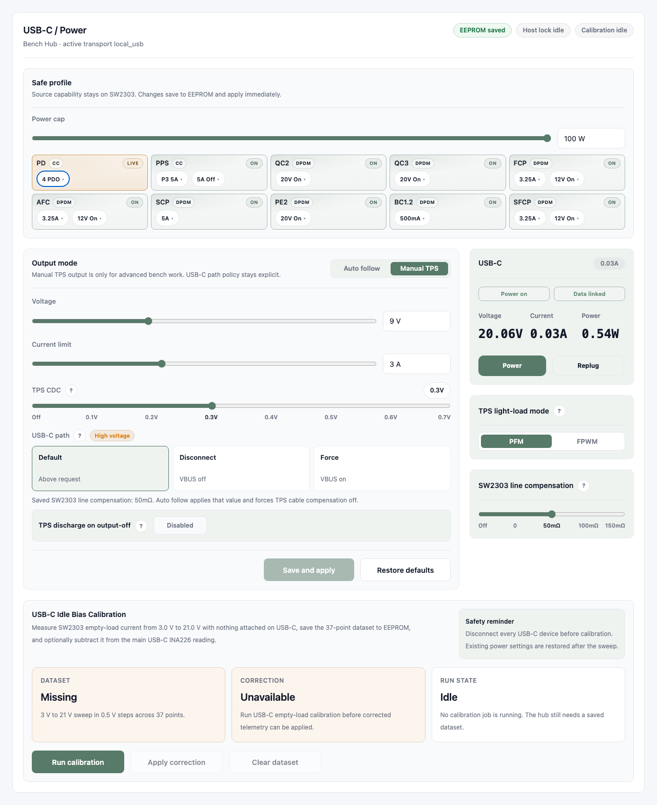

- source_type: storybook_canvas
  story_id_or_title: `Panels/DevicePowerPanel/ManualTpsCdcSet`
  state: manual TPS cable compensation set to `0.7V`
  requested_viewport: `1280x900`
  viewport_strategy: `storybook-viewport`
  capture_scope: `element`
  target_program: `mock-only`
  evidence_note: verifies `Output mode` now exposes the saved TPS cable
  compensation slider for `Manual TPS`, while the separate SW2303
  line-compensation card keeps the saved owner-facing role scoped to the next
  return to `Auto follow`.

PR: include
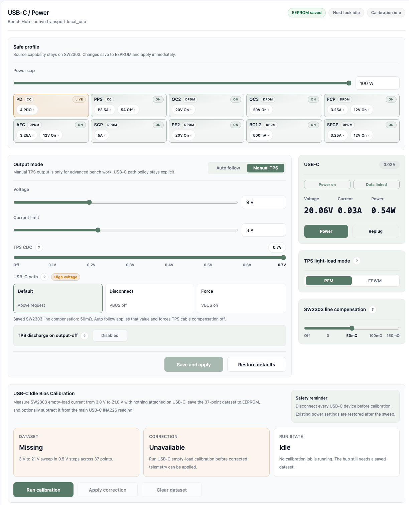

- source_type: storybook_canvas
  story_id_or_title: `Panels/DevicePowerPanel/ForcedPwmMode`
  state: saved `light_load_mode=fpwm`
  requested_viewport: `1440x1400`
  viewport_strategy: `storybook-viewport`
  capture_scope: `element`
  target_program: `mock-only`
  evidence_note: verifies the Power settings panel exposes the persisted TPS
  light-load mode toggle inside the existing saved power config surface, with
  `FPWM` selected alongside the unchanged `tps_mode` and source-capability
  controls.

PR: include
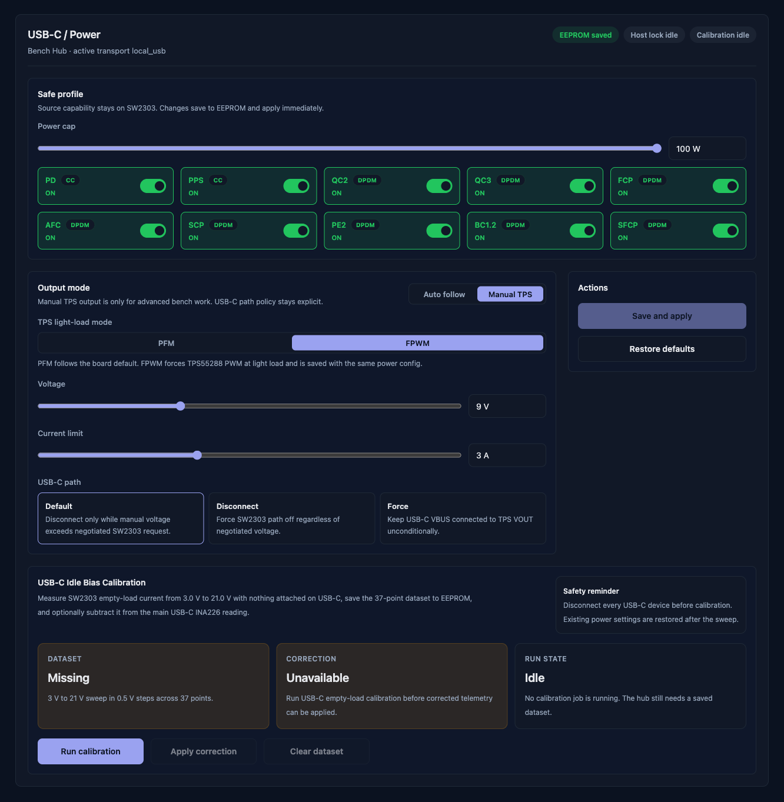

- source_type: storybook_canvas
  story_id_or_title: `Panels/DevicePowerPanel/OutputOffManualHighVoltage`
  state: runtime `Power` off with manual high-voltage warning
  requested_viewport: `1440x1400`
  viewport_strategy: `storybook-viewport`
  capture_scope: `element`
  target_program: `mock-only`
  evidence_note: verifies the runtime-only `Power` action can show the
  output-off state together with advanced TPS `DISCHG` enabled, while manual
  voltage above `5 V` shows the explicit SW2303 heating warning and `Auto
  follow` recommendation.

PR: include
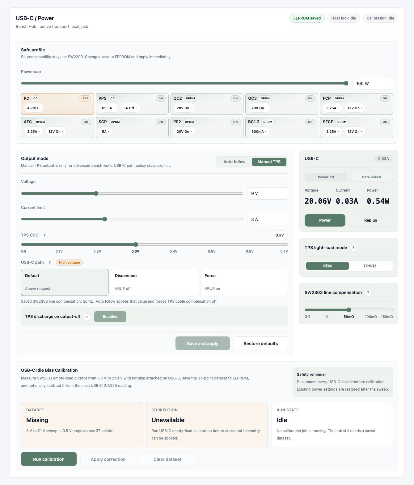

- source_type: storybook_canvas
  story_id_or_title: `Panels/DevicePowerPanel/HostLocked`
  state: host lock active with saved compensation controls disabled
  requested_viewport: `1280x900`
  viewport_strategy: `storybook-viewport`
  capture_scope: `element`
  target_program: `mock-only`
  evidence_note: verifies host-lock disable rules still cover the new TPS
  cable-compensation slider and SW2303 line-compensation control, while the
  saved values remain visible for inspection.

PR: include
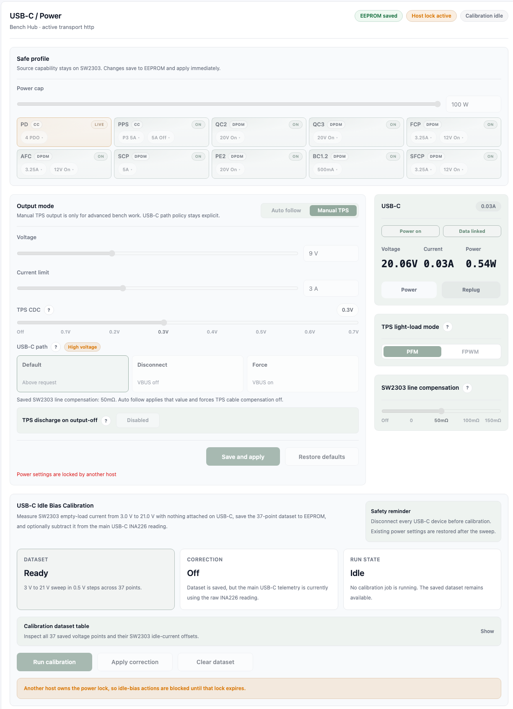

- source_type: live_hil_web_page
  story_id_or_title: `device 856a141cdbd4 power page`
  state: live page saved `light_load_mode=fpwm`
  requested_viewport: `1440x1600`
  viewport_strategy: `playwright-local-preview`
  capture_scope: `browser-viewport`
  target_program: `isolapurr-devd bridge-http + built web app`
  evidence_note: proves the real power page can save `FPWM` through the current
  bridge contract on hardware `656A14`, with the page showing `EEPROM saved`
  after the write.

PR: include
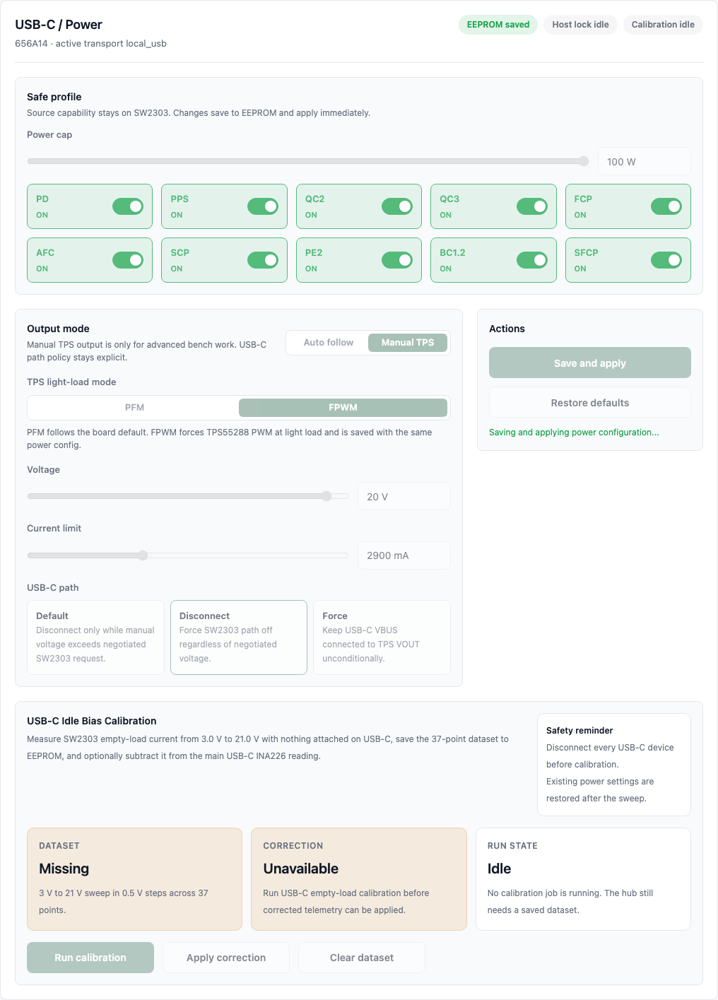

- source_type: storybook_canvas
  story_id_or_title: `Panels/DevicePowerPanel/Default`
  state: compact full panel with inline protocol options
  requested_viewport: `1440x1400`
  viewport_strategy: `playwright-local-preview`
  capture_scope: `element`
  target_program: `mock-only`
  evidence_note: verifies the protocol area is tighter than the previous
  switch-based layout while keeping inline current and fast-charge selectors
  inside the same saved power-config surface.

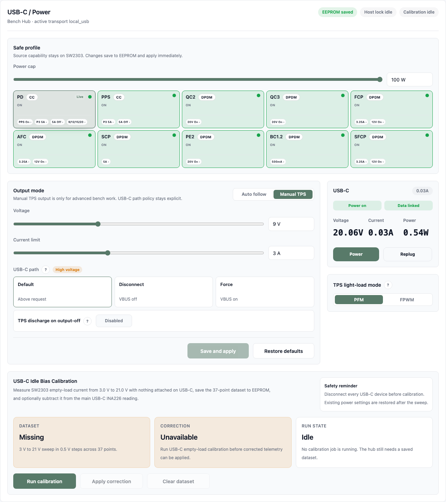

- source_type: storybook_canvas
  story_id_or_title: `Panels/DevicePowerPanel/Default`
  state: protocol grid active highlight and inline selectors
  requested_viewport: `1440x1400`
  viewport_strategy: `playwright-local-preview`
  capture_scope: `element`
  target_program: `mock-only`
  evidence_note: verifies card-click toggles, active-protocol highlight, and
  always-visible per-protocol selectors for current and extra fast-charge
  options inside the compact grid.

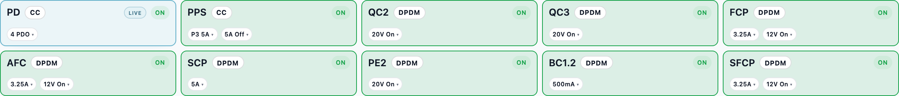

- source_type: storybook_canvas
  story_id_or_title: `Panels/DevicePowerPanel/ManualForceConfigOnly`
  state: dark theme protocol grid with refined active highlight
  requested_viewport: `1280x800`
  viewport_strategy: `storybook-viewport`
  capture_scope: `element`
  target_program: `mock-only`
  evidence_note: verifies dark mode keeps the live protocol card separated by a
  cleaner warm-amber lift, while enabled non-live cards stay subdued instead of
  turning muddy against the dark panel surface.

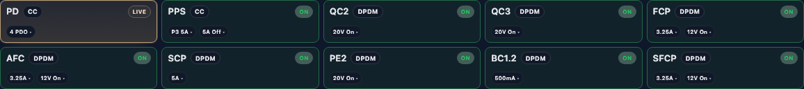

- source_type: storybook_canvas
  story_id_or_title: `Panels/DevicePowerPanel/Default`
  state: final bright-theme compact protocol grid with corrected success badge contrast
  requested_viewport: `1440x1400`
  viewport_strategy: `playwright-local-preview`
  capture_scope: `element`
  target_program: `mock-only`
  evidence_note: verifies the final compact protocol layout keeps the larger
  inline selectors while the bright-theme success badge and card hierarchy stay
  readable after the accessibility polish pass.

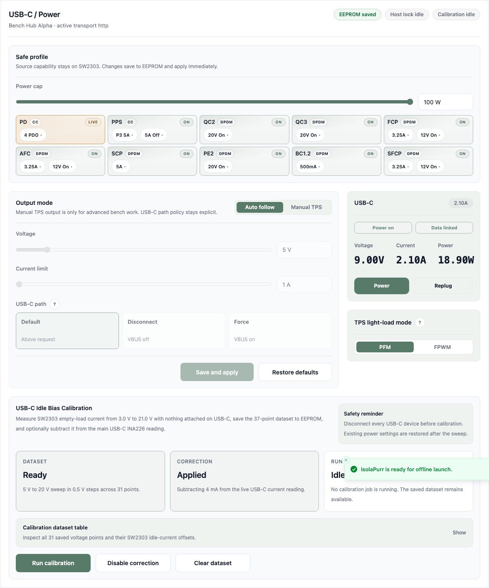

- source_type: storybook_canvas
  story_id_or_title: `Panels/DevicePowerPanel/Default`
  state: final dark-theme compact protocol grid with touch-safe inline selectors
  requested_viewport: `1440x1400`
  viewport_strategy: `playwright-local-preview`
  capture_scope: `element`
  target_program: `mock-only`
  evidence_note: verifies the final dark-theme protocol grid preserves the live
  active-card emphasis while the inline option controls remain compact on
  desktop and move to touch-safe hit areas on narrow screens.

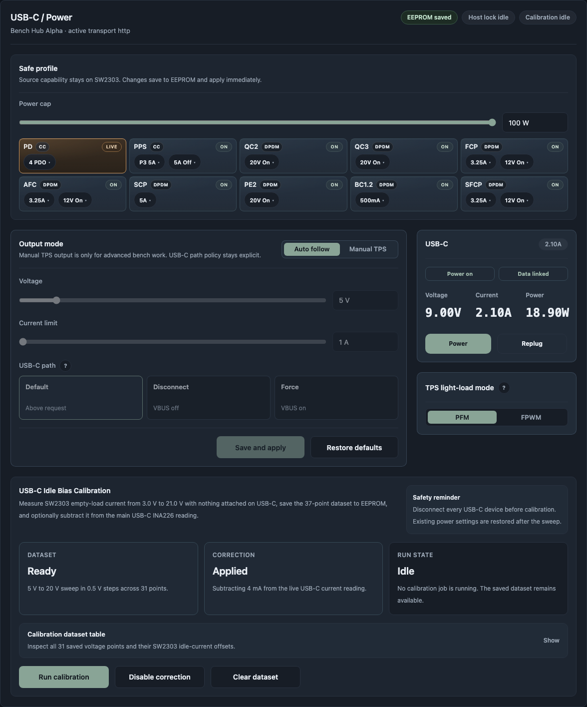

- source_type: live_hil_web_page
  story_id_or_title: `device 856a141cdbd4 power page`
  state: live page reloaded with persisted `light_load_mode=fpwm`
  requested_viewport: `1440x1600`
  viewport_strategy: `playwright-local-preview`
  capture_scope: `browser-viewport`
  target_program: `isolapurr-devd bridge-http + built web app`
  evidence_note: proves a fresh page load still reflects the persisted light-
  load state from EEPROM instead of only showing an optimistic local toggle.

PR: include
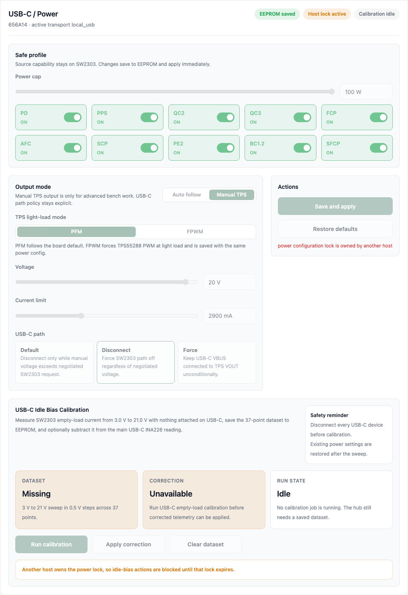

- source_type: live_hil_web_page
  story_id_or_title: `device 856a141cdbd4 power page`
  state: live page returned to `light_load_mode=pfm`
  requested_viewport: `1440x1600`
  viewport_strategy: `playwright-local-preview`
  capture_scope: `browser-viewport`
  target_program: `isolapurr-devd bridge-http + built web app`
  evidence_note: proves the same page can save back to `PFM`, leaving the final
  persisted hardware state at the default light-load mode.

PR: include
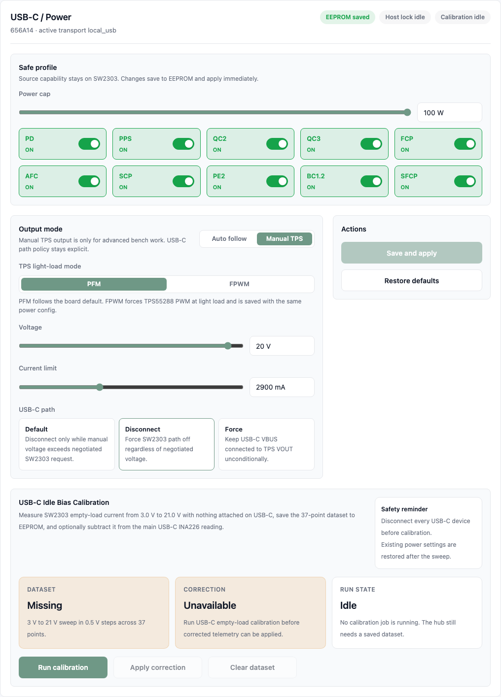

- source_type: storybook_canvas
  story_id_or_title: `Panels/DevicePowerPanel/CalibrationApplied`
  state: idle-bias dataset valid and correction enabled
  requested_viewport: `1280x900`
  viewport_strategy: `devtools-emulate`
  capture_scope: `element`
  target_program: `mock-only`
  evidence_note: verifies the corrected-telemetry state, applied offset summary,
  and idle-bias action cluster after a successful calibration dataset exists.

PR: include
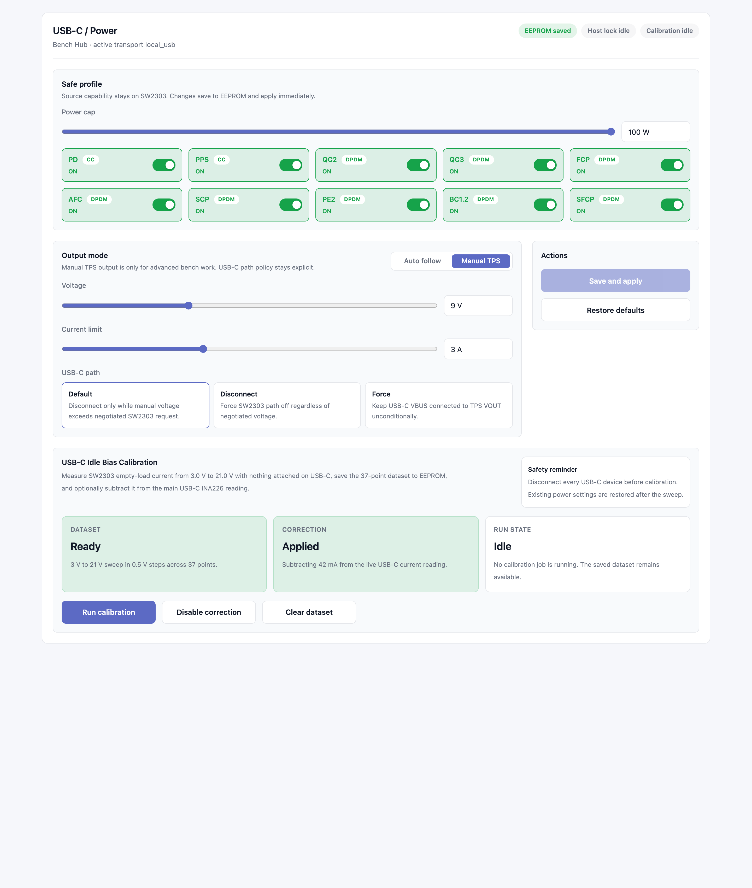

- source_type: storybook_canvas
  story_id_or_title: `Panels/DevicePowerPanel/CalibrationReadyCorrectionOff`
  state: idle-bias dataset available with table collapsed by default
  requested_viewport: `1440x1400`
  viewport_strategy: `storybook-viewport`
  capture_scope: `browser-viewport`
  target_program: `mock-only`
  evidence_note: verifies the calibration dataset stays tucked behind a
  collapsed disclosure by default, while the dataset summary and action row
  remain immediately visible.

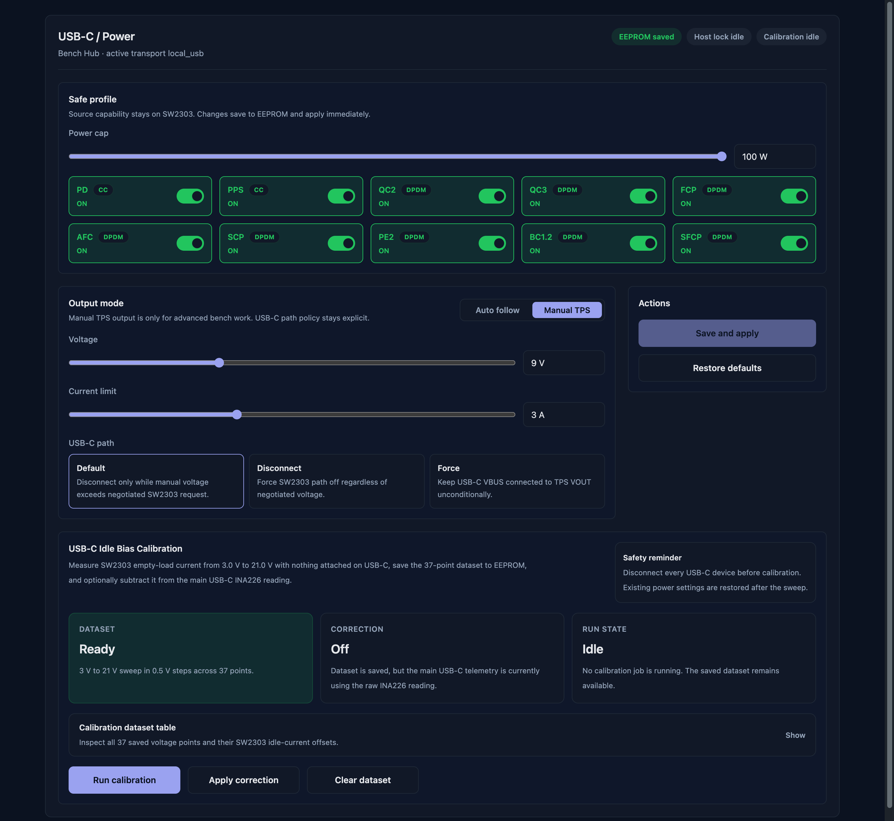

- source_type: storybook_canvas
  story_id_or_title: `Panels/DevicePowerPanel/CalibrationDatasetExpanded`
  state: idle-bias dataset chart expanded
  requested_viewport: `1440x1400`
  viewport_strategy: `storybook-viewport`
  capture_scope: `browser-viewport`
  target_program: `mock-only`
  evidence_note: verifies the saved `37`-point calibration dataset opens into
  a chart-first review surface with a single-series voltage-to-offset line and
  light area fill, without crowding the default panel state.

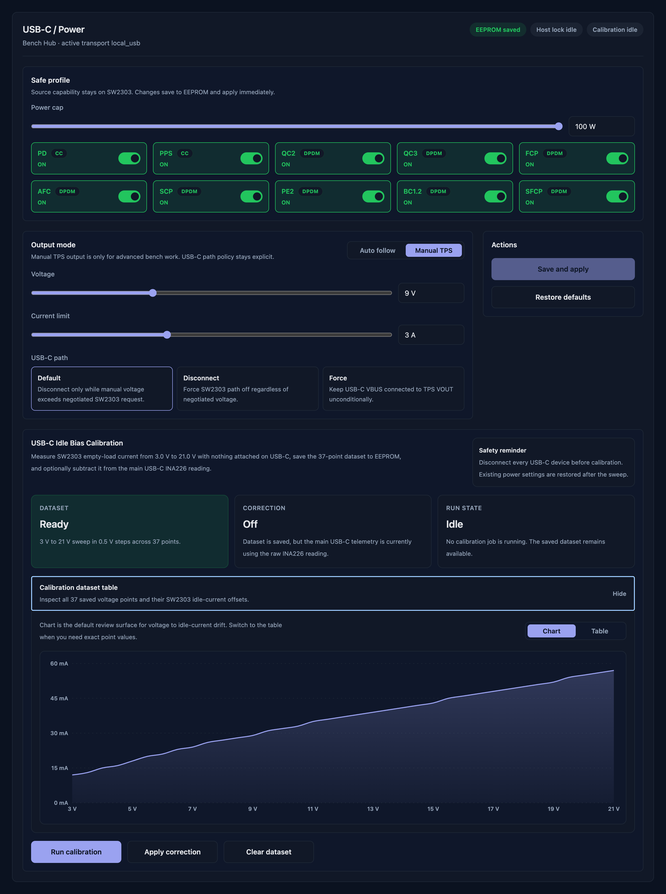

- source_type: storybook_canvas
  story_id_or_title: `Panels/DevicePowerPanel/CalibrationDatasetTableView`
  state: idle-bias dataset table view
  requested_viewport: `1440x1400`
  viewport_strategy: `storybook-viewport`
  capture_scope: `browser-viewport`
  target_program: `mock-only`
  evidence_note: verifies the table view reorganizes the saved `37` points into
  multiple side-by-side column groups on wide screens, reducing vertical scan
  length while preserving exact voltage and offset values.

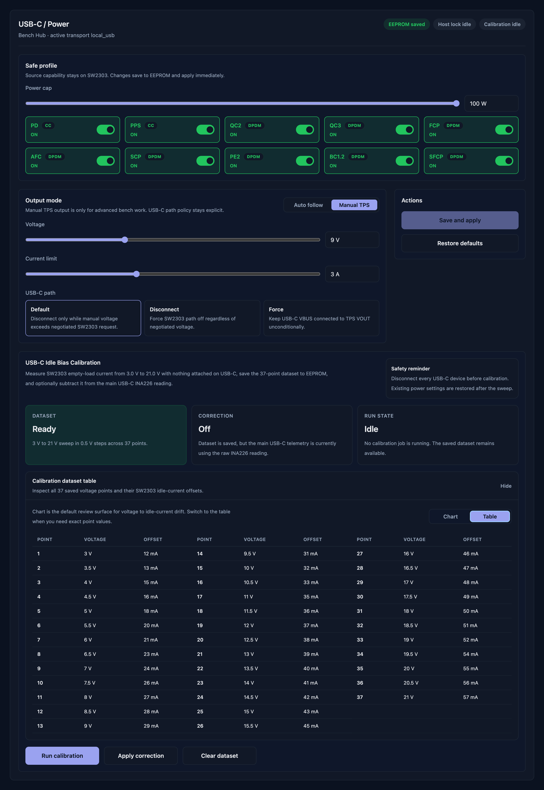

- source_type: storybook_canvas
  story_id_or_title: `Panels/DevicePowerPanel/CalibrationRunning`
  state: idle-bias sweep in progress
  requested_viewport: `1280x900`
  viewport_strategy: `devtools-emulate`
  capture_scope: `element`
  target_program: `mock-only`
  evidence_note: verifies the running badge, `n/37` progress copy, target
  voltage display, and disabled power-configuration editing while the sweep is
  active.

PR: include
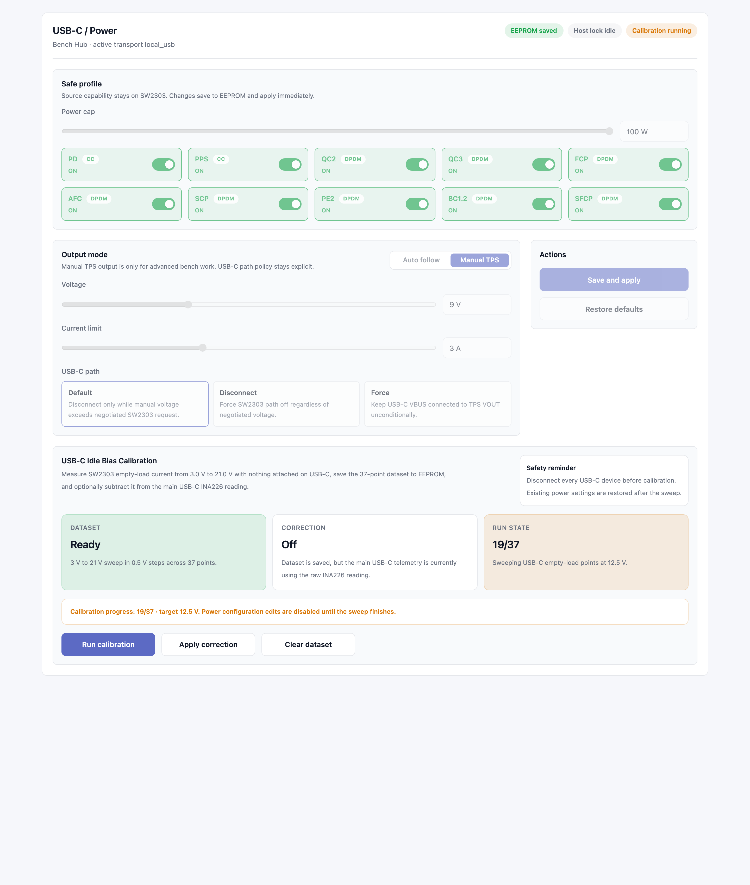

- source_type: storybook_canvas
  story_id_or_title: `Panels/DevicePowerPanel/RunConfirmation`
  state: idle-bias calibration confirmation modal
  requested_viewport: `1280x900`
  viewport_strategy: `devtools-emulate`
  capture_scope: `element`
  target_program: `mock-only`
  evidence_note: verifies the second confirmation copy for calibration, the
  USB-C disconnect warning, and the promise that the prior power configuration
  is restored after the sweep.

PR: include
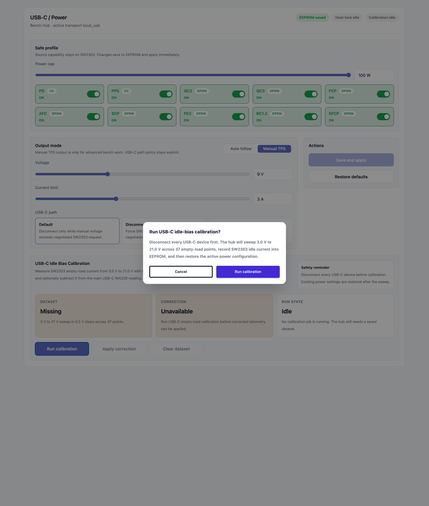

- source_type: storybook_canvas
  story_id_or_title: `Panels/DevicePowerPanel/FailureState`
  state: idle-bias EEPROM or job failure
  requested_viewport: `1280x900`
  viewport_strategy: `devtools-emulate`
  capture_scope: `element`
  target_program: `mock-only`
  evidence_note: verifies that a failed idle-bias job reports the structured
  error state without collapsing the rest of the power panel.

PR: include
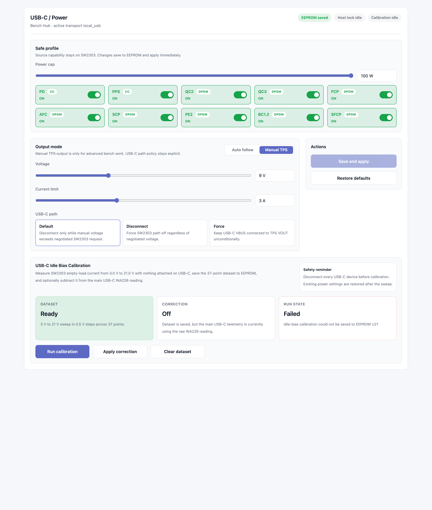

- source_type: storybook_canvas
  story_id_or_title: `Panels/DevicePowerPanel/Narrow`
  state: narrow responsive
  requested_viewport: `360x640`
  viewport_strategy: `devtools-emulate`
  capture_scope: `element`
  target_program: `mock-only`
  evidence_note: verifies the power settings panel stacks without clipping
  labels, power cap, segmented controls, action buttons, or narrow protocol
  cards after the negotiation badge hides, while keeping the compact TPS CDC
  control reachable above the light-load card.

PR: include
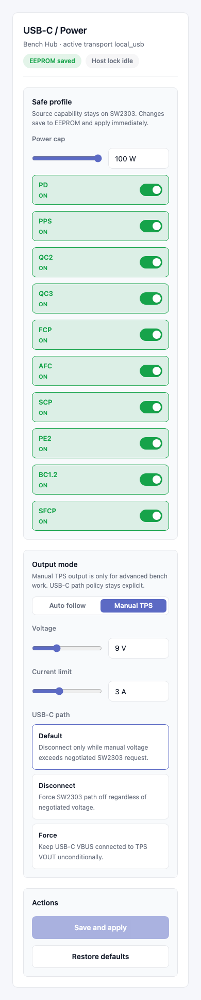

- source_type: storybook_canvas
  story_id_or_title: `Panels/DevicePowerPanel/MediumWideCards`
  state: medium constrained two-column layout
  viewport_strategy: `decorator-constrained`
  capture_scope: `element`
  target_program: `mock-only`
  evidence_note: verifies the card-level badge rule still shows `CC`/`DPDM`
  when the protocol grid is constrained into a medium two-column layout with
  enough per-card width.

PR: include
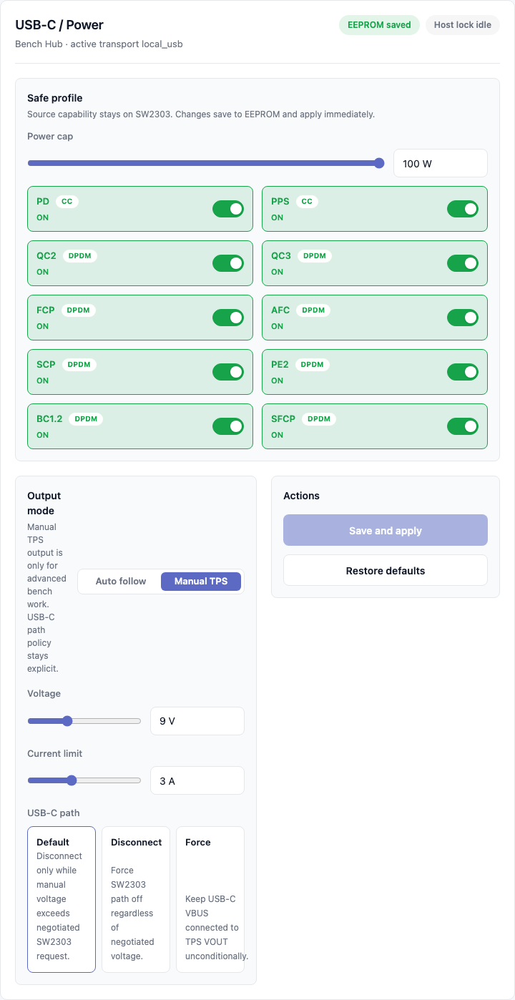

- source_type: storybook_canvas
  story_id_or_title: `Panels/DeviceDashboardPanel/ManualForceLive`
  state: Dashboard live manual `FOCUS`
  requested_viewport: `1280x900`
  viewport_strategy: `devtools-emulate`
  capture_scope: `element`
  target_program: `mock-only`
  evidence_note: verifies the Dashboard USB-C card shows inline manual
  setpoint + `FOCUS` badges while keeping the card V/A/W tied to the measured
  U17 telemetry.

PR: include
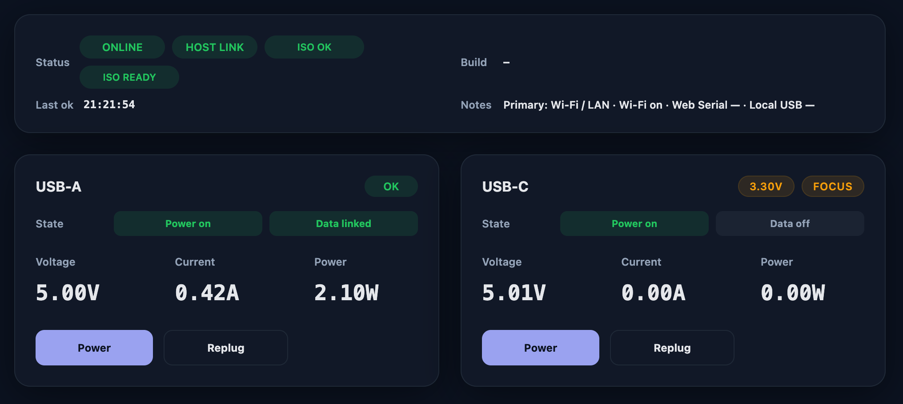

- source_type: storybook_canvas
  story_id_or_title: `Panels/DeviceDashboardPanel/ManualPathOnLive`
  state: Dashboard live manual `ON`
  requested_viewport: `1280x900`
  viewport_strategy: `devtools-emulate`
  capture_scope: `element`
  target_program: `mock-only`
  evidence_note: verifies the Dashboard USB-C card shows inline manual
  setpoint + `ON` badges while keeping the card V/A/W tied to the measured
  U17 telemetry.

PR: include
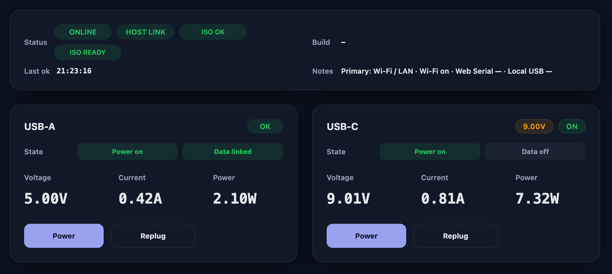

- source_type: storybook_canvas
  story_id_or_title: `Panels/DeviceDashboardPanel/ManualPathOffLive`
  state: Dashboard live manual `OFF`
  requested_viewport: `1280x900`
  viewport_strategy: `devtools-emulate`
  capture_scope: `element`
  target_program: `mock-only`
  evidence_note: verifies the Dashboard USB-C card shows inline manual
  setpoint + `OFF` badges while keeping the card V/A/W tied to the measured
  U17 telemetry.

PR: include
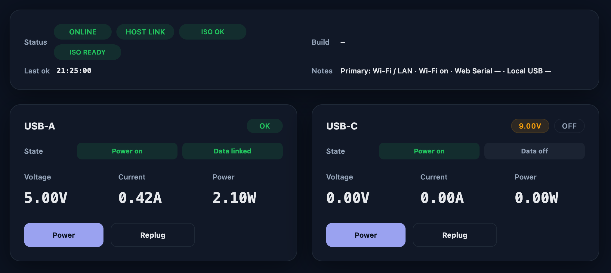

- source_type: storybook_canvas
  story_id_or_title: `Panels/DeviceDashboardPanel/LegacyFirmwareUnknownIsolation`
  state: Dashboard legacy no-diagnostics fallback
  requested_viewport: `1280x900`
  viewport_strategy: `devtools-emulate`
  capture_scope: `element`
  target_program: `mock-only`
  evidence_note: verifies legacy firmware without PD diagnostics keeps the
  existing USB-C status chip instead of rendering incomplete live badges.

PR: include
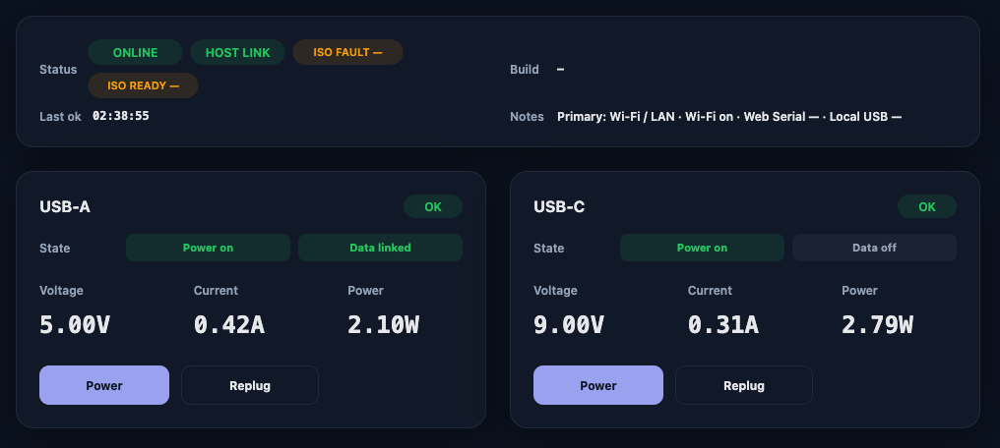

- source_type: storybook_canvas
  story_id_or_title: `Panels/DeviceDashboardPanel/LiveBadgesKeepErrorStatus`
  state: Dashboard live badges with USB-C telemetry error
  requested_viewport: `1280x900`
  viewport_strategy: `devtools-emulate`
  capture_scope: `element`
  target_program: `mock-only`
  evidence_note: verifies live USB-C mode/setpoint badges do not suppress a
  real USB-C error status chip.

PR: include
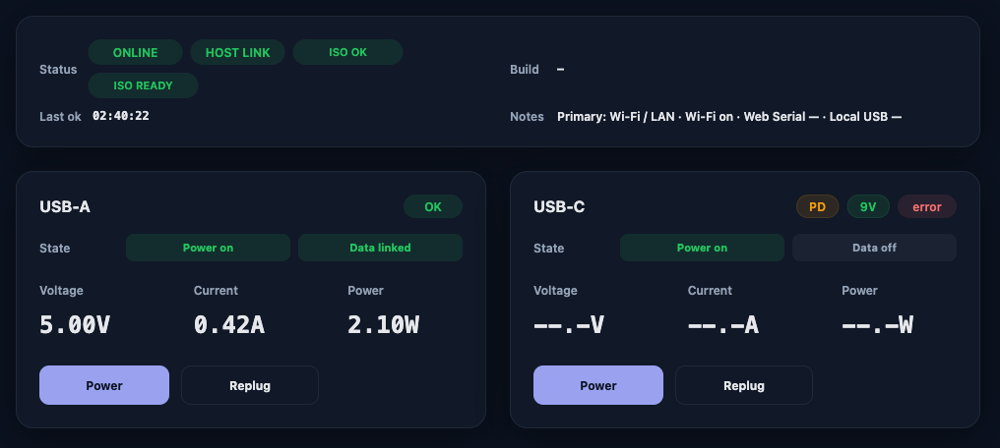

- source_type: storybook_canvas
  story_id_or_title: `Panels/DeviceDashboardPanel/Default`
  state: Dashboard USB-C live output current limit shown
  requested_viewport: `1280x900`
  viewport_strategy: `devtools-emulate`
  capture_scope: `element`
  target_program: `mock-only`
  evidence_note: verifies the USB-C header prepends the live applied
  `IOUT_LIMIT` badge as `0.50 A` while keeping the existing `PD` and `9V`
  badges on the same row.

PR: include
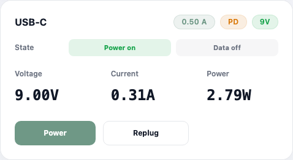

- source_type: storybook_canvas
  story_id_or_title: `Panels/DeviceDashboardPanel/MissingOutputCurrentLimit`
  state: Dashboard USB-C live output current limit missing
  requested_viewport: `1280x900`
  viewport_strategy: `devtools-emulate`
  capture_scope: `element`
  target_program: `mock-only`
  evidence_note: verifies the USB-C header hides the output current limit badge
  when live diagnostics omit `iout_limit_ma`, while the existing `PD` and `9V`
  badges still render.

PR: include
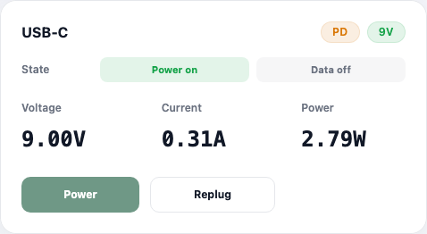

- source_type: live_hardware_browser
  story_id_or_title: `Local USB HIL overview`
  state: `HIL-f293cc-USB` default path fallback restored
  requested_viewport: `full page`
  viewport_strategy: `chrome-devtools full page screenshot`
  capture_scope: `page`
  target_program: `isolapurr-devd://usb--dev-cu-usbmodem21221401`
  evidence_note: verifies the real Local USB-backed HIL device
  `f293cc / 9C:13:9E:F2:93:CC` reports a manual sub-5V setpoint with live
  badge `ON` on the Overview page after restoring the Type-C default-path
  fallback behavior for non-negotiated sinks.

PR: include
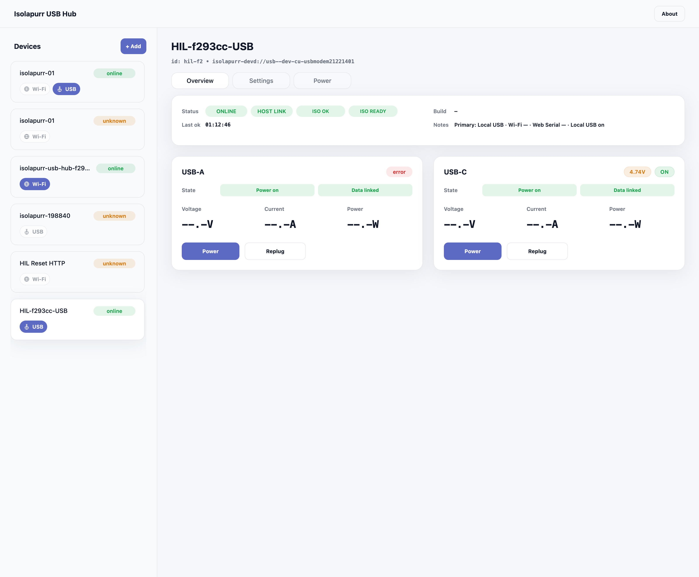

## Risks

- SW2303 path forcing is intentionally limited to explicit manual mode policy.
  Production verification still needs sink-side measurement and must not rely on
  TPS front-end telemetry alone.
- Two-button on-device advanced controls are intentionally coarse; exact
  voltage/current editing stays in Web, Web Serial, and Local USB surfaces.
