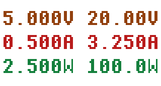
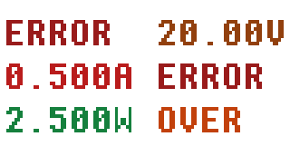
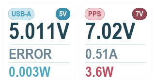
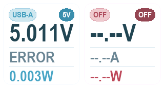

# GC9307 正常界面规格（USB-A + USB-C/PD 双口电参量）（#j9twf）

## 状态

- Status: 已完成
- Created: 2026-01-07
- Last: 2026-04-11

## 背景 / 问题陈述

- 现状：GC9307 屏幕需要稳定展示两路接口的电参量，供日常观察与现场排障使用。
- 目标：提供“正常界面”作为默认运行界面，固定显示 USB-A 与 USB-C/PD 两口的电压、电流与功率。
- 本规格用于承接 legacy `docs/plan/0001:gc9307-normal-ui/PLAN.md` 的既有口径，不扩展新的行为范围。

## 目标 / 非目标

### Goals

- 固定展示 3 行 × 2 列的 `V/A/W` 电参量。
- 规定定宽格式、颜色、状态优先级与端口 present 判定。
- 明确 INA226 的校准参数、功率来源与硬件映射。

### Non-goals

- 菜单、交互、历史曲线、数据记录/上报。
- 显示 PDO、完整协议栈状态、请求值等深度 PD 协议细节；只保留当前
  mode token 与最小 badge 语义。
- 修改 PD 协商策略、主循环控制策略或运行时网络接口。

## 范围（Scope）

### In scope

- 正常界面的固定布局、格式化规则、颜色规则与刷新节奏。
- USB-A / USB-C 两颗 INA226 的量测、校准与功率寄存器读取。
- 端口 present 判定规则。
- 用户说明文档与 UI 设计文档对规格基线的引用。

### Out of scope

- 采样频率策略调整（仅要求界面每 500ms 刷新一次）。
- SW2303 / TPS55288 的协议与电源策略改动。
- 其它硬件变体的额外适配。

## 需求（Requirements）

### MUST

- 每次刷新输出 3 行 × 2 列内容；每行严格为 `left_cell(6) + ' ' + right_cell(6)`。
- 单元宽度固定为 6 字符，支持 `OK` / `未插入` / `ERROR ` / `OVER  ` 四种显示状态。
- 未插入显示使用按单位展开的占位符：`--.--V` / `--.--A` / `--.--W`；旧 plan 中的 `--.--U` 仅表示“单位随行固定”的简写口径。
- 数值显示采用定宽 half-up 舍入：
  - `0.000 ≤ x < 10.000` -> `D.ddd`
  - `10.00 ≤ x < 100.00` -> `DD.dd`
  - `100.0 ≤ x < 1000.0` -> `DDD.d`
- 状态优先级为 `未插入 > ERROR > OVER > OK`，对每个端口、每个指标独立判定。
- 功率必须读取 INA226 Power 寄存器，不得由 `V × I` 推导。
- 屏幕刷新周期为 500ms。
- USB-A present 判定：电压有效且 `< 1.0V` 视为未插入；否则视为已插入（包含读数错误）。
- USB-C present 判定：满足任一条件即视为已插入并显示 U17 实测电参量：
  - U17 实测电压 `>= 3000mV` 且 U17 实测电流 `> 10mA`
  - SW2303 结构化状态显示 CC/设备在线已捕获（`cc_attached`）
  - SW2303 结构化状态显示真实协议已协商（`negotiated_protocol` / `fast_protocol` / `fast_voltage` 任一有效）
- USB-C 协议状态只用于 present/mode/badge 辅助，不得替代 U17 的实际电压、电流、功率读数。
- USB-C mode 判定：真实 PD fixed 目标显示 `PD`；真实 PD 非固定目标显示 `PPS`；其它快充协议显示 `DC`；若仅由 U17 量测阈值触发 present 且协议状态不可用，则显示 `DC`。
- USB-C 手动 TPS 输出判定：当 `tps_mode=manual` 且 `tps_setpoint.output_enabled=true`
  时，左 badge 必须显示手动设定 TPS 电压，格式为 `x.xxV`；若
  `manual.usb_c_path_mode=force`，右 badge 必须显示 `FOCUS`；其它手动路径模式
  只允许按 SW2303 的 `vbus_mv >= 1000mV` 显示 `ON` / `OFF`。
- USB-C 手动 TPS 输出下的 `V / A / W` 必须继续显示 U17 实测值，不得回退为目标值、
  请求值或 `OFF` 占位。
- 硬件映射（tps-sw）：
  - U13：INA226，I2C 7-bit 地址 `0x40`，分流 `R22=10mΩ`（`P1_SNP ↔ P1_VBUS`）
  - U17：INA226，I2C 7-bit 地址 `0x41`，分流 `R29=10mΩ`（`ISP_TPS ↔ VOUT_TPS`）
  - `VOUT_TPS` 通过 `Q7` 连接到 `VBUS_TPS`
- INA226 固定校准参数：
  - U13：`Current_LSB=62µA/bit`，`Calibration=8258`（目标 `I_MAX=2.000A`）
  - U17：`Current_LSB=107µA/bit`，`Calibration=4785`（目标 `I_MAX=3.500A`）
- 功率换算：`Power_LSB = 25 × Current_LSB`；读取失败视为 `ERROR`。
- 颜色（RGB565）：背景 `0xFFFF`；电压 `0x9201`；电流 `0xB8E3`；功率 `0x1407`；未插入 `0x4AAC`；错误 `0x98C3`；超量程 `0xC201`

### SHOULD

- 每次刷新使用当前可用的最新测量值；插入状态下任一项读取失败仅影响该项显示，不影响同口其它项与另一口显示。

### COULD

- None.

## 功能与行为规格（Functional/Behavior Spec）

### Core flows

- 界面每 500ms 采样并刷新一次 `V/A/W`。
- 渲染时根据 present 判定与字段结果，按优先级选择 `未插入 / ERROR / OVER / OK` 的显示文本与颜色。

### Edge cases / errors

- 单项读数失败时显示 `ERROR `；超过量程时显示 `OVER  `。
- USB-C 若协议/CC 状态不可用，但 U17 实测电压 `>= 3000mV` 且实测电流 `> 10mA`，仍显示 U17 实测电压、电流、功率；读取失败的单项按已插入状态显示 `ERROR `。

## 接口契约（Interfaces & Contracts）

None。

## 验收标准（Acceptance Criteria）

- Given：进入正常界面
  When：每 500ms 触发一次刷新
  Then：显示 3 行 × 2 列的 V/A/W 内容，且每行严格满足 13 字符布局。
- Given：USB-A 电压有效且 `< 1.0V`
  When：界面刷新
  Then：USB-A 三行均显示 `--.--V` / `--.--A` / `--.--W`。
- Given：USB-A 电压读取失败
  When：界面刷新
  Then：该口仍视为已插入，并仅让对应失败字段显示 `ERROR `。
- Given：USB-C 协议和 CC 捕获均未激活，且 U17 实测电压 `< 3000mV` 或实测电流 `<= 10mA`
  When：界面刷新
  Then：USB-C 三行均显示 `--.--V` / `--.--A` / `--.--W`。
- Given：USB-C 协议和 CC 捕获均未激活，且 U17 实测电压为 `5000mV`、实测电流为 `0mA`
  When：界面刷新
  Then：USB-C 三行均显示 `--.--V` / `--.--A` / `--.--W`，避免默认 5V 空载误判为已连接。
- Given：USB-C 协议和 CC 捕获均未激活，且 U17 实测电压为 `3000mV`、实测电流为 `11mA`
  When：界面刷新
  Then：USB-C 显示 U17 实测 V/A/W，mode 使用 `DC` fallback。
- Given：USB-C 协议和 CC 捕获均未激活，且 U17 实测电压为 `2999mV`、实测电流为 `11mA`
  When：界面刷新
  Then：USB-C 三行均显示 `--.--V` / `--.--A` / `--.--W`。
- Given：SW2303 状态显示 CC/设备在线已捕获
  When：界面刷新且 U17 任一字段读取失败
  Then：USB-C 仍视为已插入，失败字段显示 `ERROR `，其它有效字段正常显示。
- Given：SW2303 状态显示真实协议已协商
  When：界面刷新且 U17 任一字段读取失败
  Then：USB-C 仍视为已插入，失败字段显示 `ERROR `，其它有效字段正常显示。
- Given：USB-C 真实协商 7V PPS
  When：界面刷新
  Then：右列显示 `PPS`、`7V` badge 与 U17 实测 V/A/W，不得显示 `OFF` 或未插入占位。
- Given：`tps_mode=manual` 且 `tps_setpoint.output_enabled=true` 且 `manual.usb_c_path_mode=force`
  When：界面刷新
  Then：右列显示手动设定电压（如 `3.30V`）、`FOCUS` 与 U17 实测 V/A/W。
- Given：`tps_mode=manual` 且 `tps_setpoint.output_enabled=true` 且 `manual.usb_c_path_mode!=force`
  When：SW2303 `vbus_mv < 1000mV`
  Then：右列显示手动设定电压（如 `9.00V`）、`OFF` 与 U17 实测 `0.00V / 0.00A / 0.00W`。
- Given：`tps_mode=manual` 且 `tps_setpoint.output_enabled=true` 且 `manual.usb_c_path_mode!=force`
  When：SW2303 `vbus_mv >= 1000mV`
  Then：右列显示手动设定电压（如 `9.00V`）、`ON` 与 U17 实测 V/A/W。
- Given：任一项读取失败或超量程
  When：界面刷新
  Then：对应项分别显示 `ERROR ` 或 `OVER  `。
- Given：任意正常数值接近量级阈值
  When：执行 half-up 舍入并格式化
  Then：必须允许跨阈值进位（例如 `9.9996V -> 10.00V`）。
- Given：任一项 `x >= 1000.0`
  When：界面刷新
  Then：该项显示 `OVER  `。

## 实现前置条件（Definition of Ready / Preconditions）

- 正常界面的布局、格式、颜色与端口判定口径已冻结。
- tps-sw 硬件映射、分流参数与 INA226 校准值已确认。
- 该规格仅为 legacy 正常界面口径迁移，不额外扩展新的运行行为。

## 非功能性验收 / 质量门槛（Quality Gates）

### Quality checks

- Changes that alter the normal UI behavior defined here must update this spec, the linked user-facing docs, and any preview/code references that still mention the legacy plan path.

## 文档更新（Docs to Update）

- `docs/specs/README.md`
- `docs/specs/j9twf-gc9307-normal-ui/SPEC.md`
- `docs/gc9307-normal-ui-functional.md`
- `docs/gc9307-normal-ui-ui-design.md`
- `docs/plan/0001:gc9307-normal-ui/tools/gc9307_render_preview.py`
- `src/telemetry/normal_ui.rs`
- `src/bin/main.rs`

## 实现里程碑（Milestones / Delivery checklist）

- [x] M1: 将 legacy `docs/plan/0001:gc9307-normal-ui/PLAN.md` 迁移到 `docs/specs/j9twf-gc9307-normal-ui/SPEC.md`
- [x] M2: 将用户说明与 UI 设计文档的规格基线切换到新 spec 路径

## 方案概述（Approach, high-level）

- 保留 legacy `docs/plan/0001:gc9307-normal-ui/PLAN.md` 作为历史记录。
- 新的 `docs/specs/j9twf-gc9307-normal-ui/SPEC.md` 只承接原有正常界面口径，不混入后续 fallback 变更。

## 风险 / 开放问题 / 假设（Risks, Open Questions, Assumptions）

- 风险：legacy plan 与新 spec 并存期间，若引用未切换干净，可能造成口径混淆。
- 开放问题：无。
- 假设：后续新增行为变更将使用新的 spec / PR，不在本规格里追加。

## 变更记录（Change log）

- 2026-04-11: 正常界面与 GC9307 toast/网络提示统一切换为白色背景浅色主题，并同步更新预览资源与配色口径。
- 2026-03-11: 从 legacy `docs/plan/0001:gc9307-normal-ui/PLAN.md` 迁移到 `docs/specs/j9twf-gc9307-normal-ui/SPEC.md`，不改变原有正常界面行为口径。

## Visual Evidence

PR: include
白色背景下的正常双口 V/A/W 界面。

- `docs/specs/j9twf-gc9307-normal-ui/images/gc9307-normal-ui-preview-not-present.png`：白色背景下的未插入占位状态。

PR: include
白色背景下的错误/超量程状态。

PR: include
USB-C 真实协商 7V PPS 时，右列显示 `PPS`、`7V` badge 与 U17 实测 V/A/W。

PR: include
USB-C 保持默认 5V 但电流未超过 10mA、且无 CC/协议捕获时，右列显示未插入占位。

## 参考（References）

- `docs/plan/0001:gc9307-normal-ui/PLAN.md`
- `docs/gc9307-normal-ui-ui-design.md`
- `docs/gc9307-normal-ui-functional.md`
- `docs/hardware-variants.md`
- `hardware/tps-sw/netlist.enet`
