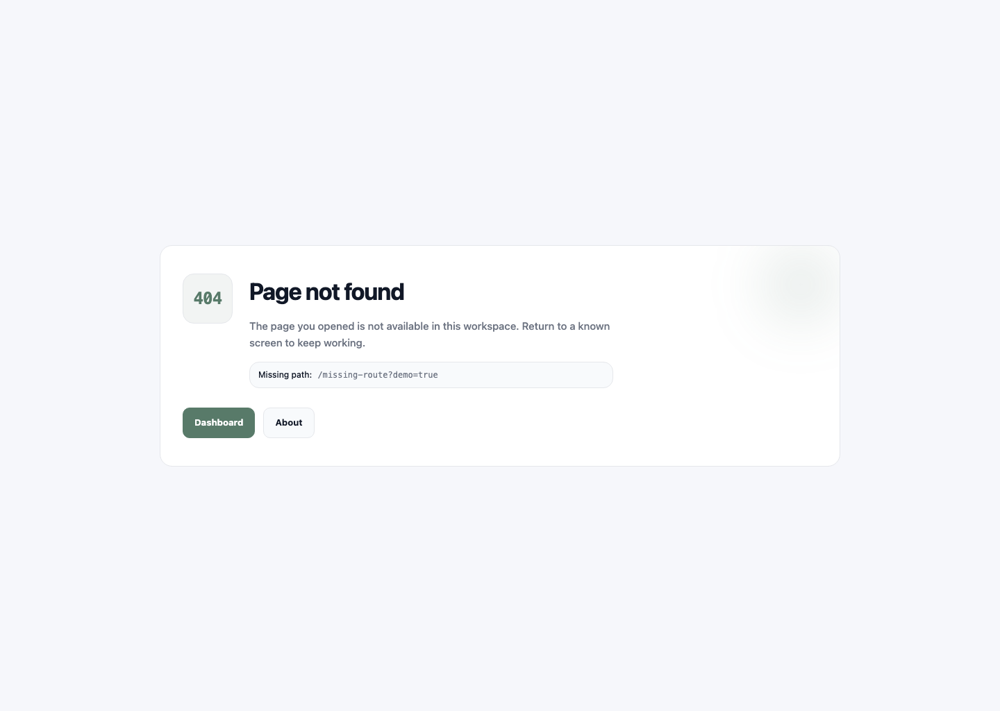
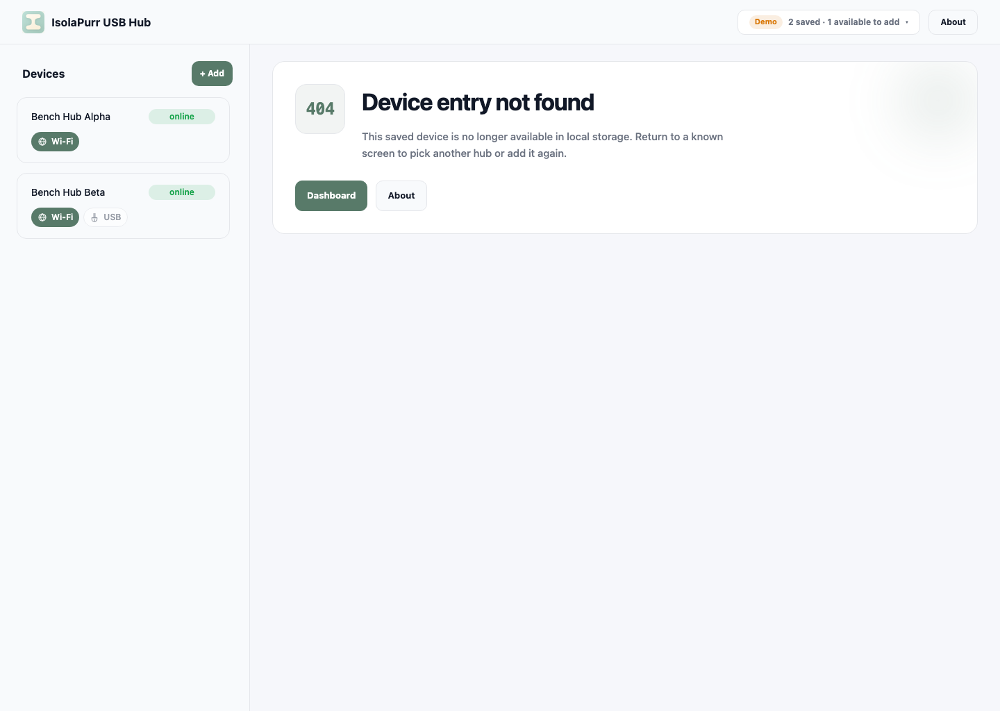

# Web error states（#kk6gk）

> 当前有效规范以本文为准；实现覆盖与当前状态见 `./IMPLEMENTATION.md`，关键演进原因见 `./HISTORY.md`。

## 背景 / 问题陈述

- 现状：Web console 之前把未知路由 fallback 放在 `AppLayout` 内，未命中页面会混入正常控制台壳子。
- 问题：当用户直接打开一个不存在的 URL，或访问一个已失效的保存设备路由时，界面缺少明确、独立且可复用的错误态语义。
- 如果没有这份 spec，404 fallback、缺失设备状态、后续 401/403 等错误页会继续散落在路由和页面实现里，难以保持一致。

## 目标 / 非目标

### Goals

- 为 Web console 定义独立的页面级 `404` 错误页，不依赖 `AppLayout`。
- 定义保存设备不存在时的页内错误态，用于设备详情相关路由。
- 提供统一、可复用的错误页骨架，约束标题、动作入口、语义 landmark 和视觉证据。

### Non-goals

- 本 spec 不接入真实的 `401/403` 授权或权限错误页。
- 不改 Dashboard、About、设备详情正常态的信息架构。
- 不为错误页引入额外的 demo-only 页面或新的运行时路由层。

## 范围（Scope）

### In scope

- 未命中路由的独立页面级 `404` fallback。
- 设备详情页在 `deviceId` 缺失对应保存设备时的页内错误态。
- 统一错误页骨架、返回动作、focus-visible、`main` landmark 与路径文案展示规则。
- 该主题的 owner-facing 视觉证据与 PR 复用规则。

### Out of scope

- 认证、授权或后端错误码驱动的错误页体系。
- 非 Web surface 的错误显示。
- 本地化、多语言文案体系扩展。

## 需求（Requirements）

### MUST

- 未命中路由必须渲染独立页面级 `404`，且不得出现 `AppLayout` 的头部、侧栏或设备列表。
- 页面级 `404` 必须显示：
  - `404` code badge
  - 标题 `Page not found`
  - 未命中路径说明
  - 返回入口 `Dashboard` 与 `About`
- 页面级 `404` 的根节点必须提供 `main` landmark。
- 页面级 `404` 中的 missing path 必须展示 `pathname + search + hash`，并在窄视口与长字符串场景下稳定换行，不产生横向滚动。
- 设备详情相关路由在 `deviceId` 无法匹配保存设备时，必须渲染页内错误态 `Device entry not found`。
- 缺失设备错误态必须沿用同一错误页骨架，并提供 `Dashboard` 与 `About` 两个返回入口。
- 错误页动作必须具备统一且可见的 `focus-visible` 状态。
- 页面级 `404` 与缺失设备错误态都必须有稳定的 owner-facing visual evidence，且可被 PR 正文复用。

### SHOULD

- 错误页骨架应保持后续扩展到 `401/403` 等状态的形状稳定。
- 页面级 `404` 与页内错误态应共享色彩、按钮和间距语义，避免形成第二套视觉语言。

### COULD

- 后续可以在不破坏当前 contract 的前提下，为更多错误态复用本骨架。

## 功能与行为规格（Functional/Behavior Spec）

### Core flows

- 当浏览器命中未知路由时，路由系统直接渲染页面级 `404`。
- 当浏览器命中 `devices/:deviceId`、`devices/:deviceId/info`、`devices/:deviceId/power` 且 store 中找不到对应设备时，页面内容区域渲染缺失设备错误态。

### Edge cases / errors

- 页面级 `404` 中的 missing path 对长 query/hash 必须换行，不得破坏容器圆角与布局节奏。
- 缺失设备错误态是“路由存在但资源失效”的语义，不得退化为全局页面级 `404`。

## 接口契约（Interfaces & Contracts）

None.

## 验收标准（Acceptance Criteria）

- Given 浏览器直接访问不存在的路由
  When 页面完成渲染
  Then 只显示独立 `404` 页面，不显示控制台头部或侧栏。

- Given 浏览器访问不存在的路由且路径包含 search/hash
  When 页面完成渲染
  Then `Missing path` 展示完整路径，并在窄视口下稳定换行。

- Given 浏览器访问 `devices/:deviceId*` 路由且对应保存设备不存在
  When 页面完成渲染
  Then 在正常控制台壳内显示 `Device entry not found` 错误态，并提供 `Dashboard` 与 `About` 两个动作。

- Given 用户通过键盘聚焦错误页动作按钮
  When `focus-visible` 生效
  Then 动作具备统一且高对比的 focus ring。

## 验收清单（Acceptance checklist）

- [x] 页面级 `404` 的长期行为已被明确描述。
- [x] 缺失设备错误态与全局 `404` 的边界已被明确描述。
- [x] 该主题不新增接口契约。
- [x] 视觉证据与 PR 复用规则已经写清楚。

## 非功能性验收 / 质量门槛（Quality Gates）

### Testing

- E2E tests: unknown routes must render standalone `404`.

### UI / Storybook (if applicable)

- Storybook stories to add/update:
  - `Pages/NotFoundPage`
  - `Errors/MissingDeviceState`
- `play` coverage must verify headings and return actions.

### Quality checks

- `cd web && bun run check`
- `cd web && bun run build`
- `cd web && bun run test:storybook`
- `cd web && bun run test:e2e`

## Visual Evidence

PR: include
Standalone page-level 404 rendered outside `AppLayout` in the real browser viewport.

PR: include
Missing saved-device state rendered inside the normal console shell in the real browser viewport.

## Related PRs

- PR #94 `feat: add standalone 404 page`

## 风险 / 开放问题 / 假设（Risks, Open Questions, Assumptions）

- 风险：后续若引入 401/403，而不复用当前错误骨架，可能再次产生视觉漂移。
- 需要决策的问题：401/403 是否继续复用本 spec，还是另开子主题 spec。
- 假设：当前主题只覆盖 Web demo / console 内的前端错误态，不依赖后端错误页协议。

## 参考（References）

- `web/src/pages/NotFoundPage.tsx`
- `web/src/ui/errors/ErrorState.tsx`
- `web/src/ui/errors/MissingDeviceState.tsx`
- `web/README.md`
