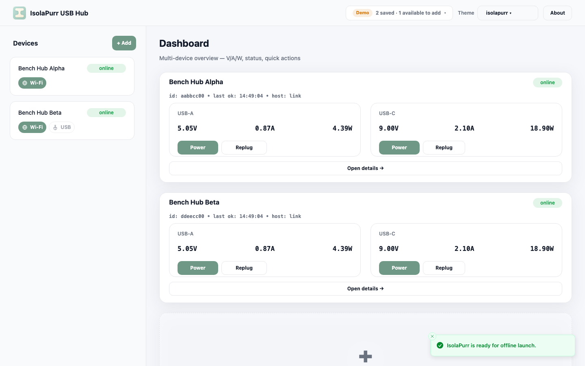
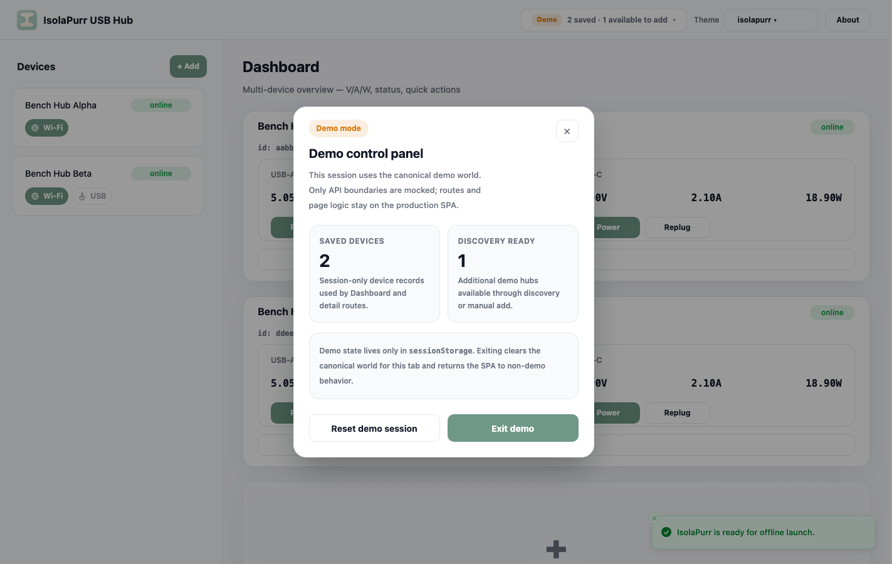
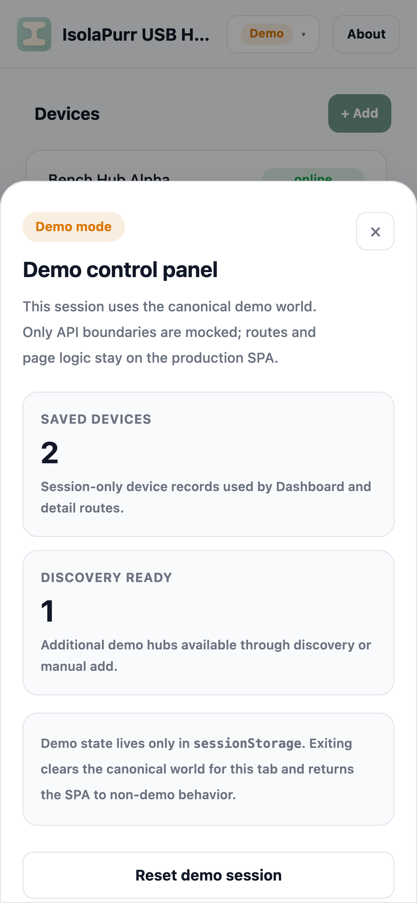
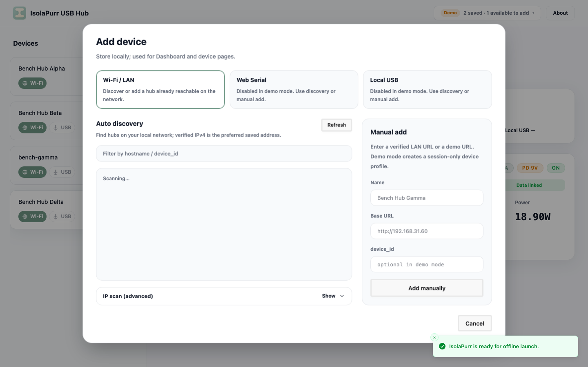

# Web Demo Surface Policy

## Background

The Web console uses three different owner-facing evidence surfaces today:

- the production SPA routes in `web/src/App.tsx`
- composite Storybook stories such as `Panels/DevicePowerPanel`
- spec-owned `## Visual Evidence` captures that point to stable mock-only or
  live evidence

This arrangement is useful only when each surface keeps a clear role.
Unbounded demo pages or arbitrary route/query toggles inside the production SPA
make the Web surface harder to reason about, and page-level Storybook stories
blur the line between route verification and component verification. The
repository needs a single policy that defines which Web demo surfaces are
allowed and how future exceptions are approved.

## Goals

- Preserve the production SPA routes as the only app-level owner-facing pages
  under `web/`.
- Preserve Storybook as a formal mock-only verification surface for reusable
  components and composite UI surfaces.
- Preserve spec `## Visual Evidence` blocks as the canonical place to bind
  owner-facing screenshots to a documented state.
- Prevent ad hoc Web demo routes, uncontrolled query toggles, and page-level
  Storybook stories from reappearing.

## Non-goals

- Rebuilding the existing Storybook architecture around smaller primitives.
- Replacing current `Panels/*`, `Layouts/*`, `Dialogs/*`, `Cards/*`, or similar
  composite verification stories.
- Changing product behavior, power semantics, hardware contracts, or transport
  APIs.
- Defining a blanket policy for non-Web preview systems such as firmware
  display previews.

## Requirements

- `demo surface` in this repository MUST mean either the formal production SPA
  demo mode defined here or a temporary exception surface explicitly approved
  by a spec update first.
- The production SPA MUST NOT add dedicated demo routes such as `/demo/*`.
- The production SPA MAY expose exactly one formal demo-mode query contract:
  `?demo=true` enters the canonical demo world for the current browser session,
  and `?demo=false` exits that demo world for the current browser session.
- The production SPA MUST NOT add any other `demo` query values, ad hoc query
  toggles, scenario selectors, or equivalent app-level demo controls without a
  further spec update.
- The formal SPA demo mode MUST reuse the production routes and production
  page/provider logic. It MUST NOT fork to a separate app shell or page tree.
- The formal SPA demo mode MUST mock only the front-end API boundary needed for
  bootstrap, storage, discovery, and device APIs.
- The formal SPA demo mode MUST keep demo world state only in `sessionStorage`.
  It MUST NOT overwrite real saved devices, desktop storage, Web Serial state,
  Local USB state, or other real owner data.
- The formal SPA demo mode MUST keep one canonical demo world in v1. It MUST
  NOT expose a scenario switcher or page-level Storybook route replacement as
  the default owner-facing demo surface.
- The formal SPA demo mode MAY expose one header-level demo control panel for
  the canonical world, provided it remains inside the production app shell,
  keeps `?demo=true|false` as the only demo route contract, and does not turn
  into a scenario switcher.
- Storybook MUST remain the formal mock-only verification surface for reusable
  components and composite surfaces, including `Panels/*`, `Layouts/*`,
  `Dialogs/*`, and `Cards/*`.
- Storybook MUST NOT host page-level stories under `web/src/pages/*.stories.*`
  as the normal verification path for production routes.
- Owner-facing screenshot evidence for Web UI changes MUST continue to bind to
  stable states through spec `## Visual Evidence` sections instead of informal
  chat-only route references.
- When a task needs route-level validation, it MUST use the production SPA page
  itself, the formal SPA demo mode defined here, an approved live HIL/browser
  path, or a spec-owned evidence capture; it MUST NOT add a dedicated demo page
  or uncontrolled route toggle.
- The repository MUST treat current production routes, composite Storybook
  stories, spec-owned visual evidence, and the formal SPA demo mode as the
  only default allowed Web verification surfaces.
- The repository MUST ship with no active exception whitelist for extra Web
  demo pages or routes beyond the formal SPA demo mode.
- Any future exception to the no-demo-page rule MUST be approved by updating a
  spec that names the exact surface, purpose, ownership boundary, and
  acceptance path before the implementation lands.
- Repository contract tests MUST fail if page-level Storybook stories under
  `web/src/pages/` are reintroduced.
- Repository contract tests MUST fail if production routing adds `/demo/*`,
  page-level Storybook stories, or any `demo` entrypoint in `web/src/App.tsx`
  other than the controlled `?demo=true|false` contract.

## Acceptance Criteria

- Given the repository after this policy lands, when the Web source tree is
  scanned, then no `web/src/pages/*.stories.*` files exist.
- Given the production Web router, when `web/src/App.tsx` is checked, then it
  contains no `/demo/` routes, no uncontrolled `demo` query toggles, and no
  extra demo entrypoints beyond the controlled `?demo=true|false` contract.
- Given the production SPA is opened with `?demo=true`, when the owner navigates
  across formal routes, then the app stays on those same production routes
  while preserving demo mode in the current browser session.
- Given demo mode is active, when the owner uses the header demo affordance,
  then the SPA opens a single demo control panel instead of separate badge and
  exit controls, using a desktop modal and a mobile drawer/sheet.
- Given the production SPA is opened with `?demo=false` or the demo exit
  affordance is used, when the owner leaves demo mode, then the current browser
  session clears the canonical demo world and returns to ordinary non-demo
  behavior.
- Given Storybook coverage for the Web console, when maintainers add or update
  UI verification stories, then composite `Panels/*`, `Layouts/*`, `Dialogs/*`,
  or `Cards/*` stories remain allowed while page-level route stories remain
  disallowed.
- Given a Web task needs owner-facing visual evidence, when the final evidence
  is documented, then the capture is referenced from a spec `## Visual
  Evidence` section instead of an undocumented demo route.
- Given a future task proposes a Web demo page exception, when the repository
  is reviewed, then the exception is blocked unless a spec explicitly defines
  the surface, purpose, and acceptance boundary first.

## Visual Evidence

- Evidence SHA: `ecafbb7b025f1ede4ba5ebd4a8f9499a6e34e8ef`
- Formal SPA dashboard in canonical demo mode on `/?demo=true`, showing the
  unified header demo affordance and the canonical session-backed device world:
  
- Formal SPA demo control panel on desktop, using a modal inside the
  production app shell:
  
- Formal SPA demo control panel on mobile, using a drawer/sheet inside the
  production app shell:
  
- Formal SPA detail flow after demo-only discovery success and manual add
  success, both staying on production routes with `?demo=true` preserved:
  
