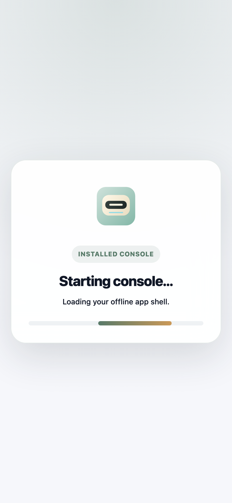
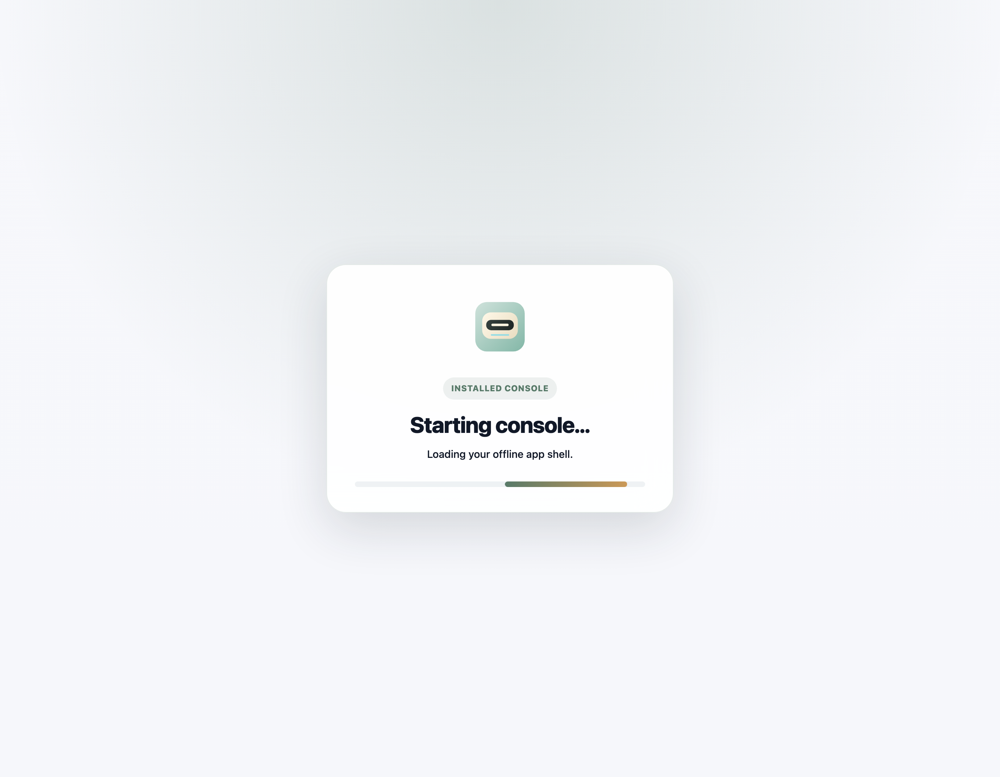
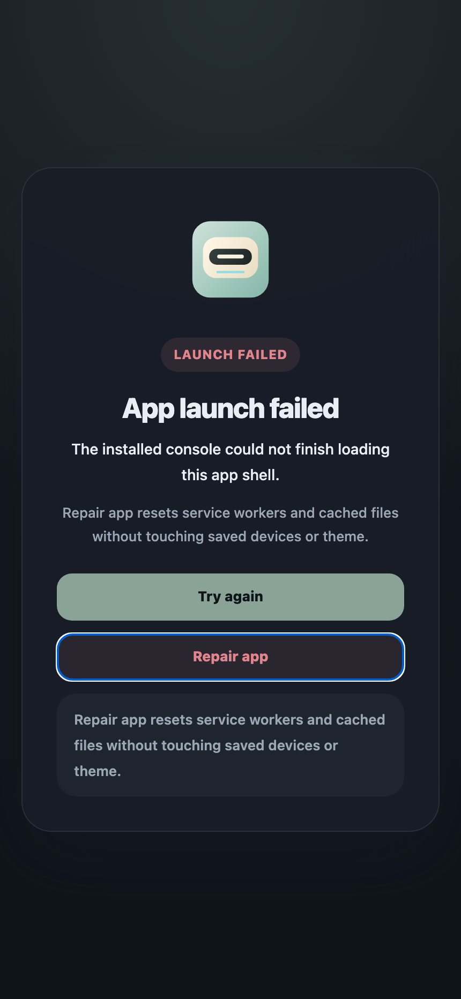
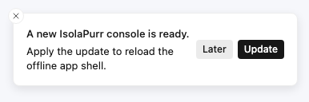

# PWA 启动壳与启动恢复（#tfzd3）

> 当前有效规范以本文为准；实现覆盖与当前状态见 `./IMPLEMENTATION.md`，关键演进原因见 `./HISTORY.md`。

## 背景 / 问题陈述

- 现状：已安装 PWA 在 GitHub Pages 发布新版本后，旧缓存的 `index.html` 可能继续引用已删除的 hash bundle。
- 问题：一旦入口脚本 `404`、service worker 卡在旧壳，或主应用迟迟没有挂载，用户只能看到白屏，且没有可解释的恢复入口。
- 如果没有这份 spec，启动壳、失败壳、自愈状态机和发布侧旧资源保留窗口会分别散落在 `index.html`、PWA 注册逻辑和 Pages workflow 里，后续很容易再次漂移回“自杀式白屏”。

## 目标 / 非目标

### Goals

- 为已安装 PWA 冷启动定义独立于 React bundle 的品牌启动壳。
- 为启动失败定义可解释、可恢复的失败壳，先自动恢复，再暴露手动入口。
- 保持健康会话的 `prompt` 更新体验，只在故障启动路径上自动接管恢复。
- 为健康会话补主动更新发现调度层，让 owner 不必完全依赖手动重开才能发现新版本。
- 为 GitHub Pages 发布定义短期旧 hash 资源保留窗口，避免 stale `index.html` 立即打到 `404`。
- 为该主题绑定稳定的视觉证据与自动化回归，阻止白屏回归重新进入主干。

### Non-goals

- 不把更新策略改成默认强制自动刷新。
- 不清空设备列表、主题、保存设备等本地持久数据。
- 不修改设备协议、host tools、CLI 或托管平台。
- 不新增生产 `demo/*` 页面或新的 app-level 路由。

## 范围（Scope）

### In scope

- `web/index.html` 级别的启动壳、失败壳、超时与错误监听。
- React 主应用挂载成功信号与启动失败上报桥接。
- 启动故障态下的 service worker `waiting` 激活、自愈 reload、缓存清理恢复动作。
- GitHub Pages 发布产物的旧 hash 资源 retention 清单与并包规则。
- Storybook 启动壳 visual evidence 与 Playwright 回归。

### Out of scope

- 非已安装浏览器页强制显示同样的启动壳。
- 离线设备状态、设备在线判断或通信协议语义改写。
- 全量 Local Storage / IndexedDB reset 恢复策略。

## 需求（Requirements）

### MUST

- 已安装 PWA 每次冷启动必须先进入品牌启动壳，不得先出现纯白或纯空白窗口。
- 启动壳必须在 React 入口之前可用，不能依赖主 bundle 成功加载后才显示。
- 当入口脚本加载失败、运行期出现同源脚本错误、启动超时或恢复后仍未进入应用时，必须切换到失败壳。
- 失败壳必须先自动执行恢复流程，再提供 `Try again` 与 `Repair app` 两个动作。
- `Repair app` 只能重置 service worker 与静态缓存，不得清空保存设备、主题或其他 owner 数据。
- 健康会话检测到新版本时，仍必须保持现有 `prompt` 更新模式。
- 健康会话在 service worker 注册完成、回到前台、重新联网以及 60 分钟节流轮询时，必须主动执行一次 `sw.js` no-store 探测与 `registration.update()` 检查。
- 当 owner 在健康会话里对某一候选更新点击 `Later` 时，同一标签页会话内不得重复提示同一候选更新；下一次启动仍应自然进入新版本。
- 故障启动路径必须优先尝试激活 `waiting` service worker 并 reload；只有该路径无效时，才进入失败壳并允许缓存修复。
- GitHub Pages 发布产物必须同时包含当前版本和 retention 窗口内仍受支持的旧 hash 资源。
- retention 窗口必须满足“最近两版或 14 天，以较晚到达者为准”的保留规则。
- stable 发布环境存在 GitHub Release 访问能力时，retention 必须优先从既有 stable Release 的 web-dist 资产恢复旧 hash 资源；不得只依赖当前线上 Pages manifest 作为历史真相源。
- 启动壳与失败壳都必须有稳定 visual evidence；自动化必须覆盖健康冷启动、stale shell 404、自愈成功、失败壳修复且设备数据保留。

### SHOULD

- 启动壳与失败壳应保持品牌一致的色彩、文案和动效节奏。
- 启动超时与恢复状态应给出明确状态文案，避免用户误判为死机。
- retention 清单应作为发布物的一部分显式落盘，便于后续淘汰与审计。

### COULD

- 后续可以在不破坏当前 contract 的前提下，给失败壳增加更多诊断信息。

## 功能与行为规格（Functional/Behavior Spec）

### Core flows

- 当已安装 PWA 冷启动时，`index.html` 立即渲染启动壳，并等待主应用通过挂载信号隐藏该壳。
- 当启动阶段检测到 `waiting` service worker 且当前会话属于故障恢复态时，启动壳先发送 `SKIP_WAITING`，等待 `controllerchange` 后 reload。
- 当自动恢复无法让应用进入可挂载状态时，启动壳切换到失败壳并显示手动动作。
- 当用户点击 `Repair app` 时，运行时注销现有 service worker、清理 Cache Storage、保留持久数据，然后 reload。
- 当健康会话的 service worker 注册完成、页面重新可见、网络重新联通或 60 分钟轮询触发时，运行时对 `sw.js` 发起 `cache: "no-store"` 探测；只有脚本指纹变化时才调用 `registration.update()`。
- 当健康会话的更新 toast 被 owner 用 `Later` 关闭时，运行时把该候选更新指纹记录到标签页级会话存储，并对同一候选更新静默到本次标签页结束。
- 当 Pages 发布新版本时，构建脚本优先从 GitHub stable Release 的 web-dist 资产读取仍受支持的旧 hash 资源；没有 GitHub Release 凭证的本地/bootstrap 路径才退回线上 retention 清单或线上 `sw.js`。脚本把这些旧资源并入当前 `dist/`，再写出新的 `asset-retention.json`。

### Edge cases / errors

- 非 standalone / 非安装态的普通浏览器页可以不显示启动壳，但仍应保留正常 app 加载行为。
- 启动恢复路径只接管 startup failure，不得把健康会话的常规更新体验变成默认强刷。
- 若没有可激活的 `waiting` worker，失败壳必须仍然可用，并允许用户显式执行 `Repair app`。
- 缓存修复后必须保留保存设备与主题设置，不能把恢复成功建立在“丢失 owner 数据”之上。

## 接口契约（Interfaces & Contracts）

- `window.__ISOLAPURR_PWA_BOOT__`
  - `markAppMounted(): void`
  - `reportStartupFailure(detail?: unknown): void`
- 发布工件新增：
  - `web/public/boot-shell.js` 作为稳定路径启动恢复运行时
  - `dist/asset-retention.json` 作为 Pages 旧资源保留清单

## 验收标准（Acceptance Criteria）

- Given 已安装 PWA 正常冷启动
  When 页面首帧开始渲染
  Then 用户先看到品牌启动壳，随后稳定切入主应用，过程中不出现纯白屏。

- Given 旧缓存 `index.html` 引用了已经删除的入口 bundle
  When PWA 冷启动
  Then 运行时必须先尝试激活 `waiting` service worker 并 reload，成功时直接恢复进入主应用。

- Given stale shell 恢复后仍无法挂载主应用
  When 启动恢复流程结束
  Then 页面进入失败壳，并提供 `Try again` 与 `Repair app` 两个动作。

- Given 用户点击 `Repair app`
  When service worker 与静态缓存被重置并重新加载
  Then 保存设备、主题等本地数据仍被保留。

- Given 健康会话在运行中检测到新版本
  When 新 service worker 进入 `waiting`
  Then 页面继续使用 prompt toast，让用户主动点击更新。

- Given 健康会话已完成 service worker 注册
  When 页面启动、回到前台、重新联网或命中 60 分钟轮询
  Then 运行时主动检查 `sw.js` 与 service worker 更新。

- Given owner 对某一候选更新点击 `Later`
  When 同一标签页会话内再次检测到同一候选更新
  Then 页面不再重复弹出该候选更新 toast。

- Given GitHub Pages 构建发布新版本
  When 产物打包完成
  Then `dist/` 中同时包含当前 hash 资源与 retention 窗口内的旧 hash 资源，并写出对应 `asset-retention.json`。

## 验收清单（Acceptance checklist）

- [x] 启动壳、失败壳、自愈状态机的 owner-facing 行为已冻结。
- [x] 健康会话 `prompt` 与故障启动自动修复的边界已冻结。
- [x] Pages retention 窗口与产物清单 contract 已冻结。
- [x] 视觉证据与自动化覆盖面已经写清楚。

## 非功能性验收 / 质量门槛（Quality Gates）

### Testing

- `cd web && bun run test:unit`
- `cd web && bun run check`
- `cd web && bun run build`
- `cd web && bun run build-storybook`
- `cd web && bun run test:storybook`
- `cd web && bun run test:e2e`

### UI / Storybook (if applicable)

- Storybook stories to add/update:
  - `PWA/StartupShell`
  - `PWA/UpdateToast`
- `play` coverage must verify failed-state recovery buttons.

### Release / workflow

- `.github/workflows/release.yml` must run the retention step for stable public deploy builds.
- `.github/workflows/pages.yml` must limit itself to PR build checks and `release_tag` backfill.
- `web/scripts/retain-pages-assets.ts` must remain able to bootstrap from live `sw.js` when `asset-retention.json` does not exist yet.
- `web/scripts/retain-pages-assets.ts` must prefer authenticated GitHub Release web-dist assets when `GITHUB_REPOSITORY` and `GITHUB_TOKEN` are present, so a truncated live Pages manifest cannot drop still-supported releases.

## Visual Evidence

PR: include
Installed-PWA cold-start launching shell rendered from the standalone Storybook mobile light state.

PR: include
Installed-PWA cold-start launching shell rendered from the standalone Storybook desktop light state.

Acceptance note:
The primary startup headline stays on one line in the desktop light state; this launch-critical text must not wrap.

PR: include
Installed-PWA startup failure shell rendered from the standalone Storybook mobile dark state, including recovery actions.

PR: include
Healthy-session update prompt rendered from the controlled `PWA/UpdateToast` Storybook surface, showing the owner-facing `Later` and `Update` actions.

## Related PRs

- None yet.

## 风险 / 开放问题 / 假设（Risks, Open Questions, Assumptions）

- 风险：若 GitHub Pages CDN 或外层缓存对 `index.html` 滞留过久，retention 窗口过短仍可能放大旧壳命中概率。
- 风险：若未来 stable Release 停止上传 web-dist 资产，Pages retention 会按合同失败而不是静默重建历史版本。
- 风险：如果未来把设备关键数据迁移到 Cache Storage，当前“修复应用不清数据”的前提会失效，需要更新本 spec。
- 需要决策的问题：未来是否需要把失败壳的诊断信息提升到可复制的错误摘要。
- 假设：保存设备、主题等 owner 数据当前位于独立于 service worker/cache 的持久层。

## 参考（References）

- `web/index.html`
- `web/public/boot-shell.js`
- `web/src/pwa/boot-shell-client.tsx`
- `web/src/pwa/register.ts`
- `web/src/pwa/PwaStartupShell.tsx`
- `web/scripts/retain-pages-assets.ts`
- `.github/workflows/pages.yml`
- `docs/web-ui-interaction-spec.md`
