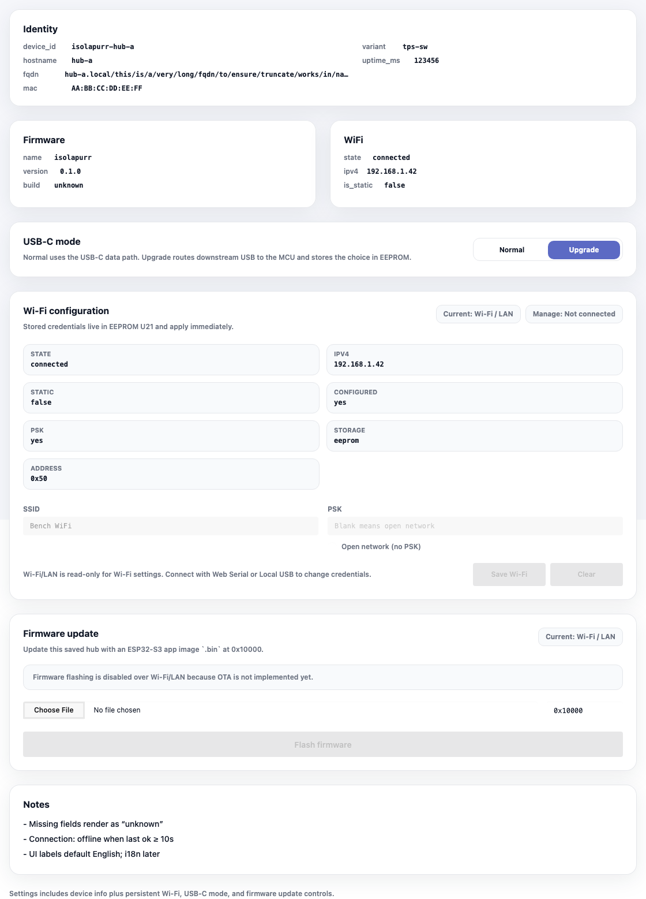
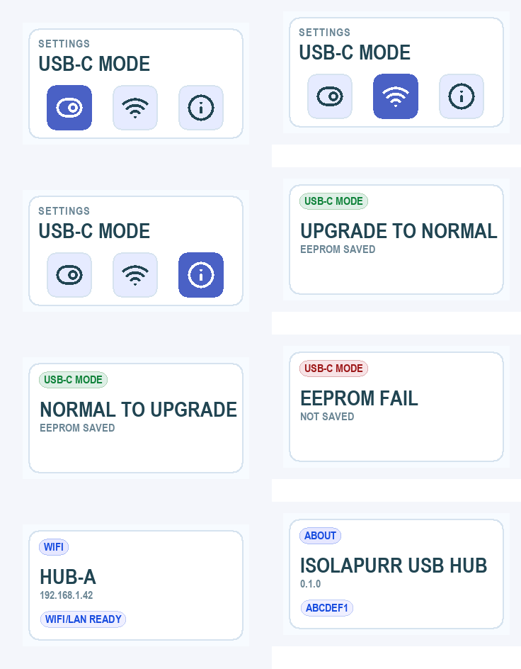

# USB-C 下行通道路由切换

## 背景 / 问题陈述

USB-C 对应的 Hub 下行通道需要在 MCU USB 数据路径与外部 USB-C 数据路径之间切换。该选择必须能通过 Web UI 和硬件按键实时改变，并保存到板载 EEPROM U21，保证重启后恢复上次选择。

现有硬件使用 CH442E U8 作为 USB-C/ESP/TPS 数据路径开关：`P2_CED` 控制 `EN#`，`P1_ESP` 控制 `IN`。`P2_CED=low` 使能连接，`P2_CED=high` 断开；`P1_ESP=low` 选择 `ESP_DP/ESP_DM`，`P1_ESP=high` 选择 `DP_TPS/DM_TPS`。

## 目标 / 非目标

### Goals

- 固件提供 `MCU` / `USB-C` 两种 USB-C 下行 route，并通过 `P1_ESP/GPIO5` 实时切换。
- 切换时先断开 `P2_CED`，设置 `P1_ESP`，再按 USB-C 当前 power/data 状态恢复 `P2_CED`。
- route 保存到 EEPROM U21 `0x50` 的独立 device settings record，不覆盖 Wi-Fi provisioning record。
- HTTP API、USB JSONL、Web UI 和硬件菜单使用同一套 route 状态与 busy/error 语义。
- Web UI 在设备设置界面展示二段模式控件，并能提示 pending、busy、EEPROM 写入失败等结果。

### Non-goals

- 不改变 USB-A replug/power 行为。
- 不改变 Wi-Fi EEPROM record 的字段布局。
- 不实现 USB 枚举成功检测、自动恢复或主机侧拓扑验证。
- 不自动 flash 实机，不自动选择或修改 `.esp32-port`。

## 范围

### In scope

- 固件启动时读取 USB-C route；空记录或坏记录默认 `MCU` / `Upgrade`，且不自动回写。
- route 切换动作写入 EEPROM；写入失败时对调用方返回 `eeprom_failed`，并在本次运行中保留当前硬件 route 状态但标记未持久化。
- `GET /api/v1/ports` 与 USB JSONL `ports.get` 返回 route 状态。
- `POST /api/v1/hub/usb-c-downstream-route?route=mcu|usb_c` 与 USB JSONL `hub.route_set` 设置 route。
- 双键长按 `1000-5000ms` 进入横向设置菜单；菜单包含 `MODE`、`WIFI`、`ABOUT`。
- 菜单内左键短按向左移动光标，右键短按向右移动光标，双键短按在主菜单里进入当前项详情页；在 `MODE` 详情页再次双键短按才切换 `Normal` / `Upgrade` 并保存 EEPROM，`WIFI` 显示网络信息，`ABOUT` 显示固件信息。

### Out of scope

- 新增独立设置页。
- 改动 PD 协同策略、TPS 输出策略或 USB-C 电源策略。
- 对旧 firmware 的 Web UI route 写入做兼容 polyfill。

## 需求

### MUST

- `MCU` / `Upgrade` 为默认 route。
- route EEPROM record 必须包含 magic、version、route byte 和 checksum。
- route EEPROM record 必须使用独立 offset，不得覆盖 Wi-Fi record offset `0` 长度 `160`。
- `P1_ESP=low` 必须表示 `MCU`，`P1_ESP=high` 必须表示 `USB-C`。
- route 切换期间必须先 `P2_CED=high` 断开数据路径。
- USB-C 端口 busy、已有 route 切换 pending 时，新的 route 请求必须返回 busy 且不改变 route。
- route API 成功响应必须表示 EEPROM 写入已成功；写入失败必须返回 `eeprom_failed`。
- `ports.get` / `GET /api/v1/ports` 必须包含 `hub.usb_c_downstream_route` 与 `hub.usb_c_downstream_persisted`。
- Web UI 每张端口卡片必须保留完整端口状态信息：端口健康状态、电源开关状态、数据连接或 replugging 状态、Voltage、Current、Power、Power 操作和 Replug 操作。
- Web UI route 控件必须作为设备设置呈现，不得放入 USB-A 或 USB-C 端口状态卡片，也不得放入 dashboard 概览卡。
- Web UI 必须用用户语义展示 `Normal` / `Upgrade` 模式：`Normal` 对应 `USB-C` route，`Upgrade` 对应 `MCU` route。
- Web UI 成功保存模式后必须使用 toast 反馈；设置卡片内不得常驻显示成功状态，未持久化异常状态必须单行显示。
- Web UI USB-A 与 USB-C 端口卡片在同一 dashboard 行内必须保持相同尺寸；不得通过隐藏状态信息、加入不支持的操作或为空间填充预留 route 区域来达成等高。
- 硬件屏幕菜单必须横向显示 `MODE   WIFI   ABOUT`，并用光标指示当前项。
- 硬件屏幕必须用用户语义显示模式结果：`USB-C MODE / NORMAL / SAVED` 或 `USB-C MODE / UPGRADE / SAVED`。

### SHOULD

- Web UI route 控件应位于设备设置界面，与 Wi-Fi configuration 等持久化配置同层级。
- Web UI 应在 legacy firmware 未返回 route 字段时默认显示 `Upgrade`，但不宣称已持久化。
- 固件屏幕 toast 和提示音应沿用现有操作确认/拒绝反馈；硬件菜单进入、左右移动光标、确认菜单项均必须有短促确认音。

## 接口契约

### HTTP

- `GET /api/v1/ports`
  - `hub.usb_c_downstream_route`: `"mcu" | "usb_c"`
  - `hub.usb_c_downstream_persisted`: `boolean`
- `POST /api/v1/hub/usb-c-downstream-route?route=mcu|usb_c`
  - 成功：`200 OK {"accepted":true,"usb_c_downstream_route":"mcu|usb_c","persisted":true}`
  - Busy：`409 {"error":{"code":"busy",...}}`
  - EEPROM 写入失败：`500 {"error":{"code":"eeprom_failed",...}}`

### USB JSONL

- `ports.get` 返回与 HTTP `GET /api/v1/ports` 等价的 hub route 字段。
- `hub.route_set` 参数：`{"route":"mcu"|"usb_c"}`。
- `hub.route_set` 成功 result：`{"accepted":true,"usb_c_downstream_route":"mcu|usb_c","persisted":true}`。

## 验收标准

- Given EEPROM 无 route record，When 固件启动，Then route 默认为 `USB-C` 且 `usb_c_downstream_persisted=false`。
- Given EEPROM 有合法 route record，When 固件启动，Then `P1_ESP` 与 API route 均反映该记录。
- Given USB-C 端口 idle，When Web 设置 route 为 `mcu`，Then 固件先断开 `P2_CED`，切换 `P1_ESP=low`，保存 EEPROM，并返回成功。
- Given USB-C 端口 busy，When Web 或 USB JSONL 设置 route，Then 返回 busy 且 route 不变。
- Given EEPROM 写入失败，When 设置 route，Then 返回 `eeprom_failed`，屏幕显示失败 toast，提示音播放拒绝音，API 标记未持久化。
- Given 双键长按 `1000-5000ms`，When 菜单未打开，Then 屏幕进入横向设置菜单。
- Given 菜单打开，When 左键短按或右键短按，Then 光标分别向左或向右移动。
- Given 菜单光标位于 `MODE`，When 双键短按一次，Then 进入模式详情页并显示当前值；When 在详情页再次双键短按，Then 切换 `Normal` / `Upgrade`、保存 EEPROM，并显示模式保存 toast。
- Given 菜单光标位于 `WIFI`，When 双键短按，Then 显示网络信息 toast。
- Given 菜单光标位于 `ABOUT`，When 双键短按，Then 显示固件版本和 build 信息 toast。

## Visual Evidence

source_type: storybook_canvas  
target_program: mock-only  
capture_scope: browser-viewport  
requested_viewport: 1536x960  
viewport_strategy: devtools-emulate  
sensitive_exclusion: N/A  
submission_gate: pending-owner-approval  
story_id_or_title: `panels-deviceinfopanel--usb-c-mode-settings`  
state: Settings tab USB-C mode control  
evidence_note: verifies the Normal / Upgrade mode control lives in settings, without adding unsupported controls or empty space to USB-A/USB-C port cards.

source_type: firmware_display_preview  
target_program: mock-only  
capture_scope: embedded-display-framebuffer  
requested_viewport: 320x172 per frame  
viewport_strategy: host-side render that calls the same `src/display_ui/surface.rs` framebuffer backend and `src/display_ui/menu.rs` render functions as firmware  
sensitive_exclusion: N/A  
submission_gate: pending-owner-approval  
story_id_or_title: hardware settings menu and toasts  
state: MODE / WIFI / ABOUT menu, mode save/failure toasts, WiFi info, About  
evidence_note: verifies the hardware two-button menu and temporary status prompts from the same RGB565 framebuffer render path used by firmware.

## 参考

- `docs/netlist/tps-sw-checklist.md`
- `docs/specs/u5b2c-usb-console-provisioning/SPEC.md`
- `src/bin/main.rs`
- `src/provisioning.rs`
