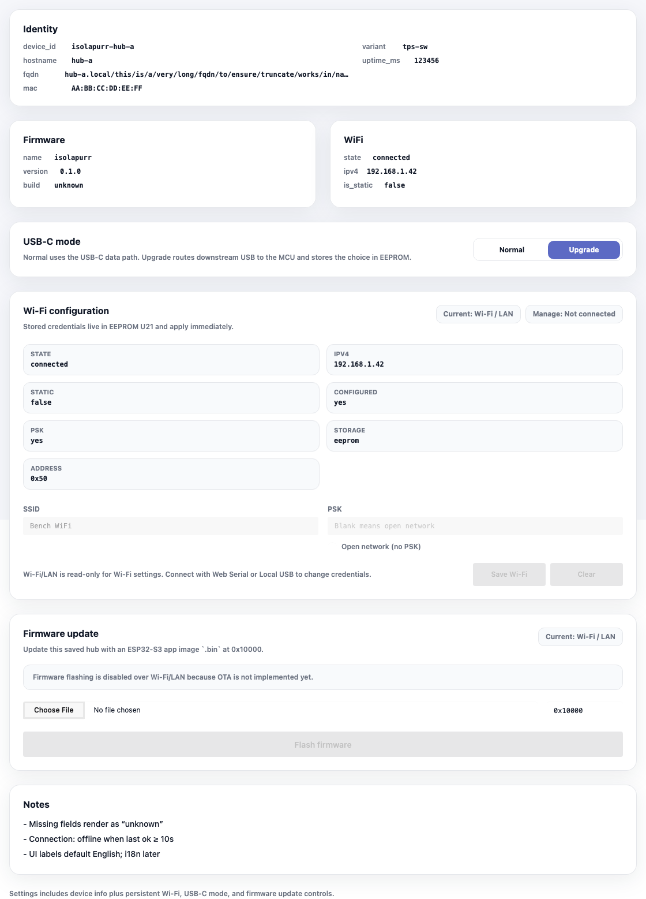
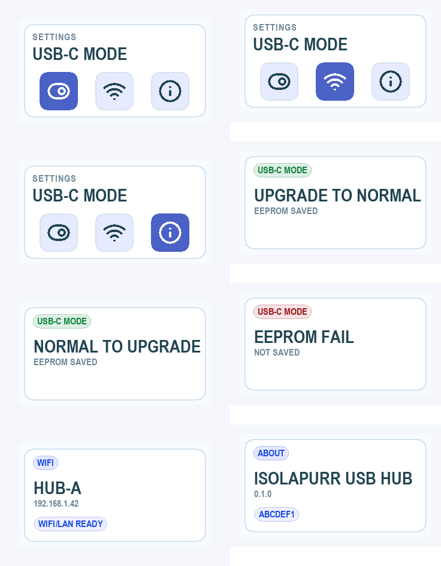

# USB-C 下行通道路由切换

## 背景 / 问题陈述

USB-C 对应的 Hub 下行通道需要在 MCU USB 数据路径与外部 USB-C 数据路径之间切换。该选择必须能通过 Web UI 和硬件按键实时改变，并保存到板载 EEPROM U21，保证重启后恢复上次选择。

现有硬件使用 CH442E U8 作为 USB-C/ESP/TPS 数据路径开关：`P2_CED` 控制 `EN#`，`P1_ESP` 控制 `IN`。`P2_CED=low` 使能连接，`P2_CED=high` 断开；`P1_ESP=low` 选择 `ESP_DP/ESP_DM`，`P1_ESP=high` 选择 `DP_TPS/DM_TPS`。

## 目标 / 非目标

### Goals

- 固件提供 `MCU` / `USB-C` 两种 USB-C 下行 route，并通过 `P1_ESP/GPIO5` 实时切换。
- 切换时先断开 `P2_CED`，设置 `P1_ESP`，再按 USB-C 当前 power/data 状态恢复 `P2_CED`。
- route 保存到 EEPROM U21 `0x50` 的独立 device settings record，不覆盖 Wi-Fi provisioning record。
- HTTP API、USB JSONL、Web UI 和硬件菜单使用同一套 route 状态与 busy/error 语义。
- Web UI 在设备设置界面展示二段模式控件，并能提示 pending、busy、EEPROM 写入失败等结果。

### Non-goals

- 不改变 USB-A replug/power 的兼容语义；`replug` 保持固定时长的数据脉冲，而不是数据链路开关。
- 不改变 Wi-Fi EEPROM record 的字段布局。
- 不实现 USB 枚举成功检测、自动恢复或主机侧拓扑验证。
- 不自动 flash 实机，不自动选择或修改 `.esp32-port`。

## 范围

### In scope

- 固件启动时读取 USB-C route；空记录或坏记录默认 `MCU` / `Upgrade`，且不自动回写。
- route 切换动作写入 EEPROM；写入失败时对调用方返回 `eeprom_failed`，并在本次运行中保留当前硬件 route 状态但标记未持久化。
- device-level `settings.reset scope=other` 擦除 route EEPROM record，并让运行态回到默认 `MCU` / `Upgrade` 且 `usb_c_downstream_persisted=false`，同时保留 Wi-Fi record。
- `GET /api/v1/ports` 与 USB JSONL `ports.get` 返回 route 状态。
- `POST /api/v1/hub/usb-c-downstream-route?route=mcu|usb_c` 与 USB JSONL `hub.route_set` 设置 route。
- 双键长按 `1000-5000ms` 进入横向设置菜单；菜单包含 `MODE`、`WIFI`、`ABOUT`。
- 菜单内左键短按向左移动光标，右键短按向右移动光标，双键短按在主菜单里进入当前项详情页；在 `MODE` 详情页再次双键短按才切换 `Normal` / `Upgrade` 并保存 EEPROM，`WIFI` 显示网络信息，`ABOUT` 显示固件信息。

### Out of scope

- 新增独立设置页。
- 改动 PD 协同策略、TPS 输出策略或 USB-C 电源策略。
- 对旧 firmware 的 Web UI route 写入做兼容 polyfill。

## 需求

### MUST

- `MCU` / `Upgrade` 为默认 route。
- route EEPROM record 必须包含 magic、version、route byte 和 checksum。
- route EEPROM record 必须使用独立 offset，不得覆盖 Wi-Fi record offset `0` 长度 `160`。
- `P1_ESP=low` 必须表示 `MCU`，`P1_ESP=high` 必须表示 `USB-C`。
- route 切换期间必须先 `P2_CED=high` 断开数据路径。
- USB-C 端口 busy、已有 route 切换 pending 时，新的 route 请求必须返回 busy 且不改变 route。
- route API 成功响应必须表示 EEPROM 写入已成功；写入失败必须返回 `eeprom_failed`。
- `ports.get` / `GET /api/v1/ports` 必须包含 `hub.usb_c_downstream_route` 与 `hub.usb_c_downstream_persisted`。
- Web UI 每张端口卡片必须保留完整端口状态信息：端口健康状态、电源开关状态、数据连接或 replugging 状态、Voltage、Current、Power、`Power` 操作和 `Data link` 操作。
- `Data link` 操作 MUST 使用固件 `data_set` capability，并在旧 firmware 缺少该 capability 时显示升级提示，不得回退调用 `replug`。它是运行时状态：断电强制断开，上电恢复连接，不写入 EEPROM。
- `Power` 与 `Data link` MUST 使用同一套二阶段短时按住交互：按下快照实际状态，约 600ms 切到反向目标，约 1250ms 在第一阶段确认后恢复初始目标；短按仅显示如何触发的帮助，结果必须以设备快照确认而非仅以动画确认。
- Web UI route 控件必须作为设备设置呈现，不得放入 USB-A 或 USB-C 端口状态卡片，也不得放入 dashboard 概览卡。
- Web UI 必须用用户语义展示 `Normal` / `Upgrade` 模式：`Normal` 对应 `USB-C` route，`Upgrade` 对应 `MCU` route。
- Web UI 成功保存模式后必须使用 toast 反馈；设置卡片内不得常驻显示成功状态，未持久化异常状态必须单行显示。
- Web UI USB-A 与 USB-C 端口卡片在同一 dashboard 行内必须保持相同尺寸；不得通过隐藏状态信息、加入不支持的操作或为空间填充预留 route 区域来达成等高。
- 硬件屏幕菜单必须横向显示 `MODE   WIFI   ABOUT`，并用光标指示当前项。
- 硬件屏幕必须用用户语义显示模式结果：`USB-C MODE / NORMAL / SAVED` 或 `USB-C MODE / UPGRADE / SAVED`。

### 共享二阶段端口控件设计契约

`TwoStageHoldButton` 是 `Power` 与 `Data link` 的唯一共享动作控件。它只能
使用这两个固定动作名称，并用于详情端口卡、Dashboard 缩略端口卡和 USB-C
侧栏；每个入口保留自己的 runtime adapter，但不得各自重写交互或视觉状态。

#### 布局与可见内容

- 每个按钮始终在左侧完整显示其动作名称，禁止省略号、截断、换行或以布局
  重排来交换可读性。既有端口卡尺寸、横向动作排列、间距和信息层级是稳定
  布局合同，修复名称显示不得将动作改为纵向堆叠或改变卡片结构。
- 右侧反馈区始终只包含一个状态图标。可见按钮内禁止出现 `On`、`Off`、
  `Hold`、`Applying`、`Enabled`、`Disabled`、`Restoring`、`Restored`、
  `Failed`、`Changed` 或同义状态文字。
- 图标反映最近一次已确认的实际端口状态：`Power` 使用 power-on / power-off，
  `Data link` 使用 data-linked / data-unlinked。禁用、忙碌、成功、失败和外部
  变化只改变图标色调与按钮本体反馈，不能替换为文字状态；禁用态使用 disabled
  token，绝不能保留绿色可用态含义。
- 操作说明、设备确认过程和错误原因不占用按钮空间。它们仅通过点击后 tooltip
  和无障碍 live region 提供，且不改变按钮或周边布局。

#### 二阶段保持与反馈

- 按下时控件快照设备已确认布尔状态 `S`。从 `0ms` 到约 `600ms`，按钮背景
  用单一连续填充从左向右显示第一阶段进度，目标为 `!S`；禁止分段轨道、双轨、
  环形进度或相邻进度块。
- 到达约 `600ms` 后，立即且仅一次请求 `!S`。只在设备确认后，图标切换为
  `!S` 的实际状态，按钮给出明确的 warning 边框、满背景和第一阶段确认动效。
  继续按住不会掩盖这个第一阶段终态。
- 从第一阶段完成到约 `1250ms`，同一背景填充从右向左回退，表示恢复原快照
  `S` 的第二阶段。第二阶段只可在第一阶段已确认且按住仍持续时排队；到阈值后
  仅一次请求 `S`，确认后图标恢复为 `S` 并给出 success 边框、背景和第二阶段
  确认动效。
- 请求与确认串行。第一阶段失败、取消、失焦、页面不可见、提前松开或外部
  状态变化时不得提交第二阶段。动画只表达进度，不能替代设备快照确认。

#### 拒绝、失败与说明

- 点击或不足 `600ms` 的松开不得发送命令，必须以 warning 边框和短促拒绝
  摇动反馈；实际状态图标保持不变。
- 忙碌或设备确认等待使用 warning 表面和单一背景方向，状态图标仍表示最近
  一次真实状态。
- 请求失败或外部状态变化使用 error 表面和短促失败摇动；图标随后以设备快照
  为准。失败文案只能进入 live region 与点击后 tooltip。
- tooltip 默认隐藏；hover、focus、按下、阶段完成、失败和状态刷新均不得自动
  显示。只有显式 click 才切换 tooltip。tooltip 必须位于可见层级之上，紧凑
  控件向上展开，且不得被卡片或详情动作遮挡。

#### 输入、无障碍与动效

- 鼠标、触摸、Space 和 Enter 走同一时序与取消规则。Pointer cancel、blur 与
  `visibilitychange` 终止未完成保持，不会产生隐式命令。
- 按钮使用 `aria-pressed` 表达实际布尔状态，状态图标有对应的可访问名称，
  动态说明由 polite live region 宣读；颜色不作为唯一状态信息。
- `prefers-reduced-motion: reduce` 保留图标、色调、边框和背景状态，但移除确认、
  失败、拒绝和位移动画。动效不得改变布局属性。

#### 验证合同

- `Actions/TwoStageHoldButton` Storybook 状态矩阵必须覆盖 connected、
  disconnected、holding、first pending、first confirmed、second pending、
  restored、early release、failure、external change 和 unavailable；每个状态
  断言动作名称完整、无省略号、反馈区无可见文字且恰有一个状态图标。
- 同一 Storybook 契约必须覆盖 pointer、touch、keyboard、短按拒绝、第一阶段、
  第二阶段、设备确认、失败、外部变化、click-only tooltip 和 unavailable 提示。
- `PortCard`、`PortMiniCard` 与 `DevicePowerPanel` Storybook 交互测试必须断言
  三个产品入口保留完整 `Power` / `Data link` 标签、44px 最小动作高度、图标状态
  和无文本反馈。
- `web/e2e/two-stage-hold-demo.spec.ts` 必须在 `?demo=true` 的桌面和 393px
  移动 Dashboard 验证四个缩略动作无重叠、无截断、图标反馈、tooltip 层级、
  两阶段设备状态恢复和 reduced-motion 语义。

### SHOULD

- Web UI route 控件应位于设备设置界面，与 Wi-Fi configuration 等持久化配置同层级。
- Web UI 应在 legacy firmware 未返回 route 字段时默认显示 `Upgrade`，但不宣称已持久化。
- 固件屏幕 toast 和提示音应沿用现有操作确认/拒绝反馈；硬件菜单进入、左右移动光标、确认菜单项均必须有短促确认音。

## 接口契约

### HTTP

- `GET /api/v1/ports`
  - `hub.usb_c_downstream_route`: `"mcu" | "usb_c"`
  - `hub.usb_c_downstream_persisted`: `boolean`
- `POST /api/v1/hub/usb-c-downstream-route?route=mcu|usb_c`
  - 成功：`200 OK {"accepted":true,"usb_c_downstream_route":"mcu|usb_c","persisted":true}`
  - Busy：`409 {"error":{"code":"busy",...}}`
  - EEPROM 写入失败：`500 {"error":{"code":"eeprom_failed",...}}`

### USB JSONL

- `ports.get` 返回与 HTTP `GET /api/v1/ports` 等价的 hub route 字段。
- `hub.route_set` 参数：`{"route":"mcu"|"usb_c"}`。
- `hub.route_set` 成功 result：`{"accepted":true,"usb_c_downstream_route":"mcu|usb_c","persisted":true}`。
- `settings.reset` 参数：`{"scope":"other","owner"?:number}`。成功 result 包含 `{"accepted":true,"scope":"other","wifi_preserved":true}`，并清空 route record。

## 验收标准

- Given EEPROM 无 route record，When 固件启动，Then route 默认为 `USB-C` 且 `usb_c_downstream_persisted=false`。
- Given EEPROM 有合法 route record，When 固件启动，Then `P1_ESP` 与 API route 均反映该记录。
- Given USB-C 端口 idle，When Web 设置 route 为 `mcu`，Then 固件先断开 `P2_CED`，切换 `P1_ESP=low`，保存 EEPROM，并返回成功。
- Given USB-C 端口 busy，When Web 或 USB JSONL 设置 route，Then 返回 busy 且 route 不变。
- Given 任一 `TwoStageHoldButton` 状态，When Storybook 渲染完整状态矩阵，Then
  `Power` / `Data link` 标签完整无省略号，反馈区只显示一个实际状态图标，所有
  阶段、禁用、失败和外部变化均不显示可见状态文字。
- Given 一个用户短按、完成第一阶段、继续完成第二阶段、失败、失焦或设备状态
  被外部改变，When 共享控件更新，Then 命令数量、确认状态、背景方向、图标和
  按钮级反馈符合共享二阶段端口控件设计契约。
- Given 端口动作从详情卡、缩略卡或 USB-C 侧栏发起，When 页面在桌面、393px
  移动或 reduced-motion 下渲染，Then 横向布局保持稳定，标签无截断，状态图标
  与实际快照一致，且 tooltip 仅由 click 打开。
- Given EEPROM 写入失败，When 设置 route，Then 返回 `eeprom_failed`，屏幕显示失败 toast，提示音播放拒绝音，API 标记未持久化。
- Given route record 已保存，When Web、Local USB 或 CLI 执行 `settings.reset scope=other`，Then route record 被擦除，运行态回到 `MCU` / `Upgrade`，API 返回 `usb_c_downstream_persisted=false`，Wi-Fi 配置不变。
- Given 双键长按 `1000-5000ms`，When 菜单未打开，Then 屏幕进入横向设置菜单。
- Given 菜单打开，When 左键短按或右键短按，Then 光标分别向左或向右移动。
- Given 菜单光标位于 `MODE`，When 双键短按一次，Then 进入模式详情页并显示当前值；When 在详情页再次双键短按，Then 切换 `Normal` / `Upgrade`、保存 EEPROM，并显示模式保存 toast。
- Given 菜单光标位于 `WIFI`，When 双键短按，Then 显示网络信息 toast。
- Given 菜单光标位于 `ABOUT`，When 双键短按，Then 显示固件版本和 build 信息 toast。

## Visual Evidence

PR: none

source_type: storybook_canvas  
target_program: mock-only  
capture_scope: browser-viewport  
requested_viewport: 1536x960  
viewport_strategy: devtools-emulate  
sensitive_exclusion: N/A  
submission_gate: pending-owner-approval  
story_id_or_title: `panels-deviceinfopanel--usb-c-mode-settings`  
state: Settings tab USB-C mode control  
evidence_note: verifies the Normal / Upgrade mode control lives in settings, without adding unsupported controls or empty space to USB-A/USB-C port cards.

source_type: firmware_display_preview  
target_program: mock-only  
capture_scope: embedded-display-framebuffer  
requested_viewport: 320x172 per frame  
viewport_strategy: host-side render that calls the same `src/display_ui/surface.rs` framebuffer backend and `src/display_ui/menu.rs` render functions as firmware  
sensitive_exclusion: N/A  
submission_gate: pending-owner-approval  
story_id_or_title: hardware settings menu and toasts  
state: MODE / WIFI / ABOUT menu, mode save/failure toasts, WiFi info, About  
evidence_note: verifies the hardware two-button menu and temporary status prompts from the same RGB565 framebuffer render path used by firmware.

## 参考

- `docs/netlist/tps-sw-checklist.md`
- `docs/specs/u5b2c-usb-console-provisioning/SPEC.md`
- `src/bin/main.rs`
- `src/provisioning.rs`
