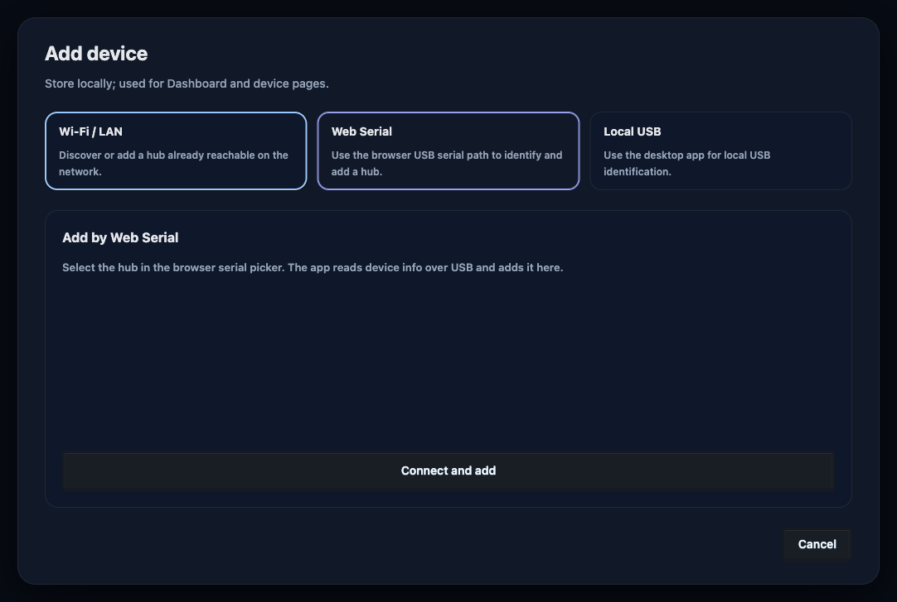
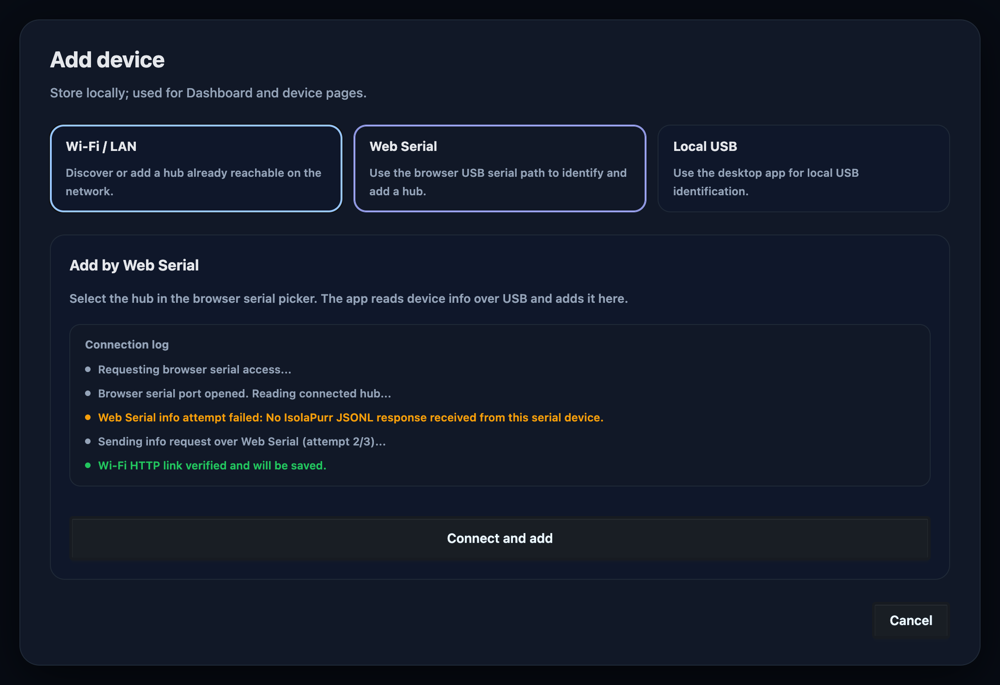
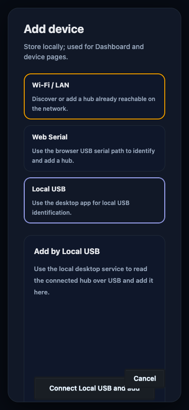
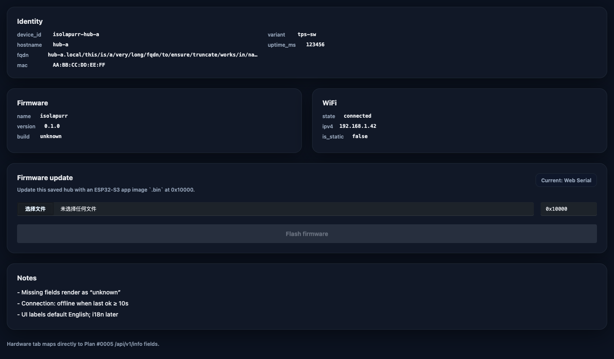
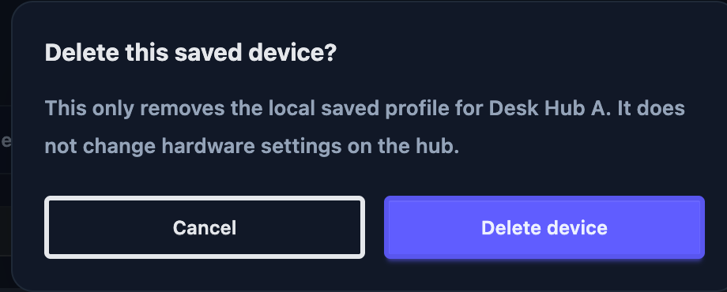
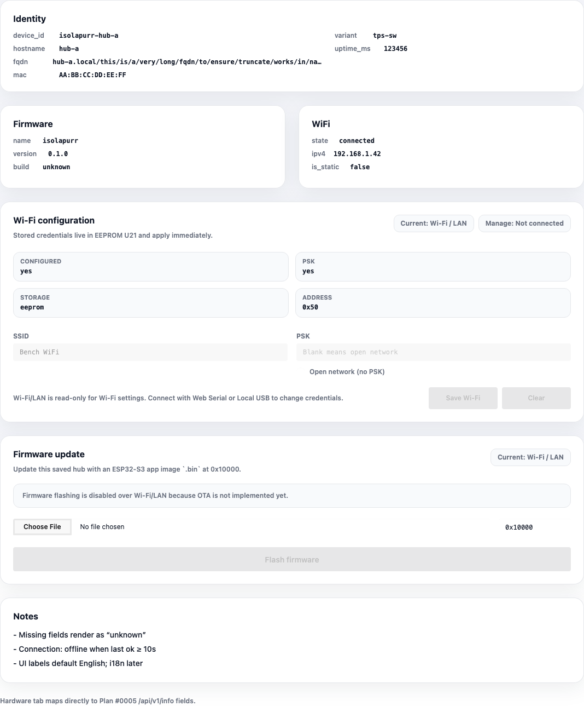
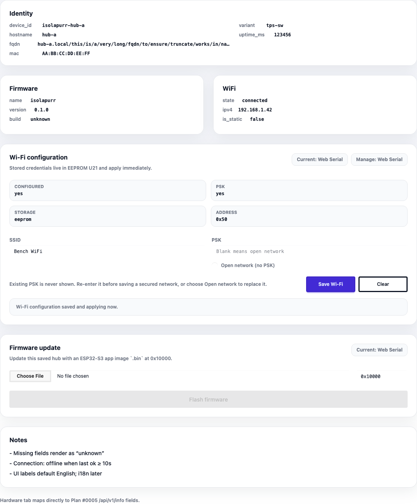
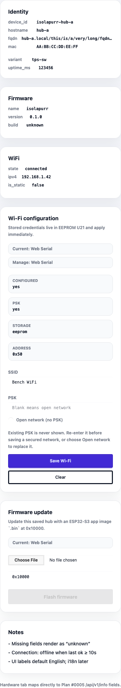
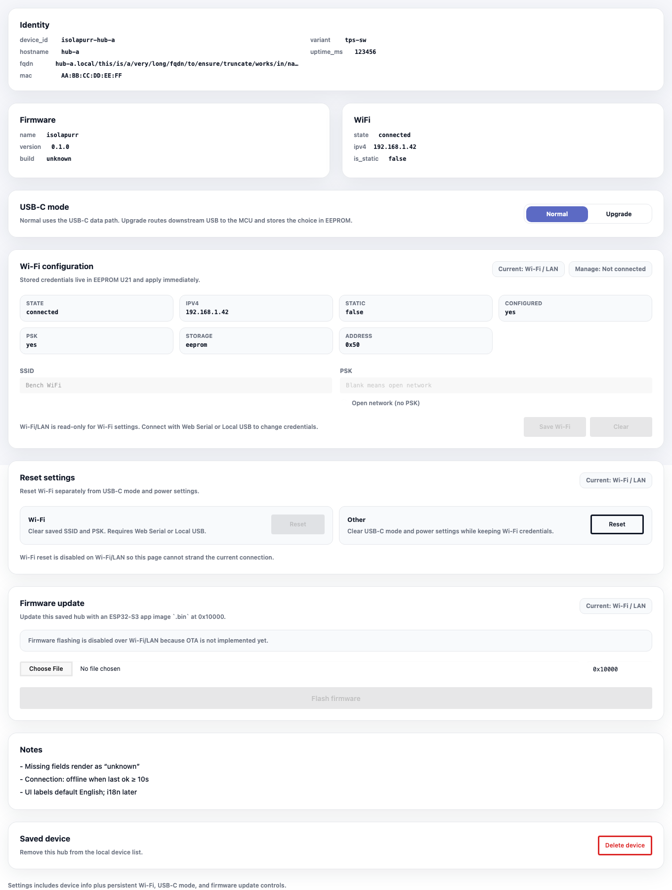
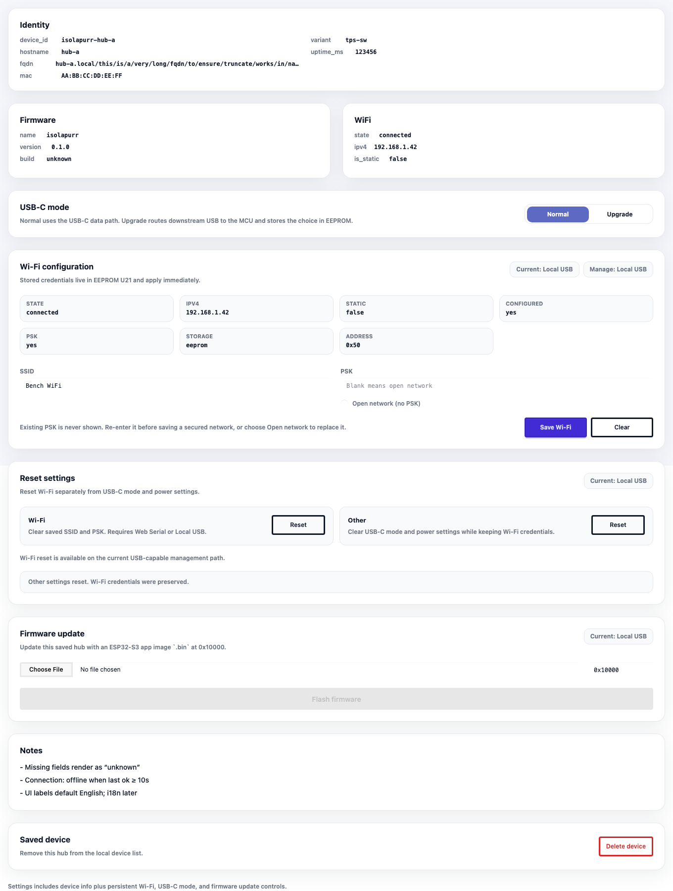

# USB 通信、固件更新与 Wi-Fi provisioning

## Background

IsolaPurr USB Hub 需要在同一套 Web / Desktop 控制台里支持三类连接路径：

- Wi-Fi / LAN：产品已联网时，Web App 可通过局域网 HTTP 连接 Hub。
- USB / Web Serial：浏览器支持 Web Serial 时，可通过 ESP32-S3 USB Serial/JTAG CDC-ACM 与 Hub 通信。
- Local USB：桌面 App 提供本机 USB 串口、烧录与代理能力，用于补足浏览器能力缺口。

这三条路径都是正式交付方案，不存在“主方案/次方案”的产品等级差异。它们的差异只体现在能力边界和可用前提上：

- 某些功能需要 USB 串口或本机代理时，Wi-Fi / LAN 不能替代。
- 浏览器私网访问策略可能限制 Wi-Fi / LAN 直连，但这不影响 Web Serial 或 Local USB 的交付品质。
- 当多个方案都已立即可用时，运行时才选择默认偏好；默认偏好只决定主路，不代表方案优先级高低。

旧文档来源：

- `docs/plan/0003:wifi-mdns-http/PLAN.md`
- `docs/plan/0005:device-http-api/PLAN.md`
- `docs/plan/0008:tauri-desktop-client/PLAN.md`
- `docs/plan/0012:desktop-persistent-storage/PLAN.md`

## Goals

- 通信方案等价交付
  将 `Wi-Fi / LAN`、`Web Serial`、`Local USB` 明确写成同等级的正式交付路径。规范应说明它们的适用场景、前提条件、能力边界，以及只有在多路立即可用时才触发默认偏好的规则。

- 统一设备通信协议
  USB CDC-ACM 与 Local USB 使用 JSONL request/response/event，字段尽量复用 HTTP API shape；HTTP 继续作为 LAN 路径的正式接口，不被描述成“备用接口”。

- 支持产品固件更新
  Web Serial 使用浏览器能力，Local USB 使用本机能力；UI 以“固件更新”呈现，不暴露内部开发调试口径，但也要写清楚何时必须依赖 USB 通道。

- Wi-Fi 运行时配置
  SSID/PSK 不再作为编译期必填项，凭据保存到板载 EEPROM U21 `M24C64-FMC6TG`，7-bit 地址 `0x50`；同时说明 Wi-Fi 配置读写在 Wi-Fi / LAN 通道下的限制边界。

- 产品控制台
  Web App 在原 Add device 流程中表达 Wi-Fi、Web Serial、Local USB 三条添加路径；已添加设备的 Hardware 页承载固件更新、遥测与端口维护动作，不另建独立连接流程。

## Non-goals

- 不实现 TinyUSB 自定义 USB device、MSC/HID/composite device。
- 不实现多设备批量烧录、云同步、账号体系或远程 OTA。
- 不把任何单一通信方案写成产品上的“唯一正确路径”。
- 不新增第四种通信方案，也不把桥接/代理包装成独立主路径。
- 不把 Web Serial 视为所有浏览器都可用；不支持时必须展示替代路径。

## Scope

- in: 三种通信方案的产品定位、能力边界、默认偏好语义、LAN 绑定规则、USB/HTTP 交互口径。
- out: 运行时代码的实现变更、桥接代理新增、底层协议重写。

## Communication Paths

多通信方案存在的原因是产品生命周期和运行环境不同，而不是交付质量分层：未联网设备需要 USB provisioning，已联网设备应能直接走 LAN，浏览器用户可能只具备 Web Serial 授权，桌面和 CLI 工作流需要本机 daemon 承担串口独占、烧录、reset/monitor 和身份校验。

| Path | Immediate availability | Intended use | Capability boundary |
|------|------------------------|--------------|---------------------|
| `Wi-Fi / LAN` | Device has network credentials, exposes a reachable LAN HTTP endpoint, and browser or desktop policy allows the request. | Day-to-day device control, telemetry, ports, power settings, and saved-device access without a USB cable. | Browser CORS/PNA or private-network policy can block direct access; Wi-Fi credential mutation and firmware flashing require a USB-capable channel so the user does not strand the device. |
| `Web Serial` | Browser supports Web Serial, the user grants the ESP32-S3 USB Serial/JTAG port, and the device firmware responds with IsolaPurr JSONL. | Browser-native USB setup, identity readout, Wi-Fi provisioning, supported controls, and firmware app updates for a saved device. | Unavailable in browsers without Web Serial or without user USB permission; native host operations that require daemon-managed leases belong to Local USB. |
| `Local USB` | Released host tools or the desktop daemon are installed/running, and a matching IsolaPurr hardware identity or owner-confirmed bootstrap port is available. | Desktop app and CLI workflows, local serial enumeration, JSONL proxying, firmware flashing, reset, monitor, and stronger host-side identity checks. | Depends on local daemon/CLI availability and host permissions; it is not required before using LAN or Web Serial when those paths are already immediately usable. |

Default selection is only defined after more than one path is immediately usable for the same saved device. In that case the runtime may keep the last successful path as the primary channel. If that path becomes unavailable, another immediately usable path is promoted. This selection rule must not be presented as a quality ranking or as a requirement that one path exist before another can be used.

## Requirements

- Firmware MUST expose a JSONL protocol over ESP32-S3 USB Serial/JTAG CDC-ACM.
- Firmware MUST accept at least these commands: `info`, `ports.get`, `port.power_set`, `port.replug`, `wifi.get`, `wifi.set`, `wifi.clear`, `settings.reset`, `reboot`.
- Firmware MUST load Wi-Fi credentials from EEPROM at boot. If no credentials exist, networking remains unconfigured while USB provisioning remains available.
- Firmware MUST remove `USB_HUB_WIFI_SSID` and `USB_HUB_WIFI_PSK` as build-time required inputs.
- EEPROM storage MUST include a magic/version marker and checksum or equivalent corruption guard.
- Desktop agent MUST expose token-protected localhost APIs for serial port listing, command proxying, and firmware update operations.
- Desktop CLI MUST expose Local USB development commands for serial port listing, JSONL request forwarding, app `.bin` generation, app flash, reset, and monitor.
- Local USB development commands MUST NOT auto-select a serial port. They MUST require an explicit port argument or an owner-confirmed cache created by `serial identify` or the interactive selector.
- Development flash MUST read JSONL `info` before normal repeated writes and match the owner-confirmed `device_id` and/or `mac`. If identity is missing because the selected port is first-time hardware or download mode, one unverified bootstrap flash is allowed only after explicit confirmation; identity mismatch still fails before `espflash write-bin`.
- Development flash MUST write only an app `.bin` at `0x10000` during normal repeated flashing. First-time bootstrap flashing MUST write the bootloader, partition table, and app from the release ELF so new hardware can boot.
- Development reset MUST return the reset method and evidence that the serial port remained available or re-enumerated. Development monitor MUST keep the serial port open until interrupted and classify boot, JSONL, panic/backtrace, and ordinary log lines.
- Web UI MUST keep device connection inside the Add device modal. Web Serial and Local USB may read device identity and add the device there, but firmware update MUST NOT appear inside Add device.
- Firmware update UI MUST live on the selected device's Hardware page after the hub has been added, using Web Serial or Local USB as update paths for that saved device.
- Firmware update UI MUST default to writing the ESP32-S3 app image `.bin` at `0x10000`; merged full-flash images are not the default product update artifact.
- Product documentation and UI copy MUST present `Wi-Fi / LAN`, `Web Serial`, and `Local USB` as first-class delivery paths. Any preference, alternate-path prompt, or disabled state MUST be explained by immediate availability or capability boundary, not by product-quality hierarchy.
- Runtime control MUST treat Wi-Fi / LAN, Web Serial, and Local USB as concurrent channels for the same saved device. The active channel is the current primary; if it fails, another available channel MUST be promoted without creating a duplicate device entry.
- When multiple channels are immediately available, the runtime MAY choose a default preference based on the last successful channel for that device. This preference is a selection rule only and MUST NOT be documented as a quality ranking.
- When only one channel is immediately available, the runtime MUST use that channel and MUST NOT require any other channel to exist first.
- When Web Serial or Local USB `info` reports a Wi-Fi IPv4 address, Web UI MUST immediately probe `http://<ipv4>` and bind that Wi-Fi / LAN base URL only when the HTTP identity matches the USB `device_id` or `mac`.
- Wi-Fi / LAN MUST be documented as a first-class product path, with explicit limitations for browser private-network access and for operations that require USB-only capabilities.
- Web Serial MUST be documented as a first-class product path, with explicit limitations when the browser does not expose USB serial access.
- Local USB MUST be documented as a first-class product path, with explicit limitations tied to local daemon availability and host-tool installation.
- Add device MUST show recent Web Serial and Local USB connection steps, including authorization, port open, `info`, Wi-Fi probe, save/bind, and failure messages.
- The saved-device Hardware page MUST provide a delete action with an in-app confirmation. Confirmed deletion MUST remove the saved profile, clear runtime USB/channel records, and leave the user on a valid device list route.
- USB-only operations, including firmware update, MUST require a USB channel even when Wi-Fi / LAN is online.
- Web UI MUST provide clear states for unsupported Web Serial, no device, connected, flashing/updating, update failed, Wi-Fi empty/configured/error, telemetry online/offline, busy action, and disruptive action confirmation.
- Storybook MUST cover the Add device and saved-device Hardware page states before visual evidence is accepted.

## JSONL Protocol

Each host request is one UTF-8 JSON object followed by `\n`.

```json
{"id":"1","method":"info"}
```

Each response includes the same `id` when available:

```json
{"id":"1","ok":true,"result":{}}
```

Errors use:

```json
{"id":"1","ok":false,"error":{"code":"bad_request","message":"invalid request","retryable":false}}
```

Events omit `id` and include `event`:

```json
{"event":"log","message":"wifi credentials saved"}
```

## Wi-Fi EEPROM Format

EEPROM U21 is `M24C64-FMC6TG` on I2C1 `SDA/SCL`, address `0x50`.

The stored record contains:

- magic/version
- SSID
- PSK
- optional hostname/static IPv4 fields
- checksum

The product UI should label writes as Wi-Fi configuration. After a successful `wifi.set`, firmware writes EEPROM and immediately reconnects Wi-Fi with the new credentials. After a successful `wifi.clear`, firmware clears EEPROM and immediately stops the Wi-Fi station. When the current device channel is Wi-Fi / LAN, Wi-Fi configuration is read-only; writes and clears require Web Serial or Local USB so the user cannot accidentally strand the hub from the same network path being edited.

`settings.reset` is the device-level reset command for persisted settings. It
accepts `{"scope":"wifi"|"other","owner"?:number}`. Scope `wifi` reuses the
same EEPROM erase and runtime disconnect path as `wifi.clear`, reports no reboot
requirement, and is only valid over Web Serial or Local USB. Firmware HTTP MUST
reject `scope=wifi` with `unsafe_transport` so a Wi-Fi / LAN client cannot erase
the credentials carrying its own connection.

## UI Design Brief

This is a product control console for people using IsolaPurr USB Hub in bench or desk workflows.

- Color strategy: Restrained.
- Scene: an engineer at a desk with the Hub physically connected, focused on connection state, update progress, port behavior, and power telemetry.
- Layout: Add device modal owns device discovery and connection only; added device pages own firmware update, telemetry, Wi-Fi maintenance, and port controls.
- Tone: dense, calm, precise, instrument-like.

## Acceptance Criteria

- Given no build-time `USB_HUB_WIFI_SSID` or `USB_HUB_WIFI_PSK`, when building the default firmware, then firmware compile does not fail because of missing Wi-Fi credentials.
- Given EEPROM contains valid Wi-Fi credentials, when default firmware boots, then Wi-Fi uses the stored credentials.
- Given a browser with Web Serial support, when the user connects over USB, then the app can fetch info/ports and run supported controls via JSONL.
- Given `Wi-Fi / LAN`, `Web Serial`, or `Local USB` satisfies its immediate-availability prerequisites, when the user runs a function supported by that path, then the UI treats the path as an official delivery route and does not require a different path first.
- Given a device already exists from Wi-Fi / LAN, when USB connects with the same `device_id`, then the app updates the saved device runtime channel state and telemetry instead of creating a duplicate.
- Given Web Serial or Local USB `info` reports a reachable Wi-Fi IPv4 address whose HTTP identity matches the USB identity, when the hub is added or reconnected, then the saved device base URL is updated to that Wi-Fi address and the Wi-Fi / LAN channel is marked available immediately.
- Given multiple channels are simultaneously immediately available, when the runtime chooses a primary, then it prefers the last successful channel for that device; when that channel becomes unavailable, it falls back to another immediately available channel without changing the product-quality promise.
- Given only one channel is immediately available, when the user opens the device or runs a command, then that channel is used directly and no other channel is required to exist.
- Given Web Serial or Local USB is connecting, when the user watches Add device, then recent connection steps and failure causes are visible in the modal.
- Given a saved device exists, when the user confirms deletion from Hardware, then the profile is removed and the page navigates away from the deleted device route.
- Given the active runtime channel fails while another channel remains available, when the next control or polling operation runs, then the available channel becomes primary.
- Given a device is currently managed through Wi-Fi / LAN, when the Hardware page renders Wi-Fi configuration, then stored settings are readable but save and clear controls are disabled until Web Serial or Local USB is active.
- Given Wi-Fi credentials are saved through Web Serial or Local USB, when EEPROM write succeeds, then firmware immediately reconnects Wi-Fi with the new credentials and reports no reboot requirement.
- Given Wi-Fi credentials are cleared through Web Serial or Local USB, when EEPROM clear succeeds, then firmware immediately stops the Wi-Fi station and reports no reboot requirement.
- Given `settings.reset` is called with `scope=wifi` through Web Serial or Local USB, when EEPROM clear succeeds, then `wifi.get` reports no stored credentials and Wi-Fi station runtime is stopped.
- Given `settings.reset` is called with `scope=wifi` through Wi-Fi / LAN HTTP, when the request is handled, then firmware returns `unsafe_transport` and leaves the Wi-Fi EEPROM record unchanged.
- Given Web Serial is unsupported, when the user opens Add device, then the UI offers Local USB or Wi-Fi/HTTP alternatives.
- Given the Desktop agent is running, when the user lists serial ports or proxies a command, then requests require the existing bearer token and origin policy.
- Given `mcu-agentd` is not installed, when a developer runs `just desktop-agent-build` once and then the Local USB Justfile flow, then they can list ports, identify a hub, generate an app `.bin`, flash `0x10000`, reset, and monitor using `isolapurr-desktop`.
- Given `.esp32-port` is missing or lacks `device_id`/`mac`, when a developer runs a flash/reset/monitor command that depends on the confirmed port, then it fails with instructions to run `just ports` and `PORT=/dev/cu.xxx just identify`.
- Given JSONL `info` returns a different `device_id` or `mac`, when Local USB flash runs, then it fails before writing flash.
- Given UI changes are complete, when Storybook renders the console states, then desktop and mobile evidence show no text overlap, clipping, or incoherent layout.

## Visual Evidence

Evidence source: Storybook canvas, captured from this worktree implementation.

Add device Web Serial desktop:

PR: include



Add device Web Serial connection log:



Add device Local USB mobile:



Device Hardware firmware update:

PR: include



Device Hardware delete confirmation:



Device list connection badges:

PR: include


Device Hardware Wi-Fi configuration:

PR: include



Device Hardware Wi-Fi immediate apply:

PR: include



Device Hardware Wi-Fi configuration mobile:

PR: include



Device Hardware reset settings over Wi-Fi/LAN:

PR: include



Device Hardware reset settings over Local USB:

PR: include


