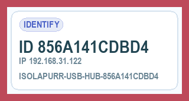
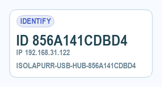
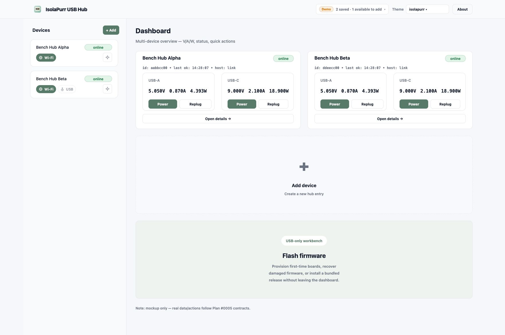
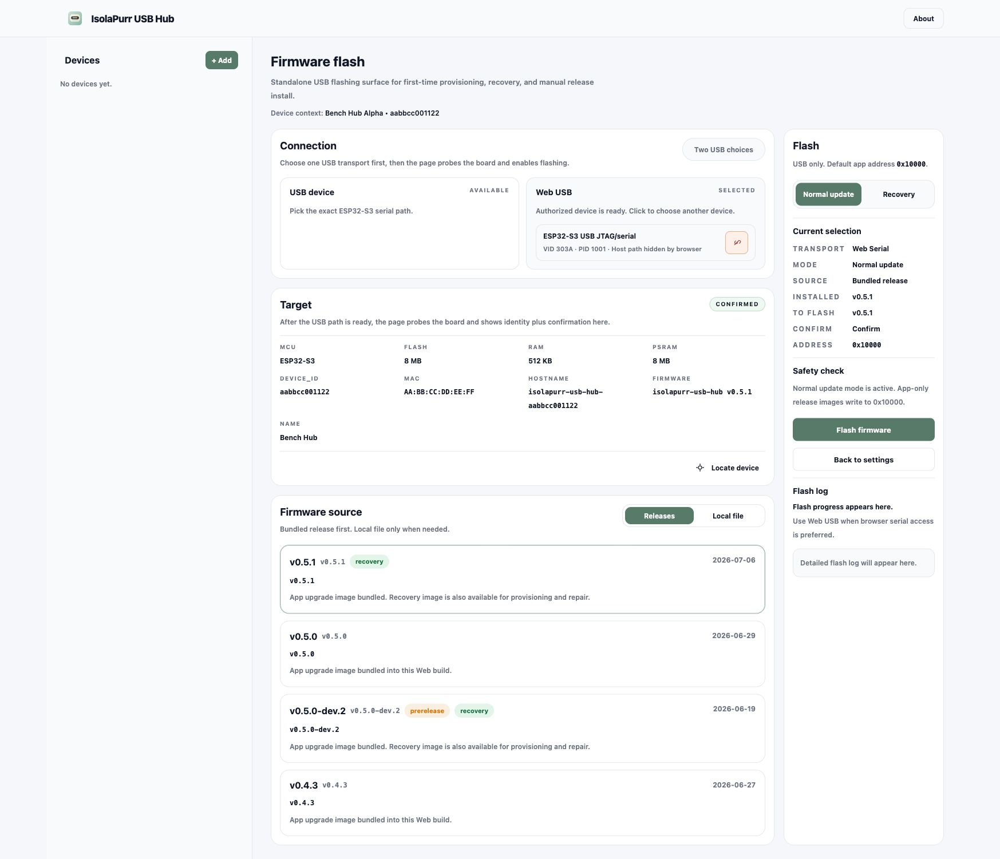
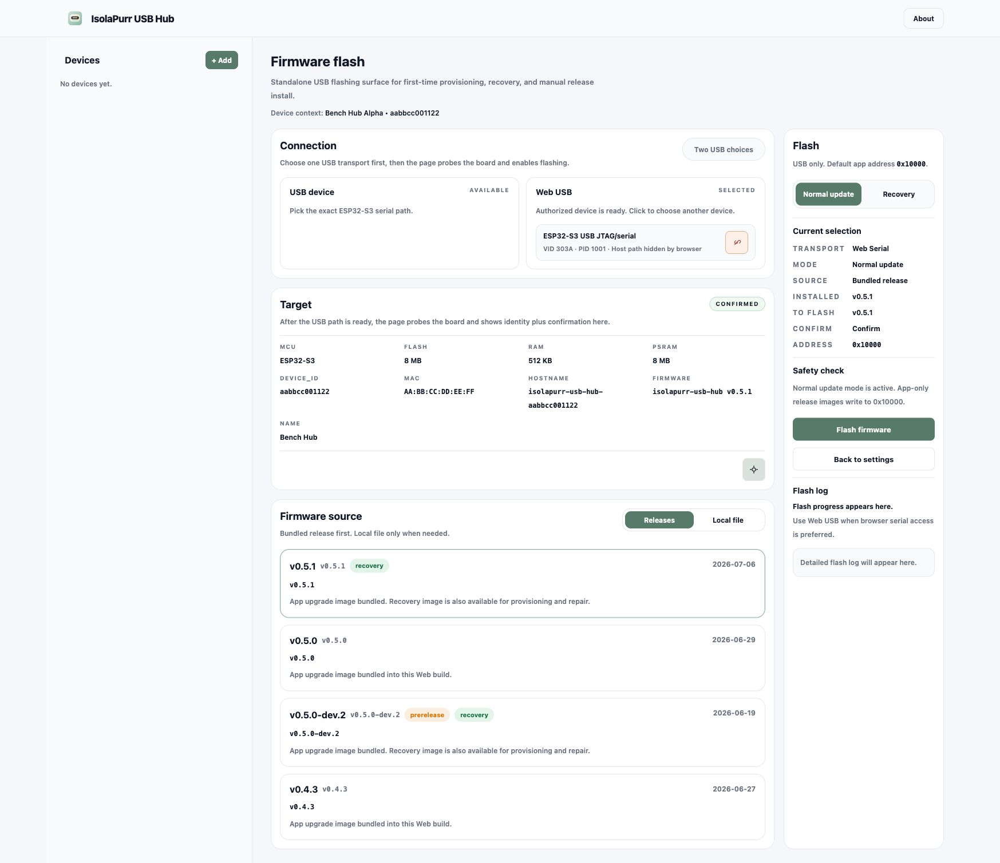
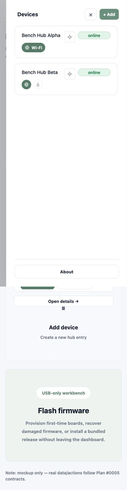
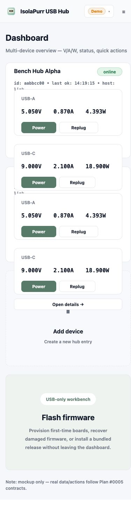
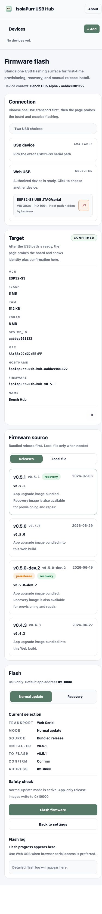

# Device identify and locate

## Goals

- Let an operator locate a known online hub from the Web console or released CLI.
- Keep the hardware action fixed, bounded, and safe: five seconds of identity display, a 2Hz border, and intermittent buzzer audio.
- Make support explicit through `capabilities.identify`; a missing capability is unsupported.

## Public contract

- Device HTTP: `POST /api/v1/identify` returns `{ "accepted": true, "duration_ms": 5000 }` only after the first full identify frame reaches the display driver; a missing acknowledgement returns a retryable `display_unavailable` error.
- Device JSONL: `identify` returns the same result envelope.
- devd HTTP: `POST /api/v1/devices/{id}/identify`; IPC: `device.identify`.
- CLI: `isolapurr identify --device-id <id>` or `isolapurr identify --url <base-url>`.
- `GET /api/v1/info` and `GET /api/v1/ports` publish `capabilities.identify=true` on supporting firmware.

## Device behavior

- Each accepted request starts a new 5000ms interval; a later request restarts it.
- A request is accepted only after the display has drawn its first frame; before
  that it returns the standard `409 busy` response rather than promising an
  interval that cannot yet be presented.
- The screen shows `IDENTIFY`, the full device ID, `IP <IPv4>` or `NOT CONNECTED`, and uppercase hostname.
- A 12px full-perimeter alert-red border alternates with a clear background every 250ms, producing an unmistakable 2Hz blink.
- The buzzer uses approximately 2.7kHz with a 150ms tone followed by 350ms silence for the active interval.
- Safety/error states and local button interaction cancel identify immediately. Normal UI resumes automatically at expiry or cancellation.

## Web behavior

- The sidebar card navigation button and Locate icon are separate buttons; invoking Locate does not navigate.
- The sidebar icon and firmware Target icon are enabled only for online, confirmed targets that publish the capability. A directly selected Web Serial or Local USB target is considered online after its identity probe succeeds, even when it has not been added to the project.
- During dispatch, the icon presents a spinner. A successful request highlights the icon for five seconds and can be restarted. Only failure produces a toast.

## Acceptance

- Firmware-core tests cover exact duration, phase cadence, restart, and cancellation semantics.
- The Web demo uses the production routes with `?demo=true`; Storybook covers available and unavailable card states.
- Final Web and framebuffer captures belong in this spec's single `## Visual Evidence` section.

## Visual Evidence

- Firmware RGB565 framebuffer, border phase on (0ms) rendered by the same
  `menu::render_identify` path used by the device:
  PR: include
  
- Firmware RGB565 framebuffer, border phase off (250ms) rendered by the same
  path:
  PR: include
  
- Chrome capture of the production Dashboard demo, showing the separate sidebar
  Locate controls for online capability-enabled devices:
  
- Chrome capture of the production Firmware flash demo with a confirmed target
  and its Locate control in the Target section:
  
- Chrome capture after the Firmware Target Locate control is invoked, showing
  its active highlight:
  
- Chrome capture of the mobile Dashboard demo with the device drawer open,
  showing the same Locate controls without overlap:
  
- Chrome capture of the mobile Dashboard content layout before opening the
  drawer, verifying the primary workflow remains readable at the narrow width:
  
- Chrome capture of the mobile Firmware flash demo with the confirmed Target
  Locate control visible above the stacked firmware workflow:
  
